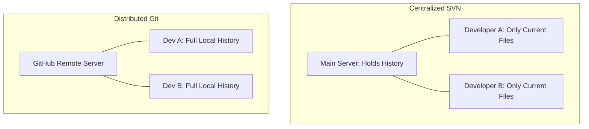

# Version Control Concepts

To truly understand Git, we need to look under the hood at how it thinks. Git is
a **Distributed Version Control System (DVCS)**, which fundamentally changes how
developers share and track code compared to older systems. 🧠

---

## 🌎 Centralized vs. Distributed

Older version control systems like SVN use a **Centralized** model. There is
only one main server holding the project history. If you lose internet access or
the server crashes, nobody can commit code or view history.

Git uses a **Distributed** model. When you copy a project, you do not just get
the latest files—you download the **entire history** of the project onto your
local machine.

<!-- Visual flow for Version Control Concepts. -->

### Why Distributed is Better:

- **Speed:** Almost every Git operation is instant because it happens directly
  on your hard drive, not over the internet.
- **Offline Work:** You can commit code, create branches, and view past history
  while completely offline.
- **Safety:** Every single developer's machine acts as a full backup. If the
  main server fries itself, any developer can restore it instantly.

## 🕒 The Three States of Git

Git manages your files across three distinct virtual zones. Understanding these
zones is the secret to mastering the Git workflow. 🧱

| Zone                           | What it represents                                                                |
| ------------------------------ | --------------------------------------------------------------------------------- |
| **Working Directory**          | The actual files you are currently editing on your computer.                      |
| **Staging Area**               | A prep zone. You pick which modified files you want to include in your next save. |
| **Git Directory (Repository)** | The official database where Git permanently stores your project snapshots.        |

## 📸 Snapshots, Not Differences

Older systems track history by storing a base file and a list of continuous file
modifications (deltas).

Git does not think in deltas. Every time you save your work, Git takes a literal
picture (**snapshot**) of what all your files look like at that exact
millisecond. If a file has not changed, Git does not copy it again—it simply
links back to the previous version to save space. ⚡

## Quick Reference

| Area | Revision point |
|---|---|
| Definition | State exactly what the topic means. |
| Mechanism | Explain the steps that produce the result. |
| Example | Use a small realistic case. |
| Pitfalls | Know common mistakes and boundary cases. |

## Decision Guide

Connect the definition to a practical decision: what problem does the concept solve, what assumptions does it make, and what evidence tells you it is working? This turns a memorised sentence into a usable mental model.

## Compare Related Ideas

When two concepts look similar, compare their purpose, inputs, guarantees, lifecycle, and trade-offs. A short comparison is often more useful for revision than another paragraph repeating the same definition.

## Self-Check

After reading an example, change one input and predict the result before running it. Then explain what changed and why. This exposes gaps in understanding and gives you a quick test without needing a separate exercise set.

## Practical Decision

A concept becomes easier to revise when it is tied to a decision you may actually make. Identify the problem, the available choices, and the condition that makes one choice appropriate. Then state one case where the concept should not be used. That negative example is useful because it marks the boundary of the idea and reduces confusion with related concepts.

## Final Understanding Check

Before considering **Version Control Concepts** revised, make sure you can state the definition without relying on the example, explain the mechanism in the correct order, and predict what happens when one important input or assumption changes. Then check one boundary case and one practical use case. The example should support the explanation rather than replace it. When a result is surprising, inspect the rule that produced it and verify the relevant precondition. This approach is more reliable than memorising a code snippet, formula, command, or interview answer because the same reasoning can be applied to a new problem. For technical topics, also distinguish what is guaranteed by the language, library, protocol, or mathematical rule from what is merely a common convention. That distinction helps you choose the correct solution when the context changes.
