# Backend System Design

_The Ultimate Guide to Building Robust, Scalable, and Distributed Backend
Systems_

---

## 1. Core Principles

| Principle           | Description                  | Emoji |
| ------------------- | ---------------------------- | ----- |
| **Scalability**     | Handle growth in users/data  | 📈    |
| **Availability**    | System uptime (99.9%+)       | ⏱️    |
| **Reliability**     | Consistent correct behavior  | 🛡️    |
| **Performance**     | Low latency, high throughput | ⚡    |
| **Security**        | Protect data and systems     | 🔒    |
| **Maintainability** | Easy to update/debug         | 🔧    |
| **Cost Efficiency** | Optimize resource usage      | 💰    |

### CAP Theorem

<!-- Visual flow for Backend System Design. -->
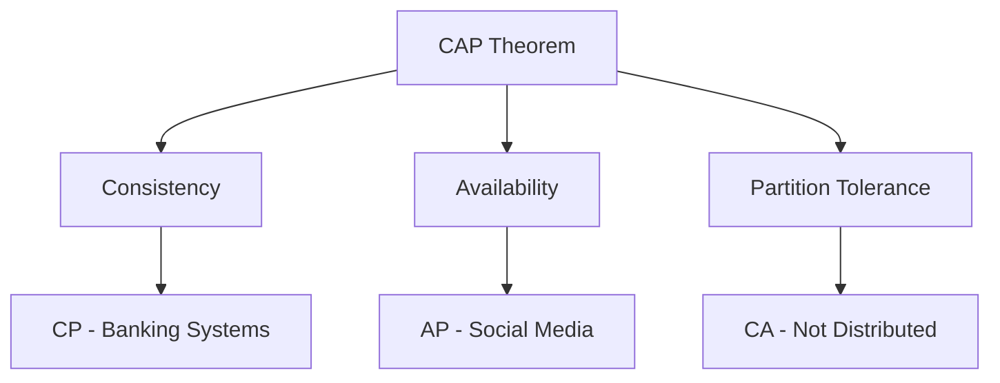

### Monolithic vs Microservices

<!-- Visual flow for Backend System Design. -->
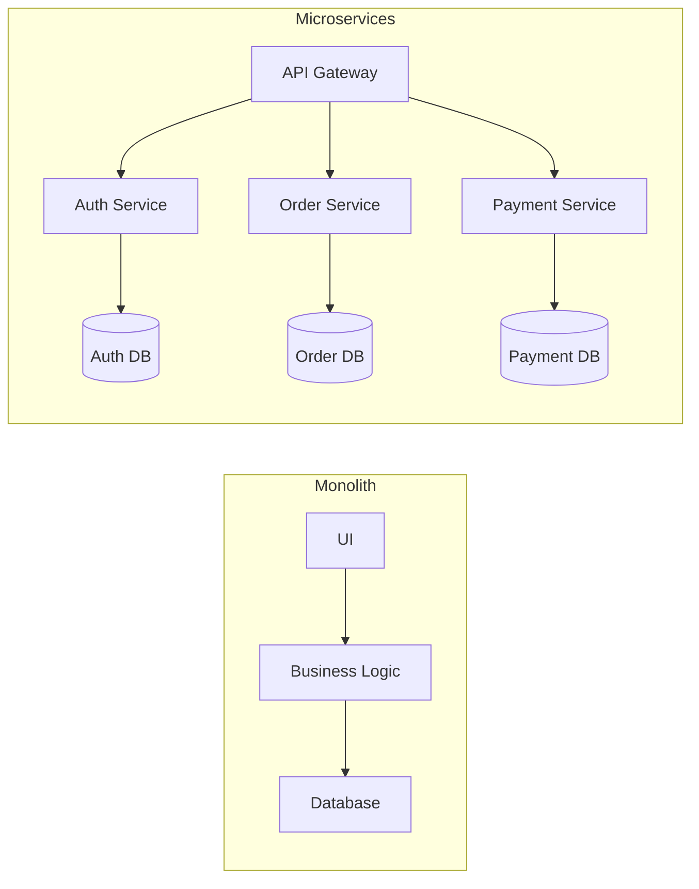

### Architecture Patterns Comparison

| Pattern           | Best For                          | Trade-offs                           |
| ----------------- | --------------------------------- | ------------------------------------ |
| **Monolith**      | Small teams, simple apps          | Easy dev, hard to scale              |
| **Microservices** | Large teams, complex apps         | Scalable, complex ops                |
| **Event-Driven**  | Async processing                  | Loose coupling, eventual consistency |
| **CQRS**          | Complex query/update patterns     | Scale reads/writes separately        |
| **Hexagonal**     | Testability, business logic focus | Clean separation, more files         |
| **Service Mesh**  | Service-to-service communication  | Observability, network control       |

### RESTful API Guidelines

<!-- Visual flow for Backend System Design. -->
```mermaid
graph TD
    A[API Design] --> B[Resources]
    A --> C[HTTP Methods]
    A --> D[Status Codes]
    A --> E[Versioning]

B --> F[/users, /orders]
    C --> G[GET, POST, PUT, DELETE, PATCH]
    D --> H[200, 400, 401, 403, 404, 500]
    E --> I[/v1/api, Accept header]
```

### API Comparison

| Feature         | REST          | GraphQL         | gRPC          | WebSocket   |
| --------------- | ------------- | --------------- | ------------- | ----------- |
| **Use Case**    | CRUD apps     | Complex queries | Microservices | Real-time   |
| **Protocol**    | HTTP/1.1      | HTTP/1.1        | HTTP/2        | WS          |
| **Data Format** | JSON          | JSON            | Protobuf      | Binary/Text |
| **Caching**     | ✅ HTTP cache | ❌              | ❌            | ❌          |
| **Batching**    | ❌            | ✅              | ❌            | ✅          |
| **Type Safety** | ❌            | ✅ Strong       | ✅ Strong     | ❌          |

### RESTful Best Practices

// Example demonstrating Backend System Design.
```
✅ Use plural nouns: /users, /products
✅ Nested resources: /users/{id}/orders
✅ Use HTTP verbs properly
✅ Version API: /v1/users
✅ Stateless authentication: JWT tokens
✅ Proper status codes
✅ Filtering: /users?status=active
✅ Pagination: /users?page=2&limit=20
✅ Sorting: /users?sort=createdAt:desc
```

### Database Decision Tree

<!-- Visual flow for Backend System Design. -->
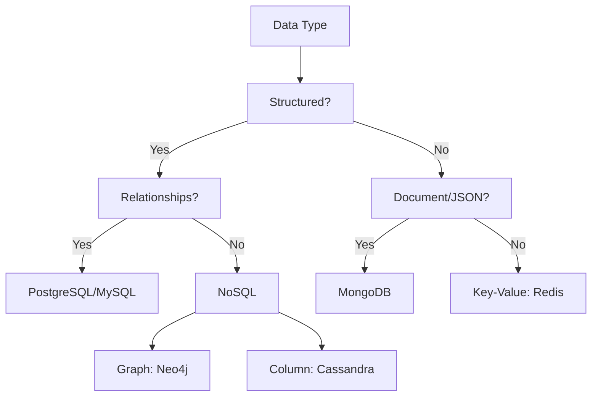

### Database Comparison

| Database          | Best For                 | Consistency | Scaling    | Query     |
| ----------------- | ------------------------ | ----------- | ---------- | --------- |
| **PostgreSQL**    | Relational data, ACID    | Strong      | Vertical   | SQL       |
| **MySQL**         | Read-heavy apps          | Strong      | Vertical   | SQL       |
| **MongoDB**       | Unstructured data        | Eventual    | Horizontal | JSON-like |
| **Cassandra**     | Write-heavy, time-series | Eventual    | Horizontal | CQL       |
| **Redis**         | Caching, real-time       | Strong      | Vertical   | Key-Value |
| **Elasticsearch** | Full-text search         | Eventual    | Horizontal | Query DSL |
| **Neo4j**         | Graph relationships      | ACID        | Vertical   | Cypher    |
| **DynamoDB**      | Serverless, key-value    | Strong      | Automatic  | Key-Value |

### Database Selection Criteria

<!-- Visual flow for Backend System Design. -->
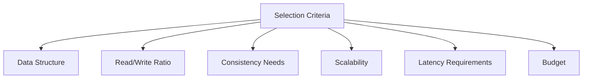

### Cache Types

<!-- Visual flow for Backend System Design. -->
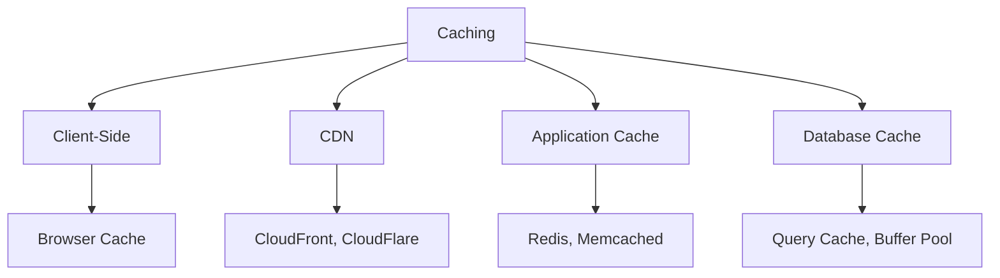

### Caching Patterns

| Pattern                  | Description                | Use Case              |
| ------------------------ | -------------------------- | --------------------- |
| **Cache-Aside**          | App checks cache first     | Most common           |
| **Read-Through**         | Cache handles DB reads     | Simple app            |
| **Write-Through**        | Write to cache + DB        | Consistency needed    |
| **Write-Behind**         | Write to cache, async DB   | High write throughput |
| **Cache-Aside with TTL** | Cache with expiry          | Stale data acceptable |
| **Refresh-Ahead**        | Auto-refresh before expiry | Predictable access    |

### Cache Invalidation Strategies

// Example demonstrating Backend System Design.
```
💡 TTL (Time-To-Live): Auto-expiry
💡 Event-Based: Invalidate on updates
💡 Version-Based: Use version numbers
💡 Write-Through: Immediate sync
💡 Lazy Loading: Load on demand
```

### Caching Best Practices

// Example demonstrating Backend System Design.
```
✅ Set appropriate TTL (5-60 minutes)
✅ Use eviction policies: LRU, LFU, TTL
✅ Cache hot data only (80/20 rule)
✅ Use multi-level caching
✅ Monitor cache hit ratio (target >80%)
✅ Implement cache warming
✅ Handle cache stampede (mutex locks)
```

### Message Broker Comparison

| Feature            | RabbitMQ          | Kafka           | SQS           | Redis Pub/Sub |
| ------------------ | ----------------- | --------------- | ------------- | ------------- |
| **Use Case**       | Task distribution | Event streaming | AWS ecosystem | Real-time     |
| **Ordering**       | Per queue         | Per partition   | FIFO optional | No            |
| **Persistence**    | In-memory + disk  | Disk            | Disk          | In-memory     |
| **Message Replay** | ❌                | ✅              | ❌            | ❌            |
| **Throughput**     | High              | Very High       | High          | Very High     |
| **Complexity**     | Medium            | High            | Low           | Low           |

### Event-Driven Architecture

<!-- Visual flow for Backend System Design. -->
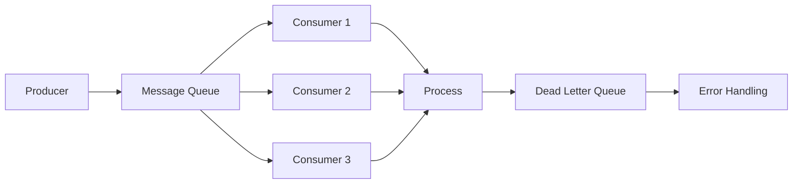

### When to Use Async Processing

// Example demonstrating Backend System Design.
```
✅ Email/SMS notifications
✅ Image/video processing
✅ Report generation
✅ Logging and analytics
✅ Database backups
✅ Batch jobs
✅ Webhook delivery
✅ PDF generation
```

### Load Balancing Algorithms

<!-- Visual flow for Backend System Design. -->
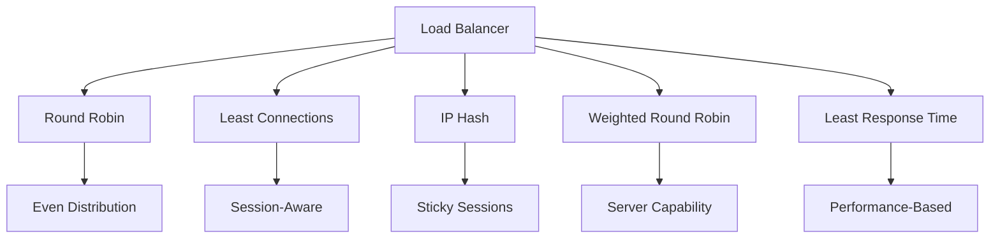

### Reverse Proxy vs Load Balancer

| Feature             | Load Balancer      | Reverse Proxy   |
| ------------------- | ------------------ | --------------- |
| **Primary**         | Distribute traffic | Protect servers |
| **SSL Termination** | Sometimes          | ✅              |
| **Caching**         | ❌                 | ✅              |
| **Compression**     | ❌                 | ✅              |
| **Security**        | Basic              | Advanced        |

### Proxy Tools

// Example demonstrating Backend System Design.
```
🔄 Nginx - Most popular, high performance
🔄 HAProxy - TCP/HTTP load balancing
🔄 Traefik - Cloud-native, Docker support
🔄 Envoy - Service mesh, advanced features
🔄 Apache - Traditional, feature-rich
```

### Authentication Methods

<!-- Visual flow for Backend System Design. -->
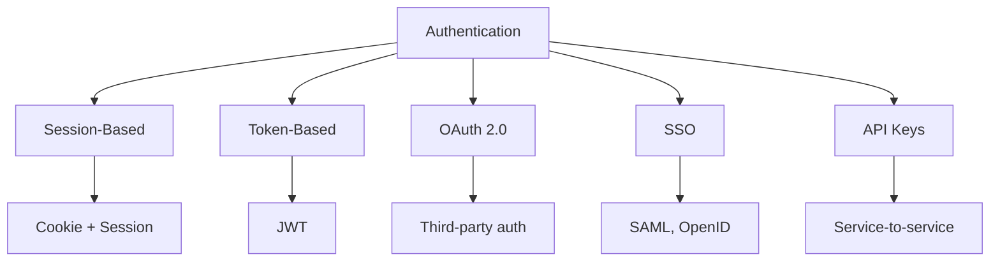

### JWT Structure

// Example demonstrating Backend System Design.
```
Header: {
  "alg": "HS256",
  "typ": "JWT"
}
Payload: {
  "sub": "user123",
  "role": "admin",
  "iat": 1516239022,
  "exp": 1516242622
}
Signature: HMACSHA256(
  base64UrlEncode(header) + "." +
  base64UrlEncode(payload),
  secret
)
```

### Authorization Models

| Model            | Description             | Example            |
| ---------------- | ----------------------- | ------------------ |
| **RBAC**         | Role-based access       | Admin, User, Guest |
| **ABAC**         | Attribute-based         | Rules + attributes |
| **ACL**          | Access Control Lists    | User → Permissions |
| **Policy-Based** | Rules defined in policy | Rego (OPA)         |

### Security Checklist

// Example demonstrating Backend System Design.
```
✅ Hash passwords: bcrypt, Argon2
✅ Use HTTPS (TLS 1.2+)
✅ Implement rate limiting
✅ Validate all inputs
✅ Use prepared statements (SQL injection)
✅ Sanitize user input (XSS)
✅ Implement CORS properly
✅ Use security headers (HSTS, CSP)
✅ Regular security audits
✅ Dependency scanning
✅ Secret management (Vault, AWS Secrets)
```

### Scaling Types

<!-- Visual flow for Backend System Design. -->
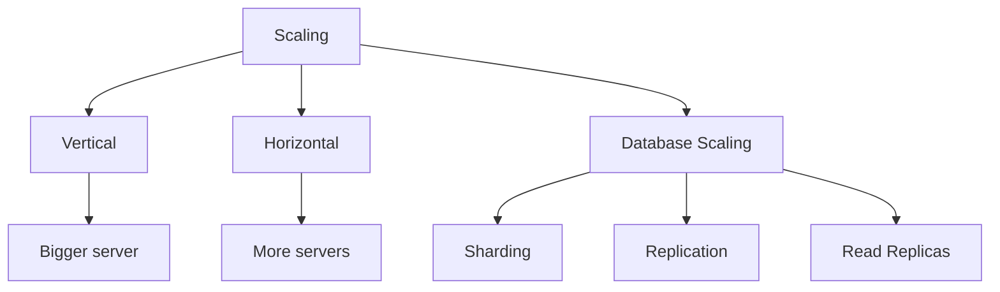

### Database Scaling Techniques

| Technique           | Description         | Pros          | Cons             |
| ------------------- | ------------------- | ------------- | ---------------- |
| **Replication**     | Copy data to slaves | Read scaling  | Write bottleneck |
| **Sharding**        | Partition data      | Write scaling | Complex queries  |
| **Denormalization** | Duplicate data      | Faster reads  | Write overhead   |
| **Indexing**        | Speed up queries    | Fast reads    | Slower writes    |
| **Partitioning**    | Split tables        | Management    | Query complexity |

### Microservices Scaling Considerations

<!-- Visual flow for Backend System Design. -->
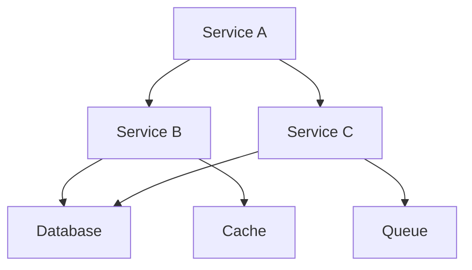

### Resilience Patterns

<!-- Visual flow for Backend System Design. -->
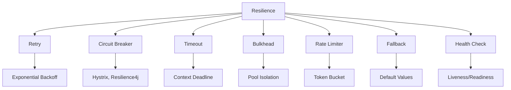

### Fault Tolerance Strategies

// Example demonstrating Backend System Design.
```
🛡️ Retry with Exponential Backoff
🛡️ Circuit Breaker (Open/Closed/Half-Open)
🛡️ Timeouts at all levels
🛡️ Bulkhead isolation
🛡️ Fallback responses
🛡️ Health checks (liveness, readiness)
🛡️ Graceful degradation
🛡️ Chaos engineering
🛡️ Rate limiting
🛡️ Dead letter queues
```

### Three Pillars of Observability

<!-- Visual flow for Backend System Design. -->
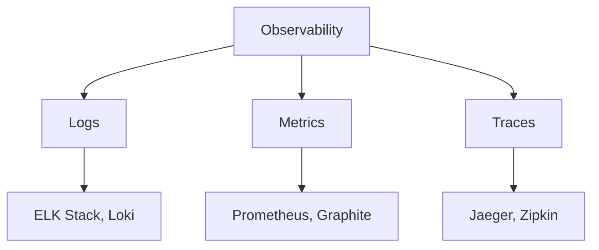

### Key Metrics to Monitor

| Category        | Metrics                             | Tools               |
| --------------- | ----------------------------------- | ------------------- |
| **Performance** | Latency, Throughput, Error Rate     | Prometheus, Grafana |
| **Resource**    | CPU, Memory, Disk, Network          | Node Exporter       |
| **Database**    | Query time, Connections, Cache hits | Database metrics    |
| **Application** | Request count, Success rate         | Custom metrics      |
| **Business**    | Revenue, Active users               | DataDog, NewRelic   |

### Alerting Best Practices

// Example demonstrating Backend System Design.
```
🚨 Use multiple severity levels (P1-P4)
🚨 Avoid alert fatigue (group alerts)
🚨 Use dynamic thresholds
🚨 Include runbooks in alerts
🚨 Test alerting regularly
🚨 Implement on-call rotation
🚨 Track alert resolution time
```

### Deployment Strategies

<!-- Visual flow for Backend System Design. -->
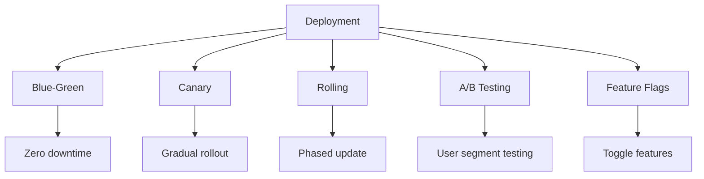

### Deployment Comparison

| Strategy       | Risk   | Complexity | Rollback | User Impact |
| -------------- | ------ | ---------- | -------- | ----------- |
| **Blue-Green** | Low    | Medium     | Instant  | None        |
| **Canary**     | Low    | High       | Gradual  | Minimal     |
| **Rolling**    | Medium | Low        | Gradual  | Some        |
| **Recreate**   | High   | Low        | Slow     | High        |

### CI/CD Pipeline

<!-- Visual flow for Backend System Design. -->
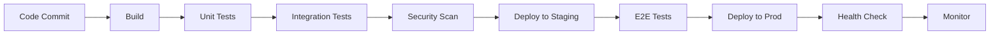

### Storage Types

<!-- Visual flow for Backend System Design. -->
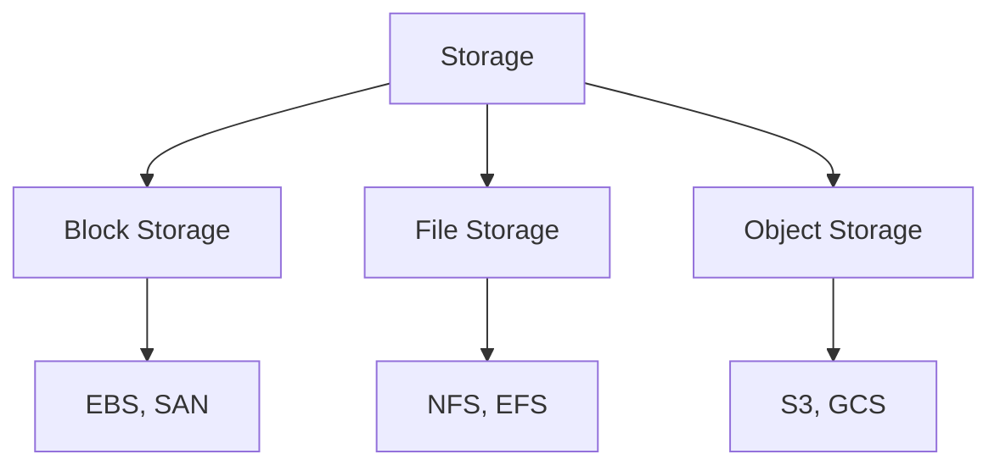

### Data Lifecycle Management

// Example demonstrating Backend System Design.
```
📊 Hot Data: Frequently accessed → Cache/SSD
📊 Warm Data: Occasionally accessed → Standard storage
📊 Cold Data: Rarely accessed → Archive/Glacier
📊 Data Retention: 30 days, 90 days, 1 year, 5 years
📊 Data Backup: Daily, Weekly, Monthly
```

### Backup Strategies

| Type            | RTO       | RPO              | Cost   |
| --------------- | --------- | ---------------- | ------ |
| **Full Backup** | Slow      | Point-in-time    | High   |
| **Incremental** | Fast      | Last incremental | Medium |
| **Snapshot**    | Very fast | Last snapshot    | Low    |
| **Replication** | Minimal   | Real-time        | High   |

### Network Layers

<!-- Visual flow for Backend System Design. -->
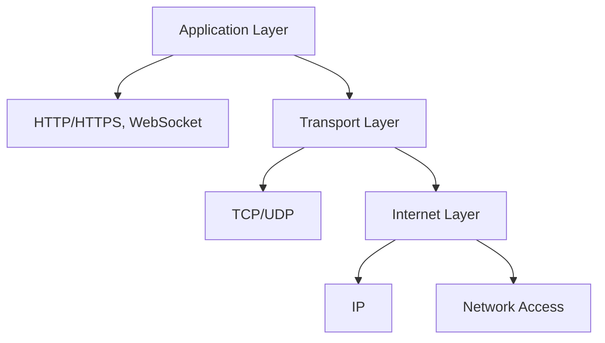

### Protocol Comparison

| Protocol      | Use Case      | Features               | Security          |
| ------------- | ------------- | ---------------------- | ----------------- |
| **HTTP/1.1**  | REST APIs     | Text-based, persistent | TLS (HTTPS)       |
| **HTTP/2**    | Modern apps   | Multiplexed, binary    | TLS required      |
| **HTTP/3**    | Mobile apps   | UDP-based, low latency | TLS required      |
| **gRPC**      | Microservices | Binary, streaming      | TLS + Interceptor |
| **WebSocket** | Real-time     | Full-duplex            | WSS               |
| **MQTT**      | IoT devices   | Lightweight            | TLS               |

### Testing Pyramid (Backend)

<!-- Visual flow for Backend System Design. -->
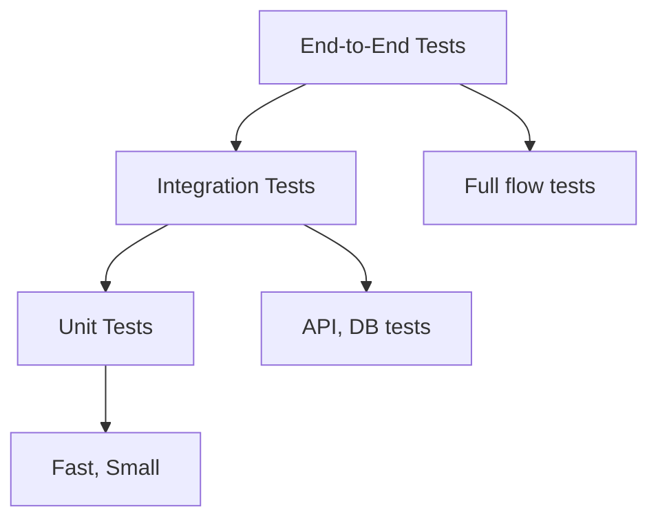

### Test Types

| Test Type       | Focus                | Tools                 |
| --------------- | -------------------- | --------------------- |
| **Unit**        | Individual functions | Jest, JUnit, PyTest   |
| **Integration** | Service interactions | TestContainers        |
| **API**         | Endpoints            | Postman, REST-assured |
| **Contract**    | API contracts        | Pact, OpenAPI         |
| **Performance** | Load, stress         | JMeter, K6            |
| **Security**    | Vulnerabilities      | OWASP ZAP, Burp       |

### Performance Bottlenecks

<!-- Visual flow for Backend System Design. -->
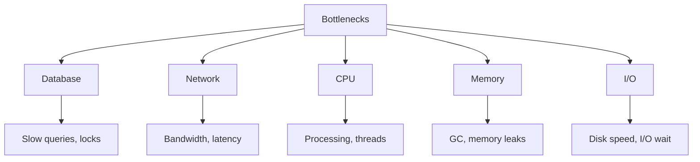

### Optimization Techniques

// Example demonstrating Backend System Design.
```
⚡ Database: Indexing, query optimization, connection pooling
⚡ Caching: Redis, CDN, in-memory cache
⚡ Asynchronous: Queues, background jobs
⚡ CDN: Static assets, media files
⚡ Compression: Gzip, Brotli
⚡ Connection pooling: HTTP keep-alive
⚡ Lazy loading: On-demand processing
⚡ Pagination: Limit result sets
⚡ Precomputation: Generate reports offline
⚡ Batch processing: Bulk operations
```

### When to Use What

| Scenario             | Recommendation                              |
| -------------------- | ------------------------------------------- |
| **Simple CRUD**      | REST API + PostgreSQL + Redis               |
| **Social Media**     | GraphQL + Cassandra + Kafka                 |
| **E-commerce**       | Microservices + PostgreSQL + Elasticsearch  |
| **Real-time Chat**   | WebSocket + Redis + MongoDB                 |
| **Analytics**        | BigQuery + Snowflake + Kafka                |
| **IoT**              | MQTT + InfluxDB + Kafka                     |
| **File Storage**     | S3 + CDN + NoSQL metadata                   |
| **Machine Learning** | Python microservices + GPU + Model registry |

### Trade-off Matrix

| Requirement            | Trade-off                   |
| ---------------------- | --------------------------- |
| **Strong Consistency** | Lower availability          |
| **High Availability**  | Eventual consistency        |
| **Low Latency**        | Lower consistency (caching) |
| **High Throughput**    | More resources, cost        |
| **Security**           | Performance overhead        |
| **Scalability**        | Increased complexity        |

### Essential Backend Stack

<!-- Visual flow for Backend System Design. -->
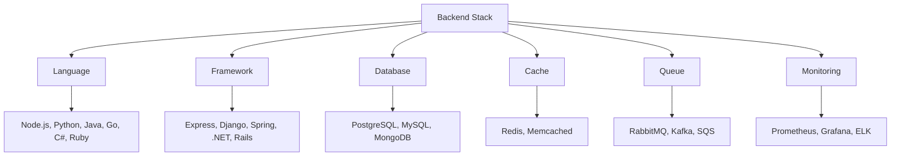

### Cloud Provider Comparison

| Service        | AWS           | GCP                | Azure        |
| -------------- | ------------- | ------------------ | ------------ |
| **Compute**    | EC2           | Compute Engine     | VMs          |
| **Serverless** | Lambda        | Cloud Functions    | Functions    |
| **K8s**        | EKS           | GKE                | AKS          |
| **DB**         | RDS, DynamoDB | Cloud SQL, Spanner | SQL Database |
| **Storage**    | S3            | Cloud Storage      | Blob Storage |
| **Queue**      | SQS           | Pub/Sub            | Service Bus  |

### Must-Have Documents

- [ ] Architecture Decision Records (ADR) 📋
- [ ] API Documentation (Swagger/OpenAPI) 📖
- [ ] Data Flow Diagrams 📊
- [ ] Deployment Guide 🚀
- [ ] Runbook (Incident response) 📘
- [ ] Onboarding Guide 👋
- [ ] System Design Overview 🏗️
- [ ] Security Policy 🔒

### ADR Template

// Example demonstrating Backend System Design.
```markdown

## Context

We need a database for our e-commerce platform with complex relationships.

## Decision

Use PostgreSQL for ACID compliance and complex queries.

## Status

Accepted

## Consequences

- Positive: Strong consistency, SQL support
- Negative: Harder to scale horizontally

## Alternatives Considered

- MongoDB: Better for unstructured data
- Cassandra: Better for write-heavy workloads
```

### Event Sourcing & CQRS

<!-- Visual flow for Backend System Design. -->
```mermaid
graph TD
    A[Command] --> B[Event Store]
    B --> C[Event]
    C --> D[Read Model]
    C --> E[Write Model]

D --> F[Query]
    E --> G[Command]

H[User] --> A
    H --> F
```

### Distributed Transactions

| Pattern    | Description               | Use When                      |
| ---------- | ------------------------- | ----------------------------- |
| **2PC**    | Two-phase commit          | Strong consistency needed     |
| **Saga**   | Compensating transactions | Eventual consistency accepted |
| **TCC**    | Try-Confirm-Cancel        | Complex business logic        |
| **Outbox** | Reliable messaging        | Guaranteed delivery           |

### Idempotency Patterns

// Example demonstrating Backend System Design.
```
🔁 Idempotency Key: Unique request ID
🔁 Check-Then-Act: Check if already processed
🔁 Version Numbers: Optimistic locking
🔁 State Machines: Track operation state
🔁 Timeline: Store operation timestamps
```

### Estimation Formulas

// Example demonstrating Backend System Design.
```
📐 Users: DAU × Requests per user × 20% peak
📐 Storage: Users × Data per user × Retention period
📐 Bandwidth: Requests × Data size × Peak multiplier
📐 Cache: 80% of read traffic × 1.5 overhead
📐 Connections: (Concurrent users × 10%) × 2
📐 Database connections: Pools = CPUs × 2
```

### Sizing Guide

| Component    | Rule of Thumb                    |
| ------------ | -------------------------------- |
| **Database** | 3x storage for indexes           |
| **Cache**    | 20-30% of database size          |
| **Network**  | 2x expected peak traffic         |
| **Memory**   | 30% for OS + overhead            |
| **Disk**     | SSD for DB, HDD for logs/backups |
| **CPU**      | 70% max utilization              |

### System Design Interview Framework

<!-- Visual flow for Backend System Design. -->
```mermaid
graph TD
    A[1. Requirements] --> B[2. Estimations]
    B --> C[3. High-Level Design]
    C --> D[4. Deep Dive]
    D --> E[5. Key Components]
    E --> F[6. Trade-offs]
    F --> G[7. Scalability]
    G --> H[8. Summary]
```

### Common Questions Checklist

// Example demonstrating Backend System Design.
```
✅ Functional requirements (features)
✅ Non-functional requirements (SLA, performance)
✅ Traffic estimates (QPS, DAU)
✅ Storage estimates (data growth)
✅ Choose database (SQL/NoSQL)
✅ Design data schema
✅ Choose caching strategy
✅ Design API endpoints
✅ Scale architecture (microservices)
✅ Handle failures (resilience)
✅ Monitor (logs, metrics)
✅ Security (auth, encryption)
```

### Before Going Live

- [ ] Load testing complete 🔥
- [ ] Security audit done 🛡️
- [ ] Monitoring/alerts configured 📊
- [ ] Backup/restore tested 💾
- [ ] Disaster recovery plan ready 🆘
- [ ] Rate limiting implemented 🚦
- [ ] API documentation updated 📝
- [ ] Environment variables configured 🔧
- [ ] Logging level set properly 📋
- [ ] SSL certificates valid 🔒
- [ ] CORS configured 🌐
- [ ] Database migrations applied 🗄️
- [ ] Health checks implemented 💚
- [ ] Rollback plan ready ↩️

## 🎓 Pro Tips

> 💡 **"Design for failure and it won't fail"** – Michael Nygard
> 📊 **"Optimize for the 90th percentile, not the average"**
> 🔄 **"If it hurts, do it more often"** – Continuous Deployment
> 📈 **"Measure everything, trust nothing"**
> 🧩 **"Make it scalable before you make it fast"**
> 🔐 **"Security is not a feature, it's a requirement"**

## Quick Reference

| Area | Revision point |
|---|---|
| Definition | State exactly what the topic means. |
| Mechanism | Explain the steps that produce the result. |
| Example | Use a small realistic case. |
| Pitfalls | Know common mistakes and boundary cases. |
