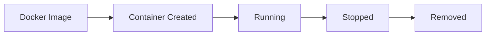

# Docker 🐳

Docker allows you to package applications and their dependencies into
lightweight containers that run consistently across environments.

---

## Docker Architecture

| Component        | Purpose                   |
| ---------------- | ------------------------- |
| Docker Engine    | Core runtime              |
| Docker Client    | CLI commands              |
| Docker Daemon    | Manages containers        |
| Docker Image     | Blueprint for containers  |
| Docker Container | Running instance of image |
| Docker Registry  | Stores images             |
| Docker Hub       | Public image registry     |
| Docker Volume    | Persistent storage        |
| Docker Network   | Container communication   |

## Installation Check

| Command                  | Description        |
| ------------------------ | ------------------ |
| `docker --version`       | Docker version     |
| `docker info`            | System information |
| `docker compose version` | Compose version    |

```bash
## Verify Docker installation
docker --version
```

## Search Images

```bash
## Search image on Docker Hub
docker search nginx
```

## Pull Image

```bash
## Download image
docker pull nginx
```

## List Images

```bash
## Show local images
docker images
```

## Remove Image

```bash
docker rmi nginx
```

## Remove Multiple Images

```bash
## Remove all images
docker rmi $(docker images -q)
```

## Run Container

```bash
docker run nginx
```

## Run in Background

```bash
## Detached mode
docker run -d nginx
```

## Assign Name

```bash
## Named container
docker run --name my-nginx nginx
```

## Interactive Mode

```bash
## Open shell
docker run -it ubuntu bash
```

## Container Management

| Command             | Description        |
| ------------------- | ------------------ |
| `docker ps`         | Running containers |
| `docker ps -a`      | All containers     |
| `docker start id`   | Start container    |
| `docker stop id`    | Stop container     |
| `docker restart id` | Restart container  |
| `docker kill id`    | Force stop         |
| `docker rm id`      | Delete container   |

```bash
## Show running containers
docker ps
```

## Port Mapping

```bash
## HostPort:ContainerPort
docker run -p 3000:80 nginx
```

Access:

```text
http://localhost:3000
```

```
## Environment Variables

```bash
## Pass environment variable
docker run -e NODE_ENV=production node
```

Multiple Variables:

```
```bash
docker run \
-e DB_HOST=localhost \
-e DB_PORT=5432 \
my-app
```

## Container Logs

```bash
## View logs
docker logs container_id
```

```bash
## Follow logs
docker logs -f container_id
```

```bash
## Last 100 lines
docker logs --tail 100 container_id
```

## Execute Commands

```bash
## Run command inside container
docker exec container_id ls
```

Interactive Shell:

```
```bash
docker exec -it container_id bash
```

For Alpine Linux:

```bash
docker exec -it container_id sh
```

## Host → Container

```bash
docker cp app.js container:/app
```

## Container → Host

```bash
docker cp container:/app .
```

## Dockerfile Basics

| Instruction | Purpose              |
| ----------- | -------------------- |
| FROM        | Base image           |
| WORKDIR     | Working directory    |
| COPY        | Copy files           |
| ADD         | Advanced copy        |
| RUN         | Execute command      |
| CMD         | Default command      |
| ENTRYPOINT  | Fixed command        |
| ENV         | Environment variable |
| EXPOSE      | Open port            |
| ARG         | Build variable       |

## Basic Dockerfile

```dockerfile
## Node.js application
FROM node:22-alpine

WORKDIR /app

COPY package*.json ./

RUN npm install

COPY . .

EXPOSE 3000

CMD ["npm", "start"]
```

## Build Image

```bash
docker build -t my-app .
```

Tag Version:

```bash
docker build -t my-app:v1 .
```

## Run Built Image

```bash
docker run -p 3000:3000 my-app
```

## Layer Caching

Bad:

```dockerfile
COPY . .
RUN npm install
```

Good:

```dockerfile
COPY package*.json ./
RUN npm install

COPY . .
```

Improves build speed.

## .dockerignore

```text
node_modules
.git
.next
dist
.env
coverage
```

Reduces image size.

## Volumes

Volumes persist data even after container deletion.

## Create Volume

```bash
docker volume create postgres-data
```

## List Volumes

```bash
docker volume ls
```

## Remove Volume

```bash
docker volume rm postgres-data
```

## Mount Volume

```bash
docker run \
-v postgres-data:/var/lib/postgresql/data \
postgres
```

## Bind Mount

```bash
docker run \
-v $(pwd):/app \
node
```

Useful for development.

## Create Network

```bash
docker network create app-network
```

## List Networks

```bash
docker network ls
```

## Remove Network

```bash
docker network rm app-network
```

## Connect Container To Network

```bash
docker run \
--network app-network \
redis
```

## Inspect Resources

```bash
docker inspect container_id
```

```bash
docker inspect image_name
```

## Memory Limit

```bash
docker run \
--memory="512m" \
nginx
```

## CPU Limit

```bash
docker run \
--cpus="1.5" \
nginx
```

## Docker Compose

Docker Compose manages multiple containers.

## compose.yaml

# Example configuration for the topic.
```yaml
## Full stack application
services:
  app:
    build: .
    ports:
      - '3000:3000'

postgres:
    image: postgres:17
    environment:
      POSTGRES_DB: app
      POSTGRES_USER: admin
      POSTGRES_PASSWORD: secret
```

## Compose Commands

| Command                  | Description      |
| ------------------------ | ---------------- |
| `docker compose up`      | Start services   |
| `docker compose up -d`   | Detached mode    |
| `docker compose down`    | Stop services    |
| `docker compose ps`      | List services    |
| `docker compose logs`    | View logs        |
| `docker compose build`   | Build services   |
| `docker compose restart` | Restart services |

## Start Compose

```bash
docker compose up -d
```

## Stop Compose

```bash
docker compose down
```

## Rebuild Containers

```bash
docker compose up --build
```

## Multi-stage Build

Reduces final image size.

```dockerfile
## Build stage
FROM node:22-alpine AS builder

RUN npm install
RUN npm run build

## Production stage
FROM node:22-alpine

COPY --from=builder /app/.next ./.next

CMD ["npm","start"]
```

## Health Check

```dockerfile
HEALTHCHECK \
CMD curl -f http://localhost:3000 || exit 1
```

## Remove Stopped Containers

```bash
docker container prune
```

## Remove Unused Images

```bash
docker image prune
```

## Remove Unused Volumes

```bash
docker volume prune
```

## Remove Everything Unused

```bash
docker system prune -a
```

## Login

```bash
docker login
```

## Tag Image

```bash
docker tag my-app username/my-app:v1
```

## Push Image

```bash
docker push username/my-app:v1
```

```bash
docker pull username/my-app:v1
```

## Docker Hub Workflow

```bash
docker build -t my-app .

docker tag my-app username/my-app:v1

docker push username/my-app:v1
```

## Useful Debugging Commands

```bash
docker logs container
```

```bash
docker exec -it container bash
```

```bash
docker inspect container
```

```bash
docker stats
```

```bash
docker top container
```

## Docker Stats

Shows:

| Metric    | Meaning         |
| --------- | --------------- |
| CPU %     | CPU usage       |
| MEM USAGE | Memory usage    |
| NET I/O   | Network traffic |
| BLOCK I/O | Disk operations |
| PIDS      | Processes       |

## Docker Compose Example (Node + PostgreSQL)

# Example configuration for the topic.
```yaml
services:
  app:
    build: .
    ports:
      - '3000:3000'
    depends_on:
      - db

db:
    image: postgres:17
    restart: always
    environment:
      POSTGRES_DB: app
      POSTGRES_USER: postgres
      POSTGRES_PASSWORD: password
    volumes:
      - postgres-data:/var/lib/postgresql/data

volumes:
  postgres-data:
```

## Common Docker Commands

| Command                   | Description        |
| ------------------------- | ------------------ |
| `docker images`           | List images        |
| `docker ps`               | Running containers |
| `docker ps -a`            | All containers     |
| `docker pull image`       | Download image     |
| `docker run image`        | Run image          |
| `docker stop id`          | Stop container     |
| `docker rm id`            | Remove container   |
| `docker rmi image`        | Remove image       |
| `docker logs id`          | View logs          |
| `docker exec -it id bash` | Open shell         |
| `docker build -t app .`   | Build image        |
| `docker compose up -d`    | Start compose      |
| `docker compose down`     | Stop compose       |

## Docker Interview Questions

| Question             | Answer                                                    |
| -------------------- | --------------------------------------------------------- |
| Image vs Container   | Image is blueprint, container is running instance         |
| CMD vs ENTRYPOINT    | CMD can be overridden, ENTRYPOINT cannot easily           |
| Volume vs Bind Mount | Volume managed by Docker, Bind Mount uses host filesystem |
| Docker vs VM         | Containers share OS kernel, VMs have full OS              |
| EXPOSE vs -p         | EXPOSE documents port, `-p` publishes port                |
| COPY vs ADD          | COPY preferred, ADD has extra features                    |
| Multi-stage Build    | Smaller production images                                 |
| Docker Compose       | Multi-container orchestration                             |
| Layer Caching        | Reuses unchanged build layers                             |
| Bridge Network       | Default Docker network                                    |

## Production Best Practices

| Practice                     | Benefit                 |
| ---------------------------- | ----------------------- |
| Use Alpine Images            | Smaller image size      |
| Multi-stage Builds           | Lean production images  |
| Use .dockerignore            | Faster builds           |
| Run as Non-root User         | Better security         |
| Pin Image Versions           | Predictable deployments |
| Use Health Checks            | Reliability             |
| Limit Resources              | Prevent abuse           |
| Store Secrets Outside Images | Security                |
| Use Named Volumes            | Persistent data         |
| Keep Images Small            | Faster deployments      |

### Container Lifecycle

<!-- Visual flow for Docker 🐳. -->


## Quick Reference

| Area | Revision point |
|---|---|
| Definition | State exactly what the topic means. |
| Mechanism | Explain the steps that produce the result. |
| Example | Use a small realistic case. |
| Pitfalls | Know common mistakes and boundary cases. |
