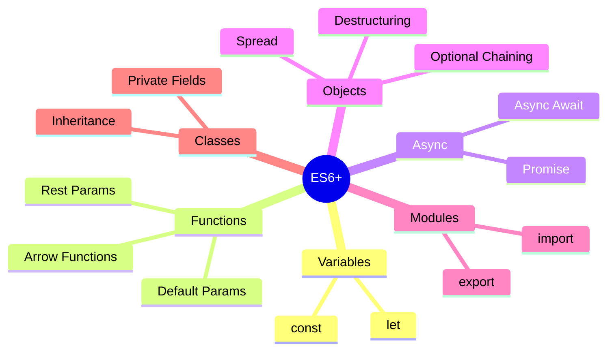
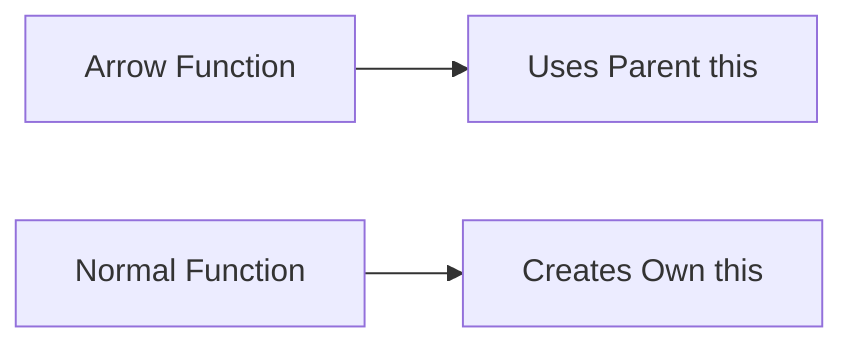
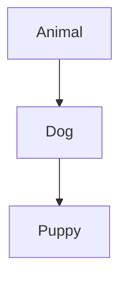
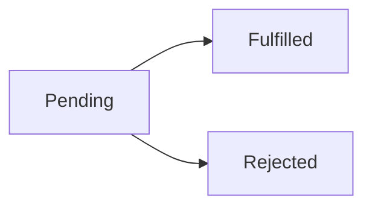
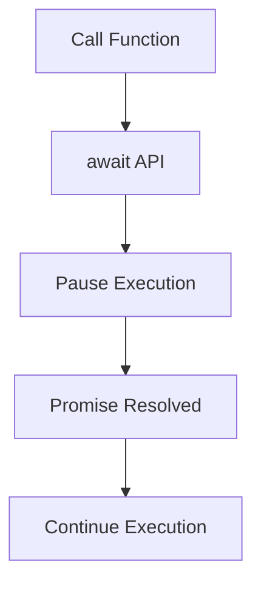
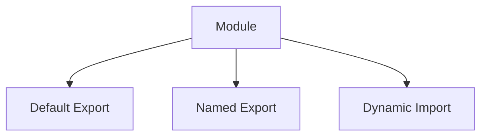

# ES6+ JavaScript

Modern JavaScript quick reference for interviews, development, debugging, and
daily usage.

---

# ES6 Overview



---

# Variables

## var vs let vs const

| Feature            | var      | let   | const |
| ------------------ | -------- | ----- | ----- |
| Scope              | Function | Block | Block |
| Reassign Allowed   | Yes      | Yes   | No    |
| Redeclare Allowed  | Yes      | No    | No    |
| Hoisted            | Yes      | Yes   | Yes   |
| Temporal Dead Zone | No       | Yes   | Yes   |
| Recommended        | ❌       | ✅    | ✅    |

---

## let

```js
let count = 1;

if (true) {
  let count = 10;
  console.log(count); // 10
}

console.log(count); // 1
```

### Best Use Cases

- Counters
- Loops
- Mutable values

---

## const

```js
const API_URL = 'https://api.com';
```

### Important

```js
const user = { name: 'Ravi' };

user.name = 'Teja'; // valid
```

`const` prevents reassignment, not mutation.

---

# Template Literals

## Interpolation

```js
const name = 'Ravi';
const message = `Hello ${name}`;
```

---

## Multi-line Strings

```js
const text = `
Line 1
Line 2
`;
```

---

## Real-world Usage

```js
const html = `
  <div>
    <h1>${title}</h1>
  </div>
`;
```

---

# Number Features

| Feature          | Example                | Result |
| ---------------- | ---------------------- | ------ |
| Binary           | `0b1010`               | 10     |
| Octal            | `0o755`                | 493    |
| Exponent         | `2 ** 3`               | 8      |
| Number.isInteger | `Number.isInteger(10)` | true   |
| Number.isNaN     | `Number.isNaN(NaN)`    | true   |

---

# String Methods

| Method     | Example                    | Result |
| ---------- | -------------------------- | ------ |
| includes   | `'hello'.includes('ll')`   | true   |
| startsWith | `'hello'.startsWith('he')` | true   |
| endsWith   | `'hello'.endsWith('lo')`   | true   |
| repeat     | `'ha'.repeat(3)`           | hahaha |
| padStart   | `'5'.padStart(3,'0')`      | 005    |
| padEnd     | `'5'.padEnd(3,'0')`        | 500    |

---

# Array Methods

## Most Important Array Methods

| Method   | Purpose          | Returns      |
| -------- | ---------------- | ------------ |
| map      | Transform array  | New array    |
| filter   | Filter items     | New array    |
| reduce   | Accumulate value | Single value |
| find     | Find first match | Item         |
| some     | Any item matches | Boolean      |
| every    | All items match  | Boolean      |
| includes | Check existence  | Boolean      |

---

## map

```js
const nums = [1, 2, 3];

const doubled = nums.map((n) => n * 2);
```

---

## filter

```js
const users = users.filter((u) => u.active);
```

---

## reduce

```js
const total = [1, 2, 3].reduce((acc, curr) => acc + curr, 0);
```

---

## find

```js
const user = users.find((u) => u.id === 1);
```

---

# Destructuring

## Array Destructuring

```js
const [first, second] = [10, 20];
```

---

## Object Destructuring

```js
const user = {
  name: 'Ravi',
  age: 25,
};

const { name, age } = user;
```

---

## Default Values

```js
const { city = 'Hyderabad' } = user;
```

---

## Rename Variables

```js
const { name: fullName } = user;
```

---

## Nested Destructuring

```js
const user = {
  profile: {
    city: 'Bangalore',
  },
};

const {
  profile: { city },
} = user;
```

---

# Spread vs Rest Operator

| Operator | Purpose         | Example     |
| -------- | --------------- | ----------- |
| Spread   | Expands values  | `[...arr]`  |
| Rest     | Collects values | `(...args)` |

---

## Spread Operator

```js
const arr1 = [1, 2];
const arr2 = [...arr1, 3];
```

---

## Object Spread

```js
const updated = {
  ...user,
  role: 'admin',
};
```

---

## Rest Parameters

```js
function sum(...nums) {
  return nums.reduce((a, b) => a + b, 0);
}
```

---

# Functions

## Arrow Functions

```js
const add = (a, b) => a + b;
```

---

## Implicit Return

```js
const square = (n) => n * n;
```

---

## Returning Object

```js
const getUser = () => ({
  id: 1,
  name: 'Ravi',
});
```

---

## Default Parameters

```js
function greet(name = 'Guest') {
  return `Hello ${name}`;
}
```

---

## Lexical this



```js
class Timer {
  start() {
    setTimeout(() => {
      console.log(this);
    }, 1000);
  }
}
```

---

# Objects

## Property Shorthand

```js
const name = 'Ravi';

const user = { name };
```

---

## Method Shorthand

```js
const app = {
  start() {
    console.log('Started');
  },
};
```

---

## Computed Properties

```js
const key = 'role';

const user = {
  [key]: 'admin',
};
```

---

## Object Utility Methods

| Method           | Purpose                 |
| ---------------- | ----------------------- |
| Object.keys()    | Returns keys            |
| Object.values()  | Returns values          |
| Object.entries() | Returns key-value pairs |
| Object.assign()  | Merge objects           |

---

# Optional Chaining

```js
const city = user?.address?.city;
```

### Prevents

```js
Cannot read properties of undefined
```

---

# Nullish Coalescing

```js
const username = value ?? 'Guest';
```

## Difference

| Operator | Checks                |     |              |
| -------- | --------------------- | --- | ------------ |
| `        |                       | `   | Falsy values |
| `??`     | null / undefined only |     |              |

---

# Classes

## Basic Class

```js
class User {
  constructor(name) {
    this.name = name;
  }

  greet() {
    return `Hello ${this.name}`;
  }
}
```

---

## Inheritance



```js
class Animal {
  speak() {
    return 'Animal sound';
  }
}

class Dog extends Animal {
  speak() {
    return 'Bark';
  }
}
```

---

## super

```js
class Admin extends User {
  constructor(name, role) {
    super(name);
    this.role = role;
  }
}
```

---

## Static Methods

```js
class MathUtil {
  static add(a, b) {
    return a + b;
  }
}
```

---

## Private Fields

```js
class Bank {
  #balance = 0;

  deposit(amount) {
    this.#balance += amount;
  }
}
```

---

# Promises

## Promise Lifecycle



---

## Creating Promise

```js
const promise = new Promise((resolve, reject) => {
  const success = true;

  if (success) {
    resolve('Done');
  } else {
    reject('Error');
  }
});
```

---

## Using Promise

```js
promise
  .then((res) => console.log(res))
  .catch((err) => console.log(err))
  .finally(() => console.log('Completed'));
```

---

## Promise Methods

| Method             | Purpose                  |
| ------------------ | ------------------------ |
| Promise.all        | Wait all promises        |
| Promise.race       | First completed promise  |
| Promise.allSettled | Wait all success/failure |
| Promise.resolve    | Create resolved promise  |
| Promise.reject     | Create rejected promise  |

---

# Async / Await



```js
async function fetchUser() {
  try {
    const user = await getUser();
    return user;
  } catch (error) {
    console.error(error);
  }
}
```

---

# Modules

## Export Default

```js
export default function App() {}
```

---

## Named Export

```js
export const PI = 3.14;
```

---

## Import Default

```js
import App from './App.js';
```

---

## Named Import

```js
import { PI } from './math.js';
```

---

## Dynamic Import

```js
const module = await import('./utils.js');
```

---

# Iterators & Generators

## Generator Function

```js
function* counter() {
  yield 1;
  yield 2;
  yield 3;
}
```

---

## for...of

```js
for (const value of [1, 2, 3]) {
  console.log(value);
}
```

---

# Set vs Map

| Feature           | Set           | Map             |
| ----------------- | ------------- | --------------- |
| Stores            | Unique values | Key-value pairs |
| Duplicate Allowed | No            | Keys unique     |
| Ordered           | Yes           | Yes             |
| Iterable          | Yes           | Yes             |

---

## Set

```js
const set = new Set([1, 2, 2, 3]);
```

---

## Map

```js
const map = new Map();

map.set('name', 'Ravi');
```

---

# Symbols

```js
const id = Symbol('id');
```

Used for unique property identifiers.

---

# Import Patterns



---

# Common Modern JavaScript Patterns

## Ternary Operator

```js
const role = isAdmin ? 'Admin' : 'User';
```

---

## Logical AND

```js
isLoggedIn && showDashboard();
```

---

## Logical OR

```js
const value = input || 'default';
```

---

## Optional Chaining + Nullish Coalescing

```js
const city = user?.address?.city ?? 'Unknown';
```

---

# ES6 Feature Popularity in Real Projects

| Feature           | Usage Frequency |
| ----------------- | --------------- |
| Arrow Functions   | ⭐⭐⭐⭐⭐      |
| Destructuring     | ⭐⭐⭐⭐⭐      |
| Async/Await       | ⭐⭐⭐⭐⭐      |
| Spread Operator   | ⭐⭐⭐⭐⭐      |
| Optional Chaining | ⭐⭐⭐⭐⭐      |
| Classes           | ⭐⭐⭐⭐        |
| Generators        | ⭐⭐            |
| Symbols           | ⭐⭐            |

---

# Most Important ES6 Features To Master

1. let / const
2. Arrow functions
3. Destructuring
4. Spread & Rest operators
5. Async / Await
6. Promises
7. Array methods
8. Modules
9. Optional chaining
10. Classes
