# 🚀 **Frontend System Design**

_The Ultimate Guide to Building Scalable, Performant, and Maintainable
Frontends_

---

## 📌 **1. Core Principles**

| Principle                       | Description                           | Emoji |
| ------------------------------- | ------------------------------------- | ----- |
| **Separation of Concerns**      | Divide UI, logic, and data layers     | 🧩    |
| **Single Responsibility**       | Each component does one thing well    | 🎯    |
| **DRY (Don't Repeat Yourself)** | Reuse code via components/hooks       | ♻️    |
| **Loose Coupling**              | Minimize dependencies between modules | 🔗    |
| **High Cohesion**               | Related code stays together           | 🧲    |

---

## 🏗️ **2. Architecture Patterns**

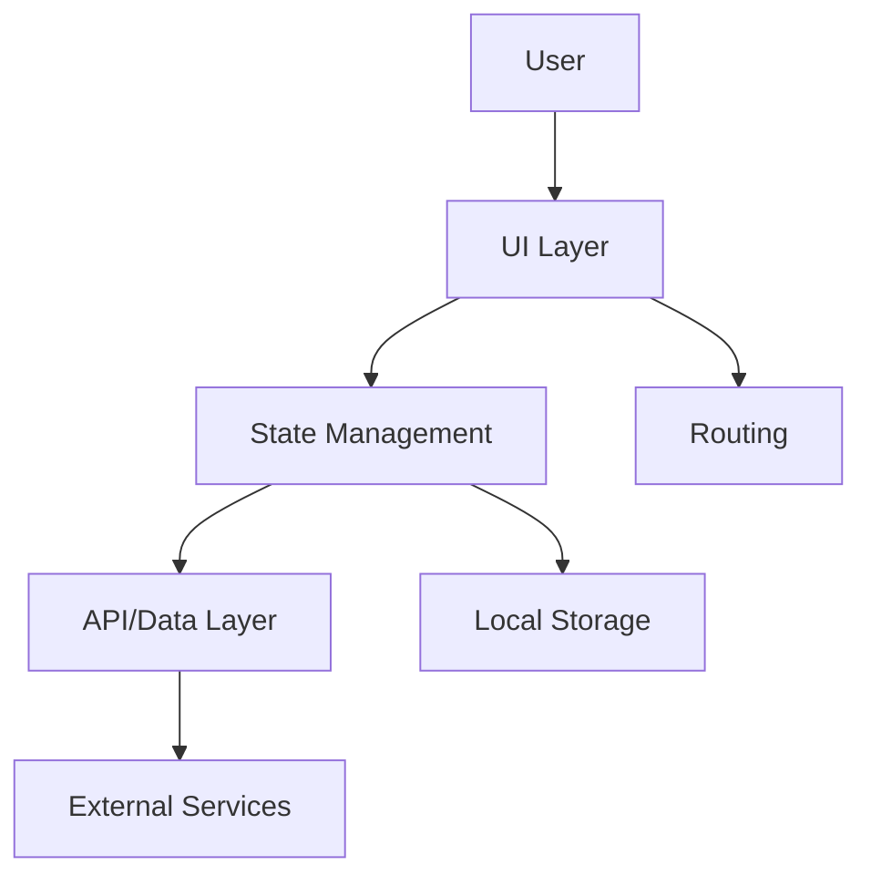

### **Popular Patterns**

| Pattern            | Use Case                 | Pros                    | Cons                  |
| ------------------ | ------------------------ | ----------------------- | --------------------- |
| **MVC**            | Traditional apps         | Clear separation        | Heavy controllers     |
| **Flux/Redux**     | Complex state            | Predictable state       | Boilerplate           |
| **MVVM**           | Data-binding (React/Vue) | Reactive                | Complex reactivity    |
| **Microfrontends** | Large teams              | Independent deployments | Coordination overhead |

---

## 🎨 **3. Component Design**

### **Component Hierarchy**

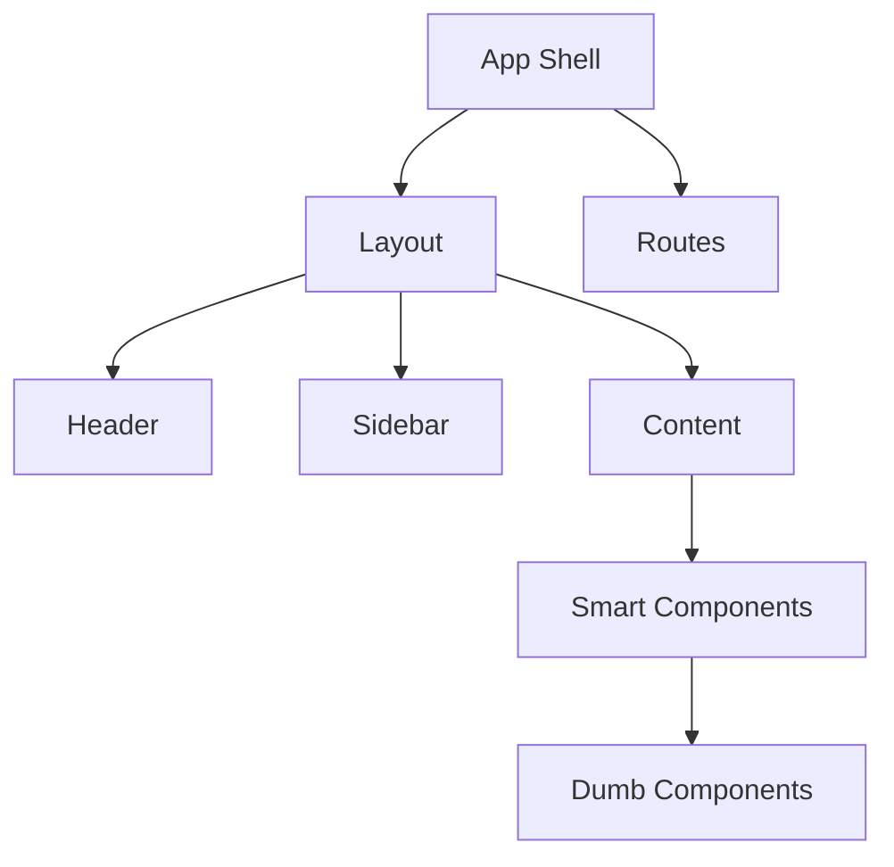

### **Component Types**

| Type                   | Description            | Example      | State? |
| ---------------------- | ---------------------- | ------------ | ------ |
| **Presentational**     | Pure UI, no logic      | Button, Card | ❌     |
| **Container**          | Logic + data fetching  | UserProfile  | ✅     |
| **Higher-Order (HOC)** | Wraps components       | withAuth     | ❌     |
| **Render Props**       | Shares logic via props | DataFetcher  | ❌     |

---

## 📦 **4. State Management**

### **State Types**

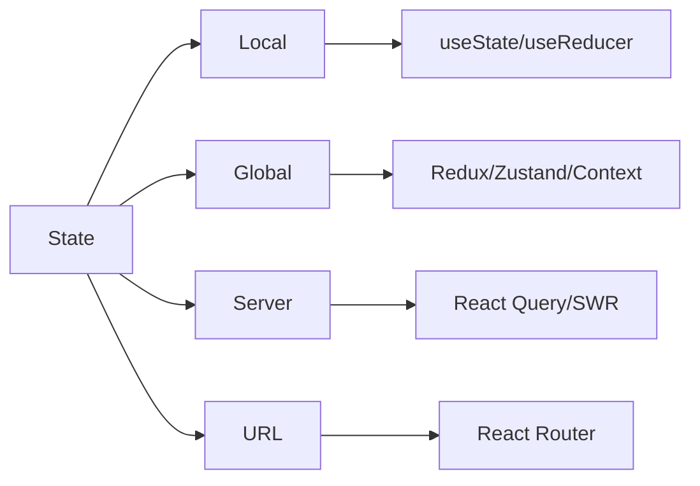

### **State Management Comparison**

| Tool              | Best For            | Size   | Learning Curve |
| ----------------- | ------------------- | ------ | -------------- |
| **Context API**   | Simple global state | Small  | Easy           |
| **Redux Toolkit** | Complex apps        | Large  | Steep          |
| **Zustand**       | Medium complexity   | Small  | Moderate       |
| **Recoil**        | Fine-grained state  | Medium | Moderate       |
| **MobX**          | Reactive state      | Medium | Moderate       |

---

## 🔄 **5. Data Flow**

### **Unidirectional Data Flow**

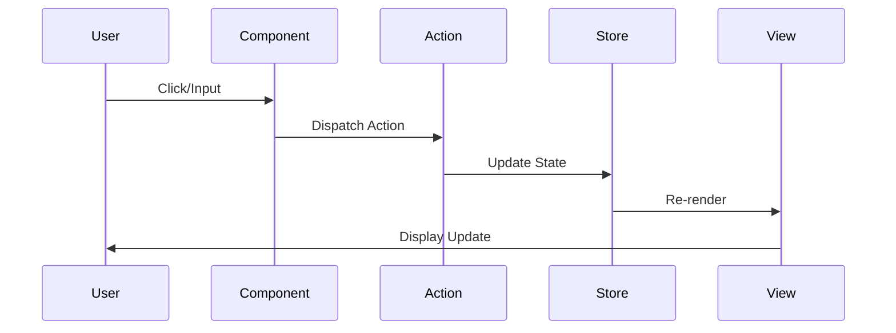

### **Data Fetching Strategies**

| Strategy              | When to Use            | Example         |
| --------------------- | ---------------------- | --------------- |
| **Client-side**       | After initial load     | Search, filters |
| **Server-side (SSR)** | SEO-critical pages     | Product pages   |
| **Static (SSG)**      | Never-changing content | Blog posts      |
| **Incremental (ISR)** | Frequently updated     | News, CMS       |

---

## 🧪 **6. Performance Optimization**

### **Critical Metrics**

| Metric                             | Target  | Emoji |
| ---------------------------------- | ------- | ----- |
| **LCP** (Largest Contentful Paint) | < 2.5s  | 🖼️    |
| **FID** (First Input Delay)        | < 100ms | ⌨️    |
| **CLS** (Cumulative Layout Shift)  | < 0.1   | 📐    |
| **TTI** (Time to Interactive)      | < 5s    | ⚡    |
| **FCP** (First Contentful Paint)   | < 1.8s  | 🎨    |

### **Optimization Techniques**

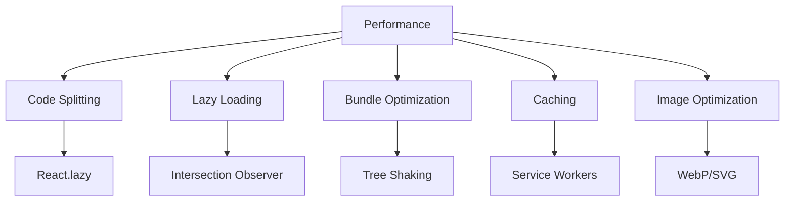

---

## 🛠️ **7. Development Tools**

### **Essential Toolchain**

| Category          | Tools                          | Emoji |
| ----------------- | ------------------------------ | ----- |
| **Bundler**       | Vite, Webpack, Rollup          | 📦    |
| **Linting**       | ESLint, Prettier               | ✨    |
| **Testing**       | Jest, Testing Library, Cypress | 🧪    |
| **Type Checking** | TypeScript, Flow               | 🔍    |
| **Dev Server**    | Vite, Next.js dev              | 🚀    |

### **Build Pipeline**

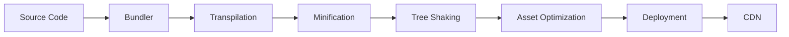

---

## 🌐 **8. API Integration**

### **API Layer Design**

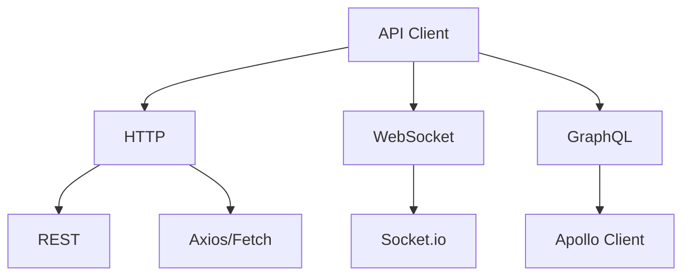

### **Error Handling Strategy**

| Error Type  | Handling               | User Feedback      |
| ----------- | ---------------------- | ------------------ |
| **4xx**     | Show validation errors | Red highlights     |
| **5xx**     | Retry with backoff     | "Try again" button |
| **Network** | Offline mode           | Offline indicator  |
| **Timeout** | Show spinner           | "Still loading..." |

---

## 🧩 **9. Reusability Patterns**

### **Code Reuse Strategies**

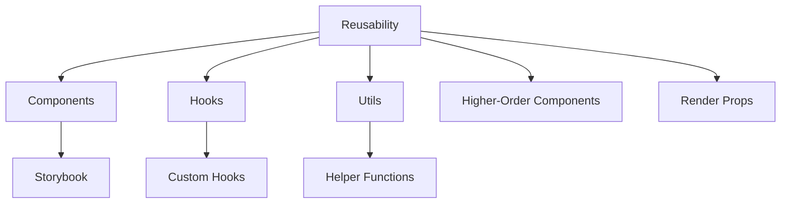

### **Design System Structure**

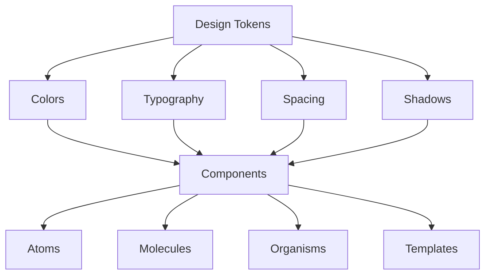

---

## 🔒 **10. Security Best Practices**

### **Common Vulnerabilities**

| Attack             | Prevention                  | Emoji |
| ------------------ | --------------------------- | ----- |
| **XSS**            | Sanitize input, CSP         | 🚫    |
| **CSRF**           | Anti-CSRF tokens            | 🛡️    |
| **Clickjacking**   | X-Frame-Options             | 🖱️    |
| **Sensitive Data** | Never store in localStorage | 🔐    |
| **Dependency**     | Regular updates             | 📦    |

### **Security Checklist**

- [ ] HTTPS everywhere 🔒
- [ ] Environment variables for secrets 🤫
- [ ] Input validation on both ends ✅
- [ ] Authentication tokens with HttpOnly cookies 🍪
- [ ] Content Security Policy (CSP) 🛡️
- [ ] Rate limiting 🚦

---

## 🗂️ **11. Project Structure**

### **Recommended Structure**

```
src/
├── components/
│   ├── common/        # Reusable UI components
│   ├── features/      # Feature-specific components
│   └── pages/         # Page-level components
├── hooks/             # Custom React hooks
├── utils/             # Helper functions
├── services/          # API calls, external services
├── store/             # State management
├── types/             # TypeScript types/interfaces
├── constants/         # App constants
├── styles/            # Global styles
├── assets/            # Images, fonts
├── config/            # Configuration
└── tests/             # Test files
```

---

## 📊 **12. Testing Strategy**

### **Testing Pyramid**

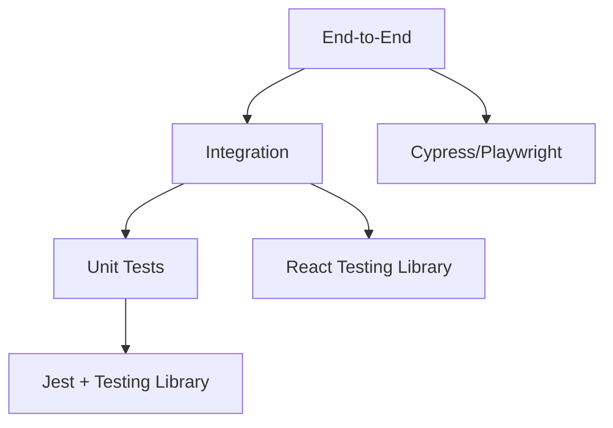

### **Test Coverage Goals**

| Test Type       | Coverage | Focus                  |
| --------------- | -------- | ---------------------- |
| **Unit**        | 70-80%   | Functions, components  |
| **Integration** | 60-70%   | Feature workflows      |
| **E2E**         | 30-40%   | Critical user journeys |

---

## 🚀 **13. CI/CD Pipeline**

### **Pipeline Stages**

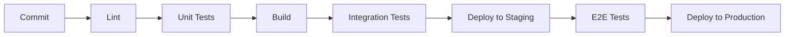

### **Git Workflow**

| Branch       | Purpose             |
| ------------ | ------------------- |
| **main**     | Production-ready    |
| **develop**  | Integration branch  |
| **feature/** | New features        |
| **hotfix/**  | Urgent fixes        |
| **release/** | Release preparation |

---

## 📈 **14. Monitoring & Observability**

### **What to Monitor**

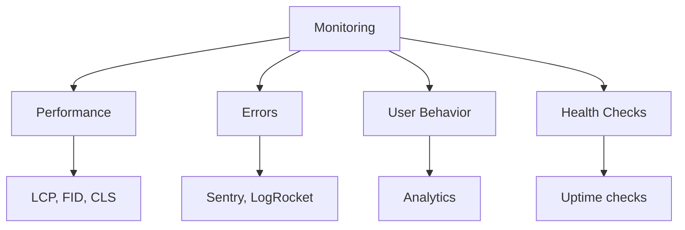

### **Alerting Rules**

| Metric           | Threshold | Action             |
| ---------------- | --------- | ------------------ |
| **Error Rate**   | >5%       | PagerDuty alert    |
| **API Response** | >3s       | Slack notification |
| **LCP**          | >4s       | Performance review |
| **Bounce Rate**  | >60%      | UX investigation   |

---

## 🧠 **15. Scalability Considerations**

### **Scale Readiness Checklist**

| Aspect             | Check                         |
| ------------------ | ----------------------------- |
| **Code Splitting** | Dynamic imports ✅            |
| **CDN**            | Assets on CDN ✅              |
| **Caching**        | Service Worker, HTTP cache ✅ |
| **Lazy Loading**   | Images, components ✅         |
| **Bundle Size**    | < 200KB initial ✅            |
| **API Caching**    | React Query/SWR ✅            |
| **Web Vitals**     | Green scores ✅               |

---

## 🎯 **16. Decision Matrix**

### **When to Use What**

| Scenario          | Recommendation            |
| ----------------- | ------------------------- |
| **Simple app**    | Context API + React Query |
| **Complex state** | Redux Toolkit + RTK Query |
| **Real-time**     | WebSockets + Zustand      |
| **SEO-critical**  | Next.js (SSR/SSG)         |
| **Static site**   | Gatsby/Vite               |
| **Mobile-first**  | Responsive design + PWA   |

---

## 📝 **17. Documentation Requirements**

### **Must-Have Docs**

- [ ] README with setup instructions 📖
- [ ] Component API documentation 📚
- [ ] State management explanation 🧠
- [ ] Architecture diagrams 📊
- [ ] Deployment guide 🚀
- [ ] Troubleshooting guide 🛠️
- [ ] Contributing guidelines 🤝

---

## 🔥 **18. Advanced Patterns**

### **Microfrontends Architecture**

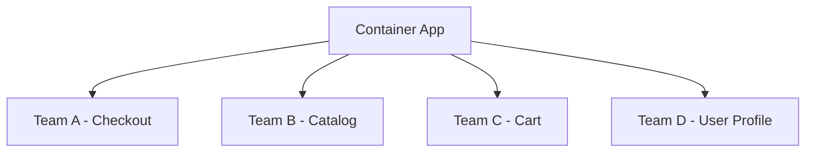

### **Feature Toggles**

```javascript
const features = {
  newCheckout: false,
  darkMode: true,
  aiRecommendations: false,
};

if (features.newCheckout) {
  // Show new checkout flow
}
```

---

## 🧹 **19. Technical Debt Management**

### **Debt Types**

| Type                      | Example           | Fix               |
| ------------------------- | ----------------- | ----------------- |
| **Code Smell**            | Large components  | Refactor          |
| **Duplication**           | Copy-pasted code  | Extract to shared |
| **Outdated Dependencies** | Old React version | Upgrade           |
| **No Tests**              | Untested features | Add tests         |
| **Magic Numbers**         | Hardcoded values  | Use constants     |

---

## 📋 **20. Final Checklist**

### **Before Release**

- [ ] Performance budget met 🎯
- [ ] Accessibility checks (WCAG) ♿
- [ ] Cross-browser testing 🌐
- [ ] Mobile responsive 📱
- [ ] Error tracking setup 🚨
- [ ] Analytics integration 📊
- [ ] SEO meta tags 🏷️
- [ ] Security headers 🔒
- [ ] Bundle analysis 📦
- [ ] Environment configs 🔧

---

## 🎓 **Pro Tips**

> 💡 **"Premature optimization is the root of all evil"** – Donald Knuth  
> 📐 **"Make it work, make it right, make it fast"** – Kent Beck  
> 🔄 **"Design for change, not for permanence"** – Eric Evans
