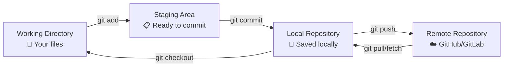
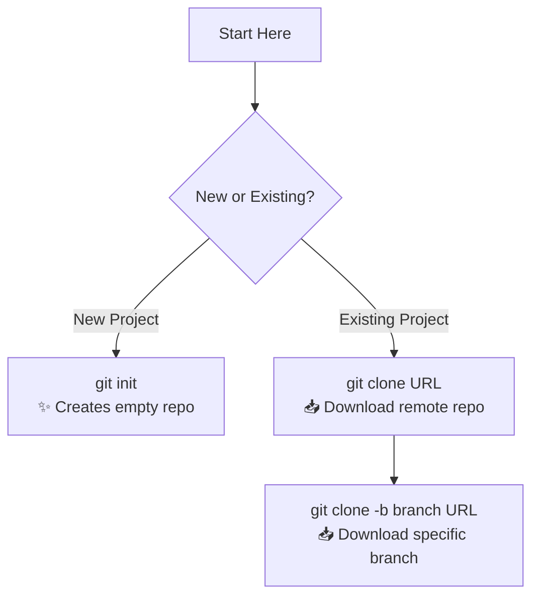
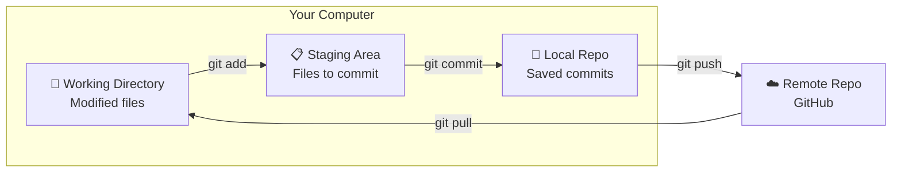
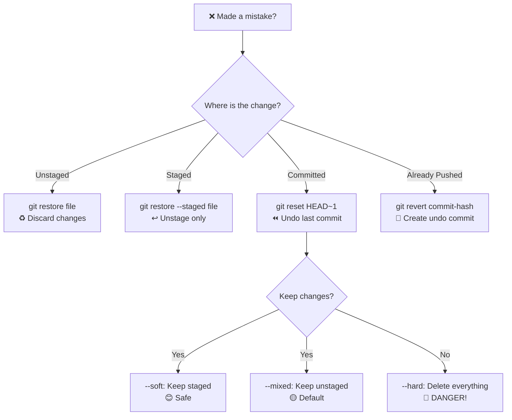
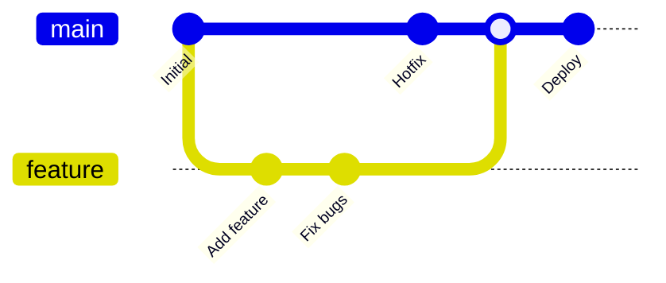
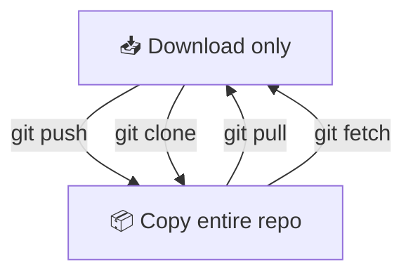
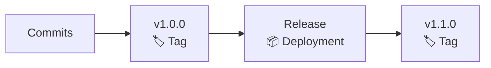
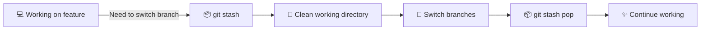
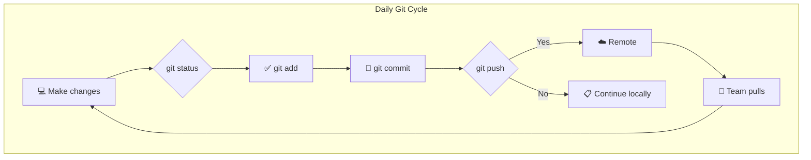

# GIT

## GIT ARCHITECTURE (How Git Works)

<!-- Visual flow for GIT. -->


---

## 1. SETUP & CONFIGURATION _(One-time setup)_

| Command                                          | What it does             |
| ------------------------------------------------ | ------------------------ |
| `git config --global user.name "Your Name"`      | 👤 Set your name         |
| `git config --global user.email "you@email.com"` | 📧 Set your email        |
| `git config --global init.defaultBranch main`    | 📌 Default branch name   |
| `git config --global core.editor "code --wait"`  | ✏️ Set VS Code as editor |
| `git config --list`                              | 🔍 View all settings     |

## 📁 2. STARTING A REPOSITORY

<!-- Visual flow for GIT. -->


| Command                    | Purpose                                    |
| -------------------------- | ------------------------------------------ |
| `git init`                 | 🆕 Create new repository in current folder |
| `git clone <url>`          | 📥 Download existing repo                  |
| `git clone <url> <folder>` | 📥 Clone to specific folder                |

## 3. BASIC WORKFLOW _(Daily Commands)_

<!-- Visual flow for GIT. -->


### Essential Commands:

| Command                    | What it does             | 🎯 When to use                     |
| -------------------------- | ------------------------ | ---------------------------------- |
| `git status`               | Shows what's changed     | 🔍 Check your current state        |
| `git add <file>`           | Stage a file             | ✅ Ready to commit this file       |
| `git add .`                | Stage all changes        | ✅ Commit everything               |
| `git commit -m "message"`  | Save staged changes      | 💾 Save your work                  |
| `git commit -am "message"` | Add & commit in one step | ⚡ Quick save (tracked files only) |
| `git push`                 | Upload to remote         | ☁️ Share your changes              |
| `git pull`                 | Download from remote     | 📥 Get latest changes              |
| `git log --oneline`        | View commit history      | 📜 See what happened               |

### Example Workflow:

# Basic example showing the core idea.
```bash
## 1. Check what's changed
git status

## 2. Stage your changes
git add index.html style.css

## 3. Save with a message
git commit -m "Add homepage and styling"

## 4. Share with team
git push origin main
```

## 4. VIEWING & COMPARING CHANGES

| Command                     | What it shows         | 🎨 Visual                      |
| --------------------------- | --------------------- | ------------------------------ |
| `git diff`                  | Unstaged changes      | ✏️ What you changed            |
| `git diff --staged`         | Staged changes        | ✏️ What you're about to commit |
| `git diff main..feature`    | Between branches      | 🔄 Differences in branches     |
| `git log --oneline --graph` | History with branches | 🌿 Visual branch tree          |
| `git show <commit>`         | Details of a commit   | 🔍 Full commit info            |

### Pretty Log Aliases:

# Basic example showing the core idea.
```bash
## Add these for beautiful history views
git config --global alias.tree "log --graph --pretty=format:'%C(yellow)%h%Creset %s %C(blue)%an%Creset %C(green)%d%Creset' --all"
git config --global alias.lg "log --oneline --graph --all --decorate"

## Use them:
git tree
git lg
```

## ⏪ 5. UNDOING CHANGES _(Your Safety Net)_

<!-- Visual flow for GIT. -->


### Common Undo Scenarios:

| What you want                     | Command                         | ⚠️ Safety    |
| --------------------------------- | ------------------------------- | ------------ |
| Undo last commit, keep changes    | `git reset --soft HEAD~1`       | 🟢 Safe      |
| Undo last commit, unstage changes | `git reset HEAD~1`              | 🟡 Medium    |
| Discard all uncommitted changes   | `git restore .`                 | 🔴 Permanent |
| Unstage a file                    | `git restore --staged file.txt` | 🟢 Safe      |
| Revert a pushed commit            | `git revert <commit-hash>`      | 🟢 Safe      |
| Remove untracked files            | `git clean -fd`                 | 🔴 Permanent |

## 🌿 6. BRANCHING _(Work on features independently)_

<!-- Visual flow for GIT. -->


### Branch Commands:

| Command                | Purpose         | Example                          |
| ---------------------- | --------------- | -------------------------------- |
| `git branch`           | List branches   | 📋 See all branches              |
| `git branch <name>`    | Create branch   | 🆕 `git branch feature-auth`     |
| `git switch <name>`    | Switch branch   | 🔀 `git switch feature-auth`     |
| `git switch -c <name>` | Create & switch | ✨ `git switch -c new-feature`   |
| `git branch -d <name>` | Delete branch   | 🗑️ `git branch -d old-branch`    |
| `git branch -D <name>` | Force delete    | 💀 `git branch -D broken-branch` |

### Merge vs Rebase:

| Merge                       | Rebase                           |
| --------------------------- | -------------------------------- |
| `git merge feature`         | `git rebase main`                |
| ✅ Preserves history        | ✅ Clean linear history          |
| ❌ Creates merge commit     | ❌ Rewrites commit history       |
| 🟢 Safe for shared branches | 🔴 Dangerous for shared branches |

# Basic example showing the core idea.
```bash
## Option 1: Merge (recommended for beginners)
git checkout feature
git merge main

## Option 2: Rebase (cleaner history)
git checkout feature
git rebase main
```

## ☁ 7. REMOTE REPOSITORIES _(Working with GitHub)_

<!-- Visual flow for GIT. -->


### Remote Commands:

| Command                       | What it does                 |
| ----------------------------- | ---------------------------- |
| `git remote -v`               | 📋 List remotes              |
| `git remote add origin <url>` | 🔗 Link to GitHub            |
| `git push -u origin main`     | ☁️ First push (set upstream) |
| `git push`                    | ☁️ Push to default remote    |
| `git pull`                    | 📥 Fetch + Merge             |
| `git fetch`                   | 📥 Download (no merge)       |
| `git remote remove origin`    | 🗑️ Remove remote link        |

### Push Scenarios:

# Basic example showing the core idea.
```bash
## First time pushing
git push -u origin main

## Regular push
git push

## Push to specific branch
git push origin feature-branch

## Force push (USE WITH CAUTION!)
git push --force-with-lease  # Safer than --force
```

## 🏷 8. TAGGING _(Mark important points)_

<!-- Visual flow for GIT. -->


| Command                                  | Purpose                       |
| ---------------------------------------- | ----------------------------- |
| `git tag`                                | 📋 List all tags              |
| `git tag v1.0.0`                         | 🏷️ Create lightweight tag     |
| `git tag -a v1.0.0 -m "Release version"` | 📝 Annotated tag with message |
| `git push --tags`                        | ☁️ Upload tags to remote      |
| `git tag -d v1.0.0`                      | 🗑️ Delete local tag           |
| `git push origin :v1.0.0`                | 🗑️ Delete remote tag          |

## 💾 9. STASHING _(Temporary save)_

<!-- Visual flow for GIT. -->


### Stash Commands:

| Command           | What it does                     |
| ----------------- | -------------------------------- |
| `git stash`       | 💾 Save current work             |
| `git stash list`  | 📋 See all stashes               |
| `git stash pop`   | 📤 Apply and remove latest stash |
| `git stash apply` | 📤 Apply (keep stash)            |
| `git stash drop`  | 🗑️ Remove latest stash           |
| `git stash clear` | 🧹 Remove all stashes            |

### Interactive Rebase _(Clean up commit history)_

# Basic example showing the core idea.
```bash
## Edit last 3 commits
git rebase -i HEAD~3

## drop = remove commit
```

### Cherry-Pick _(Copy specific commit)_

# Basic example showing the core idea.
```bash
## Copy commit from another branch
git cherry-pick <commit-hash>

## Example: Get a bug fix from main
git checkout feature
git cherry-pick abc123  # Commit hash from main
```

### Bisect _(Find which commit broke something)_

# Basic example showing the core idea.
```bash
git bisect start
git bisect bad HEAD      # Current is broken
git bisect good <hash>   # Known working commit
## Git will checkout commits for you to test
git bisect good          # If current is working
git bisect bad           # If current is broken
git bisect reset         # End bisect
```

### Reflog _(Recover lost commits)_

# Basic example showing the core idea.
```bash
git reflog               # See all HEAD movements
git checkout HEAD@{2}    # Go back to previous state
git branch recovered <commit-hash>  # Create branch from lost commit
```

## 📋 11. .GITIGNORE _(What NOT to commit)_

# Basic example showing the core idea.
```bash

## Dependencies
node_modules/
vendor/
__pycache__/

## Build outputs
dist/
build/
*.exe
*.o

## Environment files
.env
.env.local
*.secret

## IDE files
.vscode/
.idea/
*.swp
.DS_Store

## Logs
*.log
npm-debug.log*
```

**Key Rule:** Always commit `.gitignore` **before** adding files it should
ignore!

## 🚨 12. TROUBLESHOOTING COMMON ISSUES

| Problem                             | Solution                                                                  |
| ----------------------------------- | ------------------------------------------------------------------------- |
| 🔴 "Merge conflict"                 | Fix in file → `git add` → `git commit`                                    |
| 🔴 "Detached HEAD"                  | `git switch -c new-branch` to save work                                   |
| 🔴 Accidentally deleted branch      | `git reflog` → `git checkout -b branch <hash>`                            |
| 🔴 Committed to wrong branch        | `git reset HEAD~1` → `git switch correct-branch` → `git cherry-pick`      |
| 🔴 Forgot to commit on right branch | `git stash` → `git switch right-branch` → `git stash pop`                 |
| 🔴 Large file committed             | Use BFG Repo-Cleaner or `git filter-branch`                               |
| 🔴 Need to undo pushed commit       | `git revert <hash>` (safe) or `git reset --hard` + force push (dangerous) |

### 🔥 New Feature Workflow:

# Basic example showing the core idea.
```bash
## 1. Get latest main
git checkout main
git pull origin main

## 2. Create feature branch
git switch -c feature/login-page

## 3. Work on changes
git add .
git commit -m "Add login form"

## 4. Update with main (avoid conflicts)
git fetch origin
git rebase main  # or git merge main

## 5. Push to remote
git push -u origin feature/login-page

## 6. Create Pull Request on GitHub
```

### 🐛 Bug Fix Workflow:

# Basic example showing the core idea.
```bash
## 1. Create hotfix from main
git checkout main
git pull
git switch -c hotfix/security-patch

## 2. Fix bug
git add .
git commit -m "Fix security vulnerability"

## 3. Deploy immediately
git push origin hotfix/security-patch

## 4. Merge back
git checkout main
git merge hotfix/security-patch
git push origin main
```

### Release Workflow:

# Basic example showing the core idea.
```bash
## 1. Prepare release branch
git checkout main
git pull
git switch -c release/v2.0.0

## 2. Final tweaks
git commit -m "Prepare release v2.0.0"

## 3. Tag release
git tag -a v2.0.0 -m "Release version 2.0.0"

## 4. Push everything
git push origin release/v2.0.0
git push origin v2.0.0
```

## 14. PRODUCTIVITY ALIASES _(Time Savers)_

# Basic example showing the core idea.
```bash
## Add to ~/.gitconfig or use:
git config --global alias.co checkout
git config --global alias.br branch
git config --global alias.ci commit
git config --global alias.st status
git config --global alias.unstage "reset HEAD --"
git config --global alias.last "log -1 HEAD"
git config --global alias.tree "log --graph --pretty=format:'%C(yellow)%h%Creset %s %C(blue)%an%Creset %C(green)%d%Creset' --all"
git config --global alias.lg "log --oneline --graph --all --decorate"
git config --global alias.undo "reset --soft HEAD~1"
git config --global alias.wip "commit -am 'WIP: $(date +%H:%M)'"

git st          # status
git co main     # checkout
git lg          # pretty log
```

## 15. VISUAL SUMMARY

<!-- Visual flow for GIT. -->


## 📚 16. BEST PRACTICES _(Golden Rules)_

| 🥇 Rule                      | Why                             |
| ---------------------------- | ------------------------------- |
| **Commit often**             | Small commits = easier to debug |
| **Write good messages**      | Future you will thank you       |
| **Pull before you push**     | Avoid merge conflicts           |
| **Never force push to main** | Protect your team's work        |
| **Use feature branches**     | Keep main stable                |
| **Review before commit**     | `git diff` and `git status`     |
| **Don't commit secrets**     | Use `.gitignore`                |
| **Tag releases**             | Easy to find versions           |

### ✅ Good Commit Message Format:

// Example demonstrating GIT.
```
Short summary (50 chars max)

Detailed explanation if needed:
- What changed
- Why it changed
- Any side effects

Fixes #123
```

## 🔗 17. USEFUL RESOURCES

| Resource                                                          | What it's for            |
| ----------------------------------------------------------------- | ------------------------ |
| [git-scm.com](https://git-scm.com/doc)                            | 📖 Official docs         |
| [GitHub Learning Lab](https://lab.github.com/)                    | 🎓 Interactive tutorials |
| [Oh Shit, Git!](https://ohshitgit.com/)                           | 🚨 Common fixes          |
| [Git Flight Rules](https://github.com/k88hudson/git-flight-rules) | 📋 Practical solutions   |
| [Learn Git Branching](https://learngitbranching.js.org/)          | 🎮 Visual learning game  |

## ✅ REMEMBER:

> Git is like a time machine for your code. **Master these commands and you'll
> never lose work again!** 🚀

**Final Tip:** Practice in a test repo first. Create a folder called
`git-practice` and experiment freely!

// Example demonstrating GIT.
```
mkdir git-practice
cd git-practice
git init
## Test everything here!
```

## Quick Reference

| Area | Revision point |
|---|---|
| Definition | State exactly what the topic means. |
| Mechanism | Explain the steps that produce the result. |
| Example | Use a small realistic case. |
| Pitfalls | Know common mistakes and boundary cases. |
