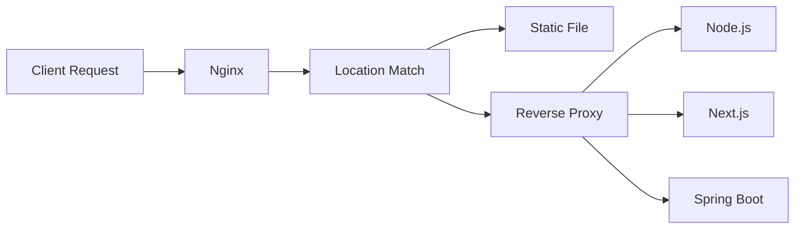

# Nginx

**Nginx** is a high-performance web server, reverse proxy, load balancer, and
API gateway widely used to serve web applications such as React, Next.js,
Node.js, and Dockerized applications.

---

## Installation

| OS     | Command                  |
| ------ | ------------------------ |
| Ubuntu | `sudo apt install nginx` |
| CentOS | `sudo yum install nginx` |
| MacOS  | `brew install nginx`     |
| Docker | `docker run nginx`       |

## Common Commands

| Command                        | Description           |
| ------------------------------ | --------------------- |
| `nginx -v`                     | Show version          |
| `nginx -V`                     | Detailed version info |
| `nginx -t`                     | Test configuration    |
| `sudo systemctl start nginx`   | Start Nginx           |
| `sudo systemctl stop nginx`    | Stop Nginx            |
| `sudo systemctl restart nginx` | Restart               |
| `sudo systemctl reload nginx`  | Reload config         |
| `sudo systemctl status nginx`  | Check status          |

# Basic example showing the core idea.
```bash
## Validate configuration
sudo nginx -t
```

## Important Directories

| Path                          | Purpose        |
| ----------------------------- | -------------- |
| `/etc/nginx/nginx.conf`       | Main config    |
| `/etc/nginx/conf.d/`          | Custom configs |
| `/etc/nginx/sites-available/` | Site configs   |
| `/etc/nginx/sites-enabled/`   | Enabled sites  |
| `/var/www/html/`              | Website files  |
| `/var/log/nginx/access.log`   | Access logs    |
| `/var/log/nginx/error.log`    | Error logs     |

## Basic Configuration Structure

// Example demonstrating Nginx.
```nginx
events {}

http {
  server {
    listen 80;

location / {
      return 200 "Hello Nginx";
    }
  }
}
```

## Server Block

Equivalent of Apache Virtual Host.

// Example demonstrating Nginx.
```nginx
server {
    listen 80;

server_name example.com;

root /var/www/html;

index index.html;
}
```

## Listen Directive

| Example           | Meaning     |
| ----------------- | ----------- |
| `listen 80;`      | HTTP        |
| `listen 443 ssl;` | HTTPS       |
| `listen 8080;`    | Custom port |
| `listen [::]:80;` | IPv6        |

## Server Names

// Example demonstrating Nginx.
```nginx
server_name example.com;
```

// Example demonstrating Nginx.
```nginx
server_name www.example.com;
```

// Example demonstrating Nginx.
```nginx
server_name *.example.com;
```

// Example demonstrating Nginx.
```nginx
server_name _;
```

Catch-all server.

## Root Directory

// Example demonstrating Nginx.
```nginx
root /var/www/html;
```

## Default Index File

// Example demonstrating Nginx.
```nginx
index index.html index.htm;
```

## Exact Match

// Example demonstrating Nginx.
```nginx
location = /login {
}
```

Only matches:

// Example demonstrating Nginx.
```text
/login
```

## Prefix Match

// Example demonstrating Nginx.
```nginx
location /api {
}
```

Matches:

// Example demonstrating Nginx.
```text
/api
/api/users
/api/products
```

## Regex Match

// Example demonstrating Nginx.
```nginx
location ~ \.php$ {
}
```

// Example demonstrating Nginx.
```text
index.php
user.php
```

## Static File Hosting

root /var/www/app;

location / {
        try_files $uri $uri/ =404;
    }
}
// Example demonstrating Nginx.
```

## React SPA Deployment

root /var/www/react-app/build;

location / {
        try_files $uri /index.html;
    }
}
```

Fixes refresh issues.

## Next.js Reverse Proxy

location / {
        proxy_pass http://localhost:3000;
    }
}
// Example demonstrating Nginx.
```

## Node.js Reverse Proxy

server_name api.example.com;

location / {
        proxy_pass http://localhost:5000;
    }
}
```

## Reverse Proxy Headers

// Example demonstrating Nginx.
```nginx
location / {
    proxy_pass http://localhost:3000;

proxy_set_header Host $host;

proxy_set_header X-Real-IP $remote_addr;

proxy_set_header X-Forwarded-For $proxy_add_x_forwarded_for;

proxy_set_header X-Forwarded-Proto $scheme;
}
```

## Load Balancing

// Example demonstrating Nginx.
```nginx
upstream backend {
    server 127.0.0.1:3000;
    server 127.0.0.1:3001;
    server 127.0.0.1:3002;
}
```

// Example demonstrating Nginx.
```nginx
server {
    location / {
        proxy_pass http://backend;
    }
}
```

## Load Balancing Methods

| Method            | Description               |
| ----------------- | ------------------------- |
| Round Robin       | Default                   |
| Least Connections | Least active connections  |
| IP Hash           | Same client → same server |
| Hash              | Custom key based          |

## Least Connections

// Example demonstrating Nginx.
```nginx
upstream backend {
    least_conn;

server app1:3000;
    server app2:3000;
}
```

## HTTPS Configuration

// Example demonstrating Nginx.
```nginx
server {
    listen 443 ssl;

ssl_certificate /etc/ssl/cert.pem;

ssl_certificate_key /etc/ssl/key.pem;
}
```

## HTTP → HTTPS Redirect

return 301 https://$host$request_uri;
}
// Example demonstrating Nginx.
```

## SSL Best Practice

```nginx
ssl_protocols TLSv1.2 TLSv1.3;
// Example demonstrating Nginx.
```

## Gzip Compression

```nginx
gzip on;

gzip_types
text/plain
text/css
application/json
application/javascript;
// Example demonstrating Nginx.
```

## Caching Static Assets

```nginx
location ~* \.(js|css|png|jpg|jpeg|svg)$ {
    expires 30d;

add_header Cache-Control "public";
}
// Example demonstrating Nginx.
```

## Custom Error Pages

```nginx
error_page 404 /404.html;
// Example demonstrating Nginx.
```

```nginx
location = /404.html {
}
// Example demonstrating Nginx.
```

## Access Logs

```nginx
access_log /var/log/nginx/access.log;
// Example demonstrating Nginx.
```

## Error Logs

```nginx
error_log /var/log/nginx/error.log;
// Example demonstrating Nginx.
```

## Disable Logs

```nginx
access_log off;
// Example demonstrating Nginx.
```

## Basic Authentication

Generate password:

```bash
htpasswd -c /etc/nginx/.htpasswd admin
// Example demonstrating Nginx.
```

Configuration:

```nginx
location /admin {
    auth_basic "Restricted";

auth_basic_user_file /etc/nginx/.htpasswd;
}
// Example demonstrating Nginx.
```

## Create Zone

```nginx
limit_req_zone
$binary_remote_addr
zone=api_limit:10m
rate=10r/s;
// Example demonstrating Nginx.
```

## Apply Limit

```nginx
location /api {
    limit_req zone=api_limit;
}
// Example demonstrating Nginx.
```

## File Upload Limit

```nginx
client_max_body_size 100M;
// Example demonstrating Nginx.
```

## CORS

```nginx
location /api {

add_header Access-Control-Allow-Origin *;

add_header Access-Control-Allow-Methods "GET,POST,PUT,DELETE";

add_header Access-Control-Allow-Headers "*";
}
// Example demonstrating Nginx.
```

## Redirect URL

```nginx
location /old {
    return 301 /new;
}
// Example demonstrating Nginx.
```

## Rewrite URL

```nginx
rewrite ^/users/(.*)$ /profile/$1 permanent;
// Example demonstrating Nginx.
```

## Security Headers

```nginx
add_header X-Frame-Options SAMEORIGIN;

add_header X-Content-Type-Options nosniff;

add_header X-XSS-Protection "1; mode=block";
// Example demonstrating Nginx.
```

## Block Access To Files

```nginx
location ~ /\. {
    deny all;
}
// Example demonstrating Nginx.
```

Protects:

```text
.env
.git
.htaccess
// Example demonstrating Nginx.
```

### Dockerfile

```dockerfile
FROM nginx:alpine

COPY dist /usr/share/nginx/html
// Example demonstrating Nginx.
```

## Docker Compose

```yaml
services:
  nginx:
    image: nginx
    ports:
      - '80:80'
// Example demonstrating Nginx.
```

## Common Variables

| Variable       | Meaning     |
| -------------- | ----------- |
| `$host`        | Domain      |
| `$uri`         | Current URI |
| `$request_uri` | Full URL    |
| `$remote_addr` | Client IP   |
| `$server_name` | Server name |
| `$scheme`      | http/https  |

## Test Config

```bash
nginx -t
// Example demonstrating Nginx.
```

## Reload Config

```bash
sudo systemctl reload nginx
// Example demonstrating Nginx.
```

## View Logs

```bash
tail -f /var/log/nginx/error.log
// Example demonstrating Nginx.
```

```bash
tail -f /var/log/nginx/access.log
// Example demonstrating Nginx.
```

## Nginx for Next.js Production

location / {
        proxy_pass http://localhost:3000;

proxy_set_header X-Forwarded-Proto $scheme;
    }
}
```

## Nginx for React Build

root /var/www/react-app;

index index.html;

## Nginx Request Flow

<!-- Visual flow for Nginx. -->


## Most Used Commands

| Command                   | Purpose         |
| ------------------------- | --------------- |
| `nginx -t`                | Validate config |
| `nginx -s reload`         | Reload          |
| `systemctl restart nginx` | Restart         |
| `tail -f error.log`       | Watch errors    |
| `tail -f access.log`      | Watch traffic   |

## Nginx Interview Questions

| Question        | Answer                               |
| --------------- | ------------------------------------ |
| Nginx vs Apache | Event-driven vs process/thread-based |
| Reverse Proxy   | Forwards requests to backend         |
| Upstream        | Group of backend servers             |
| Gzip            | Compresses responses                 |
| Location Block  | URL matching                         |
| Proxy Pass      | Forward request                      |
| Load Balancing  | Distributes traffic                  |
| SSL Termination | HTTPS handled by Nginx               |
| try_files       | File existence check                 |
| Rate Limiting   | Protect APIs                         |

## Production Best Practices

| Practice                  | Benefit             |
| ------------------------- | ------------------- |
| Enable Gzip               | Faster responses    |
| Enable HTTPS              | Security            |
| Use Reverse Proxy         | Better scalability  |
| Add Security Headers      | Prevent attacks     |
| Enable Caching            | Improve performance |
| Use Rate Limiting         | Prevent abuse       |
| Monitor Logs              | Easier debugging    |
| Use TLS 1.2+              | Secure connections  |
| Hide Sensitive Files      | Security            |
| Test Config Before Reload | Avoid downtime      |

## Quick Reference

| Area | Revision point |
|---|---|
| Definition | State exactly what the topic means. |
| Mechanism | Explain the steps that produce the result. |
| Example | Use a small realistic case. |
| Pitfalls | Know common mistakes and boundary cases. |
