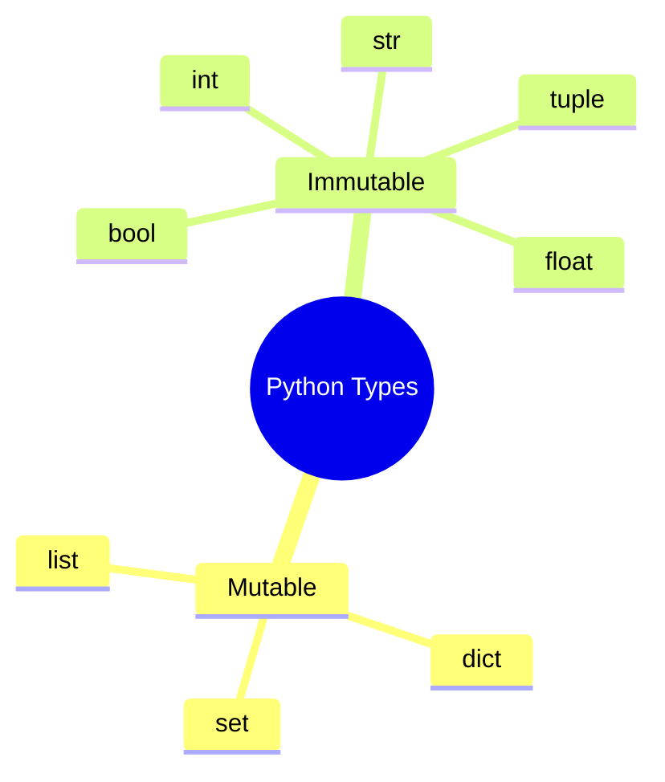

# Python

<!-- Visual flow for Python. -->


---

### 1.Variables & Data Types

| **Syntax**                 | **Description**  |
| -------------------------- | ---------------- |
| `x = 5`                    | Integer variable |
| `y = 3.14`                 | Float variable   |
| `name = "Alice"`           | String variable  |
| `is_valid = True`          | Boolean variable |
| `nums = [1, 2, 3]`         | List             |
| `person = {"name": "Bob"}` | Dictionary       |
| `coordinates = (10, 20)`   | Tuple            |
| `unique_nums = {1, 2, 3}`  | Set              |

### 2.Operators

| **Operator** | **Description**  |
| ------------ | ---------------- |
| `+ - * /`    | Arithmetic       |
| `%`          | Modulus          |
| `**`         | Exponentiation   |
| `//`         | Floor division   |
| `== !=`      | Comparison       |
| `< > <= >=`  | Comparison       |
| `and or not` | Logical          |
| `in`         | Membership check |

### 3.Strings

| **Method**                | **Description**         |
| ------------------------- | ----------------------- |
| `len(s)`                  | String length           |
| `s.lower()`               | Convert to lowercase    |
| `s.upper()`               | Convert to uppercase    |
| `s.strip()`               | Remove whitespace       |
| `s.split()`               | Split into list         |
| `s.replace("old", "new")` | Replace substring       |
| `f"Hello {name}"`         | f-strings (Python 3.6+) |

### 4.Lists

| **Method**      | **Description** |
| --------------- | --------------- |
| `len(lst)`      | List length     |
| `lst.append(x)` | Add element     |
| `lst.remove(x)` | Remove element  |
| `lst.pop(i)`    | Remove at index |
| `lst.sort()`    | Sort list       |
| `lst.reverse()` | Reverse list    |
| `lst[1:3]`      | Slicing         |

### 5.Dictionaries

| **Method**               | **Description**     |
| ------------------------ | ------------------- |
| `dict.keys()`            | Get all keys        |
| `dict.values()`          | Get all values      |
| `dict.items()`           | Get key-value pairs |
| `dict.get(key, default)` | Safe key access     |
| `dict.update(new_dict)`  | Merge dictionaries  |

### 6.Tuples

| **Method**      | **Description**       |
| --------------- | --------------------- |
| `t = (1, 2, 3)` | Immutable sequence    |
| `t.count(x)`    | Count occurrences     |
| `t.index(x)`    | Find index of element |

### 7.Sets

| **Method**          | **Description** |
| ------------------- | --------------- |
| `s.add(x)`          | Add element     |
| `s.remove(x)`       | Remove element  |
| `s.union(t)`        | Union of sets   |
| `s.intersection(t)` | Intersection    |

### 8.Conditionals

# Basic example showing the core idea.
```python
if x > 0:
    print("Positive")
elif x == 0:
    print("Zero")
else:
    print("Negative")
```

### 9.Loops

| **Loop**   | **Example**          |
| ---------- | -------------------- |
| `for`      | `for i in range(5):` |
| `while`    | `while x < 10:`      |
| `break`    | Exit loop            |
| `continue` | Skip iteration       |

### 10.Functions

# Basic example showing the core idea.
```python
def greet(name="User"):
    return f"Hello, {name}"
```

### 11.File Handling

| **Mode** | **Description** |
| -------- | --------------- |
| `"r"`    | Read            |
| `"w"`    | Write           |
| `"a"`    | Append          |
| `"rb"`   | Read binary     |

# Basic example showing the core idea.
```python
with open("file.txt", "r") as f:
    content = f.read()
```

### 12.Exception Handling

# Basic example showing the core idea.
```python
try:
    x = 10 / 0
except ZeroDivisionError:
    print("Cannot divide by zero!")
finally:
    print("Done")
```

### 13.Classes & OOP

# Basic example showing the core idea.
```python
class Person:
    def __init__(self, name):
        self.name = name

def greet(self):
        return f"Hello, {self.name}"

p = Person("Alice")
print(p.greet())
```

This cheat sheet covers essential Python syntax. Bookmark it for quick
reference! 🚀

## Quick Reference

| Area | Revision point |
|---|---|
| Definition | State exactly what the topic means. |
| Mechanism | Explain the steps that produce the result. |
| Example | Use a small realistic case. |
| Pitfalls | Know common mistakes and boundary cases. |

## A Strong Answer Pattern

Start with a precise definition, then explain the mechanism, trade-offs, and one concrete example. If there are alternatives, say what constraint would make each alternative preferable. This shows understanding without turning the answer into a list of disconnected terms.

## Follow-up Questions

Be ready for “what happens when this fails?”, “what is the complexity?”, “what changes at scale?”, and “what are the trade-offs?”. These questions test whether you can apply the concept rather than repeat its definition.

## Example Before Vocabulary

When a concept is abstract, explain a small scenario first and name the pattern afterward. The example gives the terminology a useful mental model and makes the answer easier to recall under interview pressure.

## Decision Trade-offs

For interviews, avoid treating a technology or pattern as universally correct. State the requirement first, then explain the choice and the cost it introduces. A concise answer can mention one alternative and the condition that would make it preferable. This demonstrates engineering judgment: the goal is not to name the most advanced option, but to show that the decision follows from the constraints.

## Final Understanding Check

Before considering **Python** revised, make sure you can state the definition without relying on the example, explain the mechanism in the correct order, and predict what happens when one important input or assumption changes. Then check one boundary case and one practical use case. The example should support the explanation rather than replace it. When a result is surprising, inspect the rule that produced it and verify the relevant precondition. This approach is more reliable than memorising a code snippet, formula, command, or interview answer because the same reasoning can be applied to a new problem. For technical topics, also distinguish what is guaranteed by the language, library, protocol, or mathematical rule from what is merely a common convention. That distinction helps you choose the correct solution when the context changes.
