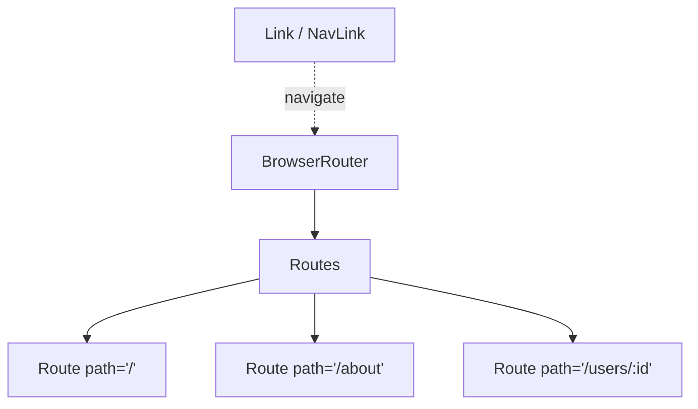

# React-Router-Dom

---

## Installation

| Command                        | Description                       |
| ------------------------------ | --------------------------------- |
| `npm install react-router-dom` | Install React Router for web apps |

## Basic Components

| Component         | Description                                 | Example                                                                                 |
| ----------------- | ------------------------------------------- | --------------------------------------------------------------------------------------- |
| `<BrowserRouter>` | Wrapper for routing in React apps           | `<BrowserRouter><App /></BrowserRouter>`                                                |
| `<Routes>`        | Container for route definitions (v6+)       | `<Routes><Route path="/" element={<Home />} /></Routes>`                                |
| `<Route>`         | Defines a route                             | `<Route path="/about" element={<About />} />`                                           |
| `<Link>`          | Navigation link (prevents full page reload) | `<Link to="/about">About</Link>`                                                        |
| `<NavLink>`       | Link with active styling                    | `<NavLink to="/" className={({ isActive }) => isActive ? "active" : ""}>Home</NavLink>` |

<!-- Visual flow for React-Router-Dom. -->

## Navigation

| Component/Prop | Description                         | Example                                    |
| -------------- | ----------------------------------- | ------------------------------------------ |
| `to`           | Specifies the path to navigate      | `<Link to="/contact">Contact</Link>`       |
| `replace`      | Replaces history instead of pushing | `<Link to="/" replace />`                  |
| `state`        | Pass state with navigation          | `<Link to="/" state={{ from: "home" }} />` |

## Route Configuration

| Prop      | Description                      | Example                                       |
| --------- | -------------------------------- | --------------------------------------------- |
| `path`    | URL path to match                | `<Route path="/users" element={<Users />} />` |
| `element` | Component to render              | `<Route path="/" element={<Home />} />`       |
| `index`   | Marks a route as index (default) | `<Route index element={<Home />} />`          |

## Dynamic Routing

| Feature        | Description             | Example                                                 |
| -------------- | ----------------------- | ------------------------------------------------------- |
| URL Parameters | Extract params from URL | `<Route path="/users/:id" element={<UserProfile />} />` |
| `useParams()`  | Access URL parameters   | `const { id } = useParams();`                           |
| Wildcard (`*`) | Catch-all route         | `<Route path="/docs/*" element={<Docs />} />`           |

## Nested Routes

| Feature        | Description              | Example                                          |
| -------------- | ------------------------ | ------------------------------------------------ |
| `<Outlet>`     | Renders child routes     | `<Outlet />` inside parent component             |
| Relative paths | Paths relative to parent | `<Route path="profile" element={<Profile />} />` |

## Navigation Hooks

| Hook                | Description              | Example                                              |
| ------------------- | ------------------------ | ---------------------------------------------------- |
| `useNavigate()`     | Programmatic navigation  | `const navigate = useNavigate(); navigate("/home");` |
| `useLocation()`     | Access current location  | `const location = useLocation();`                    |
| `useParams()`       | Access URL parameters    | `const { id } = useParams();`                        |
| `useSearchParams()` | Read/update query params | `const [params, setParams] = useSearchParams();`     |

## Redirects & 404 Handling

| Component/Pattern | Description               | Example                                                  |
| ----------------- | ------------------------- | -------------------------------------------------------- |
| `<Navigate>`      | Redirect to another route | `<Route path="/old" element={<Navigate to="/new" />} />` |
| No-match route    | 404 handling              | `<Route path="*" element={<NotFound />} />`              |

## Programmatic Navigation

| Method           | Description           | Example                   |
| ---------------- | --------------------- | ------------------------- |
| `navigate(path)` | Navigate to a path    | `navigate("/dashboard");` |
| `navigate(-1)`   | Go back in history    | `navigate(-1);`           |
| `navigate(1)`    | Go forward in history | `navigate(1);`            |

This cheat sheet covers **React Router v6+**. Let me know if you'd like any
additions or modifications! 🚀

## Quick Reference

| Area | Revision point |
|---|---|
| Definition | State exactly what the topic means. |
| Mechanism | Explain the steps that produce the result. |
| Example | Use a small realistic case. |
| Pitfalls | Know common mistakes and boundary cases. |

## A Strong Answer Pattern

Start with a precise definition, then explain the mechanism, trade-offs, and one concrete example. If there are alternatives, say what constraint would make each alternative preferable. This shows understanding without turning the answer into a list of disconnected terms.

## Follow-up Questions

Be ready for “what happens when this fails?”, “what is the complexity?”, “what changes at scale?”, and “what are the trade-offs?”. These questions test whether you can apply the concept rather than repeat its definition.

## Example Before Vocabulary

When a concept is abstract, explain a small scenario first and name the pattern afterward. The example gives the terminology a useful mental model and makes the answer easier to recall under interview pressure.

## Decision Trade-offs

For interviews, avoid treating a technology or pattern as universally correct. State the requirement first, then explain the choice and the cost it introduces. A concise answer can mention one alternative and the condition that would make it preferable. This demonstrates engineering judgment: the goal is not to name the most advanced option, but to show that the decision follows from the constraints.

## Final Understanding Check

Before considering **React-Router-Dom** revised, make sure you can state the definition without relying on the example, explain the mechanism in the correct order, and predict what happens when one important input or assumption changes. Then check one boundary case and one practical use case. The example should support the explanation rather than replace it. When a result is surprising, inspect the rule that produced it and verify the relevant precondition. This approach is more reliable than memorising a code snippet, formula, command, or interview answer because the same reasoning can be applied to a new problem. For technical topics, also distinguish what is guaranteed by the language, library, protocol, or mathematical rule from what is merely a common convention. That distinction helps you choose the correct solution when the context changes.
