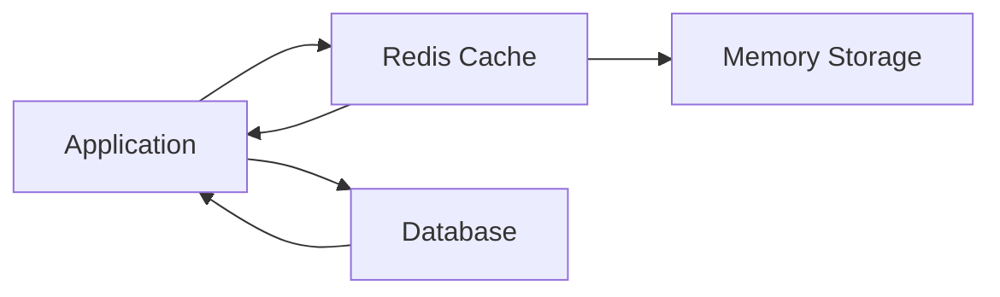

# Redis

**Redis** (Remote Dictionary Server) is an in-memory key-value database used for
caching, session storage, pub/sub messaging, rate limiting, queues, and
real-time applications.

---

## Redis Architecture

| Component    | Description           |
| ------------ | --------------------- |
| Redis Server | Stores data in memory |
| Redis Client | Connects to Redis     |
| Key          | Unique identifier     |
| Value        | Stored data           |
| Persistence  | Save data to disk     |
| Pub/Sub      | Real-time messaging   |
| Streams      | Event processing      |
| Replication  | Data duplication      |
| Sentinel     | High availability     |
| Cluster      | Horizontal scaling    |

## Installation

| Platform | Command                         |
| -------- | ------------------------------- |
| Ubuntu   | `sudo apt install redis-server` |
| MacOS    | `brew install redis`            |
| Docker   | `docker run redis`              |

## Common Commands

| Command             | Description     |
| ------------------- | --------------- |
| `redis-server`      | Start Redis     |
| `redis-cli`         | Open CLI        |
| `redis-cli ping`    | Test connection |
| `redis-cli info`    | Server info     |
| `redis-cli monitor` | Watch commands  |

```bash id="vjjtdm"
## Check Redis connection
redis-cli ping
```

Output:

```text id="1huj0s"
PONG
```

```
## Set Value

```redis id="3s4syr"
SET username "Ravi"
```

## Get Value

```redis id="3zj4g2"
GET username
```

## Update Value

```redis id="d4xkvt"
SET username "John"
```

## Delete Key

```redis id="y5e2iq"
DEL username
```

## Check Key Exists

```redis id="d5r1x6"
EXISTS username
```

## Multiple Values

```redis id="jpdx3m"
MSET name "Ravi" age 25 city "BBSR"
```

```redis id="fbj1x0"
MGET name age city
```

## Set Expiry

```redis id="72g69n"
SET token "abc123" EX 60
```

Expires in 60 seconds.

## Add Expiry

```redis id="3c9kqg"
EXPIRE token 120
```

## Check Remaining Time

```redis id="g3h3bn"
TTL token
```

## Remove Expiry

```redis id="3gqjyl"
PERSIST token
```

## Increment

```redis id="m95fzd"
INCR visitors
```

## Increment By

```redis id="jxxs9o"
INCRBY visitors 10
```

## Decrement

```redis id="34m2qf"
DECR visitors
```

## Decrement By

```redis id="4mpz4w"
DECRBY visitors 5
```

## Lists

Lists work like queues.

## Push Left

```redis id="d7lcg8"
LPUSH tasks "task1"
```

## Push Right

```redis id="4k6x44"
RPUSH tasks "task2"
```

## Get All

```redis id="hk5v76"
LRANGE tasks 0 -1
```

## Pop Left

```redis id="r6jkwg"
LPOP tasks
```

## Pop Right

```redis id="qjlwmn"
RPOP tasks
```

## Sets

Unique values only.

## Add Value

```redis id="y26ef6"
SADD skills "React"
```

```redis id="fqt4wg"
SADD skills "React" "Node" "Redis"
```

## Get Values

```redis id="yowh3t"
SMEMBERS skills
```

## Check Member

```redis id="5nk7g0"
SISMEMBER skills "React"
```

## Remove Member

```redis id="7w3y3l"
SREM skills "Node"
```

## Hashes

Store objects.

## Create Hash

```redis id="5qimaf"
HSET user:1 name Ravi age 25
```

## Get Field

```redis id="yhz6kc"
HGET user:1 name
```

## Get All Fields

```redis id="yodm3u"
HGETALL user:1
```

## Delete Field

```redis id="wxzdjm"
HDEL user:1 age
```

## Sorted Sets

Used for leaderboards.

## Add Member

```redis id="3rzjef"
ZADD leaderboard 100 Ravi
```

## Add Multiple

```redis id="ubcmr8"
ZADD leaderboard 150 Alex 200 John
```

## Get Ranking

```redis id="o4nww4"
ZRANK leaderboard Ravi
```

## Top Scores

```redis id="gqoh9y"
ZREVRANGE leaderboard 0 9 WITHSCORES
```

## List Keys

```redis id="em8a6j"
KEYS *
```

## Find Pattern

```redis id="gq8w5z"
KEYS user:*
```

## Rename Key

```redis id="ibwjlwm"
RENAME oldKey newKey
```

## Database Size

```redis id="mjlwmq"
DBSIZE
```

## Pub/Sub

Real-time messaging.

## Subscribe

```redis id="9mpmqs"
SUBSCRIBE notifications
```

## Publish

```redis id="xjn3bn"
PUBLISH notifications "Hello"
```

## Multiple Channels

```redis id="z5qltr"
SUBSCRIBE chat email sms
```

## Start Transaction

```redis id="tk8m6k"
MULTI
```

## Commands

```redis id="ekd6lg"
SET user Ravi
INCR count
```

## Execute

```redis id="p7u2lb"
EXEC
```

## Cancel

```redis id="aqiv3s"
DISCARD
```

## RDB Snapshot

```redis id="n2k4fu"
SAVE
```

Blocks Redis during save.

## Background Save

```redis id="zuc1p8"
BGSAVE
```

Recommended.

## Memory Usage

```redis id="e4m2g8"
MEMORY USAGE user:1
```

## Memory Stats

```redis id="vqcbvc"
MEMORY STATS
```

## Streams

Used for event-driven systems.

## Add Event

```redis id="rzn48s"
XADD orders * user Ravi amount 100
```

## Read Events

```redis id="5r7uww"
XRANGE orders - +
```

## Export Database

```bash id="1kmhnk"
redis-cli SAVE
```

## Copy Dump

```bash id="sjr40z"
cp dump.rdb backup.rdb
```

## Run Redis

```bash id="1epvvj"
docker run -d \
--name redis \
-p 6379:6379 \
redis
```

## Redis With Volume

```bash id="i5z4d4"
docker run -d \
-v redis-data:/data \
redis
```

## Docker Compose

```yaml id="l10rtw"
services:
  redis:
    image: redis:8
    ports:
      - '6379:6379'
```

## Install Package

```bash id="l14jlwm"
npm install redis
```

## Connect Redis

```javascript id="ukm1my"
// Connect to Redis
import { createClient } from 'redis';

const client = createClient();

await client.connect();
```

```javascript id="xbh2xk"
// Store data
await client.set('user', 'Ravi');
```

```javascript id="s3sv4h"
// Read data
const user = await client.get('user');
```

## Express Cache Example

```javascript id="kn1q80"
// Cache API response
app.get('/users', async (req, res) => {
  const cached = await client.get('users');

if (cached) {
    return res.json(JSON.parse(cached));
  }

const users = await getUsers();

await client.set('users', JSON.stringify(users), {
    EX: 60,
  });

res.json(users);
});
```

## Redis Data Types

| Type        | Use Case         |
| ----------- | ---------------- |
| String      | Cache, tokens    |
| List        | Queues           |
| Set         | Unique values    |
| Hash        | User profiles    |
| Sorted Set  | Rankings         |
| Stream      | Event processing |
| Bitmap      | Analytics        |
| HyperLogLog | Unique counts    |

## Common Use Cases

| Use Case        | Redis Feature  |
| --------------- | -------------- |
| API Cache       | Strings        |
| Session Store   | Hashes         |
| Rate Limiting   | Counters + TTL |
| Leaderboard     | Sorted Sets    |
| Chat System     | Pub/Sub        |
| Job Queue       | Lists          |
| Event Streaming | Streams        |
| OTP Storage     | TTL Keys       |

## Rate Limiting Example

```redis id="azj5h1"
INCR api:user:123
EXPIRE api:user:123 60
```

Limit requests per minute.

## Useful Monitoring Commands

| Command        | Purpose           |
| -------------- | ----------------- |
| `INFO`         | Server details    |
| `MONITOR`      | Live commands     |
| `CLIENT LIST`  | Connected clients |
| `SLOWLOG GET`  | Slow queries      |
| `MEMORY STATS` | Memory usage      |

## Set Password

```redis id="gznn4o"
requirepass myStrongPassword
```

## Authenticate

```redis id="53e91l"
AUTH myStrongPassword
```

## Redis Interview Questions

| Question            | Answer                     |
| ------------------- | -------------------------- |
| Redis vs Database   | Memory-first vs Disk-first |
| Cache Aside Pattern | App manages cache          |
| TTL                 | Automatic expiration       |
| Pub/Sub             | Real-time messaging        |
| Sorted Set          | Ranking system             |
| Persistence         | RDB + AOF                  |
| Redis Cluster       | Horizontal scaling         |
| Redis Sentinel      | High availability          |
| Hash vs String      | Object vs Simple value     |
| Streams             | Event processing           |

## Production Best Practices

| Practice               | Benefit                     |
| ---------------------- | --------------------------- |
| Set TTL for Cache      | Prevent stale data          |
| Use Hashes for Objects | Better memory usage         |
| Avoid `KEYS *`         | Blocks server               |
| Use `SCAN` Instead     | Safer in production         |
| Enable Persistence     | Prevent data loss           |
| Monitor Memory         | Avoid crashes               |
| Use Connection Pooling | Better performance          |
| Secure Redis           | Prevent unauthorized access |
| Use Redis Cluster      | Scalability                 |
| Backup Regularly       | Disaster recovery           |

### Redis Workflow

<!-- Visual flow for Redis. -->


### Common Redis Commands Summary

| Command                       | Purpose            |
| ----------------------------- | ------------------ |
| `SET key value`               | Store value        |
| `GET key`                     | Read value         |
| `DEL key`                     | Delete key         |
| `EXPIRE key 60`               | Set TTL            |
| `TTL key`                     | Check TTL          |
| `INCR key`                    | Increment          |
| `LPUSH list value`            | Add to list        |
| `SADD set value`              | Add to set         |
| `HSET hash field value`       | Store object field |
| `ZADD leaderboard score user` | Ranking            |
| `PUBLISH channel msg`         | Send message       |
| `SUBSCRIBE channel`           | Receive messages   |

## Quick Reference

| Area | Revision point |
|---|---|
| Definition | State exactly what the topic means. |
| Mechanism | Explain the steps that produce the result. |
| Example | Use a small realistic case. |
| Pitfalls | Know common mistakes and boundary cases. |
