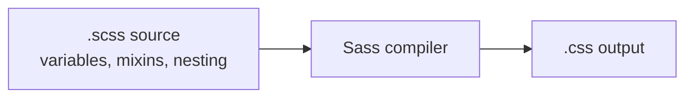

# Sass

<!-- Visual flow for Sass. -->


### Variables

// Example demonstrating Sass.
```scss
$defaultLinkColor: #46eac2;

a {
  color: $defaultLinkColor;
}
```

### String interpolation

// Example demonstrating Sass.
```scss
$wk: -webkit-;

.rounded-box {
  #{$wk}border-radius: 4px;
}
```

### Comments

// Example demonstrating Sass.
```scss
/*
 Block comments
 Block comments
 Block comments
*/

// Line comments
```

### Mixins

// Example demonstrating Sass.
```scss
@mixin heading-font {
  font-family: sans-serif;
  font-weight: bold;
}
h1 {
  @include heading-font;
}
```

See: [Mixins](#sass-mixins)

### Nesting {.row-span-2}

// Example demonstrating Sass.
```scss
.markdown-body {
  a {
    color: blue;
    &:hover {
      color: red;
    }
  }
}
```

#### to properties

// Example demonstrating Sass.
```scss
text: {
  // like text-align: center
  align: center;
  // like text-transform: uppercase
  transform: uppercase;
}
```

### Extend

// Example demonstrating Sass.
```scss
.button {
    ···
}
```

// Example demonstrating Sass.
```scss
.push-button {
  @extend .button;
}
```

### @import

// Example demonstrating Sass.
```scss
@import './other_sass_file';
@import '/code', 'lists';

// Plain CSS @imports
@import 'theme.css';
@import url(theme);
```

The `.sass` or `.sass` extension is optional.

### Parameters

// Example demonstrating Sass.
```scss
@mixin font-size($n) {
  font-size: $n * 1.2em;
}
```

// Example demonstrating Sass.
```scss
body {
  @include font-size(2);
}
```

### Default values

// Example demonstrating Sass.
```scss
@mixin pad($n: 10px) {
  padding: $n;
}
```

// Example demonstrating Sass.
```scss
body {
  @include pad(15px);
}
```

### Default variable

// Example demonstrating Sass.
```scss
$default-padding: 10px;

@mixin pad($n: $default-padding) {
  padding: $n;
}

body {
  @include pad(15px);
}
```

### rgba

// Example demonstrating Sass.
```scss
rgb(100, 120, 140)
rgba(100, 120, 140, .5)
rgba($color, .5)
```

### Mixing

// Example demonstrating Sass.
```scss
mix($a, $b, 10%)   // 10% a, 90% b
```

### Modifying HSLA

// Example demonstrating Sass.
```scss
darken($color, 5%)
lighten($color, 5%)
```

// Example demonstrating Sass.
```scss
saturate($color, 5%)
desaturate($color, 5%)
grayscale($color)
```

// Example demonstrating Sass.
```scss
adjust-hue($color, 15deg)
complement($color)    // like adjust-hue(_, 180deg)
invert($color)
```

// Example demonstrating Sass.
```scss
fade-in($color, .5)   // aka opacify()
fade-out($color, .5)  // aka transparentize()
rgba($color, .5)      // sets alpha to .5
```

#### HSLA

// Example demonstrating Sass.
```scss
hue($color)         // 0deg..360deg
saturation($color)  // 0%..100%
lightness($color)   // 0%..100%
alpha($color)       // 0..1 (aka opacity())
```

#### RGB

// Example demonstrating Sass.
```scss
red($color)         // 0..255
green($color)
blue($color)
```

See:
[hue()](http://sass-lang.com/documentation/Sass/Script/Functions.html#hue-instance_method),
[red()](http://sass-lang.com/documentation/Sass/Script/Functions.html#red-instance_method)

### Adjustments

// Example demonstrating Sass.
```scss
// Changes by fixed amounts
adjust-color($color, $blue: 5)
adjust-color($color, $lightness: -30%) // darken(_, 30%)
adjust-color($color, $alpha: -0.4)     // fade-out(_, .4)
adjust-color($color, $hue: 30deg)      // adjust-hue(_, 15deg)
```

// Example demonstrating Sass.
```scss
// Changes via percentage
scale-color($color, $lightness: 50%)
```

// Example demonstrating Sass.
```scss
// Changes one property completely
change-color($color, $hue: 180deg)
change-color($color, $blue: 250)
```

Supported: `$red`, `$green`, `$blue`, `$hue`, `$saturation`, `$lightness`,
`$alpha`

### Strings

// Example demonstrating Sass.
```scss
unquote('hello')
quote(hello)
```

// Example demonstrating Sass.
```scss
to-upper-case(hello)
to-lower-case(hello)
```

// Example demonstrating Sass.
```scss
str-length(hello world)
str-slice(hello, 2, 5)     // "ello" - it's 1-based, not 0-based
str-insert("abcd", "X", 1) // "Xabcd"
```

### Units

// Example demonstrating Sass.
```scss
unit(3em)        // 'em'
unitless(100px)  // false
```

### Numbers

// Example demonstrating Sass.
```scss
floor(3.5)
ceil(3.5)
round(3.5)
abs(3.5)
```

// Example demonstrating Sass.
```scss
min(1, 2, 3)
max(1, 2, 3)
```

// Example demonstrating Sass.
```scss
percentage(.5)   // 50%
random(3)        // 0..3
```

### Misc

// Example demonstrating Sass.
```scss
variable-exists(red)    // checks for $red
mixin-exists(red-text)  // checks for @mixin red-text
function-exists(redify)
```

// Example demonstrating Sass.
```scss
global-variable-exists(red)
```

// Example demonstrating Sass.
```scss
selector-append('.menu', 'li', 'a')   // .menu li a
selector-nest('.menu', '&:hover li')  // .menu:hover li
selector-extend(...)
selector-parse(...)
selector-replace(...)
selector-unify(...)
```

### Feature check

// Example demonstrating Sass.
```scss
feature-exists(global-variable-shadowing)
```

### Features

- global-variable-shadowing
- extend-selector-pseudoclass
- units-level-3
- at-error

### For loops

// Example demonstrating Sass.
```scss
@for $i from 1 through 4 {
  .item-#{$i} {
    left: 20px * $i;
  }
}
```

### Each loops (simple)

// Example demonstrating Sass.
```scss
$menu-items: home about contact;

@each $item in $menu-items {
  .photo-#{$item} {
    background: url('#{$item}.jpg');
  }
}
```

### Each loops (nested)

// Example demonstrating Sass.
```scss
$backgrounds: (home, 'home.jpg'), (about, 'about.jpg');

@each $id, $image in $backgrounds {
  .photo-#{$id} {
    background: url($image);
  }
}
```

### While loops

// Example demonstrating Sass.
```scss
$i: 6;
@while $i > 0 {
  .item-#{$i} {
    width: 2em * $i;
  }
  $i: $i - 2;
}
```

### Conditionals {.row-span-2}

// Example demonstrating Sass.
```scss
@if $position == 'left' {
  position: absolute;
  left: 0;
} @else if $position == 'right' {
  position: absolute;
  right: 0;
} @else {
  position: static;
}
```

### Interpolation

// Example demonstrating Sass.
```scss
.#{$klass} { ... }      // Class
call($function-name)    // Functions

@media #{$tablet}
font: #{$size}/#{$line-height}
url("#{$background}.jpg")
```

### Lists

// Example demonstrating Sass.
```scss
$list: (a b c);

nth($list, 1)  // starts with 1
length($list)

@each $item in $list { ... }
```

### Maps {.col-span-2}

// Example demonstrating Sass.
```scss
$map: (key1: value1, key2: value2, key3: value3);

map-get($map, key1)
```

## Quick Reference

| Area | Revision point |
|---|---|
| Definition | State exactly what the topic means. |
| Mechanism | Explain the steps that produce the result. |
| Example | Use a small realistic case. |
| Pitfalls | Know common mistakes and boundary cases. |

## A Strong Answer Pattern

Start with a precise definition, then explain the mechanism, trade-offs, and one concrete example. If there are alternatives, say what constraint would make each alternative preferable. This shows understanding without turning the answer into a list of disconnected terms.
