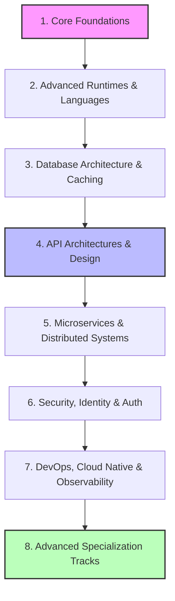
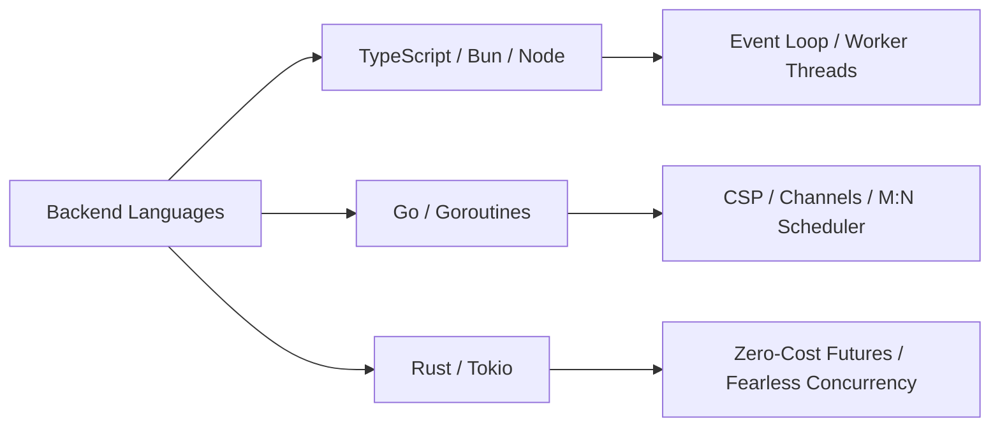
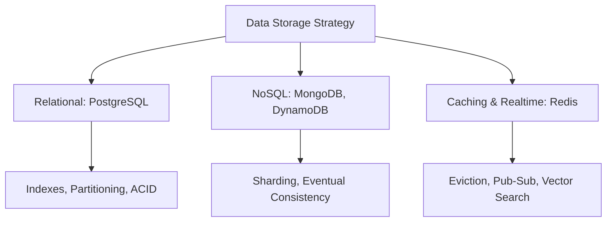
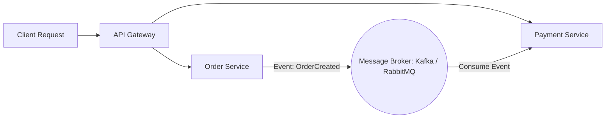
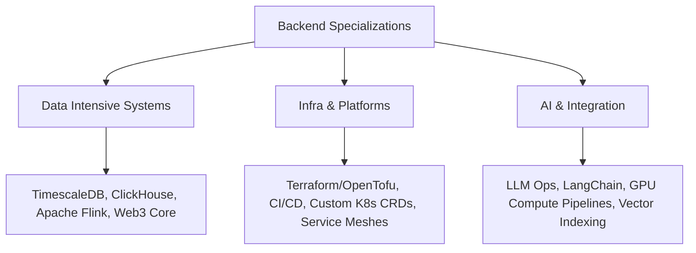

# The Modern Backend Developer Roadmap

A comprehensive, production-ready guide to mastering modern backend engineering.
This roadmap focuses on cloud-native architectures, type-safe runtimes,
high-performance database design, and robust distributed system patterns.

---

## Roadmap Overview

<!-- Visual flow for The Modern Backend Developer Roadmap. -->

## 1. Core Foundations

Before scaling systems to millions of users, a deep understanding of standard
network layers, operating systems, and fundamental computer science paradigms is
critical.

### 🌐 Networking & Protocols

- 🌐 **HTTP Ecosystem:** Master HTTP/1.1 (Keep-Alive, pipelining), HTTP/2
  (multiplexing, server push), and HTTP/3 (QUIC protocol, UDP-based connection
  migration).
- 🔌 **Sockets & Long-Lived Connections:** WebSockets for bidirectional
  streaming and Server-Sent Events (SSE) for unidirectional updates.
- 🛡️ **Network Security:** TLS 1.3 handshakes, cipher suites, public/private key
  infrastructure (PKI), and DNS configurations (A, AAAA, CNAME, TXT, MX
  records).

### OS & Linux Internals

- 📂 **File Systems & I/O:** Understanding POSIX standards, standard I/O streams
  (`stdin`, `stdout`, `stderr`), and file descriptors.
- 🧠 **Process Management:** Memory allocation (Stack vs. Heap), processes vs.
  threads, context switching overhead, and handling signals (`SIGINT`,
  `SIGTERM`, `SIGKILL`).
- 🎛️ **Resource Monitoring:** Commands like `top`, `htop`, `lsof`, `netstat`,
  and `df` for debugging infrastructure live.

## 2. Advanced Runtimes & Languages

Modern backends are predominantly built using type-safe, compiled, or highly
optimized async environments. Pick one ecosystem and master its concurrency
model.

<!-- Visual flow for The Modern Backend Developer Roadmap. -->

### 🟢 TypeScript & JavaScript (Node.js / Bun / Deno)

- 🧬 **Runtime Architecture:** The V8 engine, Libuv event loop, worker threads
  for CPU-bound tasks, and asynchronous I/O primitives.
- 🍞 **Modern Runtimes:** Transitioning scripts and web servers to **Bun** or
  **Deno** for native TypeScript execution and blazing-fast startup times.

### 🔵 Go (Golang)

- 🐹 **Concurrency Model:** Goroutines, channels, select blocks, and the Go
  scheduler architecture (M:N model).
- 🛠️ **Memory Safety:** Pointer management, garbage collection tuning, and
  structural composition without class-based inheritance.

### 🦀 Rust (Cloud-Native System Language)

- 🛡️ **Memory Management:** Ownership, borrowing, lifetimes, and a strict
  compile-time guarantee of data-race prevention.
- ⚡ **Async Ecosystem:** Mastering the `Tokio` runtime, zero-cost abstractions,
  futures, and writing memory-efficient server code.

## 3. 💾 Database Architecture & Caching

Data persistence requires knowing when to choose relational structure,
document-based flexibility, or specialized search indexes.

### 🐘 Relational Databases (SQL)

- 📊 **PostgreSQL / MySQL:** Deep dive into ACID compliance, transaction
  isolation levels (Read Committed, Serializable), and foreign key design.
- 📈 **Performance Tuning:** Execution plans (`EXPLAIN ANALYZE`), B-Tree
  indexing, composite indexes, query optimization, and connection pooling.
- 🌐 **Scaling Structures:** Database partitioning, read replicas, connection
  pooling (e.g., PgBouncer), and handling dual-write drift.

### 🍃 NoSQL Databases

- 📄 **Document / Key-Value:** MongoDB, DynamoDB, and understanding the CAP
  theorem (Consistency, Availability, Partition Tolerance).
- 🗺️ **Data Modeling:** Single-table design patterns in DynamoDB, handling
  eventual consistency, and sharding configurations.

### 🟥 In-Memory Caching & Vector Storage

- ⚡ **Redis Engine:** Data structures (Hashes, Lists, Sets, Sorted Sets), cache
  eviction policies (LRU, LFU), and cache invalidation strategies (Cache-Aside,
  Write-Through).
- 🎯 **Modern Capabilities:** Using Redis/Valkey for real-time Pub/Sub,
  distributed locks, and leveraging vector databases (e.g., Pinecone, Milvus)
  for AI-powered LLM context storage.

## 4. 🔗 API Architectures & Design

Backend systems present structured contracts to client applications or internal
microservices.

### 🛠 API Paradigms

- 🌐 **RESTful APIs:** Richardson Maturity Model, semantic status codes,
  idempotent routes, and strict OpenAPI/Swagger documentation.
- 📐 **GraphQL:** Schema definitions, queries, mutations, resolving the $N+1$
  query problem with DataLoaders, and schema federation.
- 🚀 **gRPC & Protocol Buffers:** High-performance, binary serialized, type-safe
  RPC frameworks designed for internal microservice communication over HTTP/2.

### 🚧 Edge Gateways & Security

- 🛡️ **API Gateways:** Reverse proxy routing, SSL termination, and global rate
  limiting (Token Bucket, Leaky Bucket algorithms) using tools like Kong, Envoy,
  or Traefik.

## 5. 🔀 Microservices & Distributed Systems

Monoliths struggle at enterprise scale. True engineering depth lies in
decoupling boundaries and processing data asynchronously.

<!-- Visual flow for The Modern Backend Developer Roadmap. -->

### 🚌 Message Brokers & Event-Driven Architecture

- 📦 **RabbitMQ / NATS:** Message queuing, AMQP protocol, exchange types
  (direct, fanout, topic), and guaranteed delivery guarantees.
- 🎬 **Apache Kafka / Redpanda:** Event streaming, commit logs, consumer groups,
  partition management, and building event-driven event-sourcing pipelines.

### Distributed Consistency

- ⛓️ **Patterns:** Sagas pattern (orchestration vs. choreography) for
  distributed transactions, Outbox pattern for reliable message publishing, and
  CQRS (Command Query Responsibility Segregation).

## 6. Security, Identity & Auth

Securing application data and managing stateful/stateless user identities across
systems.

### 🔑 Authentication & Authorization

- 🎟️ **Stateless Tokens:** JWT (JSON Web Tokens) structure, signing algorithms
  (RS256 vs. HS256), token expiration, and secure rotation loops using sliding
  sessions.
- 🗺️ **Protocols:** OAuth 2.1 authorization flows, OpenID Connect (OIDC)
  identity layers, and machine-to-machine client credentials authentication.
- 🔐 **Access Control:** RBAC (Role-Based Access Control) and ABAC
  (Attribute-Based Access Control) strategies.

### Secure Development Practices

- 🛑 **OWASP Top 10:** Thwarting SQL Injection, Cross-Site Scripting (XSS), SSRF
  (Server-Side Request Forgery), and broken object-level authorization.
- 📦 **Data Protection:** Hashing passwords natively via Argon2id or bcrypt, and
  implementing envelope encryption for sensitive database column storage
  (AES-GCM-256).

## 7. DevOps, Cloud Native & Observability

A backend engineer is responsible for their code up until the point it runs
smoothly in production under peak load.

### Containerization & Orchestration

- 🐋 **Docker:** Writing optimized multi-stage Dockerfiles, managing image
  layers, caching package builds, and using Docker Compose for local
  environments.
- ☸️ **Kubernetes (K8s):** Core primitives (Pods, Deployments, Services,
  Ingress, ConfigMaps, Secrets) and scaling workloads based on CPU/Memory
  metrics.

### Observability (The Three Pillars)

- 📜 **Logs:** Structured JSON logging, centralizing pipelines via FluentBit,
  Logstash, or Vector.
- 📈 **Metrics:** Prometheus time-series scraping coupled with Grafana
  dashboards for alerting on operational metrics (error rates, response
  latencies).
- 🗺️ **Traces:** Distributed tracing via OpenTelemetry to trace client request
  contexts down into interconnected microservice dependencies.

## 8. Advanced Specialization Tracks

Once the foundational enterprise engineering layer is complete, pick a dedicated
domain lane.

### Track A: Data-Intensive & High-Frequency Engineering

- Operating analytical storage systems (**ClickHouse**, **Apache Druid**),
  building real-time stream processing with **Apache Flink**, and configuring
  hyper-fast time-series databases for real-time reporting dashboards.

### ☁ Track B: Cloud Platform & Infrastructure Engineering

- Infrastructure as Code (IaC) using **Terraform / OpenTofu**, implementing
  declarative GitOps pipelines via **ArgoCD**, configuring service meshes
  (**Istio**, **Linkerd**), and tailoring custom cloud runtime topologies.

### 🤖 Track C: Intelligent Backend & AI Integration

- Constructing LLM orchestration APIs (**LangChain**, **LlamaIndex**), designing
  high-performance ingestion gateways for unstructured raw information vectors,
  managing model deployment context pipelines, and deploying containerized
  Python/Rust AI compute boundaries.

## Quick Reference

| Operation | What it does |
|---|---|
| Read/inspect | Check the current value or state. |
| Transform | Produce a new value when the API supports it. |
| Update | Change state only when the operation is designed to mutate. |
| Edge case | Handle empty, invalid, or boundary input explicitly. |
