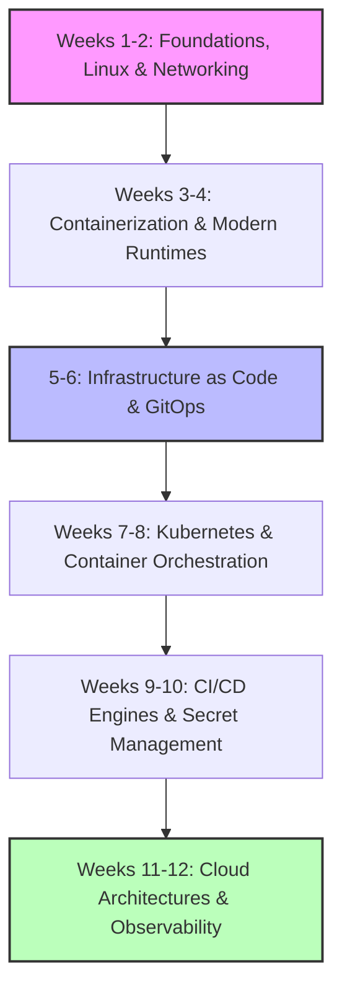
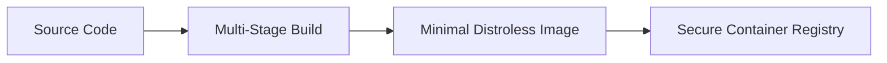
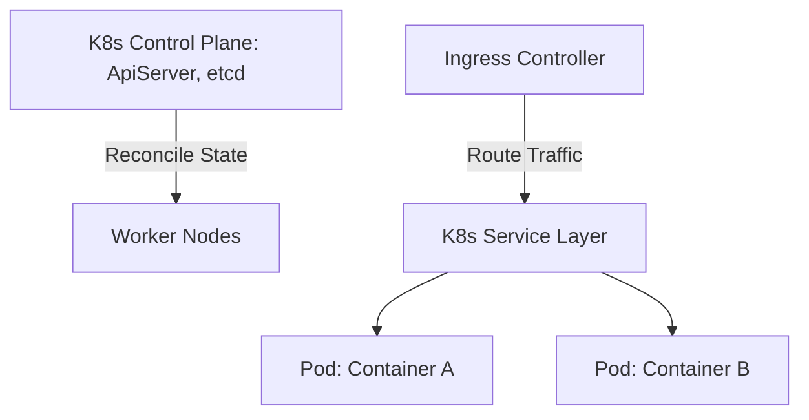
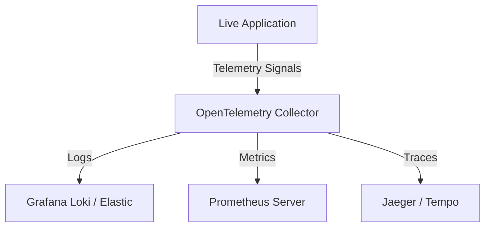

# ♾ The Modern DevOps & Platform Engineer Roadmap

Mastering DevOps requires transitioning from a traditional systems administrator
or application developer into an automation architect. In a modern cloud-native
ecosystem, DevOps is less about manual server patching and more about building
self-service internal developer platforms, enforcing declarative state
infrastructure, and ensuring zero-downtime shipping pipelines.

This detailed 12-week study plan guides you from OS internals to platform
engineering at scale.

---

## Roadmap Core Progression

<!-- Visual flow for ♾ The Modern DevOps & Platform Engineer Roadmap. -->

## Week 1-2: Operating System Internals, Linux Mastery & Networking

You cannot safely automate or troubleshoot distributed infrastructure without a
foundational grasp of the underlying kernel and networking layers.

### Linux Systems & Shell Scripting

- **Kernel & Resource Primitives:** Process states, memory management (Virtual
  Memory, Swap), and storage architectures. Master checking system constraints
  via `/proc`.
- **System Administration & Core Utilities:** Stream editors (`sed`, `awk`),
  processing JSON data at the terminal (`jq`), system resource monitors (`htop`,
  `lsof`, `strace`, `journalctl`), and system startup initialization
  (`systemd`).
- **Automation Scripts:** Writing highly structured Bash scripts or utilizing
  Python/Go for infrastructure tasks (handling signals, file manipulation, and
  automated error catching).

### 🌐 Advanced Systems Networking

- **OSI Model & Core Protocols:** In-depth knowledge of TCP/IP parameters, DNS
  routing tables, and HTTP/3 (QUIC over UDP setup).
- **Traffic Debugging Tools:** Troubleshooting routing pathways and connection
  status via `dig`, `traceroute`, `curl`, `netstat`, and packet inspections
  using `tcpdump` or Wireshark.
- **Firewalls & Software Routing:** Setting up standard Linux networking rules
  with `iptables`, `nftables`, and SSH routing tunnels.

## 🐋 Week 3-4: Containerization, Isolation & Modern Runtimes

Containers form the core unit of deployment for modern microservice
architectures.

### 🐋 Docker & Linux Isolation Primitives

- **The Tech Under the Hood:** Understand how containers are formed via Linux
  kernel isolates: **Namespaces** (isolating network, processes, mounts) and
  **Cgroups** (limiting resource consumption like CPU/Memory).
- **Optimizing Dockerfiles:** Writing multi-stage Docker configurations to
  separate compilation runtimes from final static assets, reducing image size,
  and eliminating security vulnerabilities.

- **Image Management:** Working with layers, optimizing cache invalidation
  structures, and securing base images by using rootless/distroless runtimes.

### ⚙ Container Runtimes & Orchestration Ecosystem

- **Container Standards:** Understanding OCI (Open Container Initiative),
  low-level runtimes (`runc`), and high-level runtimes (`containerd`).
- **Local Multi-Service Layouts:** Orchestrating complex local dependency
  services with Docker Compose for local development workflows.

<!-- Visual flow for ♾ The Modern DevOps & Platform Engineer Roadmap. -->

## 🧱 Week 5-6: Infrastructure as Code (IaC) & GitOps Declarative Patterns

Treating infrastructure identical to application code—version-controlled,
tested, and reviewable.

### 📜 Infrastructure as Code (IaC)

- **Declarative Configuration:** Structuring cloud infrastructures using
  **Terraform** or **OpenTofu**.
- **State Management:** Setting up remote state file storage paired with state
  locking mechanics (e.g., S3 backends with DynamoDB locking) to prevent
  execution drift during team collisions.
- **Modularization:** Creating reusable infrastructure definitions across
  development, staging, and production environments.

### 🚢 GitOps Alignment

- **The Pull Model:** Transitioning from traditional push-based scripts to
  continuous synchronization loops where the real-world cluster state maps
  continuously to a Git repository configuration.
- **ArgoCD / Flux:** Setting up reconciliation engines inside active clusters to
  auto-heal system state if manual mutations occur outside version control.

## Week 7-8: Kubernetes & Container Orchestration

Kubernetes is the standard operating system of cloud-native infrastructure
platforms.

### Core Architecture Elements

- **Control Plane vs. Node Internals:** How `etcd`, `kube-apiserver`,
  `kube-scheduler`, and `kube-controller-manager` interact with the node level
  `kubelet` and `kube-proxy`.
- **Workload Primitives:** Managing Pod lifecycles, Deployments (Rolling Updates
  vs. Canary), StatefulSets (for databases), and DaemonSets (for logging
  agents).
- **Networking & Storage:** Configuring Ingress Controllers, CoreDNS,
  ClusterIP/NodePort Services, PersistentVolumes (PV), and
  PersistentVolumeClaims (PVC).

### 🛠 Package Management & Policies

- **Helm:** Authoring templates and values charts to standardize reusable
  cluster applications.
- **Network Policies:** Restricting pod-to-pod networking to create tight
  namespace-isolated security boundaries.

## Week 9-10: Advanced CI/CD Integration Engines & Secret Management

Constructing secure pipelines that continuously validate code and update active
software.

### ⚙ CI/CD Engineering Pipelines

- **Pipeline Orchestration:** Configuring GitHub Actions, GitLab CI, or Tekton
  platforms via declarative YAML configurations.
- **Quality & Validation Gates:** Injecting structural linting, automated
  testing suites (Vitest/Playwright), and code security checks directly into the
  compilation path.

- **Artifact Storage:** Standardizing deployment files inside secure versioned
  object stores or internal private container registries.

### Secret Management

- **Zero-Secret Repositories:** Enforcing that zero raw passwords, API keys, or
  certificates live in Git history.
- **HashiCorp Vault / Cloud Secret Managers:** Injecting transient configuration
  variables dynamically into container memory at application startup, keeping
  secrets secure.

## ☁ Week 11-12: Cloud Topologies, Observability & Platform Engineering

Ensuring applications run efficiently under heavy load and providing clean
self-service tools for internal developers.

<!-- Visual flow for ♾ The Modern DevOps & Platform Engineer Roadmap. -->

### ☁ Cloud Architectures (AWS / GCP / Azure)

- **Core Compute Foundations:** Virtual Machines (EC2), Managed Kubernetes
  engines (EKS/GKE), Object Storage systems (S3/GCS), and Virtual Private Clouds
  (VPC) with secure routing setups.

### Observability Frameworks

- **The Three Pillars:** Exporting application data cleanly utilizing
  **OpenTelemetry** unified standards:
- _Logs:_ Structuring json outputs collected via tools like FluentBit or Vector.

- _Metrics:_ Time-series performance indexing via **Prometheus** targets
  analyzed inside **Grafana** dashboards.

- _Traces:_ Pinpointing distributed application processing delays using Jaeger
  or Tempo tools.

### 🏢 Platform Engineering (The Future of DevOps)

- **Internal Developer Platforms (IDP):** Building unified developer portals
  using **Backstage** to let application engineers provision infrastructure
  templates safely without direct access to base cloud platforms.

## 🏆 Production Incident Debugging Checklist

When a production outage strikes, follow a systematic telemetry isolation
process rather than guessing solutions:

- **Verify Routing First:** Execute curl against target endpoint gateways and
  audit DNS resolution status via `dig` to isolate network level disconnects.
- **Check the Entry Gate (Ingress/LB):** Review access control error
  distributions on outer Edge Gateways or Kubernetes Ingress layers to isolate
  routing drop issues.
- **Evaluate Pod/Process Status:** Run `kubectl get pods -n <namespace>` or
  standard `systemctl status` checks to look for structural error flags like
  `CrashLoopBackOff` or memory starvation.
- **Analyze System Metrics:** Query Grafana/Prometheus trends to verify if CPU
  limits or Memory utilization ceilings triggered automatic container evictions.
- **Trace Live Logs:** Stream active tracking files via
  `kubectl logs --tail=100` or central search logs using JSON structured
  patterns to capture unhandled application exceptions.

## Quick Reference

| Operation | What it does |
|---|---|
| Read/inspect | Check the current value or state. |
| Transform | Produce a new value when the API supports it. |
| Update | Change state only when the operation is designed to mutate. |
| Edge case | Handle empty, invalid, or boundary input explicitly. |
