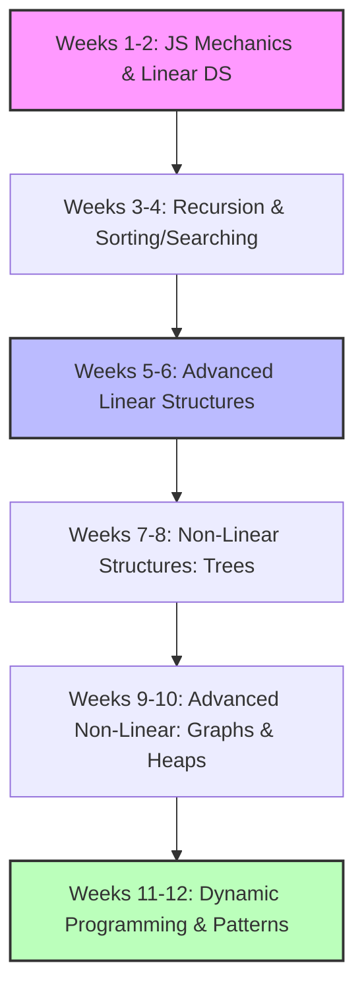

# Comprehensive Data Structures & Algorithms (DSA) Study Plan

Mastering Data Structures and Algorithms in JavaScript requires a specialized
approach. Because JavaScript lacks built-in advanced structures (like Priority
Queues or Linked Lists), implementing these from scratch is a highly rewarded
skill in frontend and full-stack technical interviews.

This detailed 12-week study plan is tailored around JavaScript execution
environments, runtime complexities, and modern interview patterns.

---

## Roadmap Core Progression

<!-- Visual flow for Comprehensive Data Structures & Algorithms (DSA) Study Plan. -->


## Week 1-2: JavaScript Runtime Mechanics & Fundamental Linear Structures

Before optimization, you must understand how JavaScript handles memory and basic
arrays under the hood.

### JavaScript-Specific Core Concepts

- **Array Memory Allocation:** JavaScript arrays are dynamic objects, not
  fixed-size contiguous memory blocks. Understand how V8 shifts between _Fast
  Elements_ (contiguous arrays) and _Dictionary Elements_ (sparse hash maps).
- **Time Complexity Analysis:** Master Big O notation ($\mathcal{O}(1)$,
  $\mathcal{O}(\log n)$, $\mathcal{O}(n)$, $\mathcal{O}(n \log n)$,
  $\mathcal{O}(n^2)$). Understand the performance impact of native JS array
  methods like `push()`/`pop()` ($\mathcal{O}(1)$ amortized) versus
  `shift()`/`unshift()` ($\mathcal{O}(n)$ re-indexing).
- **Reference vs. Value:** Grasp how primitive values are passed by value,
  whereas Objects and Arrays are passed by reference—causing silent bugs if
  mutated accidentally.

### 📐 Linear Data Structures

- **Dynamic Arrays:** Implementing multi-dimensional arrays, sliding windows,
  and in-place manipulations.
- **Hash Maps & Sets:** Mastering the built-in `Map` and `Set` objects,
  realizing why `Map` is preferred over standard Objects for dynamic key-value
  operations (avoids prototype pollution, maintains insertion order, offers true
  $\mathcal{O}(1)$ lookup).

<!-- Visual flow for Comprehensive Data Structures & Algorithms (DSA) Study Plan. -->
```mermaid
graph LR
    subgraph Array Memory in V8
    Fast[Fast Elements: Contiguous Block]
    Sparse[Dictionary Elements: Key-Value Hash]
    end
    Method1[push / pop] -->|O 1 | Fast
    Method2[shift / unshift] -->|O n  re-indexing| Fast

### Key Practice Problems

1. Two Sum (LeetCode 1)
2. Valid Anagram (LeetCode 242)
3. Container With Most Water (LeetCode 11)

## 🔁 Week 3-4: The Pillars of Logic: Recursion, Searching & Sorting

The foundation for complex tree and graph traversals relies entirely on managing
memory call stacks.

### 🔁 Recursion & The Call Stack

- **Call Stack Mechanics:** Visualizing how stack frames are added and removed.
  Managing base cases to avoid the feared `Maximum call stack size exceeded`
  error.
- **Tail Call Optimization (TCO):** Understand that while ES6 specifies TCO,
  support varies across JS engines (Node.js/V8 has disabled it for debugging
  clarity).

### Searching & Sorting Algorithms

- **Binary Search:** Master the divide-and-conquer strategy on sorted arrays.
  Know how to calculate midpoints safely without integer overflow:

```javascript
const mid = Math.floor(low + (high - low) / 2);
// Example demonstrating Comprehensive Data Structures & Algorithms (DSA) Study Plan.
```

````
* **Sorting Essentials:** Implement Merge Sort and Quick Sort from scratch. Understand why JavaScript’s native `Array.prototype.sort()` uses Timsort (a hybrid of Merge and Insertion sort) and why passing a custom comparator function (`(a, b) => a - b`) is mandatory for sorting numbers.

1. Binary Search (LeetCode 704)
2. Search in Rotated Sorted Array (LeetCode 33)
3. Merge Intervals (LeetCode 56)

## 🔗 Week 5-6: Advanced Linear Structures: Custom Implementations

JavaScript does not have native Linked List, Stack, or Queue structures. You must learn how to build them using ES6 Classes.

<!-- Visual flow for Comprehensive Data Structures & Algorithms (DSA) Study Plan. -->
```mermaid
classDiagram
    class Node {
        +any val
        +Node next
        +Node prev
    }
    class DoublyLinkedList {
        +Node head
        +Node tail
        +int size
        +push(val)
        +shift()
    }
    DoublyLinkedList "1" *-- "many" Node

````

### 🔗 Linked Lists

- **Singly & Doubly Linked Lists:** Building full implementations with `head`,
  `tail`, and pointer references.
- **Pointer Manipulation:** Reversing lists in-place, detecting cycles, and
  merging sorted tracks.

### 📚 Stacks & Queues

- **Stack:** Last-In, First-Out (LIFO). Easily simulated with an array using
  `push()` and `pop()`.
- **Queue:** First-In, First-Out (FIFO). _Interview Warning:_ Simulating a queue
  using an array with `push()` and `shift()` degrades performance to
  $\mathcal{O}(n)$ due to element shifting. You must learn to implement an
  optimized $\mathcal{O}(1)$ Queue using a Linked List or a pointer object hash.

1. Reverse Linked List (LeetCode 206)
2. Linked List Cycle (LeetCode 141)
3. Min Stack (LeetCode 155)

## 🌳 Week 7-8: Non-Linear Hierarchies: Trees & Advanced Traversals

Trees break past linear restrictions and are heavily utilized in frontend
ecosystems (like the DOM tree).

<!-- Visual flow for Comprehensive Data Structures & Algorithms (DSA) Study Plan. -->
```mermaid
graph TD
    Root((10)) --> Left((5))
    Root --> Right((15))
    Left --> LL((3))
    Left --> LR((7))

classDef bfs fill:#bbf,stroke:#333,stroke-width:2px;
    classDef dfs fill:#f9f,stroke:#333,stroke-width:2px;

### 🌲 Binary Trees & Binary Search Trees (BST)

- **BST Properties:** In a valid BST, a parent node's left child must be smaller
  than the parent, and the right child must be greater.
- **Depth-First Search (DFS):** Mastering the three recursive and iterative
  variations:
- _Pre-order_ (Root, Left, Right)
- _In-order_ (Left, Root, Right — yields a sorted array from a BST)
- _Post-order_ (Left, Right, Root)

- **Breadth-First Search (BFS):** Layer-by-layer traversal using an optimized
  Queue structure.

1. Maximum Depth of Binary Tree (LeetCode 104)
2. Validate Binary Search Tree (LeetCode 98)
3. Binary Tree Level Order Traversal (LeetCode 102)

## 🕸 Week 9-10: Graphs & Heaps/Priority Queues

These represent complex network models and real-time processing queues.

### 🕸 Graphs

- **Representations:** Adjacency List (preferred in JS via `Map` or Object
  mappings) vs. Adjacency Matrix.
- **Traversals:** Applying DFS and BFS algorithms to matrix paths, graph cyclic
  evaluation, and isolating disconnected sub-graphs.

### 🏔 Binary Heaps & Priority Queues

- **Heap Architecture:** Max and Min Heaps modeled efficiently inside flat
  structural arrays where a parent at index $i$ maps its children to $2i + 1$
  and $2i + 2$.
- **Priority Queue Implementation:** Since JavaScript lacks a native heap, write
  a custom `PriorityQueue` class using a bubbling-up and sinking-down algorithm
  loop. This is critical for scheduling algorithms or shortest-path networks.

```mermaid
graph TD
    Heap[Array representation of a Heap] --> Formula[Parent: i]
    Formula --> LeftChild[Left Child: 2i + 1]
    Formula --> RightChild[Right Child: 2i + 2]

1. Clone Graph (LeetCode 133)
2. Number of Islands (LeetCode 200)
3. Merge k Sorted Lists (LeetCode 23 — _Requires a Custom Priority Queue_)

## 🏁 Week 11-12: Dynamic Programming & High-Level Interview Patterns

Synthesizing everything learned into optimization frameworks and structural
architecture strategies.

### Dynamic Programming (DP)

- **Memoization (Top-Down):** Using a JavaScript cache object to store the
  results of expensive, overlapping recursive function calculations.
- **Tabulation (Bottom-Up):** Eliminating recursive call-stack consumption by
  constructing an iterative multi-dimensional array matrix.

### 🛠 Dominant Interview Patterns

- **Sliding Window:** Tracking contiguous subarrays efficiently without
  repeating inner evaluation loops.
- **Two Pointers:** Converging or fast/slow pointer pairs scanning collections
  simultaneously to drop complexity from $\mathcal{O}(n^2)$ down to
  $\mathcal{O}(n)$.
- **Top K Elements:** Extracting specialized frequency groups out of collections
  using mapping arrays or heap indices.

1. Longest Substring Without Repeating Characters (LeetCode 3)
2. Climb Stairs (LeetCode 70)
3. Coin Change (LeetCode 322)

## 🏆 Checklist for Solving Problems in Interviews

When writing DSA solutions in JavaScript during live technical interviews,
ensure you consistently follow these steps:

- **Clarify Inputs and Outputs:** Confirm data types (e.g., "Can the array
  contain negative numbers?", "Could the input be empty?").
- **State the Brute Force Solution:** Always explicitly state the obvious
  $\mathcal{O}(n^2)$ or $\mathcal{O}(2^n)$ solution before optimizing. It shows
  algorithmic awareness and keeps you from getting stuck.
- **Watch out for JS Gotchas:** Avoid using slow operations inside loops like
  `Array.prototype.unshift()` or string concatenation `str += char` (which
  creates a new string in memory every time). Use array push and `join('')`
  instead.
- **Dry Run Code:** Trace your pointers and loop index states line-by-line using
  a sample input case before declaring your code complete.

## Quick Reference

| Area | Revision point |
|---|---|
| Definition | State exactly what the topic means. |
| Mechanism | Explain the steps that produce the result. |
| Example | Use a small realistic case. |
| Pitfalls | Know common mistakes and boundary cases. |
