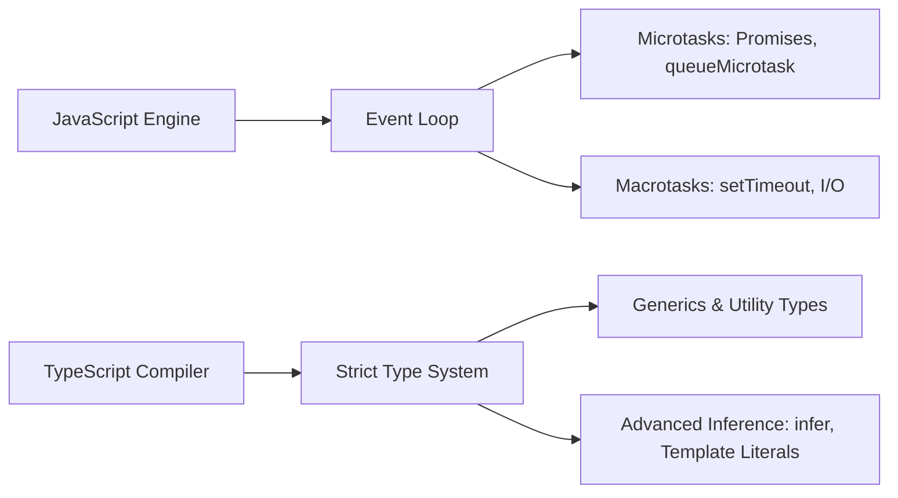
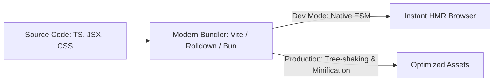
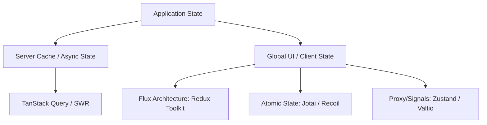
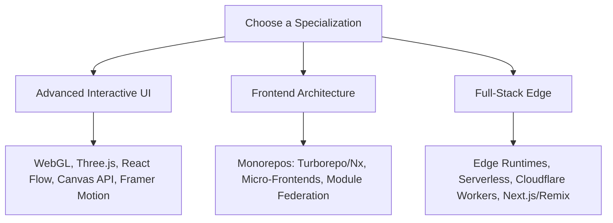

# The Modern Frontend Developer Roadmap

A comprehensive, production-ready guide to mastering frontend engineering. This
roadmap focuses on the latest standards, current industry patterns, and modern
tooling, moving away from legacy architectures.

---

## Roadmap Overview

<workflowshowcase preset="frontend" direction="vertical" />

## 1. Core Fundamentals

Before diving into complex frameworks, mastering the browser's native languages
and accessibility APIs is non-negotiable.

### 🌐 HTML5 & Semantic Web

- 🏷️ **Semantic Elements:** `main`, `section`, `article`, `nav`, `aside`,
  `figure`. Stop wrapping everything in unstyled `div` elements.

- 🔍 **SEO & Metadata:** Open Graph protocols, structured JSON-LD data, meta
  viewport configurations.

- 📝 **Forms & Validation:** Constraint Validation API, custom form controls,
  handling multi-part uploads natively.

### Modern CSS Foundation

- 📐 **Layout Systems:** Flexbox and CSS Grid (including Subgrid for multi-level
  card layouts).

- ⚙️ **CSS Variables (Custom Properties):** Scope-aware variables, dynamic theme
  switching without runtime JavaScript.

- ⚙️ **Modern Selectors & Functions:** `:has()`, `:is()`, `:where()`, `clamp()`,
  `min()`, `max()`, and CSS Container Queries for component-driven
  responsiveness.

### ♿ Accessibility (a11y)

- 🗣️ **ARIA Roles & Attributes:** `aria-live`, `aria-expanded`, `aria-controls`,
  and structural landmarks.

- ⌨️ **Keyboard Navigation:** Managing focus rings, trapping focus within
  modals/overlays (`inert` attribute), and skipping links.

- 🥇 **WCAG 2.2 Standards:** Color contrast ratios, target sizes, and
  screen-reader testing (NVDA/VoiceOver).

## 2. Advanced JavaScript & TypeScript

Modern frontend development relies entirely on deterministic type safety and
strict asynchronous programming patterns.

<!-- Visual flow for The Modern Frontend Developer Roadmap. -->

### 🟨 Modern JavaScript (ECMAScript Next)

- ⏳ **Asynchronous Architecture:** Deep execution mechanics of Promises,
  async/await, top-level await, and the Microtask vs. Macrotask queue event
  loop.

- 🧩 **Functional Programming Concepts:** Immutability, pure functions,
  closures, currying, high-order array methods (`map`, `filter`, `reduce`,
  `flatMap`).

- 🧠 **Memory Management:** Garbage collection cycles, identifying memory leaks
  (uncleaned event listeners, closures), and utilizing `WeakMap` and `WeakSet`.

### 🟦 TypeScript Mastery

- ⚙️ **Configuration:** Enforcing strict mode (`strict: true`), path mapping,
  and managing monorepo project references.

- 🧬 **Advanced Type Systems:** Generics, Conditional Types, Type Inference
  (`infer`), Template Literal Types, and Mapped Types.

- 🛡️ **Type Guards & Assertions:** Custom type predicates (`is`), assertion
  signatures, and handling unknown data streams with runtime validation
  libraries like Zod or Valibit.

## 3. 🛠 Modern Build Tools & Runtimes

The legacy Webpack ecosystem has shifted heavily toward native ESM-powered,
Rust/Go-backed compilation pipelines.

<!-- Visual flow for The Modern Frontend Developer Roadmap. -->

### Next-Gen Bundlers & Compilers

- ⚡ **Vite & Rolldown:** Understanding configuration, plugin ecosystems, and
  instant Hot Module Replacement (HMR).

- 🦀 **Rust/Go Tooling:** The roles of Biome (linting/formatting), LightningCSS,
  and esbuild in supercharging compiler speeds.

- 🪓 **Code Splitting & Optimization:** Dynamic imports, tree-shaking mechanics,
  manual chunking strategies, and caching headers.

### ⚙ Emerging JS Runtimes

- 🍞 **Node.js Alternatives:** Bun and Deno for ultra-fast task running, edge
  deployments, and native TypeScript execution.

## 4. Component-Driven UI Frameworks

While multiple frameworks exist, the dominant architecture relies on
declarative, component-driven development with fine-grained reactivity or
unified server-client components.

### ⚛ React Core & Server Architecture

- ⚓ **Hooks Ecosystem:** Master `useState`, `useEffect`, `useMemo`,
  `useCallback`, `useRef`, and the modern `use` hook.

- 🖥️ **React Server Components (RSC):** The architectural split between Server
  Components (data fetching, zero bundle size) and Client Components
  (interactivity).

- 🌊 **Suspense & Streaming:** Progressive hydration, concurrent rendering
  features, and error boundary handling.

### 🟢 Alternative Reactivity Frameworks

- 💚 **Vue 3 (Composition API) & Nuxt:** Signals-like reactivity, Teleport, and
  full-stack universal applications.

- 🧡 **SolidJS / Svelte 5:** Compile-time optimizations, true fine-grained
  reactivity using Runes/Signals, avoiding virtual DOM overhead.

## 5. State Management Architectures

Choosing a state tool depends entirely on whether your state is global UI state,
a client-side cache of server data, or context-isolated local states.

### Async State & Server Caching

- 📡 **TanStack Query (React Query):** Stale-while-revalidate strategy, query
  keys design, optimistic updates, automatic refetching, and paginated/infinite
  queries.

### 🌐 Global Client State

- 🐻 **Zustand:** Lightweight, store-based state using centralized hook
  selectors without boilerplate.

- 💜 **Redux Toolkit (RTK):** For complex enterprise applications needing
  rigorous transactional event histories, middleware, and RTK Query.

- ⚛️ **Atomic State (Jotai/Recoil):** Fine-grained updates for complex
  graph-based or canvas interfaces.

## 6. 💅 Professional Styling & Design Systems

Scaling frontend layout requires component-level modularity and robust
programmatic design token systems.

### Utility-First Design

- 🍃 **Tailwind CSS:** Configuration pipelines, arbitrary variants, optimizing
  with `tailwind-merge` and `clsx` for conditional dynamic styling.

### 🧱 Design Systems & Component Foundations

- 🦴 **Unstyled Primitives:** Building accessible user interfaces using Headless
  UI, Radix UI, or **shadcn/ui** to own the markup while retaining robust
  accessible keyboard patterns.

- 🪙 **Design Tokens:** Structuring variables for typography, spacing, and color
  palettes across light, dark, and high-contrast modes.

## 7. 📈 Production Readiness & Performance

Writing code is only 40% of the job; deploying high-performing, reliable systems
requires continuous optimization.

### ⏱ Core Web Vitals (CWV) Optimization

- 🏎️ **LCP (Largest Contentful Paint):** Modern image optimization (AVIF/WebP,
  srcset, priority loading tags), font preloading, and resource hinting
  (`dns-prefetch`, `preconnect`).

- ⚡ **INP (Interaction to Next Paint):** Reducing long tasks, deferring
  non-critical scripts, breaking up long execution blocks using
  `requestIdleCallback`.

- 📐 **CLS (Cumulative Layout Shift):** Defining explicit image dimensions,
  styling skeleton placeholders, and containing dynamic structural layouts.

### Testing Strategies

- 🧪 **Unit Testing:** Fast execution frameworks like Vitest combined with
  Testing Library for component unit and integration isolation.

- 🎭 **End-to-End (E2E):** Playwright for multi-browser, cross-platform user
  flow simulations, visual regression testing, and network mocking.

## 8. Specialization Tracks

Once you conquer the foundational pipeline, pick a specialized track to elevate
your engineering value.

<!-- Visual flow for The Modern Frontend Developer Roadmap. -->

### 🎮 Track A: Advanced Interactive UI & Engineering

- ✨ Node-based flow builders (**React Flow**), custom interactive layouts, data
  dashboards, animation orchestration frameworks (**Framer Motion**), and
  high-performance **HTML5 Canvas / WebGL (Three.js)**.

### 🏢 Track B: Scale & Infrastructure Architecture

- 📦 Monorepo orchestration (**Turborepo**, **Nx**), managing large cross-team
  build pipelines, semantic micro-frontends, shared package management, and
  unified CI/CD linting gates.

### 🌐 Track C: Full-Stack Edge Systems

- 🚀 Deploying next-gen meta-frameworks (**Next.js App Router**, **Remix/React
  Router**) onto distributed edge platforms like Cloudflare Workers or Vercel
  Edge networks.

## Quick Reference

| Operation | What it does |
|---|---|
| Read/inspect | Check the current value or state. |
| Transform | Produce a new value when the API supports it. |
| Update | Change state only when the operation is designed to mutate. |
| Edge case | Handle empty, invalid, or boundary input explicitly. |
