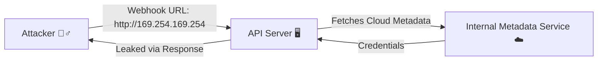

# 🔌 API Security: Protecting the Connective Tissue of the Web

Application Programming Interfaces (APIs) have become the foundational building
blocks of modern software architecture. They enable disparate systems,
microservices, mobile applications, and third-party partners to communicate and
share data seamlessly. However, this critical role also makes them a highly
attractive target for attackers. API security is the discipline of protecting
APIs from malicious use, unauthorized access, and data breaches. 🛡️

Because APIs are designed to expose data and functionality programmatically,
they inherently expand an organization's attack surface. Traditional perimeter
defenses, like traditional firewalls, are often ineffective because API traffic
typically flows over standard web ports (80 and 443) and looks like legitimate
traffic. Therefore, a specialized approach to API security is required. 🚦

## 🎯 Why APIs are Unique Security Targets

APIs differ from traditional web applications in several ways that impact their
security posture:

| Characteristic               | Security Implication                                                                                                                |
| :--------------------------- | :---------------------------------------------------------------------------------------------------------------------------------- |
| 🗄️ **Direct Access to Data** | Unlike web apps that render HTML, APIs often return raw data (e.g., JSON). Vulnerabilities expose massive, structured data.         |
| 👻 **Statelessness**         | REST/GraphQL APIs are stateless, requiring robust authentication/authorization for _every_ single request.                          |
| 🔀 **Complex Authorization** | Serving multiple clients (mobile, web, microservices) demands complex authorization policies (e.g., OAuth scopes), prone to errors. |
| 🧟 **Hidden Attack Surface** | Rapid development leads to undocumented (Shadow APIs) or deprecated (Zombie APIs) endpoints that are unmanaged.                     |
| 🛤️ **Predictability**        | REST APIs follow predictable URL structures (e.g., `/api/users/123`), making resource enumeration easy for attackers.               |

## 🏆 The OWASP API Security Top 10 (2023)

To understand API vulnerabilities, it is essential to study the OWASP API
Security Top 10. The 2023 version highlights the most critical risks facing APIs
today.

### 🥇 API1:2023 - Broken Object Level Authorization (BOLA)

Also known as Insecure Direct Object Reference (IDOR), BOLA occurs when an API
endpoint allows a user to access or modify an object without adequately
verifying permissions.

- **Example Scenario:** User A accesses `/api/v1/receipts/1001`, then changes
  the ID to `1002`. If the server doesn't check ownership, it's a BOLA flaw.
- **Mitigation:** Implement strict authorization checks at the code level. Use
  unpredictable, randomized IDs (like UUIDs) instead of sequential integers. 🛡️

### 🥈 API2:2023 - Broken Authentication

Authentication mechanisms are often implemented incorrectly, allowing attackers
to compromise passwords, keys, or session tokens.

- **Example Scenario:** An endpoint `/api/login` without rate limiting falls
  victim to credential stuffing attacks.
- **Mitigation:** Implement OAuth 2.0/OpenID Connect. Enforce strong password
  policies and MFA. Implement rate limiting and account lockouts. 🔑

### 🥉 API3:2023 - Broken Object Property Level Authorization

Combines Excessive Data Exposure and Mass Assignment. Occurs when an API exposes
sensitive properties or allows updating properties they shouldn't access.

- **Example Scenario (Mass Assignment):** A user sends
  `{"name":"John", "role":"admin"}` to a profile update endpoint. The backend
  blindly binds this to the database, elevating privileges.
- **Mitigation:** Never rely on the client to filter data. Return only necessary
  fields. Explicitly define and restrict which properties can be updated. 🧽

### 📉 API4:2023 - Unrestricted Resource Consumption

APIs are susceptible to Denial of Service (DoS) attacks if they do not limit
resources (CPU, memory, storage, bandwidth).

- **Example Scenario:** An API allows massive file uploads without size limits,
  exhausting disk space.
- **Mitigation:** Implement strict rate limiting, throttling, and payload size
  limits. Use timeouts and pagination limits. 🚦

### 🚪 API5:2023 - Broken Function Level Authorization

Complex access control policies can lead to flaws where regular users access
administrative endpoints.

- **Example Scenario:** A regular user changes their request URL to
  `/api/v1/admin/users/all` and gains access because role checks are missing.
- **Mitigation:** Deny access by default. Require explicit permission checks
  before granting access to sensitive functions. 🚫

### 🤖 API6:2023 - Unrestricted Access to Sensitive Business Flows

APIs expose business flows that, when used automatically by bots, cause harm to
the business.

- **Example Scenario:** Scalper bots rapidly booking all available concert
  tickets via the ticketing API.
- **Mitigation:** Implement robust bot protection, CAPTCHAs for high-value
  flows, and analyze behavioral anomalies. 🛡️

### 🔗 API7:2023 - Server Side Request Forgery (SSRF)

SSRF occurs when an API fetches a remote resource based on a user-provided URI
without validating it, coercing the server to connect to internal systems.

- **Mitigation:** Validate all URLs against an allowlist. Disable following
  redirects. Restrict the API server's network access to internal resources. 🧱

### 🛠️ API8:2023 - Security Misconfiguration

Encompasses unpatched systems, misconfigured CORS policies, unencrypted data,
and verbose error messages.

- **Example Scenario:** A CORS policy set to `Access-Control-Allow-Origin: *`
  allowing malicious sites to make cross-origin requests.
- **Mitigation:** Implement automated hardening, restrict CORS, use generic
  error messages, and patch regularly. ⚙️

### 📦 API9:2023 - Improper Inventory Management

Lack of an accurate inventory of all APIs (Shadow and Zombie APIs). You cannot
secure what you don't know exists.

> ⚠️ **Warning:** A forgotten beta API (`/api/v2-beta`) without proper
> authentication can be a backdoor to production data.

- **Mitigation:** Maintain automated API inventory. Deprecate APIs formally. Use
  OpenAPI (Swagger) specs. 📋

### 🤝 API10:2023 - Unsafe Consumption of APIs

Developers blindly trust data from third-party APIs. If compromised, they can
attack the consuming application.

- **Example Scenario:** A mapping API is compromised and returns malicious XSS
  payloads, which the main app renders directly.
- **Mitigation:** Treat third-party data as untrusted. Validate, sanitize, and
  encode it. 🛡️

## 🏰 Implementing a Robust API Security Strategy

Securing APIs requires a defense-in-depth approach, encompassing design,
development, deployment, and runtime operations.

1.  🚪 **API Gateways:** Acts as a central control point for authentication,
    rate limiting, and basic validation.
2.  🛡️ **Web Application and API Protection (WAAP):** Modern solutions that
    understand API protocols and detect anomalous traffic patterns.
3.  🔑 **Authentication and Authorization Frameworks:** Use OAuth 2.0 / OpenID
    Connect. Implement fine-grained policies (e.g., OPA).
4.  🔍 **Continuous Discovery:** Utilize automated tools to find shadow and
    zombie APIs.
5.  ⬅️ **Shift-Left API Testing:** Integrate API-specific SAST/DAST into CI/CD
    pipelines.
6.  🛑 **Zero Trust Architecture:** Assume internal networks are hostile.
    Require mutual TLS (mTLS) between microservices.

## 🎉 Conclusion

API security is not a one-time configuration but an ongoing lifecycle. As
organizations increasingly rely on APIs to drive digital transformation, the
attack surface expands exponentially. By understanding the unique
vulnerabilities of APIs, adhering to the OWASP API Security Top 10, and
implementing comprehensive security controls at the gateway, code, and runtime
levels, organizations can protect their critical data and ensure the reliability
of their digital ecosystems. 🛡️🔌
