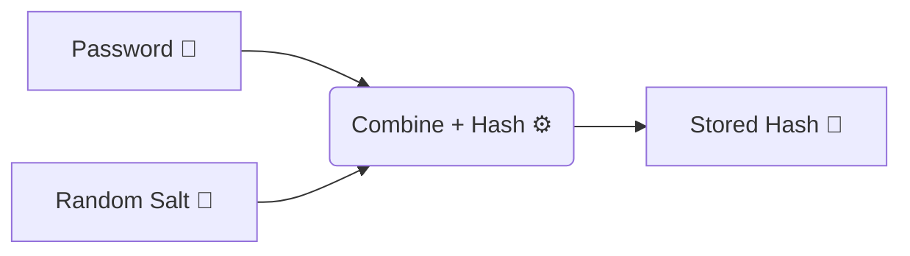
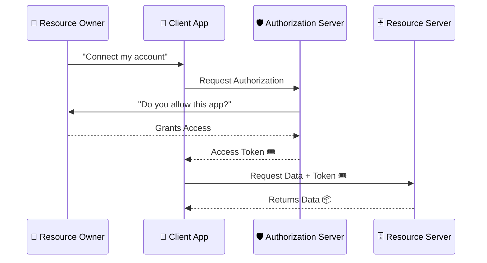

# 🔐 Authentication Security: The Front Door of Your Application

Authentication is the process of verifying the identity of a user, device, or
system. It answers the fundamental question: "Are you who you claim to be?" In
the realm of application security, robust authentication is the critical first
line of defense. If the authentication mechanism is flawed, all subsequent
security controls—no matter how sophisticated—can be bypassed, granting
attackers unfettered access to sensitive data and functionality. 🚪

Despite its importance, authentication remains one of the most frequently
attacked and commonly misconfigured areas of application development. The
persistence of "Broken Authentication" near the top of the OWASP Top 10 for
years underscores this reality. ⚠️

## 📈 The Evolution of Authentication

The methods used to authenticate users have evolved significantly in response to
increasing computational power and sophisticated attack techniques.

### 1️⃣ Single-Factor Authentication (SFA)

Historically, authentication relied almost exclusively on a single factor:
something the user knows, namely a username and password. While simple to
implement, passwords have proven to be exceptionally fragile. They are
susceptible to weak choices, reuse across multiple sites, phishing, brute-force
attacks, and credential stuffing. 🔑

### 2️⃣ Multi-Factor Authentication (MFA)

To combat the weaknesses of passwords, Multi-Factor Authentication (MFA)
requires users to provide two or more distinct types of verification factors
before access is granted. The factors are typically categorized as:

| Factor Type              | Description        | Examples                                                     |
| :----------------------- | :----------------- | :----------------------------------------------------------- |
| 🧠 **Knowledge Factor**  | Something you know | Password, PIN, answer to a security question                 |
| 📱 **Possession Factor** | Something you have | Smartphone, hardware token like a YubiKey, smart card        |
| 👁️ **Inherence Factor**  | Something you are  | Biometrics like a fingerprint, facial recognition, iris scan |

> **Note:** MFA drastically reduces the success rate of automated attacks and
> credential compromise. Even if an attacker steals a password, they still need
> the second factor to gain access. 🛡️

### 🪄 Passwordless Authentication

The modern trend in authentication is moving towards "passwordless" solutions.
These systems eliminate the need for users to memorize or input passwords
entirely, replacing them with more secure and user-friendly methods such as:

- 🔗 **Magic Links:** Sending a unique, time-limited login link to a user's
  registered email address.
- 👆 **Biometrics (FIDO2/WebAuthn):** Leveraging the cryptographic capabilities
  of modern devices and their built-in biometric sensors (e.g., Apple FaceID,
  Windows Hello) to authenticate users locally and securely.

## 🦹‍♂️ Common Authentication Attacks

Attackers employ a wide array of techniques to compromise authentication
systems. Understanding these attacks is crucial for designing robust defenses.

### 1. 🔨 Brute-Force Attacks

In a brute-force attack, an attacker systematically submits many passwords or
passphrases with the hope of eventually guessing correctly. **Defenses:** Strong
password policies (length and complexity), account lockout mechanisms, and rate
limiting login endpoints. 🛡️

### 2. 🧳 Credential Stuffing

This is a highly automated attack where attackers take large lists of
compromised username/password pairs obtained from breaches of other services and
programmatically "stuff" them into the login page of a target application.
**Defenses:** Multi-Factor Authentication (MFA) is the most effective defense.
Other mitigations include checking passwords against lists of known compromised
credentials (e.g., Have I Been Pwned API). 🛡️

### 3. 🚿 Password Spraying

A variation of brute-force, password spraying attacks avoid account lockouts by
attempting a small number of commonly used passwords (e.g., 'Password123',
'Winter2023!') against a very large list of usernames. **Defenses:** Strong
password policies that prevent the use of easily guessable passwords. Monitoring
for high volumes of failed logins. 🛡️

### 4. 🎣 Phishing and Social Engineering

Phishing involves deceiving users into willingly handing over their credentials.
Attackers often create fake login pages that mimic legitimate services.
**Defenses:** User education is critical. FIDO2/WebAuthn based security keys
provide strong, phishing-resistant authentication. 🛡️

### 5. 🍪 Session Hijacking and Fixation

Once authenticated, the application issues a session identifier (e.g., a cookie
or token) to keep the user logged in. If an attacker can steal this session ID,
they can impersonate the user. **Defenses:** Ensure session IDs are generated
securely. Transmit session IDs only over secure channels (HTTPS). Set
appropriate cookie flags (`HttpOnly`, `Secure`, `SameSite`). 🛡️

## 💾 Implementing Secure Password Storage

> ⚠️ **Critical:** If an application must store passwords, they must never be
> stored in plaintext. They must be cryptographically hashed and salted.

### #️⃣ Hashing

A cryptographic hash function is a one-way mathematical algorithm that takes an
input (the password) and produces a fixed-size string of characters. **Bad
Example:** Storing `password123`. ❌ **Better Example:** Storing the MD5 hash
`482c811da5d5b4bc6d497ffa98491e38`. (But note: MD5 and SHA-1 are considered
broken and should never be used for password hashing.) ⚠️

### 🧂 Salting

Attackers use precomputed tables of hashes (Rainbow Tables) to quickly reverse
weak hashes. To defeat rainbow tables, a unique, random string called a "salt"
is appended to the password _before_ it is hashed.

### ⏱️ Modern Password Hashing Algorithms

Modern password hashing algorithms are designed to be intentionally slow and
resource-intensive (key stretching), making brute-force attacks economically
unviable.

| Algorithm  | Description                                                                                                                         | Recommendation             |
| :--------- | :---------------------------------------------------------------------------------------------------------------------------------- | :------------------------- |
| **Argon2** | Winner of the Password Hashing Competition. Highly configurable and resistant to GPU/side-channel attacks. (Specifically Argon2id). | **Best** 🌟                |
| **bcrypt** | Widely used, proven, and robust. Incorporates a work factor that can be increased as hardware gets faster.                          | **Excellent** 👍           |
| **scrypt** | Designed to be memory-hard, making it particularly resistant to custom hardware (ASIC) attacks.                                     | **Great** ✅               |
| **PBKDF2** | Older standard, approved by NIST. Less resistant to GPU attacks than bcrypt or scrypt.                                              | **Acceptable (Legacy)** ⚠️ |

## 🌐 Modern Authentication Protocols: OAuth 2.0 and OpenID Connect

For modern web and mobile applications, building custom authentication from
scratch is generally discouraged. Industry-standard protocols should be
utilized. 🧱

### 🔑 OAuth 2.0 (Authorization)

OAuth 2.0 is an authorization framework that enables applications to obtain
limited access to user accounts on an HTTP service. It does not share passwords.

> **Note:** Crucially, OAuth 2.0 is not an authentication protocol. It does not
> communicate identity; it communicates authorization.

### 🆔 OpenID Connect (OIDC) (Authentication)

OpenID Connect is an identity layer built on top of the OAuth 2.0 protocol. It
allows clients to verify the identity of the end-user based on the
authentication performed by an Authorization Server.

**Key Concept:**

- **ID Token:** A JSON Web Token (JWT) that contains claims about the
  authenticated user (e.g., their name, email, when they authenticated).

OIDC is the standard for "Login with Google/Apple/Facebook/Microsoft" and is the
recommended approach for modern identity management.

## 📋 Authentication Best Practices Summary

To secure the front door of your application, adhere to these comprehensive best
practices:

1.  🛑 **Do Not Invent Your Own Crypto:** Never attempt to create custom hashing
    or encryption algorithms. Use vetted, industry-standard libraries.
2.  🔐 **Use Modern Password Hashing:** Employ Argon2id, bcrypt, or scrypt.
    Ensure appropriate work factors are configured.
3.  📏 **Implement Strong Password Policies:** Enforce minimum length (e.g., 12+
    characters) and check passwords against known compromised lists. Length >
    Complexity.
4.  🛡️ **Enforce Multi-Factor Authentication (MFA):** Make MFA mandatory, or at
    least highly encouraged, for all users. Prioritize WebAuthn/FIDO2 or TOTP
    over SMS.
5.  🍪 **Protect Session Management:** Generate strong session IDs, use secure
    cookie flags (`HttpOnly`, `Secure`, `SameSite`), and implement timeouts.
6.  🛑 **Implement Rate Limiting and Lockouts:** Protect login, password reset,
    and registration endpoints.
7.  🤐 **Fail Securely:** Ensure authentication error messages are generic.
    (e.g., "Invalid username or password").
8.  🤝 **Leverage Standard Protocols:** Use OpenID Connect and OAuth 2.0 for
    identity management and delegated access.
9.  🔄 **Secure Password Recovery:** Implement secure account recovery
    mechanisms using time-limited, single-use tokens.

By implementing these robust authentication controls, organizations can
significantly harden their applications against unauthorized access and protect
sensitive user data from compromise. 🛡️
