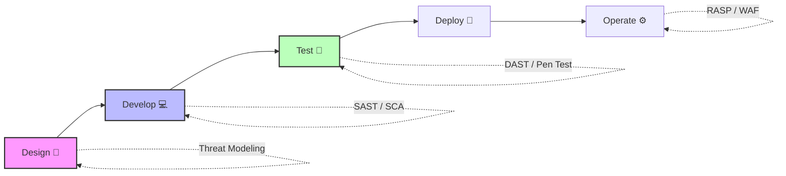

# Application Security: An In-Depth Introduction

Application security (AppSec) is the process of developing, adding, and testing
security features within applications to prevent security vulnerabilities
against threats such as unauthorized access and modification. Application
security is critical because today’s applications are often available over
various networks and connected to the cloud, increasing vulnerabilities to
security threats and breaches. There is increasing pressure and incentive to not
only secure security at the network level but also within applications
themselves. One reason for this is that hackers are going after apps with their
attacks more today than in the past. 🛡️

### 🏰 The Early Days: Perimeter Defense

In the early days of computing and the internet, security was largely focused on
perimeter defense. Organizations built "moats" and "walls" around their networks
using firewalls and intrusion detection systems (IDS). The assumption was that
threats originated from the outside, and if the perimeter was secure, the
applications and data inside were safe. Applications were mostly internal,
monolithic, and accessed by a restricted set of users.

### 🕸 The Shift to the Web

The advent of the World Wide Web changed everything. Applications became
internet-facing, accessible to anyone with a browser. This shift meant that the
traditional perimeter was no longer sufficient. Attackers realized they could
bypass firewalls by attacking the applications directly through legitimate ports
(like port 80 and 443). This era saw the rise of common web vulnerabilities like
SQL Injection (SQLi) and Cross-Site Scripting (XSS).

### 📱 The Rise of Mobile and APIs

The proliferation of smartphones introduced mobile applications, expanding the
attack surface further. Unlike web apps, mobile apps reside on the user's
device, giving attackers physical access to the binary. Simultaneously, the
shift towards microservices and Service-Oriented Architectures (SOA) led to an
explosion in Application Programming Interfaces (APIs). APIs are now the
connective tissue of the modern digital economy, but they also present a massive
target. 🎯

### ☁ Cloud-Native and DevSecOps

Today, applications are often cloud-native, built using containers, orchestrated
by Kubernetes, and deployed via continuous integration and continuous deployment
(CI/CD) pipelines. This rapid pace of development means that traditional, gated
security checks at the end of the development lifecycle are no longer viable.
Security must be integrated into every stage of development, a paradigm known as
DevSecOps. ♾️

## 💎 Why Application Security is Paramount

The importance of AppSec cannot be overstated in the modern digital landscape.
Here are the primary reasons why organizations must invest heavily in securing
their applications:

| Reason                                | Description                                                                                                              |
| :------------------------------------ | :----------------------------------------------------------------------------------------------------------------------- |
| 🔒 **Protecting Sensitive Data**      | Applications are gateways to an organization's most valuable asset: data (PII, PHI, financial records, IP).              |
| 🤝 **Maintaining Customer Trust**     | A single high-profile security breach can irreparably damage customer trust, leading to loss of business and churn.      |
| 📜 **Regulatory Compliance**          | Governments and industry bodies mandate stringent data protection standards (GDPR, HIPAA, PCI DSS).                      |
| 💸 **Preventing Financial Loss**      | Breaches cause direct financial losses due to system downtime, incident response costs, legal fees, and loss of revenue. |
| ⏱️ **Preserving Business Continuity** | App vulnerabilities can be exploited for DoS attacks, disrupting business operations and causing downtime.               |

## Core Concepts in Application Security

To understand AppSec, one must be familiar with its foundational concepts.

### 🔺 The CIA Triad

The CIA triad is the cornerstone of information security, and it applies
directly to applications:

- 🤫 **Confidentiality:** Ensuring that data is accessed only by authorized
  individuals (Encryption, Access Controls).
- ✅ **Integrity:** Ensuring that data is accurate and has not been tampered
  with (Digital Signatures, Hashing).
- 🟢 **Availability:** Ensuring that applications and data are available to
  authorized users when needed (Rate Limiting, DDoS protection).

### 🛂 Authentication and Authorization

- **Authentication (AuthN):** The process of verifying the identity of a user.
  ("Are you who you say you are?") 👤
- **Authorization (AuthZ):** The process of determining permissions. ("Are you
  allowed to do this?") 🔑

### ⚠ Vulnerability, Threat, and Risk

- 🐛 **Vulnerability:** A weakness in an application's design, implementation,
  or configuration.
- 🦹‍♂️ **Threat:** A potential malicious act that can capitalize on a
  vulnerability.
- 📉 **Risk:** The potential for loss or damage when a threat exploits a
  vulnerability. `Risk = Likelihood x Impact`.

## The AppSec Lifecycle: Integrating Security into the SDLC

Application security is not a single tool or a phase; it's a continuous process
integrated into the Software Development Life Cycle (SDLC). This integration is
often referred to as "shifting left".

<!-- Visual flow for Application Security: An In-Depth Introduction. -->

### 1. Requirements and Design Phase

- **Threat Modeling:** A structured approach to identifying potential threats
  and vulnerabilities during the design phase.
- **Security Requirements Definition:** Establishing specific security
  requirements alongside functional requirements.

### 2. 💻 Development Phase

- **Secure Coding Practices:** Developers must be trained in secure coding
  guidelines (e.g., OWASP Top 10).
- **Static Application Security Testing (SAST):** SAST tools analyze source
  code, bytecode, or binaries without executing the application.
- **Software Composition Analysis (SCA):** SCA tools analyze an application's
  dependencies to identify known vulnerabilities (CVEs) in third-party
  components.

### 3. Testing Phase

- **Dynamic Application Security Testing (DAST):** DAST tools interact with a
  running application from the outside, just as an attacker would.
- **Interactive Application Security Testing (IAST):** IAST works from within
  the application to analyze code execution and data flow in real-time.
- **Penetration Testing:** A manual security assessment performed by skilled
  ethical hackers to find complex vulnerabilities.

### 4. Deployment and Operations Phase

- **Runtime Application Self-Protection (RASP):** RASP technology monitors
  application behavior and can detect/block attacks in real-time.
- **Web Application Firewall (WAF):** A WAF filters, monitors, and blocks
  malicious HTTP/S traffic.
- **Continuous Monitoring:** Monitoring applications for suspicious activity and
  feeding data into a SIEM.

## 🧗‍♂ Key Challenges in Modern AppSec

Implementing effective application security is fraught with challenges:

> ⚠️ **Challenge:** The push for faster release cycles (Agile, DevOps) often
> conflicts with the time required for thorough security testing.

- 🏃 **Speed of Development:** Security teams struggle to keep pace with rapid
  development cycles.
- 🧩 **Complexity of Applications:** Modern architectures (microservices, APIs,
  serverless) increase the attack surface.
- 🧠 **Skill Shortage:** There is a significant shortage of skilled application
  security professionals.
- 🔔 **Tool Fatigue:** Organizations deploy numerous disjointed security tools,
  leading to alert fatigue.
- 📦 **Third-Party Risk:** Heavy reliance on open-source software and
  third-party APIs introduces vulnerabilities outside direct control.

## 🎉 Conclusion

Application security is a complex, multi-faceted discipline that requires a
proactive and integrated approach. It's no longer sufficient to treat security
as an afterthought. By understanding the core concepts, integrating security
throughout the SDLC, and leveraging appropriate testing tools and methodologies,
organizations can build resilient applications that protect sensitive data and
maintain customer trust in an increasingly hostile digital environment. 🛡️💻

## Quick Reference

| Area | Revision point |
|---|---|
| Definition | State exactly what the topic means. |
| Mechanism | Explain the steps that produce the result. |
| Example | Use a small realistic case. |
| Pitfalls | Know common mistakes and boundary cases. |
