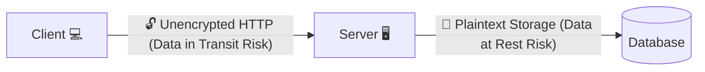
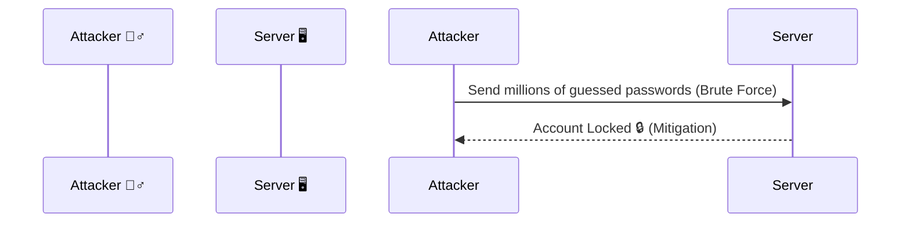
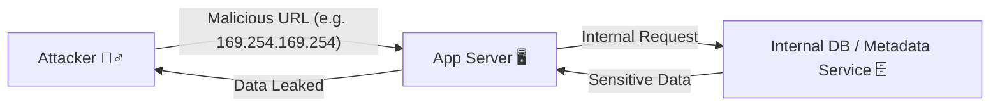

# 🏆 The OWASP Top 10: The Definitive Guide to Web Application Security Risks

The Open Worldwide Application Security Project (OWASP) Top 10 is a globally
recognized standard awareness document for developers and web application
security. It represents a broad consensus on the most critical security risks to
web applications. Understanding and mitigating the OWASP Top 10 is widely
considered the foundational baseline for any application security program. 🛡️

First published in 2003 and periodically updated (most recently in 2021) to
reflect the evolving threat landscape, the list is compiled through extensive
analysis of vulnerability data provided by security firms and industry experts.
It is not an exhaustive list of all possible flaws, but rather a prioritized
ranking of the risks that have the greatest potential for severe impact.

This guide provides an in-depth exploration of the OWASP Top 10: 2021 list,
detailing the mechanics of each vulnerability, real-world examples, and robust
mitigation strategies. 🧭

---

## 🥇 A01:2021 – Broken Access Control

Moving up from the fifth position in 2017 to the number one spot in 2021, Broken
Access Control highlights the difficulty of correctly implementing and
maintaining authorization rules in complex modern applications. Access control
enforces policy such that users cannot act outside of their intended
permissions.

> ⚠️ **Warning:** Failures typically lead to unauthorized information
> disclosure, modification, or destruction of all data or performing a business
> function outside the user's limits.

### ⚙ Mechanics and Attack Vectors

Access control failures occur when the application fails to verify if a user has
the right to access a specific resource or perform a specific action. Common
scenarios include:

| Attack Vector                                  | Description                                                                                                                                                                                             |
| :--------------------------------------------- | :------------------------------------------------------------------------------------------------------------------------------------------------------------------------------------------------------ |
| 🆔 **Insecure Direct Object Reference (IDOR)** | Bypassing access control checks by modifying the URL, internal application state, or the HTML page, or by using an API attack tool to manipulate an ID (e.g., changing `account=123` to `account=124`). |
| 🪜 **Privilege Escalation**                    | A standard user exploiting a flaw to gain administrative capabilities (Vertical Escalation), or a user accessing data belonging to another user with similar privileges (Horizontal Escalation).        |
| 🕵️‍♂️ **Forceful Browsing**                       | Accessing endpoints or directories that are supposed to be hidden or restricted without proper authentication or authorization checks.                                                                  |

### 🐛 Vulnerable Code Example (PHP)

// Example demonstrating 🏆 The OWASP Top 10: The Definitive Guide to Web Application Security Risks.
```php
// The application takes the account ID directly from the URL query parameter
$account_id = $_GET['account_id'];
$user_id = $_SESSION['user_id'];

// ❌ VULNERABLE: The query fetches the account without checking if it belongs to the logged-in user.
$query = "SELECT * FROM accounts WHERE id = '$account_id'";
$result = mysqli_query($conn, $query);
```

### Mitigation Strategies

- 🚫 **Deny by Default:** Implement a centralized access control mechanism.
  Except for public resources, deny access by default.
- 🧱 **Implement Access Control in Trusted Code:** Enforcement should occur on
  the server side, never relying on client-side constraints (like hidden fields
  or disabled buttons) which can easily be bypassed.
- 🧩 **Use Domain Models for Authorization:** Base access control on the
  business logic and domain models, ensuring that a user can only access records
  they explicitly own or have been granted access to.
- 📝 **Log and Monitor:** Log all access control failures. Alert administrators
  to repeated failures, which may indicate an ongoing attack.

## 🥈 A02:2021 – Cryptographic Failures

Previously known as Sensitive Data Exposure, this category was renamed to focus
on the root cause—failures related to cryptography—rather than the symptom.
Cryptographic failures often lead to sensitive data (passwords, credit card
numbers, health records, personal information) being exposed.

Failures in this category typically fall into one of two areas: data in transit
and data at rest.

<!-- Visual flow for 🏆 The OWASP Top 10: The Definitive Guide to Web Application Security Risks. -->


- 📡 **Data in Transit:** Transmitting sensitive data over unencrypted channels
  (HTTP, FTP, Telnet) or using weak/outdated protocols (SSL v3, TLS 1.0) and
  ciphers. Attackers can intercept this data using Man-in-the-Middle (MitM)
  attacks.
- 💾 **Data at Rest:** Storing sensitive data in plaintext or using weak
  cryptographic algorithms (e.g., MD5 or SHA1 for passwords) or improper key
  management practices (e.g., hardcoding encryption keys in source code).

- 🏷️ **Classify Data:** Identify which data is sensitive according to privacy
  laws, regulatory requirements, or business needs.
- 🔒 **Encrypt Data at Rest:** Apply robust encryption algorithms to all
  sensitive data stored in databases, files, and backups. Use strong password
  hashing algorithms like Argon2, scrypt, or bcrypt.
- 🛡️ **Encrypt Data in Transit:** Mandate TLS with Forward Secrecy for all data
  in transit. Enforce secure connections using HTTP Strict Transport Security
  (HSTS) directives.
- 🔑 **Proper Key Management:** Never hardcode keys. Use dedicated secure key
  management systems or Hardware Security Modules (HSMs). Ensure keys are
  rotated regularly and access to them is strictly controlled.
- 🚫 **Disable Weak Crypto:** Ensure legacy protocols (FTP, Telnet) and weak
  cryptographic ciphers are disabled in server configurations.

## 🥉 A03:2021 – Injection

Injection flaws, particularly SQL Injection (SQLi), Cross-Site Scripting (XSS),
and OS Command Injection, remain prevalent. Injection occurs when untrusted
user-supplied data is sent to an interpreter as part of a command or query
without proper validation or sanitization. 💉

The attacker's hostile data tricks the interpreter into executing unintended
commands or accessing data without proper authorization.

| Injection Type              | Mechanism                                                                                                                                                                                                                                        |
| :-------------------------- | :----------------------------------------------------------------------------------------------------------------------------------------------------------------------------------------------------------------------------------------------- |
| 🗄️ **SQL Injection (SQLi)** | An attacker injects malicious SQL commands into input fields. If the backend constructs SQL queries by concatenating strings, the injected payload alters the query's logic, allowing the attacker to read, modify, or delete database contents. |
| 💻 **Command Injection**    | An attacker injects OS-level commands through an application interface, allowing them to execute arbitrary commands on the host operating system with the privileges of the application.                                                         |

### 🐛 Vulnerable Code Example (Node.js/Express)

// Basic example showing the core idea.
```javascript
// ❌ Vulnerable to OS Command Injection
app.get('/ping', (req, res) => {
  const target = req.query.target;
  // DANGEROUS: Directly passing user input to a system shell
  exec(`ping -c 4 ${target}`, (error, stdout, stderr) => {
    res.send(`<pre>${stdout}</pre>`);
  });
});
// An attacker calls: /ping?target=127.0.0.1; cat /etc/passwd
```

> **Note:** The most reliable way to prevent SQL Injection is using
> parameterized queries.

- 🧩 **Use Parameterized Queries (Prepared Statements):** This is the primary
  defense against SQL injection. Parameterization separates the SQL code from
  the user-provided data, ensuring the data is always treated as a literal value
  and never executable code.
- 🔌 **Use Safe APIs:** Avoid using interpreters entirely or use secure, typed
  APIs that do not parse data as executable logic.
- ✅ **Positive Input Validation:** Implement strict allowlists (positive
  validation) on all user input. Reject any input that does not strictly conform
  to expected formats.
- 🧽 **Escape/Encode Data:** If parameterized queries are not possible,
  carefully escape special characters specific to the target interpreter.

## 📐 A04:2021 – Insecure Design

A new category in 2021, Insecure Design focuses on risks related to design and
architectural flaws. It emphasizes the need for threat modeling, secure design
principles, and reference architectures. A secure implementation cannot fix an
inherently insecure design; if the logic itself is flawed, perfectly written
code will still be vulnerable. 🏗️

Insecure design encompasses a wide range of issues where security was not
considered during the initial planning phases.

- 🤖 **Missing Anti-Automation:** An application designed without rate limiting
  or bot protection is inherently vulnerable to credential stuffing, brute
  force, and denial of service, regardless of how well the login function is
  coded.
- 🛒 **Flawed Business Logic:** An e-commerce site that allows users to apply a
  discount code multiple times recursively, or manipulate price variables in the
  shopping cart due to flawed state management design.
- 🕵️ **Lack of Threat Modeling:** Failing to anticipate potential attack paths
  during the design phase leaves critical assets unprotected.

- ⬅️ **Shift Left with Threat Modeling:** Conduct threat modeling sessions
  during the requirements and design phases to identify potential
  vulnerabilities and design robust mitigations before coding begins.
- 📚 **Establish Secure Design Patterns:** Utilize established secure design
  patterns and reference architectures.
- 🧠 **Evaluate Business Logic Risks:** Specifically analyze business workflows
  for potential abuse or logical bypasses.
- 🤝 **Integration of Security Experts:** Ensure security professionals are
  involved early in the software development lifecycle (SDLC).

## ⚙ A05:2021 – Security Misconfiguration

This category moved up from #6 in the previous list. As systems become more
complex and rely heavily on automated deployments, containerization, and cloud
infrastructure, configuration errors become more common and impactful. 🛠️

Security misconfiguration can happen at any level of the application stack,
including the network, platform, web server, application server, database,
framework, and custom code.

| Misconfiguration              | Example                                                                                                                         |
| :---------------------------- | :------------------------------------------------------------------------------------------------------------------------------ |
| 🔑 **Default Credentials**    | Leaving default usernames and passwords (e.g., `admin/admin`) active on application servers or database instances.              |
| 📦 **Unnecessary Features**   | Keeping unnecessary ports open, or leaving sample applications, legacy code, or unused services running on the server.          |
| 🗣️ **Verbose Error Messages** | Displaying detailed stack traces or internal server error messages to users, which can reveal sensitive infrastructure details. |
| ☁️ **Insecure Cloud Storage** | Misconfiguring cloud storage buckets (like AWS S3) to be publicly readable or writable.                                         |

- 🛡️ **Hardening Processes:** Implement a repeatable, automated hardening
  process to ensure environments are deployed securely.
- 📉 **Minimalist Architecture:** Remove or do not install unused features and
  frameworks. Keep the attack surface as small as possible.
- 🤖 **Automated Configuration Auditing:** Use tools to continuously audit
  configurations in CI/CD pipelines and production environments against security
  baselines (like CIS Benchmarks).
- 🤐 **Generic Error Handling:** Ensure the application implements a centralized
  error handling mechanism that returns generic, non-informative messages to
  clients.

## A06:2021 – Vulnerable and Outdated Components

Modern applications are rarely built from scratch; they rely heavily on
open-source libraries, frameworks, and third-party modules. If an application
utilizes a component with a known vulnerability (e.g., a CVE), the application
itself becomes vulnerable. 🧩

Attackers constantly scan the internet for applications running known vulnerable
versions of software.

- 🎯 **Exploiting Known CVEs:** If a popular library (like Log4j or Apache
  Struts) has a critical vulnerability published, attackers will quickly develop
  automated tools to exploit it across thousands of targets.
- 🔄 **Dependency Confusion:** Attackers publish malicious packages to public
  repositories with the same names as internal, private packages used by an
  organization, tricking the build system into pulling the malicious code.

- 🔍 **Software Composition Analysis (SCA):** Integrate SCA tools into the
  development pipeline to automatically identify and flag dependencies with
  known vulnerabilities.
- 📋 **Maintain a Bill of Materials (SBOM):** Maintain an accurate inventory of
  all client-side and server-side components and their dependencies.
- 🩹 **Continuous Patching:** Establish a robust patch management process. Keep
  all components up to date.
- 🗑️ **Remove Unused Dependencies:** Regularly audit and remove components that
  are no longer actively used by the application.

## 👤 A07:2021 – Identification and Authentication Failures

Previously named Broken Authentication, this category dropped slightly in rank
as standard frameworks have improved their built-in authentication mechanisms.
However, customized or poorly implemented authentication and session management
continue to result in severe vulnerabilities. 🔑

Failures occur when an application improperly verifies the user's identity or
mishandles the secure session.

<!-- Visual flow for 🏆 The OWASP Top 10: The Definitive Guide to Web Application Security Risks. -->


- 🤖 **Credential Stuffing/Brute Force:** Lack of protection against automated
  attacks targeting login forms.
- 🔓 **Weak Passwords:** Allowing users to choose weak or easily guessable
  passwords.
- 🍪 **Session Fixation/Hijacking:** Exposing session IDs in URLs, failing to
  rotate session IDs after login, or using predictable session tokens.

- 🔐 **Implement Multi-Factor Authentication (MFA):** This is the single most
  effective defense against credential-based attacks.
- 🛡️ **Use Standard Protocols:** Leverage established authentication protocols
  like OpenID Connect and avoid writing custom authentication logic.
- 📏 **Robust Password Policies:** Enforce password length and check against
  lists of breached credentials.
- 🍪 **Secure Session Management:** Use built-in, secure server-side session
  management. Ensure session IDs are random, transmitted over HTTPS, and
  invalidated securely on logout or timeout.

## A08:2021 – Software and Data Integrity Failures

This is a new category encompassing failures related to code and infrastructure
that do not protect against integrity violations. It highlights the risks
associated with modern CI/CD pipelines and automatic updates. 🛡️

- 🏭 **Insecure CI/CD Pipelines:** Attackers compromising the build environment
  to inject malicious code into the application before it is deployed (Supply
  Chain Attack).
- 📦 **Untrusted Deserialization:** Applications deserializing hostile or
  tampered data provided by a user, which can lead to remote code execution.
- ⬇️ **Lack of Signed Updates:** Applications downloading plugins, libraries, or
  automatic updates without verifying their cryptographic signatures, allowing
  attackers to deliver malicious payloads.

- ✍️ **Use Digital Signatures:** Verify the authenticity and integrity of all
  software, firmware, and data before processing or executing it.
- 🔒 **Secure the Supply Chain:** Harden CI/CD pipelines. Implement strict
  access controls, audit logs, and require multiple approvals for critical
  changes. Use tools to scan container images for vulnerabilities.
- 🚫 **Avoid Deserialization of Untrusted Data:** If possible, do not accept
  serialized objects from untrusted sources. If necessary, use safe formats like
  JSON, or implement strict type checking and digital signatures before
  deserialization.

## 📈 A09:2021 – Security Logging and Monitoring Failures

This category moved up from #10. Without proper logging and monitoring, breaches
cannot be detected. Industry studies consistently show that the time to detect a
breach is often measured in hundreds of days, typically because logging is
either non-existent, inadequate, or ignored. 🔭

> ⚠️ **Warning:** If you don't log it, it didn't happen (and you won't know
> you've been breached).

While not a direct vulnerability that can be exploited for access, failures here
allow attackers to operate silently, pivot within the network, and extract data
over long periods without triggering alarms.

- 🔇 **Inadequate Logging:** Only logging system errors but failing to log
  security-relevant events like successful/failed logins, high-value
  transactions, or access control failures.
- 📝 **Log Tampering:** Storing logs locally without protection, allowing an
  attacker who gains access to delete or alter the logs to cover their tracks.
- 🚨 **Lack of Alerting:** Having logs but no systems in place to analyze them
  and alert security teams to suspicious activity in real-time.

- 📋 **Comprehensive Logging:** Log all input validation failures,
  authentication attempts, access control failures, and critical business logic
  events with sufficient context.
- 🎯 **Centralized Log Management:** Stream logs securely to a centralized,
  protected system (like a SIEM) that cannot be altered by a compromised
  application server.
- 🔔 **Proactive Monitoring and Alerting:** Establish thresholds and behavioral
  rules to generate automated alerts for suspicious activities, enabling rapid
  incident response.

## 🌐 A10:2021 – Server-Side Request Forgery (SSRF)

Added based on industry survey data rather than raw vulnerability statistics,
SSRF highlights a growing threat as modern applications increasingly fetch data
from external and internal URIs. 🔗

SSRF occurs when a web application fetches a remote resource without validating
the user-supplied URL. It allows an attacker to force the application to send a
crafted request to an unexpected destination, often bypassing firewalls and
accessing internal networks.

<!-- Visual flow for 🏆 The OWASP Top 10: The Definitive Guide to Web Application Security Risks. -->


- 🗺️ **Internal Network Scanning:** An attacker provides an internal IP address
  (e.g., `192.168.1.x`) to map out internal services that are not exposed to the
  internet.
- ☁️ **Cloud Metadata Exploitation:** In cloud environments (AWS, Azure, GCP),
  attackers often use SSRF to query internal metadata services to extract highly
  sensitive IAM credentials and take over cloud infrastructure.

- ✅ **Input Validation (Allowlisting):** Validate user-supplied URLs against a
  strict allowlist of permitted domains or IP addresses. Do not use denylists,
  as they are easily bypassed.
- 🚫 **Disable Unused URL Schemas:** Configure the application to only accept
  necessary protocols (e.g., `http` and `https`), disabling schemas like
  `file://`, `dict://`, or `gopher://`.
- 🧱 **Network Segmentation:** Use network controls (firewalls, VPC
  configurations) to restrict the application server's access to internal
  networks and cloud metadata services.
- 🙈 **Avoid Raw Responses:** Do not return the raw response from the fetched
  URI directly to the client if possible, to limit information leakage.

## 🎉 Conclusion

The OWASP Top 10 provides a critical roadmap for navigating the complex
landscape of application security. While technologies and attack methods will
continue to evolve, the underlying principles highlighted by this list—robust
access control, secure design, cryptography, and comprehensive visibility—remain
the bedrock of building secure and resilient software systems. Continuous
education and integration of these principles into the SDLC are essential for
mitigating these pervasive risks. 🛡️💻

## Quick Reference

| Area | Revision point |
|---|---|
| Definition | State exactly what the topic means. |
| Mechanism | Explain the steps that produce the result. |
| Example | Use a small realistic case. |
| Pitfalls | Know common mistakes and boundary cases. |
