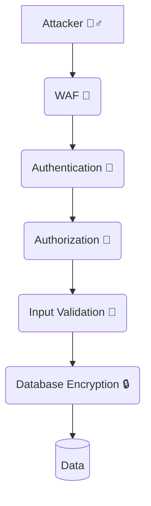
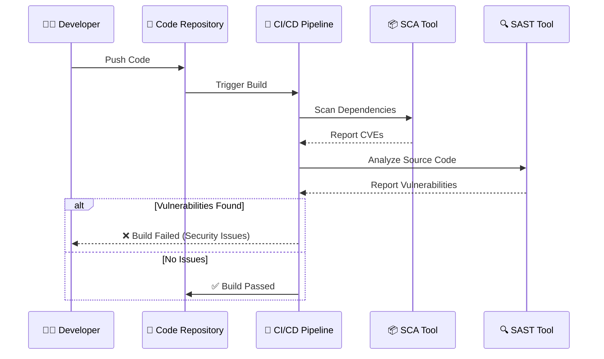

# Secure Coding: Building Defenses from the Ground Up

Secure coding is the practice of developing computer software in a way that
guards against the accidental introduction of security vulnerabilities. It
represents a fundamental shift from viewing security as an operational
concern—something bolted on after the application is built—to a structural one,
where security is woven into the very fabric of the source code. 🧱

In the modern threat landscape, relying solely on perimeter defenses (like
firewalls and WAFs) is insufficient. Attackers frequently bypass these outer
layers by exploiting flaws directly within the application's logic. Therefore,
training developers in secure coding principles and establishing rigorous secure
coding standards is the most effective way to reduce an organization's overall
risk profile. 📉

## 💸 The Cost of Insecure Code

The financial and reputational impact of vulnerabilities introduced through poor
coding practices is immense.

| Impact Area                | Description                                                                                                                                                                                                                                                                                        | Severity    |
| :------------------------- | :------------------------------------------------------------------------------------------------------------------------------------------------------------------------------------------------------------------------------------------------------------------------------------------------- | :---------- |
| 🛠️ **Remediation Costs**   | A vulnerability discovered during the requirements phase is cheap to fix. If found during development, it costs more. If discovered in production by a security researcher or an attacker, the cost to fix—in terms of emergency patches, downtime, and incident response—is exponentially higher. | High 🔴     |
| 🚨 **Data Breaches**       | Insecure code is the root cause of most major data breaches, leading to regulatory fines (GDPR, HIPAA), lawsuits, and loss of intellectual property.                                                                                                                                               | Critical 💥 |
| 📉 **Reputational Damage** | Customers lose trust in organizations that fail to protect their data, leading to customer churn and a tarnished brand image.                                                                                                                                                                      | High 🔴     |

> ⚠️ **Warning:** Fixing a bug in production can be up to 100x more expensive
> than fixing it during the design phase!

## Core Secure Coding Principles

Effective secure coding relies on a set of foundational principles that should
guide every architectural decision and line of code written.

### 1. 🧅 Defense in Depth

Never rely on a single security control. Assume that any single defense
mechanism might fail or be bypassed. Implement multiple layers of security
controls throughout the application stack.

<!-- Visual flow for Secure Coding: Building Defenses from the Ground Up. -->


> **Note:** Do not rely solely on a WAF to stop SQL injection. Use parameterized
> queries in the code, enforce least privilege on the database user, and use a
> WAF as a supplementary layer of defense.

### 2. 🔑 Least Privilege

Every module, process, user, and program must have the absolute minimum set of
privileges necessary to perform its legitimate function.

- _Example:_ An application connecting to a database to read user profiles
  should use a database account that only has `SELECT` permissions on the
  `users` table. It should not use an account with `DROP`, `UPDATE`, or `INSERT`
  privileges, nor should it use a database administrator (DBA) account.

### 3. 🛑 Fail Securely (Fail-Safe Defaults)

When a system fails or encounters an error, it should fail to a secure state
rather than an insecure one. Access should be denied by default, and explicit
permission must be required for access.

- _Example:_ If a function checking a user's authorization to access a sensitive
  document throws an unexpected exception, the exception handler should default
  to denying access, not granting it.

### 4. Keep It Simple (Economy of Mechanism)

Complexity is the enemy of security. Complex designs are harder to understand,
harder to test, and more likely to contain subtle flaws. Keep architectures,
code, and security mechanisms as simple and straightforward as possible.

### 5. 🛂 Complete Mediation

Every access to every object must be checked for authority. This principle
dictates that access control checks cannot be bypassed.

- _Example:_ If a user attempts to access a specific record via a URL (e.g.,
  `/view_record/123`), the system must verify the user's authorization on
  _every_ request, not just assume they are authorized because they are logged
  in.

### 6. 🤝 Separation of Privilege

Require multiple conditions to grant privilege, rather than a single condition.
This is similar to the concept of Multi-Factor Authentication but applied to
system architecture.

- _Example:_ Requiring both an administrator's credential and physical presence
  (or access from a specific secured network segment) to perform high-risk
  administrative actions.

### 7. 🚫 Never Trust User Input

This is arguably the most critical rule in secure coding. All input received
from outside the application's trust boundary (users, API calls, external files,
databases) must be considered untrusted and potentially malicious.

> ⚠️ **Critical:** If you only remember one rule, make it this: **All input is
> evil until proven otherwise.**

## 🛠 Key Secure Coding Practices

Translating principles into practice requires specific techniques during the
development process.

### 🧹 Input Validation and Sanitization

Because user input cannot be trusted, it must be rigorously verified before it
is processed by the application.

| Technique                                 | Description                                                                                                                                          | Recommendation   |
| :---------------------------------------- | :--------------------------------------------------------------------------------------------------------------------------------------------------- | :--------------- |
| ✅ **Positive Validation (Allowlisting)** | Define exactly what the expected input looks like (type, length, format, character set) and reject everything else. Example: US Zip Code (5 digits). | **Preferred** 🌟 |
| ❌ **Negative Validation (Denylisting)**  | Attempting to filter out known bad characters (e.g., `<script>`, `' OR 1=1`).                                                                        | **Avoid** 🚫     |
| 🧽 **Sanitization (Encoding/Escaping)**   | Converting special characters into a safe format so the interpreter does not execute them. Example: `<` to `&lt;`.                                   | **Essential** 🛡️ |

### 🔤 Output Encoding

Output encoding is the primary defense against Cross-Site Scripting (XSS). It
ensures that data rendered in a browser is treated as text content rather than
executable code.

- 🎯 **Context-Aware Encoding:** The type of encoding depends entirely on where
  the data is being placed. Encoding for an HTML body is different from encoding
  for an HTML attribute, a JavaScript variable, or a CSS context.
- 🖼️ **Use Framework Features:** Modern web frameworks (like React, Angular,
  Vue, and modern templating engines) often provide automatic, context-aware
  HTML output encoding by default. Developers must be careful not to bypass
  these protections (e.g., using `dangerouslySetInnerHTML` in React without
  extreme caution).

### Secure Authentication and Session Management

- 🔒 **Use Strong Cryptography:** Never store passwords in plaintext. Use
  strong, slow cryptographic hashing algorithms with a unique salt per user
  (e.g., Argon2id, bcrypt).
- 🎫 **Secure Session Identifiers:** Generate session IDs securely using a
  cryptographically secure pseudorandom number generator (CSPRNG). Ensure they
  possess high entropy.
- 🍪 **Protect Cookies:** Set the `Secure` flag (ensuring the cookie is only
  sent over HTTPS) and the `HttpOnly` flag (preventing client-side JavaScript
  from accessing the cookie, mitigating XSS risks). Use the `SameSite` attribute
  to help protect against Cross-Site Request Forgery (CSRF).
- 🚪 **Session Invalidation:** Ensure sessions are properly invalidated upon
  logout and implement absolute and idle session timeouts. Always generate a new
  session ID when a user's privilege level changes (e.g., post-login) to prevent
  session fixation attacks.

### Parameterized Queries (Preventing SQL Injection)

SQL injection occurs when untrusted data is concatenated directly into a
database query string. The definitive solution is to use parameterized queries
(also known as prepared statements).

> ⚠️ **Warning:** String concatenation allows SQL injection and should be
> strictly avoided for database queries.

**Vulnerable Example (Node.js/PostgreSQL):**

```javascript
// ❌ DANGEROUS: String concatenation allows SQL injection
const username = req.body.user;
const query = "SELECT * FROM users WHERE username = '" + username + "'";
db.query(query, (err, res) => {
  /* ... */
});
```

_If `username` is `admin' --`, the query becomes `SELECT _ FROM users WHERE
username = 'admin' --'`, bypassing authentication.\*

**Secure Example (Parameterized Query):**

```javascript
// ✅ SECURE: Parameterization separates code from data
const username = req.body.user;
const query = 'SELECT * FROM users WHERE username = $1';
db.query(query, [username], (err, res) => {
  /* ... */
});
```

_The database driver ensures the input `$1` is treated strictly as a literal
value, regardless of its content._

### Error Handling and Logging

- 🤐 **Fail Securely and Silently to the User:** When exceptions occur, do not
  leak sensitive system information (stack traces, database structures, internal
  paths) to the end-user. Return generic error messages (e.g., "An unexpected
  error occurred. Please try again later.").
- 🗣️ **Log Verbose Errors Internally:** While hiding details from the user,
  ensure comprehensive details about the error are logged securely on the server
  for debugging and security auditing.
- 🧽 **Sanitize Logs:** Ensure that sensitive information (passwords, credit
  card numbers, PII) is never written to log files. Be wary of Log Injection
  attacks; sanitize data before writing it to logs.

## Integrating Secure Coding into the SDLC (DevSecOps)

Secure coding cannot be effective if it relies solely on developer memory. It
must be integrated into the Software Development Life Cycle (SDLC).

<!-- Visual flow for Secure Coding: Building Defenses from the Ground Up. -->


1.  🎓 **Training and Awareness:** Developers must receive ongoing,
    language-specific training on secure coding practices and common
    vulnerabilities (like the OWASP Top 10).
2.  📜 **Coding Standards:** Establish and enforce comprehensive secure coding
    guidelines specific to the organization's technology stack.
3.  🔍 **Static Application Security Testing (SAST):** Integrate SAST tools into
    the IDE and the CI/CD pipeline. These tools analyze source code
    automatically, identifying potential vulnerabilities (like SQLi, XSS,
    insecure cryptography) before the code is even compiled.
4.  📦 **Software Composition Analysis (SCA):** Modern applications rely heavily
    on open-source libraries. SCA tools scan dependencies to identify known
    vulnerabilities (CVEs) and licensing risks in third-party code.
5.  👀 **Code Reviews:** Conduct peer code reviews with a specific focus on
    security. A second pair of eyes is often the best defense against complex
    logical flaws that automated tools might miss.

## 🎉 Conclusion

Secure coding is not an endpoint, but a continuous journey of improvement. By
embracing secure design principles, rigorously validating all input, employing
secure authentication mechanisms, and integrating automated security testing
into the development pipeline, development teams can build robust applications
capable of withstanding the sophisticated attacks of the modern digital
landscape. Security must become an integral part of the engineering culture,
owned by developers and supported by security professionals. 🛡️💻

## Quick Reference

| Area | Revision point |
|---|---|
| Definition | State exactly what the topic means. |
| Mechanism | Explain the steps that produce the result. |
| Example | Use a small realistic case. |
| Pitfalls | Know common mistakes and boundary cases. |
