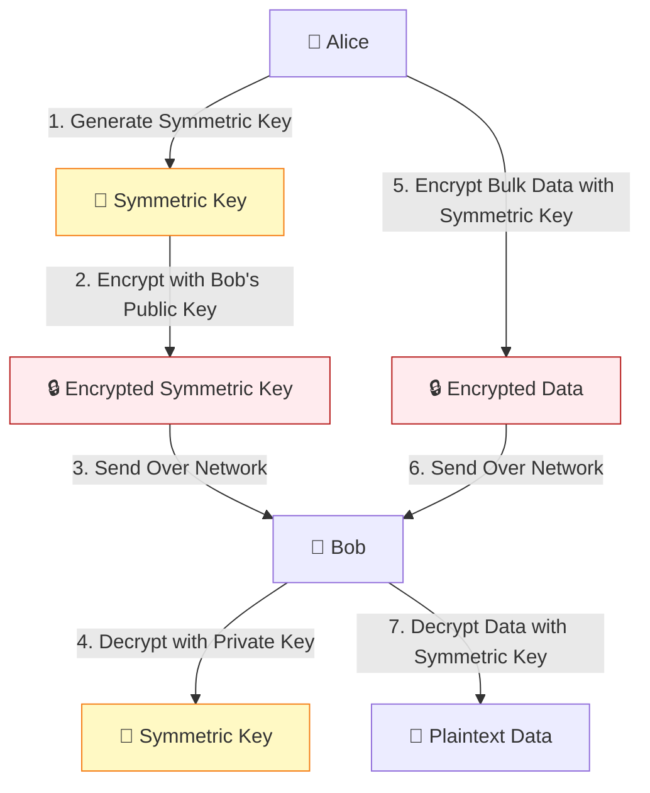

# 🗝️ Asymmetric Encryption (Public Key Cryptography)

Before the 1970s, all cryptographic systems relied on a shared secret key. The
insurmountable problem was **key distribution**: how do two parties who have
never met agree on a secret key over a public, monitored channel?

The invention of Asymmetric Encryption (or Public Key Cryptography) by Whitfield
Diffie, Martin Hellman, and Ralph Merkle in 1976 revolutionized the field. It
introduced the concept of mathematically linked **key pairs**.

This comprehensive guide explores the profound mathematics behind asymmetric
cryptography, detailed breakdowns of RSA and ECC, key exchange mechanisms, and
the real-world infrastructure that relies on these algorithms.

## 1. 🎯 The Core Concept: Key Pairs

Unlike symmetric encryption, which uses one key for both encryption and
decryption, asymmetric encryption uses two distinct, but mathematically related,
keys:

1.  **Public Key:** This key is designed to be shared openly with the world.
    Anyone can use it.
2.  **Private Key:** This key must be kept absolutely secret by its owner.

### 1.1 🕳️ The One-Way Mathematical Trapdoor

The security of asymmetric cryptography relies on "trapdoor one-way functions."

- A **one-way function** is a mathematical operation that is easy to compute in
  one direction but practically impossible to reverse. (e.g., smashing a glass
  is easy; reassembling it is hard).
- A **trapdoor** is a secret piece of information (the private key) that makes
  reversing the one-way function easy.

> **Note:** The security of asymmetric cryptography fundamentally depends on the
> difficulty of reversing these mathematical one-way functions.

### 1.2 ✌️ Two Primary Use Cases

The relationship between the public and private key enables two distinct
operations:

1.  **Secure Communication (Encryption):**
    - If Alice wants to send a secret message to Bob, she encrypts the message
      using **Bob's Public Key**.
    - Once encrypted, _only_ **Bob's Private Key** can decrypt it. Not even
      Alice can decrypt the message she just encrypted.
2.  **Authentication (Digital Signatures):**
    - If Alice wants to prove she wrote a message, she encrypts a hash of the
      message using **her own Private Key**.
    - Anyone can decrypt that hash using **Alice's Public Key**. If the
      decryption is successful and the hash matches, it proves the message could
      _only_ have come from Alice (since only she possesses her private key).

## 2. 🧮 RSA (Rivest-Shamir-Adleman)

Developed in 1977 by Ron Rivest, Adi Shamir, and Leonard Adleman, RSA is the
most famous asymmetric algorithm. Its security relies on the **integer
factorization problem**: it is easy to multiply two large prime numbers
together, but it is computationally infeasible to take the resulting product and
figure out what the two original primes were.

### 2.1 🔢 The Mathematics of RSA

The RSA algorithm involves three steps: Key Generation, Encryption, and
Decryption.

#### Step 1: Key Generation

1.  **Choose two distinct, large prime numbers:** $p$ and $q$. (In modern RSA,
    these are typically 2048 bits long).
2.  **Compute $n = p \times q$.**
    - $n$ is used as the modulus for both the public and private keys. Its
      length, usually expressed in bits, is the key length.
3.  **Compute the totient:** $\phi(n) = (p-1) \times (q-1)$.
    - This relates to Euler's totient function, which counts the positive
      integers up to $n$ that are relatively prime to $n$.
4.  **Choose an integer $e$** such that $1 < e < \phi(n)$ and $e$ is coprime to
    $\phi(n)$.
    - $e$ is the **public exponent**. (Commonly, $e = 65537$ is used because it
      provides a good balance between security and encryption speed).
5.  **Compute $d$** to satisfy the congruence relation
    $d \times e \equiv 1 \pmod{\phi(n)}$.
    - $d$ is the **private exponent**. It is computed using the Extended
      Euclidean algorithm.

**The Keys:**

- **Public Key:** $(n, e)$
- **Private Key:** $(n, d)$ (Keep $p$, $q$, and $\phi(n)$ secret or destroy
  them).

#### Step 2: Encryption

Given a plaintext message $M$ (represented as an integer where $0 \le M < n$),
the ciphertext $C$ is calculated as: $$C \equiv M^e \pmod n$$

#### Step 3: Decryption

To recover the plaintext $M$ from the ciphertext $C$, the receiver uses their
private exponent $d$: $$M \equiv C^d \pmod n$$

### 2.2 ⚠️ Vulnerabilities and Padding

Raw RSA (textbook RSA) is vulnerable to several attacks:

- **Deterministic Encryption:** Because there is no randomness, encrypting the
  same message twice yields the same ciphertext.
- **Malleability:** An attacker can intercept a ciphertext $C$, multiply it by
  some number, and create a new valid ciphertext that decrypts to a predictable
  modification of the original plaintext.

**Solution: OAEP Padding** To make RSA secure in the real world, **Optimal
Asymmetric Encryption Padding (OAEP)** is used. OAEP adds structured randomness
to the plaintext before mathematical encryption, ensuring that the same
plaintext always produces a wildly different ciphertext, destroying
malleability.

## 3. 📈 Elliptic Curve Cryptography (ECC)

While RSA relies on the difficulty of factoring large numbers, ECC relies on the
**Elliptic Curve Discrete Logarithm Problem (ECDLP)**.

### 3.1 📐 The Math Behind the Curve

An elliptic curve is defined by an equation, typically of the form:
$$y^2 = x^3 + ax + b$$ Over a finite field, this creates a specific set of
points. ECC defines a mathematical "addition" operation for points on this
curve. If you take a starting point $G$ (the generator point) and "add" it to
itself $k$ times, you arrive at a new point $P$.

- **Private Key:** The randomly chosen large integer $k$.
- **Public Key:** The resulting point $P$ on the curve.

The **ECDLP** states that given the starting point $G$ and the final point $P$,
it is computationally infeasible to figure out how many times $G$ was added to
itself (i.e., you cannot deduce the private key $k$).

### 3.2 ⚖️ The Advantage of ECC over RSA

The primary advantage of ECC is that it offers the same level of cryptographic
strength as RSA but with vastly smaller key sizes.

| Feature                            | 🧮 RSA                        | 📈 ECC                            |
| :--------------------------------- | :---------------------------- | :-------------------------------- |
| **Mathematical Basis**             | Integer Factorization         | Elliptic Curve Discrete Logarithm |
| **Key Size (Equivalent Security)** | 3072-bit                      | 256-bit                           |
| **Performance**                    | Slower key generation         | Faster key generation & signing   |
| **Resource Usage**                 | High (CPU, Memory, Bandwidth) | Low (Ideal for Mobile/IoT)        |

**Benefits of smaller keys:**

1.  **Faster computation:** Signing and key generation are much faster.
2.  **Lower power consumption:** Crucial for mobile and IoT devices.
3.  **Less bandwidth:** Certificates and keys take up less space in network
    handshakes.

### 3.3 🧬 Common ECC Curves

Not all curves are secure. The cryptographic community relies on standardized
curves that have been vetted for mathematical weaknesses.

- **NIST Curves:** P-256, P-384. (Widely used in enterprise and government).
- **Curve25519:** Designed by Daniel J. Bernstein. It is faster than the NIST
  curves, highly secure against side-channel attacks, and is the modern standard
  for new protocols (like Signal, WireGuard, and TLS 1.3).

## 4. 🤝 Key Exchange: Diffie-Hellman (DH)

While RSA can be used to encrypt a symmetric key and send it to a receiver,
**Diffie-Hellman** allows two parties to mutually generate a shared secret over
a public channel without ever transmitting the secret itself.

### 4.1 🎨 How Diffie-Hellman Works (The Paint Analogy)

Imagine Alice and Bob want to agree on a secret color over a public network
where Eve is listening.

1.  **Public Agreement:** Alice and Bob agree on a public common paint color
    (e.g., Yellow).
2.  **Private Colors:** Alice selects a secret color (Red). Bob selects a secret
    color (Blue).
3.  **Mixing:** Alice mixes her secret Red with the public Yellow, resulting in
    Orange. Bob mixes his secret Blue with the public Yellow, resulting in
    Green.
4.  **Exchange:** Alice sends Orange to Bob. Bob sends Green to Alice. (Eve sees
    Yellow, Orange, and Green).
5.  **Final Mix:** Alice takes Bob's Green and adds her secret Red, creating a
    muddy brown. Bob takes Alice's Orange and adds his secret Blue, creating the
    exact same muddy brown.

Alice and Bob now share the secret brown color. Eve cannot recreate it because
she cannot easily "unmix" the Orange or Green paint to discover the original
secret colors.

### 4.2 🧮 The Math (Discrete Logarithm)

1.  Alice and Bob agree on a large prime modulus $p$ and a generator $g$.
2.  Alice chooses a private integer $a$ and calculates $A = g^a \pmod p$. She
    sends $A$ to Bob.
3.  Bob chooses a private integer $b$ and calculates $B = g^b \pmod p$. He sends
    $B$ to Alice.
4.  Alice computes the shared secret $S = B^a \pmod p$.
5.  Bob computes the shared secret $S = A^b \pmod p$.

Because $B^a = (g^b)^a = g^{ba} = g^{ab} = (g^a)^b = A^b$, they both arrive at
the exact same secret $S$.

### 4.3 🕵️‍♂️ Ephemeral Diffie-Hellman (DHE / ECDHE)

In modern systems (like TLS 1.3), Diffie-Hellman is used in an **ephemeral**
mode. This means new private integers ($a$ and $b$) are generated for _every
single connection_ and then discarded.

- **Perfect Forward Secrecy (PFS):** Because the keys are ephemeral, if an
  attacker records months of encrypted traffic and later manages to steal the
  server's long-term RSA private key, they _cannot_ decrypt the past traffic.
  The server's RSA key is only used to authenticate the connection, while the
  ECDHE handshake generates the temporary encryption keys.

## 5. 🧬 The Hybrid Cryptosystem

Asymmetric encryption is mathematically profound, but it is extremely
slow—typically 1,000 to 10,000 times slower than symmetric encryption. It is
completely impractical to use RSA or ECC to encrypt a 1GB video file.

Therefore, the modern internet uses a **Hybrid Cryptosystem**:

1.  **Asymmetric Cryptography** (RSA/ECC) is used during the initial handshake
    to authenticate the server and securely exchange a symmetric key (via
    ECDHE).
2.  **Symmetric Cryptography** (AES/ChaCha20) uses that freshly generated,
    shared secret key to encrypt the actual data payload for the duration of the
    session.

This combines the key-distribution benefits of asymmetric cryptography with the
blazing speed of symmetric cryptography.

## 6. 🏛️ Public Key Infrastructure (PKI)

If Bob sends Alice his public key over the internet, how does Alice know the key
actually belongs to Bob, and not to an attacker (Eve) who intercepted the
message and substituted her own public key? (A Man-in-the-Middle attack).

This is solved by **Public Key Infrastructure (PKI)** and **Digital
Certificates**.

- A trusted third party, known as a **Certificate Authority (CA)** (e.g., Let's
  Encrypt, DigiCert), verifies Bob's identity.
- The CA then issues a Digital Certificate, which contains Bob's public key and
  is digitally signed by the CA's private key.
- Alice's computer comes pre-installed with the public keys of major CAs. She
  uses the CA's public key to verify the signature on Bob's certificate,
  mathematically proving that Bob's public key is legitimate.

## 🎉 Summary

Asymmetric encryption is the mathematical miracle that makes secure
communication over the public internet possible. By understanding the
factorization foundations of RSA, the elegant efficiency of Elliptic Curve
Cryptography, and the vital importance of ephemeral key exchange protocols like
Diffie-Hellman, we can appreciate the robust architecture that secures our
digital lives. As we move forward, the transition from traditional asymmetric
algorithms to Post-Quantum Cryptography will be the next great challenge in this
domain.
