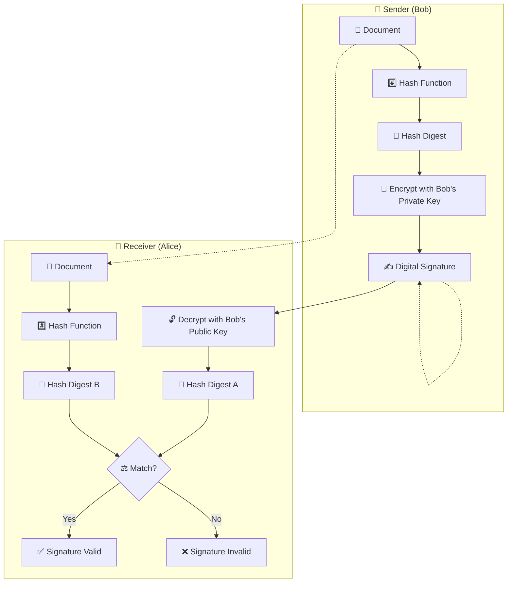

# ✍ Digital Signatures

In the physical world, a handwritten signature binds a person's identity to a
document, signaling intent and agreement. In the digital realm, a scanned image
of a handwritten signature is functionally useless, as it can be perfectly
copied and pasted onto any other document.

A **Digital Signature** is the cryptographic equivalent of a handwritten
signature, but it is vastly more secure. It mathematically binds an entity's
digital identity not just to a document, but to the _exact mathematical state_
of that document. If a single comma is changed after the document is signed, the
digital signature instantly becomes invalid.

This comprehensive guide breaks down the mechanics of digital signatures, the
algorithms used to generate them, and their critical role in proving identity
and non-repudiation in modern computing.

## 1. The Core Objectives of a Digital Signature

Digital signatures are designed to fulfill three primary security objectives:

### 1.1 🆔 Authentication (Identity)

When Alice receives a signed message from Bob, the digital signature proves
mathematically that the message truly originated from Bob (or at least, from
someone possessing Bob's private key). It prevents an attacker from forging a
message and claiming it came from Bob.

### 1.2 ✅ Data Integrity

The signature guarantees that the message has not been altered in transit. If an
attacker intercepts Bob's signed message to Alice and changes "Transfer $100" to
"Transfer $10,000", the digital signature verification will fail, alerting Alice
to the tampering.

### 1.3 ⚖ Non-Repudiation

Because only Bob possesses his private key, Bob cannot later deny having signed
the message. If Bob signs a digital contract, he cannot later claim in court
that someone else forged his signature (unless he can prove his private key was
stolen). This is a critical legal and commercial requirement.

## 2. ⚙ How Digital Signatures Work (The Mechanics)

Digital signatures are built upon the foundations of two other cryptographic
primitives: **Asymmetric Encryption** (Public Key Cryptography) and
**Cryptographic Hashing**.

Recall the rule of asymmetric encryption:

- Data encrypted with the Public Key can only be decrypted by the Private Key.
- _Crucially:_ Data encrypted with the **Private Key** can only be decrypted by
  the **Public Key**.

<!-- Visual flow for ✍ Digital Signatures. -->

### 2.1 📤 The Signing Process (Sender)

Let's say Bob wants to send a digitally signed contract to Alice.

1.  **Hashing:** Bob's computer first runs the entire contract document through
    a cryptographic hash function (like SHA-256). This produces a unique,
    fixed-size 256-bit hash (the digest) representing the exact contents of the
    contract.
2.  **Encryption (Signing):** Bob's computer encrypts that 256-bit hash using
    **Bob's Private Key**.
    - _This encrypted hash is the Digital Signature._
3.  **Transmission:** Bob sends the plaintext contract AND the Digital Signature
    to Alice.

> **Note:** The document itself is not necessarily encrypted (kept secret)
> during this process. Anyone can read the contract. The cryptography is only
> used to protect the signature.

### 2.2 📥 The Verification Process (Receiver)

Alice receives the contract and the digital signature. She wants to verify that
Bob sent it and that it hasn't been changed.

1.  **Decryption:** Alice's computer uses **Bob's Public Key** to decrypt the
    digital signature.
    - If the decryption is successful, it yields the original 256-bit hash that
      Bob computed.
    - _Authentication achieved:_ Because only Bob's Public Key could decrypt it,
      Alice knows it _must_ have been encrypted by Bob's Private Key.
2.  **Independent Hashing:** Alice's computer takes the plaintext contract she
    received and runs it through the exact same hash function (SHA-256) that Bob
    used, generating her own hash.
3.  **Comparison:** Alice's computer compares the hash she just calculated
    against the decrypted hash she got from the signature.
    - If Hash A == Hash B, the signature is **Valid**.
    - If the hashes differ even slightly, the signature is **Invalid**.
    - _Integrity achieved:_ If the hashes match, Alice knows the document she
      holds is mathematically identical to the one Bob signed.

## 3. 🧮 Digital Signature Algorithms

While the conceptual model remains the same, different mathematical algorithms
can be used to perform the signing and verification.

| Algorithm           | Description                        | Vulnerabilities / Notes                                        |
| :------------------ | :--------------------------------- | :------------------------------------------------------------- |
| **RSA-PSS**         | Modern standard for RSA signatures | Requires randomized salt to prevent existential forgery.       |
| **ECDSA**           | Elliptic Curve variant of DSA      | Vulnerable to catastrophic nonce reuse (reveals private key).  |
| **EdDSA (Ed25519)** | Edwards-curve, deterministic nonce | 🌟 **Gold Standard.** Very fast, eliminates nonce reuse risks. |

### 3.1 🔢 RSA-PSS / RSA-PKCS1-v1_5

As discussed in Asymmetric Encryption, RSA can be used for both encryption and
signing.

- **Vulnerability:** Textbook RSA signing is vulnerable to existential forgery.
- **Solution:** Standardized padding schemes must be used before the hash is
  encrypted with the private key. **RSA-PSS** is the provably secure standard,
  adding randomized salt to the process.

### 3.2 📈 ECDSA (Elliptic Curve Digital Signature Algorithm)

The Elliptic Curve equivalent of the older DSA algorithm.

- **Advantage:** ECDSA provides the same security as RSA signatures but with
  vastly smaller keys and signatures. A 256-bit ECDSA signature is as secure as
  a 3072-bit RSA signature.
- **The Nonce Problem:** ECDSA relies heavily on a random number (a nonce)
  generated during signing. If a poor random number generator is used, or if the
  same nonce is ever reused, the private key can be instantly recovered.

### 3.3 EdDSA (Edwards-curve Digital Signature Algorithm)

Designed by Daniel J. Bernstein to fix the cryptographic footguns of ECDSA.

- **Advantage:** EdDSA (specifically the **Ed25519** variant) does not rely on a
  random number generator during signing. The nonce is generated
  deterministically. This completely eliminates the catastrophic risk of nonce
  reuse.
- **Status:** Ed25519 is the modern gold standard for digital signatures and
  should be preferred over ECDSA and RSA.

## 4. 🏛 Public Key Infrastructure (PKI) and Certificates

The entire digital signature ecosystem hinges on one critical question: **How
does Alice know that "Bob's Public Key" actually belongs to Bob?**

If an attacker, Eve, intercepts Alice's request and sends her own public key,
Eve can forge signatures as Bob. This problem is solved by **PKI** and **Digital
Certificates (X.509)**.

### 4.1 📜 Certificate Authorities (CAs)

A Certificate Authority is a trusted third-party organization (like Let's
Encrypt or DigiCert) whose job is to verify identities.

- The CA verifies Bob's identity and creates a **Digital Certificate**
  containing Bob's name and public key.
- **The Crucial Step:** The CA _digitally signs_ Bob's certificate using the
  **CA's own Private Key**.

### 4.2 🔗 The Chain of Trust

When Alice visits Bob's website:

1.  Alice's OS comes pre-installed with a "Trust Store"—a list of public keys
    belonging to major CAs.
2.  Alice's computer retrieves the CA's public key from her local Trust Store.
3.  She uses the CA's public key to verify the signature on Bob's certificate.
4.  If valid, Alice knows the CA mathematically vouches that the public key
    belongs to Bob.

## 5. 🛠 Practical Use Cases for Digital Signatures

Digital signatures are not just theoretical; they secure nearly every
transaction on the internet.

- 💻 **Software Code Signing:** When you download an app, your OS checks the
  digital signature on the executable. The developer signed it; your OS verifies
  it. This prevents malware tampering.
- 📧 **Email Authentication (DKIM):** Adds a digital signature to email headers
  to prove the email actually originated from the claimed domain and wasn't
  spoofed.
- 🪙 **Cryptocurrencies:** In Bitcoin, a wallet is a key pair. You digitally
  sign a transaction to transfer funds, proving you own them.
- 📝 **E-Signatures (eIDAS):** Platforms like DocuSign use digital signatures
  under the hood to comply with legal frameworks, providing robust
  non-repudiation in court.

## 🎉 Summary

Digital Signatures are the glue that binds identity to data in a zero-trust
digital world. By elegantly combining hashing algorithms and asymmetric
encryption, they provide unbreakable proof of origin and integrity.
Understanding how they work, and the PKI infrastructure that supports them, is
fundamental to comprehending how trust is established and maintained on the
global internet.

## Quick Reference

| Part | Revision point |
|---|---|
| Input | Know the allowed values and constraints. |
| Core idea | Identify the invariant, recurrence, or search rule. |
| Complexity | Track time and space costs. |
| Edge cases | Test empty, minimum, maximum, and duplicate inputs. |
