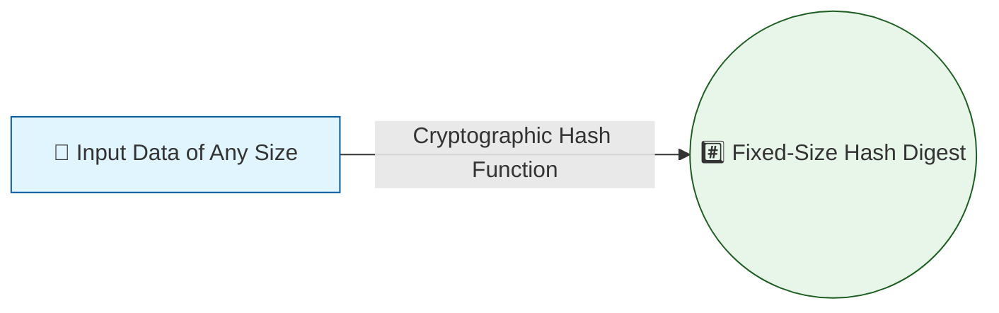

# #⃣ Cryptographic Hashing

While encryption is about hiding data so it can be revealed later with a key,
**hashing** is fundamentally different. A cryptographic hash function takes an
input of any size (from a single character to a multi-terabyte database backup)
and mathematically condenses it into a fixed-size string of characters, known as
a hash value, digest, or fingerprint.

Hashing is a **one-way function**. It is computationally infeasible to take a
hash and reverse-engineer the original input. This single property makes hashing
the backbone of data integrity, digital signatures, and secure password storage.

This exhaustive guide covers the mathematical requirements of secure hash
functions, explores the evolution of algorithms from MD5 to SHA-3, details the
specific requirements for hashing passwords, and examines real-world attacks.

## 1. Core Properties of a Cryptographic Hash Function

Not all hash functions are cryptographic. For example, a simple checksum used to
detect accidental data corruption (like CRC32) is a hash function, but it is
entirely insecure against an intentional attack.

<!-- Visual flow for #⃣ Cryptographic Hashing. -->

To be considered cryptographically secure, a hash function must possess several
strict mathematical properties:

### 1.1 Determinism

The same input must _always_, without exception, produce the exact same output.
If you hash the complete works of Shakespeare twice, the resulting hashes must
be identical.

### 1.2 🚫 Pre-image Resistance (One-Wayness)

Given a specific hash output $H$, it must be computationally infeasible to find
the original input message $M$ such that `hash(M) = H`.

- _Analogy:_ If you know the exact chemical composition of a baked cake, you
  still cannot un-bake it back into raw eggs, flour, and sugar.

### 1.3 Second Pre-image Resistance

Given a specific input $M_1$, it must be computationally infeasible to find a
different input $M_2$ such that `hash(M_1) = hash(M_2)`.

- _Why it matters:_ If an attacker intercepts your digitally signed contract
  ($M_1$), they shouldn't be able to craft a fraudulent contract ($M_2$) that
  produces the same hash, thereby spoofing your signature.

### 1.4 💥 Collision Resistance

It must be computationally infeasible to find _any_ two distinct inputs, $M_1$
and $M_2$, that hash to the exact same output: `hash(M_1) = hash(M_2)`.

- **The Pigeonhole Principle:** Because the output size is fixed (e.g., 256
  bits) but the input size is infinite, collisions _must_ exist mathematically.
  The goal of a cryptographic hash function is to make finding one so difficult
  that it would take all the world's computers billions of years to compute.
- _Note:_ Collision resistance is a stronger requirement than second pre-image
  resistance. If a hash function is not collision-resistant, it is broken.

### 1.5 ❄ The Avalanche Effect

A microscopic change to the input should result in a macroscopic, unpredictable
change to the output. Changing a single bit in a 10GB file should flip roughly
50% of the bits in the resulting hash.

- This ensures that an attacker cannot look at two similar hashes and deduce
  that their original inputs were also similar.

## 2. ⏳ The Evolution of Hash Algorithms

The history of hashing is marked by algorithms being standardized, widely
adopted, mathematically broken by cryptanalysts, and subsequently retired.

| Algorithm | Bit Size          | Status              | Notes                                                             |
| :-------- | :---------------- | :------------------ | :---------------------------------------------------------------- |
| **MD5**   | 128-bit           | ❌ **BROKEN**       | Severe collision vulnerabilities (2004). Do not use for security. |
| **SHA-1** | 160-bit           | ❌ **BROKEN**       | SHAttered attack (2017). Deprecated and rejected by browsers.     |
| **SHA-2** | 256, 384, 512-bit | ✅ **THE STANDARD** | Ubiquitous. No significant vulnerabilities found.                 |
| **SHA-3** | Variable          | ✅ **SECURE**       | Uses Sponge Construction. Designed as an alternative to SHA-2.    |

### 2.1 📉 MD5 (Message Digest 5)

Developed by Ron Rivest in 1992, MD5 produces a 128-bit hash.

- **The Fall:** In 2004, severe collision vulnerabilities were found. Today,
  using standard hardware, an attacker can generate two different files that
  have the same MD5 hash in mere seconds. It is completely unsuitable for any
  security purpose.

### 2.2 📉 SHA-1 (Secure Hash Algorithm 1)

Developed by the NSA in 1995, SHA-1 produces a 160-bit hash. It was the internet
standard for over a decade.

- **The Fall:** In 2017, Google and CWI Amsterdam announced "SHAttered,"
  successfully performing the first real-world collision attack against SHA-1.
  They generated two different PDF files with the exact same SHA-1 hash. All
  major web browsers now reject TLS certificates signed with SHA-1.

### 2.3 🌟 SHA-2 (SHA-256, SHA-384, SHA-512)

Also designed by the NSA (published in 2001), the SHA-2 family includes
algorithms that produce hashes of 224, 256, 384, or 512 bits.

- **Usage:** SHA-256 is currently the industry standard for general-purpose
  cryptographic hashing. It is used in TLS certificates, blockchain technology
  (Bitcoin uses double SHA-256), and software integrity checks.

### 2.4 SHA-3 (Keccak)

In 2012, NIST concluded a multi-year public competition to select a successor to
SHA-2. The winner was Keccak, which became SHA-3.

- **Architecture:** Unlike MD5, SHA-1, and SHA-2, which all use the
  Merkle-Damgård construction, SHA-3 uses a completely different internal
  structure called a "Sponge Construction." This ensures that if a mathematical
  breakthrough breaks the Merkle-Damgård structure, SHA-3 will remain secure.

## 3. 🔑 Password Hashing: A Different Paradigm

> ⚠️ **Warning:** It is a cardinal sin of cybersecurity to store user passwords
> in plain text. If the database is compromised, the attacker immediately has
> everyone's password.

Instead, systems store the _hash_ of the password. When a user logs in, the
system hashes the password they typed and compares it to the stored hash. If
they match, the password is correct.

**Crucial Distinction:** General-purpose hash functions like SHA-256 are
designed to be extremely fast. This is great for checking the integrity of a 4GB
ISO file, but it is **terrible** for passwords.

### 3.1 🏎 The Problem with Fast Hashes

If you hash a password with SHA-256, an attacker with a modern GPU can guess
tens of billions of passwords per second. They can perform an offline
**brute-force attack** or a **dictionary attack** to crack the hashes almost
instantly.

### 3.2 🐢 Key Derivation Functions (KDFs)

To protect passwords, we use specialized algorithms called Key Derivation
Functions or Password Hashing Algorithms. These are intentionally designed to be
**slow and resource-intensive**.

By making the hashing process take 0.5 seconds to compute, it doesn't bother a
user logging in, but it completely destroys the economics of a brute-force
attack, reducing the attacker's speed from 10 billion guesses a second to 2
guesses a second.

### 3.3 🧂 The Necessity of "Salt"

Even if a slow hash is used, an attacker could pre-compute the hashes for the
most common 10 million passwords and store them in a massive lookup table called
a **Rainbow Table**.

To defeat this, we add **Salt**.

- A salt is a long, randomly generated string of characters unique to each user.
- During registration, the salt is generated, concatenated with the password,
  and then the combination is hashed: `SlowHash(Password + Salt) = Hash`.
- The salt is stored in plain text right next to the hash in the database.
- **Effect:** Because every user has a unique salt, an attacker cannot use
  pre-computed Rainbow Tables. They must attack every single user's password
  individually.

### 3.4 🏆 Industry Standard Password Algorithms

When storing passwords, you must use one of the following algorithms:

| Algorithm  | Characteristics                                            | Recommendation           |
| :--------- | :--------------------------------------------------------- | :----------------------- |
| **Argon2** | Memory-hard, highly parameterized (protects vs GPUs/ASICs) | 🌟 **Gold Standard**     |
| **Bcrypt** | Built-in work factor (cost) to slow it down over time      | ✅ **Excellent**         |
| **scrypt** | Memory-hard (requires lots of RAM)                         | ✅ **Good**              |
| **PBKDF2** | CPU-intensive, not memory-hard                             | ❌ **Avoid if possible** |

**DO NOT USE:** plain SHA-256, SHA-1, or MD5 for passwords under any
circumstances.

## 4. 🏷 Message Authentication Codes (MACs)

A standard hash (like SHA-256) provides data integrity, but it does _not_
provide authentication. If you download a file and its hash from a website, an
attacker who compromised the website could replace both the file and the hash
with their own malicious versions. When you verify the hash, it will match, but
you are still compromised.

To prove that a message comes from a specific sender and hasn't been altered, we
use a **Message Authentication Code (MAC)**.

### 4.1 🤝 HMAC (Hash-based Message Authentication Code)

HMAC combines a cryptographic hash function with a secret cryptographic key.

- `HMAC = hash(SecretKey + Message)` (Oversimplified; the actual construction is
  mathematically rigorous to prevent length-extension attacks).
- **How it works:** Alice and Bob share a secret key. Alice calculates the HMAC
  of her message and sends both the message and the HMAC to Bob. Bob uses the
  shared key to calculate his own HMAC of the received message. If the HMACs
  match, Bob knows the message hasn't been altered AND that it definitely came
  from Alice (since only Alice possesses the secret key).
- **Use Cases:** JSON Web Tokens (JWTs) signatures, API authentication, and
  within AEAD ciphers like AES-GCM.

## 5. ⚠ Practical Implementation and Pitfalls

1.  **Length Extension Attacks:** Naively creating a MAC by just hashing a key
    and a message `hash(key || message)` using MD5, SHA-1, or SHA-2 is
    vulnerable to length extension attacks. An attacker can append data to the
    end of the message and generate a valid signature without knowing the key.
    Always use the standardized HMAC construction.
2.  **Timing Attacks in Comparison:** When your server compares a user-supplied
    hash against the stored hash, do not use a standard string comparison
    (`==`). Standard operators return `false` the instant they find a mismatched
    character, leaking timing information. **Always use constant-time comparison
    functions** provided by your crypto library.
3.  **Algorithm Agility:** Hardcoding hash algorithms into a database schema is
    dangerous. Store the algorithm version and parameters alongside the hash so
    that the system can seamlessly upgrade users to stronger algorithms during
    their next login.

## 🎉 Summary

Cryptographic hashing is the silent enforcer of digital truth. From ensuring
that a downloaded operating system hasn't been tampered with, to protecting
millions of user passwords from offline cracking, hash functions provide the
irrefutable mathematical proof required in a zero-trust environment.
Understanding the distinction between fast general-purpose hashes and slow
password hashes is one of the most critical concepts for any software engineer
building secure systems.

## Quick Reference

| Part | Revision point |
|---|---|
| Input | Know the allowed values and constraints. |
| Core idea | Identify the invariant, recurrence, or search rule. |
| Complexity | Track time and space costs. |
| Edge cases | Test empty, minimum, maximum, and duplicate inputs. |
