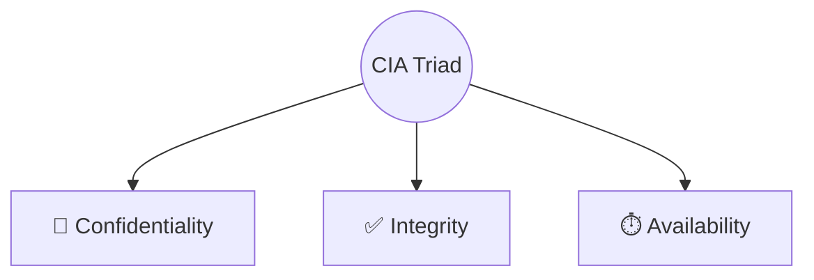

# Introduction to Cryptography

Cryptography is the cornerstone of modern digital security. It is the science
and art of protecting information by transforming it (encrypting it) into a
secure, unreadable format, called ciphertext. Only those who possess a secret
key can decipher (or decrypt) the message into plaintext. This comprehensive
guide explores the depth and breadth of cryptography, covering its historical
roots, core principles, types of cryptographic algorithms, cryptanalysis, and
the future landscape.

## 1. 🕵‍♂ What is Cryptography?

At its core, cryptography is about communication in the presence of adversaries.
It encompasses the principles and methods of transforming an intelligible
message into one that is unintelligible, and then retransforming that message
back to its original form. Cryptography is a branch of both mathematics and
computer science and is affiliated closely with information theory, computer
security, and engineering.

In the digital age, cryptography ensures that private communications remain
private, that digital identities can be verified, and that the integrity of data
across public and private networks is maintained.

<!-- Visual flow for Introduction to Cryptography. -->

### 1.1 🕵‍♀ Cryptography vs. Steganography

While cryptography aims to conceal the contents of a message, steganography aims
to conceal the very existence of the message.

| Feature        | 🔐 Cryptography                          | 🖼️ Steganography                                    |
| :------------- | :--------------------------------------- | :-------------------------------------------------- |
| **Goal**       | Hide the _meaning_ of the message        | Hide the _existence_ of the message                 |
| **Technique**  | Mathematical transformation (Encryption) | Embedding data in other media (e.g., LSB in images) |
| **Visibility** | Ciphertext is visible, but unreadable    | The message is completely invisible to observers    |

> **Note:** Modern security systems often use both techniques in tandem, but
> this guide will focus strictly on cryptography.

## 2. 📜 Historical Context: The Evolution of Secrecy

The history of cryptography is a fascinating journey of continuous escalation
between codemakers and codebreakers.

### 2.1 🏛 Ancient Cryptography

- **The Scytale (Sparta, ~400 BC):** The Spartans used a transposition cipher
  called a scytale. A strip of parchment was wrapped around a cylinder of
  specific diameter. The message was written across the wrapped parchment. When
  unrolled, it appeared as random letters. It could only be read if wrapped
  around a cylinder of the exact same diameter.
- **The Caesar Cipher (Rome, ~50 BC):** Julius Caesar used a simple substitution
  cipher to communicate with his generals. Each letter in the plaintext was
  shifted a certain number of places down the alphabet. A shift of 3 means 'A'
  becomes 'D'.
  - _Mathematical representation:_ `E(x) = (x + n) mod 26`
  - _Vulnerability:_ Easily broken with frequency analysis, as the distribution
    of letters remains unchanged.

### 2.2 🏰 The Middle Ages and the Renaissance

- **Frequency Analysis:** Developed by the Arab mathematician Al-Kindi in the
  9th century, frequency analysis was the first major breakthrough in
  cryptanalysis. It exploited the fact that certain letters (like 'E' in
  English) appear more frequently than others.
- **The Vigenère Cipher (16th Century):** To combat frequency analysis,
  polyalphabetic substitution was invented. The Vigenère cipher uses a keyword
  to apply multiple Caesar shifts across a message. For centuries, it was
  considered _le chiffre indéchiffrable_ (the indecipherable cipher).
  - _Vulnerability:_ Eventually broken in the 19th century by Charles Babbage
    and Friedrich Kasiski, who found ways to determine the length of the
    keyword.

### 2.3 🌍 The World Wars and the Enigma Machine

The 20th century saw the mechanization of cryptography. The most famous example
is the German Enigma machine used during World War II. It used a series of
electromechanical rotors to implement an incredibly complex polyalphabetic
substitution cipher that changed with every keystroke.

- **The Turning Point:** Polish mathematicians, followed by Alan Turing and his
  team at Bletchley Park, successfully broke the Enigma cipher using a
  combination of mathematical logic (the Bombe machines), captured materials,
  and procedural flaws by the German operators.

### 2.4 💻 The Digital Era

The invention of the computer revolutionized cryptography. Cryptography moved
from linguistic manipulation (shifting letters) to mathematical manipulation of
binary data. The development of the Data Encryption Standard (DES) in the 1970s
and the revolutionary invention of Public Key Cryptography (RSA) by Diffie,
Hellman, Rivest, Shamir, and Adleman brought cryptography to the masses.

## 3. Core Principles of Information Security (The CIA Triad)

Cryptography is a tool used to achieve broader information security goals, most
commonly modeled as the CIA triad.

<!-- Visual flow for Introduction to Cryptography. -->

### 3.1 🤫 Confidentiality

Confidentiality ensures that information is accessible only to those authorized
to have access. In cryptography, this is achieved through encryption. Even if an
attacker intercepts a data packet, they cannot read it without the decryption
key.

- _Mechanism:_ Symmetric Encryption (AES), Asymmetric Encryption (RSA, ECC).

### 3.2 ✅ Integrity

Integrity guarantees that information has not been altered, added to, or deleted
by unauthorized parties. It ensures the data remains accurate and trustworthy.

- _Mechanism:_ Cryptographic Hash Functions (SHA-256), Message Authentication
  Codes (MACs).

### 3.3 ⏱ Availability

Availability ensures that systems, applications, and data are accessible to
authorized users when needed. While cryptography doesn't directly provide
availability (and can sometimes hinder it if keys are lost or processing is too
slow), secure systems rely on cryptography to protect the infrastructure that
provides availability.

### 3.4 🤝 Non-Repudiation and Authentication

Beyond the CIA triad, cryptography provides two other crucial services:

- **Authentication:** Verifying the identity of a user, process, or device.
  (e.g., Digital Certificates).
- **Non-repudiation:** Ensuring that a party to a transaction cannot deny having
  participated in that transaction. (e.g., Digital Signatures).

## 4. 📚 Fundamental Terminology

To deeply understand cryptography, one must master its vocabulary:

| Term                             | Definition                                                                                                               |
| :------------------------------- | :----------------------------------------------------------------------------------------------------------------------- |
| **Plaintext (or Cleartext)**     | 📄 The original, intelligible message or data.                                                                           |
| **Ciphertext**                   | 🔒 The transformed, unintelligible message or data.                                                                      |
| **Cipher (or Algorithm)**        | 🧮 The mathematical function or rules used for encryption and decryption.                                                |
| **Key**                          | 🔑 A piece of information (usually a string of bits) that determines the functional output of a cryptographic algorithm. |
| **Encryption (or Encipherment)** | 🔐 The process of converting plaintext into ciphertext using a cipher and a key.                                         |
| **Decryption (or Decipherment)** | 🔓 The process of converting ciphertext back into plaintext using a cipher and a key.                                    |
| **Cryptanalysis**                | 🕵️‍♂️ The study of mathematical techniques for attempting to defeat cryptographic techniques. (Codebreaking).               |
| **Cryptology**                   | 🧠 The overarching branch of mathematics encompassing both cryptography and cryptanalysis.                               |

## 5. 🔑 Kerckhoffs's Principle and Shannon's Maxim

One of the most important concepts in modern cryptography is **Kerckhoffs's
Principle**, formulated in the 19th century by Auguste Kerckhoffs:

> **Kerckhoffs's Principle:** "A cryptographic system should be secure even if
> everything about the system, except the key, is public knowledge."

### 5.1 Why Open Algorithms are Better

Historically, "security through obscurity" (keeping the algorithm secret) was
common. Modern cryptography rejects this. Algorithms (like AES or RSA) are
published openly and heavily scrutinized by the global cryptographic community.

- **Scrutiny breeds security:** If a weakness exists, thousands of
  mathematicians trying to break it are more likely to find it (and fix it) than
  a small proprietary team.
- **The secret is the key:** The entire security of the system rests on the
  secrecy of the key, not the algorithm.

### 5.2 👁 Shannon's Maxim

Claude Shannon, the father of information theory, restated Kerckhoffs's
principle more bluntly:

> **Shannon's Maxim:** "The enemy knows the system."

> ⚠️ **Warning:** When designing any secure system, you must assume the attacker
> has the source code, the blueprints, and full knowledge of your cryptographic
> protocols. Never rely on obscurity!

## 6. 🧮 Types of Cryptographic Algorithms

Modern cryptographic systems are generally divided into three main categories,
each serving a different purpose.

| Type               | Key Usage                       | Characteristics                                                      | Primary Use Cases                   | Examples               |
| :----------------- | :------------------------------ | :------------------------------------------------------------------- | :---------------------------------- | :--------------------- |
| **Symmetric-Key**  | 🔑 Same key for encrypt/decrypt | Very fast, efficient for bulk data. Key distribution is challenging. | Bulk data encryption, file storage. | AES, DES, ChaCha20     |
| **Asymmetric-Key** | 🗝️ Public & Private key pair    | Slower, computationally intensive. Solves key distribution.          | Key exchange, Digital Signatures.   | RSA, ECC (Curve25519)  |
| **Hash Functions** | 🚫 No key (typically)           | One-way function, deterministic, collision-resistant.                | Data integrity, password storage.   | SHA-256, SHA-3, BLAKE2 |

## 7. ⚔ Cryptanalysis and Types of Attacks

Cryptanalysts (and attackers) use various methods to break cryptographic
systems. Understanding these attacks is crucial for designing secure systems.

- 🔢 **Mathematical Attacks:** These attacks focus on finding flaws in the
  underlying mathematical algorithm of the cipher. _(Example: Shor's algorithm,
  which can theoretically break RSA and ECC)._
- 🔨 **Brute-Force Attacks:** The most basic attack: trying every possible key
  until the correct one is found.
  - _Defense:_ Use large enough keys. For a 256-bit key, there are 2^256
    combinations—impervious to classical brute force.
- 📊 **Analytical Attacks:** (e.g., Differential Cryptanalysis) These involve
  analyzing pairs of plaintext and ciphertext to find how differences in the
  plaintext affect the ciphertext.
- ⚡ **Side-Channel Attacks:** Exploiting physical implementations rather than
  mathematics.
  - _Timing Attacks:_ Measuring how long a system takes to perform an operation.
  - _Power Analysis:_ Monitoring power consumption during encryption.
  - _Electromagnetic Attacks:_ Measuring emitted radiation.
- 🎯 **Known-Plaintext and Chosen-Plaintext Attacks:**
  - _Known-Plaintext:_ Attacker has both plaintext and ciphertext and tries to
    deduce the key.
  - _Chosen-Plaintext:_ Attacker chooses arbitrary plaintexts to be encrypted
    and analyzes the resulting ciphertexts.

### 8.1 🛜 The WEP Disaster

Wired Equivalent Privacy (WEP) was an early Wi-Fi security protocol. It used the
RC4 stream cipher but implemented it poorly, particularly regarding
Initialization Vectors (IVs).

- **The Flaw:** The small IV size led to IV reuse. Attackers could collect
  enough packets to perform statistical attacks and easily recover the WEP key
  in minutes.
- **The Lesson:** Even a strong algorithm can be rendered useless by poor
  protocol design.

### 8.2 The Debian PRNG Bug (2008)

A maintainer for the Debian Linux distribution made a seemingly harmless change
to the OpenSSL package to suppress a warning from a static analysis tool.

- **The Flaw:** This change accidentally removed the entropy (randomness) source
  for the pseudo-random number generator (PRNG).
- **The Impact:** For two years, all SSH keys and SSL certificates generated on
  Debian systems were predictable, drawing from a pool of only 32,767 possible
  keys.
- **The Lesson:** Cryptography is incredibly fragile. "Fixing" warnings in
  cryptographic code without deep understanding can be catastrophic.

## 9. The Future of Cryptography

The field of cryptography is on the precipice of a massive paradigm shift.

### 9.1 ⚛ Quantum Computing and the Threat to RSA/ECC

Quantum computers leverage principles of quantum mechanics to perform certain
calculations exponentially faster than classical computers.

- **Shor's Algorithm:** A quantum algorithm that can efficiently factor large
  prime numbers and solve discrete logarithms, instantly breaking RSA, ECC, and
  Diffie-Hellman.
- **The Timeline:** Experts believe a Cryptographically Relevant Quantum
  Computer (CRQC) could be built within the next 10-20 years.

### 9.2 Post-Quantum Cryptography (PQC)

In response, the National Institute of Standards and Technology (NIST) has been
standardizing new, quantum-resistant algorithms.

- PQC relies on hard mathematical problems like:
  - **Lattice-based cryptography** (e.g., CRYSTALS-Kyber)
  - **Hash-based cryptography**
  - **Code-based cryptography**
- The transition to PQC will be a monumental infrastructure upgrade.

### 9.3 ☁ Homomorphic Encryption

Currently, to process encrypted data, you must first decrypt it, exposing it to
potential theft.

- **Fully Homomorphic Encryption (FHE)** allows computations to be performed
  directly on encrypted data without ever decrypting it. The result remains
  encrypted!
- **Challenge:** FHE is computationally extremely expensive, but optimization is
  a major area of research.

## 10. ✅ Best Practices and Practical Implications

For developers and security professionals, implementing cryptography requires
strict adherence to best practices:

1.  🛑 **Never Roll Your Own Crypto:** Designing secure algorithms is incredibly
    hard. Always use established, widely vetted libraries (like libsodium, Tink,
    or OS-level APIs).
2.  ✨ **Use Modern Algorithms:** Deprecate old standards (MD5, SHA-1, DES,
    RC4). Use AES-GCM for symmetric, ECC (Curve25519) for asymmetric, and
    SHA-256/SHA-3 for hashing.
3.  🏦 **Manage Keys Securely:** Use Hardware Security Modules (HSMs) or Key
    Management Services (KMS). Never hardcode keys in source code.
4.  🎲 **Understand Entropy:** Ensure your system has access to a strong
    Cryptographically Secure Pseudo-Random Number Generator (CSPRNG).
5.  ✅ **Authenticate Your Ciphertexts:** Always use Authenticated Encryption
    with Associated Data (AEAD) like AES-GCM or ChaCha20-Poly1305.
6.  📰 **Stay Informed:** Follow organizations like NIST and the IETF to stay
    updated on new standards.

> **Note:** The security of any cryptographic system is only as strong as its
> weakest link, which is often key management or implementation details, not the
> algorithm itself.

---

### 🎉 Conclusion

Cryptography is a vast, mathematically rigorous, and essential discipline. It is
the invisible shield that protects the global digital economy, personal privacy,
and national security. From the simple substitution ciphers of ancient Rome to
the cutting-edge post-quantum algorithms of tomorrow, the battle between
codemakers and codebreakers continues to drive innovation. Understanding these
core concepts is the first critical step for anyone working in cybersecurity or
software engineering.

## Quick Reference

| Part | Revision point |
|---|---|
| Input | Know the allowed values and constraints. |
| Core idea | Identify the invariant, recurrence, or search rule. |
| Complexity | Track time and space costs. |
| Edge cases | Test empty, minimum, maximum, and duplicate inputs. |
