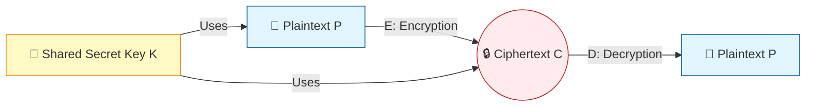
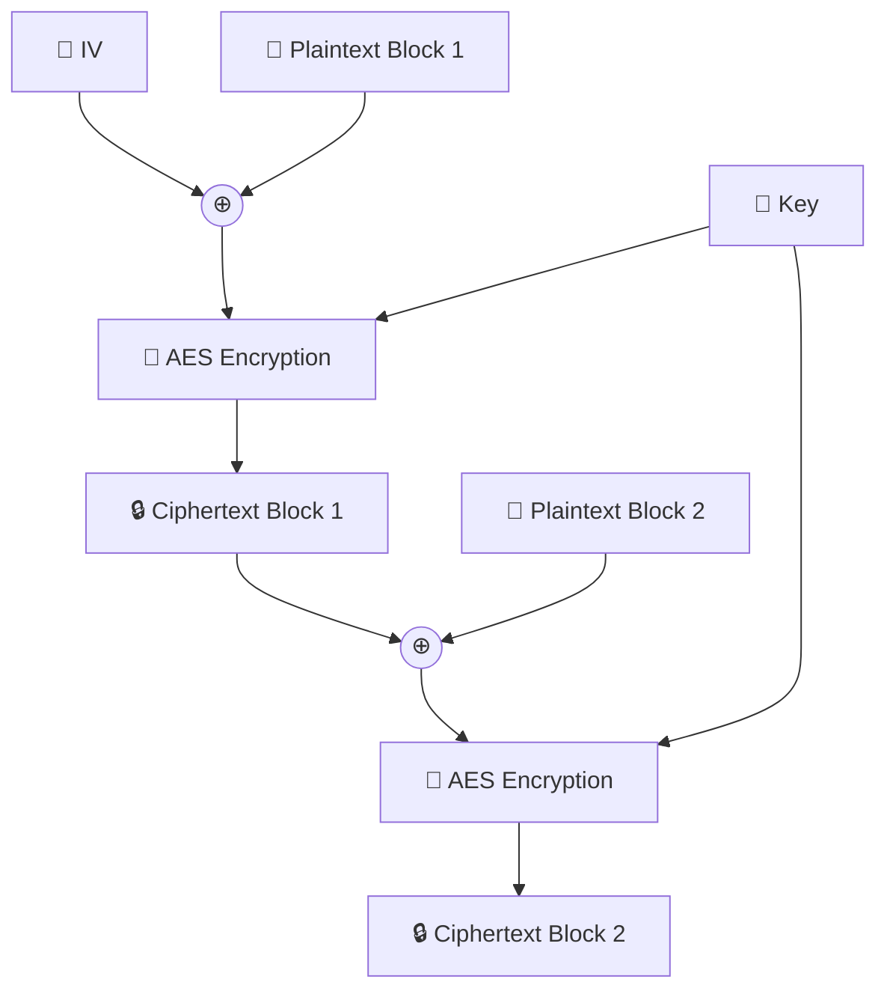

# Symmetric Encryption

Symmetric encryption, also known as secret-key cryptography, is the oldest and
most widely used method for encrypting data. It relies on a single, shared
secret key to both encrypt the plaintext into ciphertext and decrypt the
ciphertext back into plaintext. Because of its computational efficiency, it is
the workhorse of modern cryptography, used to secure everything from local hard
drives to internet traffic.

This comprehensive guide will break down how symmetric encryption works, explore
the most prominent algorithms (especially AES), delve into block cipher modes of
operation, and outline the best practices for using symmetric cryptography
securely.

## 1. ⚙ How Symmetric Encryption Works

In a symmetric cryptosystem, the sender and the receiver must agree on a shared
secret key before they can communicate securely.

<!-- Visual flow for Symmetric Encryption. -->


The process can be mathematically represented as:

- **Encryption:** `C = E(K, P)` where `C` is ciphertext, `E` is the encryption
  algorithm, `K` is the secret key, and `P` is the plaintext.
- **Decryption:** `P = D(K, C)` where `D` is the decryption algorithm, ensuring
  that `D(K, E(K, P)) = P`.

### 1.1 🤫 The Core Requirement: Secrecy

The absolute, fundamental requirement of symmetric encryption is that the key
`K` must remain completely secret. If an attacker gains access to the key, the
entire system is compromised, and they can read all past and future messages
encrypted with that key.

### 1.2 The Key Distribution Problem

The primary challenge of symmetric encryption is key distribution. How do Alice
and Bob safely share the secret key over an insecure network (like the internet)
without an attacker (Eve) intercepting it?

- _Historical solutions:_ Trusted couriers, diplomatic pouches, face-to-face
  meetings.
- _Modern solution:_ Asymmetric encryption (like RSA or Diffie-Hellman) is used
  to securely establish a shared symmetric key, which is then used for the bulk
  of the communication.

## 2. 🧱 Block Ciphers vs. 🌊 Stream Ciphers

Symmetric algorithms are generally divided into two main categories based on how
they process the data.

| Feature       | 🧱 Block Ciphers                                        | 🌊 Stream Ciphers                                                   |
| :------------ | :------------------------------------------------------ | :------------------------------------------------------------------ |
| **Operation** | Encrypts data in fixed-size blocks (e.g., 128 bits)     | Encrypts data bit-by-bit or byte-by-byte continuously               |
| **Padding**   | Requires padding if data isn't a multiple of block size | No padding required                                                 |
| **Mechanics** | Uses substitution and permutation networks (e.g., SPN)  | Generates a continuous pseudo-random keystream XORed with plaintext |
| **Examples**  | AES, DES, Blowfish, Twofish                             | RC4 (deprecated), ChaCha20                                          |

> ⚠️ **Warning:** For stream ciphers, the keystream must _never_ be reused. If
> the same keystream is used to encrypt two different messages, an attacker can
> XOR the two ciphertexts together to eliminate the keystream and reveal the XOR
> of the two plaintexts, which is often enough to read both messages.

## 3. The Advanced Encryption Standard (AES)

AES is the gold standard of symmetric encryption. It was adopted by the U.S.
government in 2001 after a public competition to replace the aging DES. The
winning algorithm, originally named Rijndael (created by Belgian cryptographers
Vincent Rijmen and Joan Daemen), became AES.

### 3.1 📏 Key Sizes and Block Size

AES operates strictly on **128-bit blocks** of data. However, it supports three
different key sizes, offering varying levels of security and computational cost:

| Algorithm   | Key Size | Number of Rounds | Security Level               |
| :---------- | :------- | :--------------- | :--------------------------- |
| **AES-128** | 128-bit  | 10 rounds        | Standard security, very fast |
| **AES-192** | 192-bit  | 12 rounds        | High security                |
| **AES-256** | 256-bit  | 14 rounds        | Top Secret government data   |

### 3.2 How AES Works (The Rijndael Design)

AES is a Substitution-Permutation Network (SPN). It takes the 128-bit block of
plaintext, arranges it into a 4x4 grid of bytes (the "state"), and applies a
series of transformations ("rounds") over and over.

A single round of AES consists of four distinct steps:

1.  **SubBytes (Substitution):** Every byte in the state is replaced with
    another byte using a lookup table called the S-box. This provides
    _non-linearity_, making it highly resistant to mathematical attacks.
2.  **ShiftRows (Permutation):** The rows of the 4x4 state grid are shifted
    cyclically to the left. The 1st row is not shifted, the 2nd is shifted by 1
    byte, the 3rd by 2 bytes, and the 4th by 3 bytes. This diffuses the data.
3.  **MixColumns (Permutation):** Each column of the state grid is
    mathematically mixed together using a linear transformation. This ensures
    that a change in one input byte affects all four output bytes of the column.
    (This step is skipped in the final round).
4.  **AddRoundKey:** The state is XORed with a "round key" derived from the main
    secret key using a key schedule algorithm.

_Code Example: High-level Python (using cryptography library) demonstrating
AES-256 encryption:_

# Basic example showing the core idea.
```python
from cryptography.hazmat.primitives.ciphers import Cipher, algorithms, modes
from cryptography.hazmat.primitives import padding
from cryptography.hazmat.backends import default_backend
import os

## 1. Generate a 256-bit (32-byte) random key
key = os.urandom(32)

## 2. Generate a 128-bit (16-byte) Initialization Vector (IV) for CBC mode
iv = os.urandom(16)

## 3. Create the Cipher object using AES and CBC mode
cipher = Cipher(algorithms.AES(key), modes.CBC(iv), backend=default_backend())
encryptor = cipher.encryptor()

## 4. Data to encrypt (must be padded to 128-bit blocks)
plaintext = b"This is a highly secret message that needs encryption."
padder = padding.PKCS7(128).padder()
padded_data = padder.update(plaintext) + padder.finalize()

## 5. Encrypt the data
ciphertext = encryptor.update(padded_data) + encryptor.finalize()

print(f"Ciphertext (hex): {ciphertext.hex()}")
```

## 4. Block Cipher Modes of Operation

Because block ciphers like AES only encrypt fixed-size blocks (e.g., 16 bytes at
a time), we need a "mode of operation" to define how to encrypt messages that
are longer than one block. Choosing the wrong mode can catastrophically destroy
security.

| Mode                      | Acronym | Description                                                                           | Verdict                         |
| :------------------------ | :------ | :------------------------------------------------------------------------------------ | :------------------------------ |
| **Electronic Codebook**   | ECB     | Encrypts each block independently. Identical plaintexts yield identical ciphertexts.  | ❌ **DO NOT USE**               |
| **Cipher Block Chaining** | CBC     | XORs each plaintext block with the previous ciphertext block. Requires an IV.         | ⚠️ Use with caution (needs MAC) |
| **Counter Mode**          | CTR     | Turns a block cipher into a stream cipher using an incrementing counter.              | ⚠️ Use with caution (needs MAC) |
| **Galois/Counter Mode**   | GCM     | Combines CTR mode with GMAC for Authenticated Encryption with Associated Data (AEAD). | ✅ **THE STANDARD**             |

### 4.1 ⛓ Cipher Block Chaining (CBC) Mechanics

<!-- Visual flow for Symmetric Encryption. -->


> **Note:** AES-GCM is the modern standard used in TLS 1.3, SSH, and IPsec.
> Always prefer AEAD modes over plain encryption, as they guarantee both
> confidentiality AND integrity. An attacker might not be able to read data
> encrypted with standard modes like CBC or CTR, but they could theoretically
> alter the ciphertext in transit (bit-flipping attacks). AEAD prevents this.

## 5. ChaCha20 and Poly1305

While AES is hardware-accelerated on most modern CPUs (via AES-NI instructions),
making it incredibly fast, it can be slower on low-power devices (like older
smartphones or IoT devices) that lack specialized hardware.

Enter **ChaCha20**, a modern stream cipher designed by Daniel J. Bernstein.

- **Performance:** ChaCha20 is heavily optimized for software implementation. On
  devices without AES-NI hardware, ChaCha20 is significantly faster and more
  power-efficient than AES.
- **AEAD Pairing:** ChaCha20 is almost always used in conjunction with the
  **Poly1305** authenticator to provide AEAD (similar to AES-GCM).
- **Adoption:** ChaCha20-Poly1305 is standardized in TLS 1.3 and is the primary
  cipher suite used by Google on Android devices and Chrome browsers
  communicating with Google servers.

### 6.1 🎭 The Padding Oracle Attack (Against CBC)

If a server uses AES-CBC and returns a different error message depending on
whether the decryption failed due to "invalid padding" or "incorrect MAC", an
attacker can use this as an "oracle". By repeatedly sending slightly modified
ciphertext and observing the server's response, the attacker can systematically
decrypt the entire message without knowing the key.

- _Mitigation:_ Always use Encrypt-then-MAC, or better yet, use an AEAD mode
  like AES-GCM which verifies integrity _before_ decrypting or checking padding.

### 6.2 💥 The Keystream Reuse Disaster (WEP & MS-PPTP)

As mentioned, if a stream cipher (or CTR mode) reuses an IV/Nonce with the same
key, it is fatal.

- In early implementations of Microsoft's PPTP VPN protocol, the same key was
  used to encrypt data in both directions (client-to-server and
  server-to-client) using the RC4 stream cipher. If both sides sent data
  simultaneously, they used the exact same keystream, allowing attackers to
  trivially recover the traffic.

## 7. ✅ Best Practices for Implementing Symmetric Encryption

When designing systems that utilize symmetric cryptography, adhere strictly to
these rules:

1.  🛡️ **Prefer Authenticated Encryption (AEAD):** Always use AES-GCM or
    ChaCha20-Poly1305. Never use raw AES-CBC or AES-CTR without calculating and
    verifying an HMAC (Hash-based Message Authentication Code).
2.  🚫 **Never Hardcode Keys:** Keys must never be stored in source code
    repositories (like GitHub). They should be managed using environment
    variables at runtime, or ideally, through a dedicated Key Management System
    (KMS) like AWS KMS or HashiCorp Vault.
3.  🎲 **Use Unique IVs/Nonces:** An Initialization Vector or Nonce must be
    uniquely generated for _every single encryption operation_. They do not need
    to be secret (they are transmitted alongside the ciphertext), but they must
    be unique. Using a secure random number generator (CSPRNG) to create a
    96-bit or 128-bit IV is standard practice.
4.  🔄 **Rotate Keys Periodically:** Implement Key Rotation strategies. If a key
    is compromised, rotating to a new key limits the amount of data exposed.
    Cryptographic standards (like NIST SP 800-38D for GCM) dictate maximum
    limits on how much data can be encrypted under a single key before it must
    be rotated.
5.  📚 **Use Established Libraries:** Do not attempt to implement AES or
    ChaCha20 from scratch. Even minor implementation errors can create timing
    side-channels that leak the key. Use thoroughly audited libraries like
    Libsodium, Tink, ring (Rust), or the standard cryptography libraries
    provided by your language runtime (e.g., Node's `crypto` module, Java's
    `javax.crypto`).

## 🎉 Summary

Symmetric encryption provides the speed and efficiency required to secure the
vast majority of the world's digital data. By understanding the differences
between block and stream ciphers, the critical importance of modes of operation
(especially AEAD), and the necessity of rigorous key management, developers can
build robust systems that protect sensitive information against sophisticated
attacks.

## Quick Reference

| Part | Revision point |
|---|---|
| Input | Know the allowed values and constraints. |
| Core idea | Identify the invariant, recurrence, or search rule. |
| Complexity | Track time and space costs. |
| Edge cases | Test empty, minimum, maximum, and duplicate inputs. |
