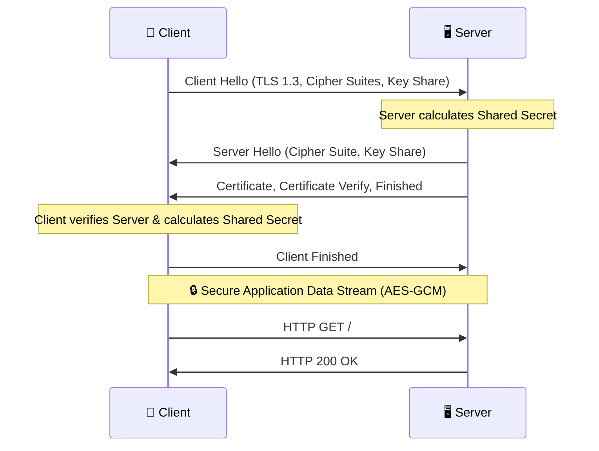

# Transport Layer Security (TLS) / SSL

When you see the padlock icon in your browser or type `https://` instead of
`http://`, you are relying on **Transport Layer Security (TLS)**. Historically
known as **Secure Sockets Layer (SSL)**, this protocol is the absolute
foundation of secure communication on the internet.

TLS provides the three core pillars of security—Confidentiality, Integrity, and
Authentication—over an otherwise insecure network (the internet). It is a
remarkable engineering achievement that seamlessly combines symmetric
encryption, asymmetric encryption, cryptographic hashing, and digital signatures
into a single, automated protocol.

This comprehensive guide dissects how TLS works, explores the intricate details
of the TLS handshake, explains the critical concept of Perfect Forward Secrecy,
and traces the evolution of the protocol up to the modern TLS 1.3 standard.

## 1. The Objectives of TLS

TLS operates between the Transport Layer (TCP) and the Application Layer (HTTP,
SMTP, IMAP) in the OSI model. When a TCP connection is established, TLS steps in
to secure it before any application data is sent.

It guarantees three things:

1.  **🆔 Authentication:** You are mathematically certain you are communicating
    with `google.com` and not an imposter intercepting your traffic
    (Man-in-the-Middle attack).
2.  **🤫 Confidentiality (Encryption):** Anyone eavesdropping on the Wi-Fi or
    routing infrastructure can only see encrypted gibberish, not your passwords
    or credit card numbers.
3.  **✅ Integrity:** The data received is exactly what was sent. An attacker
    cannot flip bits in the encrypted stream to alter the message without the
    receiver instantly detecting it.

## 2. 🤝 The TLS Handshake (How it Works)

The TLS Handshake is the complex, multi-step negotiation that occurs the moment
a client connects to a server. During this phase, the client and server agree on
cryptographic algorithms, authenticate each other, and generate the shared
secret keys needed for the session.

_(Note: The following describes the modernized TLS 1.3 handshake. Older versions
required more round trips)._

<!-- Visual flow for Transport Layer Security (TLS) / SSL. -->

### 🛠 Step 1: Client Hello

The client initiates the connection by sending a "Client Hello" message
containing:

- Highest supported TLS version.
- List of supported **Cipher Suites**.
- A client nonce.
- **Key Share:** The client's public Diffie-Hellman key.

### 🛠 Step 2: Server Hello

The server responds with a "Server Hello" message containing:

- Chosen TLS version and **Cipher Suite**.
- A server nonce.
- **Key Share:** The server's public Diffie-Hellman key. _(Shared secret can now
  be calculated!)_

### 🛠 Step 3: Server Authentication and Finished

Now encrypting messages using the shared secret, the server sends:

- **Certificate:** The server's Digital Certificate (with its public RSA/ECC
  key).
- **Certificate Verify:** A digital signature generated by the server's
  _private_ key over the handshake.
- **Server Finished:** A MAC confirming the handshake is complete.

### 🛠 Step 4: Client Verification and Finished

The client receives the messages and:

1.  Verifies the CA's signature on the server's certificate.
2.  Verifies the server's digital signature.
3.  Sends a "Client Finished" message.

### 🛠 Step 5: Application Data

The handshake is complete. Both sides securely stream Application Data using the
agreed symmetric cipher.

## 3. Cipher Suites Explained

A cipher suite specifies the exact combination of cryptographic algorithms for
the connection.

A typical TLS 1.2 suite: `TLS_ECDHE_RSA_WITH_AES_128_GCM_SHA256`

- **Protocol:** `TLS`
- **Key Exchange:** `ECDHE` (Elliptic Curve Diffie-Hellman Ephemeral)
- **Authentication:** `RSA`
- **Symmetric Cipher:** `AES_128_GCM`
- **MAC/Hashing:** `SHA256`

In TLS 1.3, key exchange and authentication are negotiated separately, so suites
are simpler: `TLS_AES_256_GCM_SHA384`

## 4. 🕵‍♂ Perfect Forward Secrecy (PFS)

Perfect Forward Secrecy is arguably the most critical security feature of modern
TLS.

- **The Old Way (RSA Key Exchange):** The client encrypted the session key with
  the server's public RSA key. If an attacker stole the server's private key
  years later, they could decrypt _all_ historical recorded traffic.
- **The Modern Way (ECDHE):** The long-term RSA/ECC key is _only_ used for
  authentication. The actual encryption keys are generated using Ephemeral
  Diffie-Hellman. New parameters are generated for _every single connection_ and
  then destroyed. Even if an attacker steals the server's private key today,
  yesterday's traffic remains secure because the keys are gone forever.

## 5. ⏳ The Evolution: SSL vs. TLS

> ⚠️ **Warning:** The terms SSL and TLS are often used interchangeably, but
> strictly speaking, SSL is dead and highly vulnerable.

| Protocol        | Year      | Status                 | Notes                                                |
| :-------------- | :-------- | :--------------------- | :--------------------------------------------------- |
| **SSL 2.0/3.0** | 1995/1996 | ❌ **Deprecated**      | Highly vulnerable (e.g., POODLE attack).             |
| **TLS 1.0/1.1** | 1999/2006 | ❌ **Deprecated**      | Formally deprecated in 2020.                         |
| **TLS 1.2**     | 2008      | ✅ **Acceptable**      | Current minimum standard. Prone to misconfiguration. |
| **TLS 1.3**     | 2018      | 🌟 **Modern Standard** | 1-RTT, removed all weak cryptography.                |

### 5.1 Why TLS 1.3 is a Massive Leap Forward

1.  **Faster Handshakes (1-RTT):** Requires only one round-trip instead of two.
2.  **Removal of Weak Cryptography:** Ruthlessly eliminated support for RSA key
    exchange, weak ciphers (RC4, DES), non-AEAD modes (CBC), and weak hashing
    (MD5, SHA-1).
3.  **Encrypted Client Hello (ECH):** Encrypts the domain name being connected
    to, vastly improving privacy.

## 6. Mutual TLS (mTLS)

Standard TLS is one-way: the client verifies the server. What if the server
needs to verify the client?

This is **Mutual TLS (mTLS)**. The client must present its own Digital
Certificate and prove ownership of its private key.

- **Use Cases:** Rarely used for public websites, but it is the gold standard
  for **Zero Trust Architecture** and microservices (e.g., internal billing
  service talking to a database).

## 🎉 Summary

TLS is the unsung hero of the digital age. By orchestrating a complex dance of
asymmetric authentication, ephemeral key exchange, and blazing-fast symmetric
encryption, it allows us to transmit our most sensitive data across a network
inherently designed to be open and unsecure. The deployment of TLS 1.3 marks a
critical maturation point, removing decades of cryptographic baggage and
delivering a protocol that is both mathematically robust and incredibly fast.

## Quick Reference

| Part | Revision point |
|---|---|
| Input | Know the allowed values and constraints. |
| Core idea | Identify the invariant, recurrence, or search rule. |
| Complexity | Track time and space costs. |
| Edge cases | Test empty, minimum, maximum, and duplicate inputs. |
