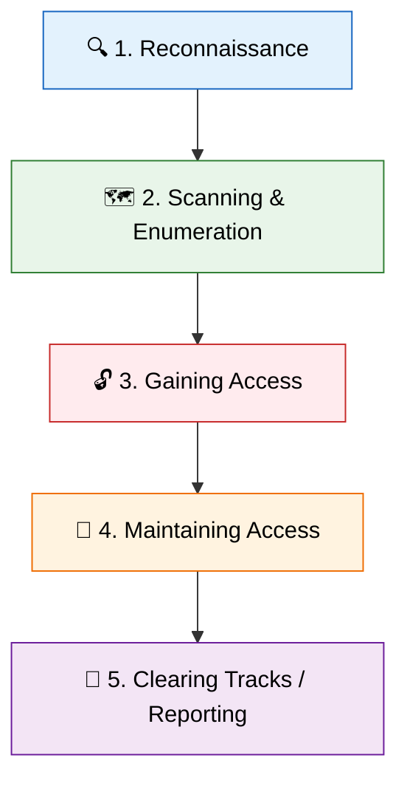

# 🛡️ Introduction to Ethical Hacking

Ethical hacking, also known as penetration testing or white-hat hacking,
involves authorized attempts to gain unauthorized access to a computer system,
application, or data. Carrying out an ethical hack involves duplicating
strategies and actions of malicious attackers. This practice helps to identify
security vulnerabilities which can then be resolved before a malicious attacker
has the opportunity to exploit them.

This guide serves as a deep dive into the foundational principles, legal
considerations, and core concepts that every aspiring cybersecurity professional
must master.

---

## 📜 1. The History and Evolution of Hacking

The term "hacker" has evolved significantly since its inception. Originally
coined in the 1960s at MIT, it referred to individuals who used their technical
ingenuity to solve problems or overcome limits.

### ⏳ The Evolution Timeline

- **1960s-1970s (The Explorers):** The era of the "phreakers" (phone hackers)
  like John Draper (Captain Crunch), who discovered that a toy whistle emitted a
  2600 Hz tone that could manipulate the AT&T telephone system.
- **1980s (The Rise of Cybercrime):** The introduction of personal computers led
  to widespread BBS systems. The term "hacker" began taking on malicious
  connotations. The Computer Fraud and Abuse Act (CFAA) was enacted in 1986.
- **1990s (The Commercialization of the Web):** The dot-com boom brought massive
  security flaws to light. "Hacktivism" began to take shape.
- **2000s (Organized Cybercrime & State-Sponsored Attacks):** Malware became big
  business (e.g., ILOVEYOU). The concept of Advanced Persistent Threats (APTs)
  emerged.
- **2010s-Present (Ransomware and Cloud):** Weaponization of zero-days (e.g.,
  Stuxnet). Ransomware became a primary monetization strategy, and cloud
  environments introduced new attack surfaces.

---

## 🎩 2. Categorization of Hackers

Hackers are traditionally categorized by the "color of their hat," a metaphor
derived from old Western movies.

| Hat Color        | Motivation                | Authorization                   | Legality  | Characteristics                                                                        |
| :--------------- | :------------------------ | :------------------------------ | :-------- | :------------------------------------------------------------------------------------- |
| **🤍 White Hat** | Defense, compliance       | Explicitly authorized (RoE/NDA) | Legal     | Follows strict methodologies. Penetration Testers, Bug Bounty hunters.                 |
| **🖤 Black Hat** | Malice, financial gain    | Unauthorized                    | Illegal   | Exploits vulnerabilities for personal gain. Develops malware, disrupts infrastructure. |
| **👽 Gray Hat**  | Curiosity, notoriety      | Usually unauthorized            | Ambiguous | Finds vulnerabilities without permission but reports them to the owner.                |
| **🔴 Red Hat**   | Vigilante justice         | Unauthorized                    | Illegal   | Actively attacks and destroys Black Hat systems.                                       |
| **🔵 Blue Hat**  | External security consult | Authorized                      | Legal     | Invited by organizations (e.g., Microsoft) to find bugs pre-release.                   |
| **🟢 Green Hat** | Learning                  | Varies                          | Varies    | Beginners or "noobs" eager to learn.                                                   |

### 🚨 Other Threat Actors

- **Script Kiddies:** Inexperienced individuals who use pre-written tools (e.g.,
  LOIC, Metasploit) without understanding them.
- **Hacktivists:** Attackers motivated by political, social, or religious
  ideologies (e.g., Anonymous).
- **State-Sponsored/APTs:** Highly funded groups conducting espionage/sabotage
  for governments (e.g., Fancy Bear).
- **Insider Threats:** Employees with legitimate access who misuse it
  intentionally or negligently.

---

## ⚖️ 3. Core Security Principles

Security professionals base strategies on foundational models that define what
needs protecting.

### 🔺 The CIA Triad

The fundamental model for information security development.

| Principle           | Description                                            | Defenses                     | Common Attacks                   |
| :------------------ | :----------------------------------------------------- | :--------------------------- | :------------------------------- |
| **Confidentiality** | Sensitive info is accessed only by authorized parties. | Encryption, RBAC, MFA.       | Packet sniffing, MitM, breaches. |
| **Integrity**       | Data is accurate, reliable, and unaltered.             | Hashing, Digital Signatures. | SQLi, Malware, MitB.             |
| **Availability**    | Systems/data are available to users when needed.       | Redundancy, Load Balancing.  | DoS/DDoS, Ransomware.            |

### 💠 The Parkerian Hexad

An extension of the CIA triad, adding three more elements: 4. **Possession or
Control:** Physical disposition of media (a stolen encrypted drive loses
possession). 5. **Authenticity:** Ascertaining information is genuine and from
the expected source. 6. **Utility:** The usefulness of the data (encrypted data
with a lost key lacks utility).

---

## 🏛️ 4. Legal and Ethical Frameworks

> ⚠️ **CRITICAL WARNING:** Unauthorized access is a felony in most
> jurisdictions. Going out of scope, even accidentally, changes your status from
> an Ethical Hacker to a Cybercriminal. Always have written permission.

### Key Legislation & Regulations

- **CFAA (Computer Fraud and Abuse Act):** US federal law criminalizing
  unauthorized computer access.
- **GDPR:** EU data protection regulation with massive fines for breaches.
- **PCI-DSS:** Mandates pentesting for organizations processing credit cards.

### 📜 Rules of Engagement (RoE)

The most critical document for an ethical hacker, defining:

- **Scope:** Permitted IP addresses, domains, and systems.
- **Timing:** Authorized testing windows.
- **Techniques:** Allowed/disallowed actions (e.g., No DoS).
- **Emergency Contacts:** Protocol for system crashes.

---

## 🔄 5. Phases of Ethical Hacking

1.  **Reconnaissance (Footprinting):** Passive information gathering.
2.  **Scanning and Enumeration:** Active probing for open ports and services.
3.  **Gaining Access (Exploitation):** Exploiting vulnerabilities to breach the
    system.
4.  **Maintaining Access (Post-Exploitation):** Establishing persistence
    (backdoors).
5.  **Clearing Tracks / Reporting:** Removing evidence (or for ethical hackers,
    delivering the final report).

---

## 🧠 6. The Attacker's Mindset and Threat Modeling

Technical skills alone do not make a good hacker. The defining characteristic is
the **Attacker's Mindset**: making a system designed to do _X_ perform _Y_ and
_Z_.

### Threat Modeling Methodologies

- **STRIDE:** (Spoofing, Tampering, Repudiation, Information Disclosure, Denial
  of Service, Elevation of Privilege).
- **DREAD:** (Damage, Reproducibility, Exploitability, Affected Users,
  Discoverability) for risk assessment.

> 💡 **Thinking Laterally:** Hackers rarely attack the fortified front door.
> They seek weak links like unpatched dev servers, spear-phishing targets, or
> physically unsecured network jacks.

---

## 🛠️ 7. Essential Setup and Operating Systems

Ethical hackers use specialized environments.

- **OS Distributions:** Kali Linux (industry standard), Parrot Security OS,
  BlackArch, Commando VM (Windows).
- **Virtualization:** VMware, VirtualBox, and Docker containers ensure safe,
  repeatable testing environments.

---

## 🎓 8. Foundational Knowledge Domains

- **Networking:** The OSI Model, TCP/IP Suite, Subnetting, and protocols (HTTP,
  DNS, SMB).
- **Operating Systems:** Linux (bash, permissions) and Windows (Active
  Directory, PowerShell).
- **Scripting:** Python (automation/exploits), Bash, JavaScript (XSS), C/C++
  (memory corruption).

---

## 🎖️ 9. Certifications and Career Paths

### Certifications

| Level        | Certifications           | Focus                                             |
| :----------- | :----------------------- | :------------------------------------------------ |
| **Entry**    | Security+, PenTest+, CEH | Foundational concepts, tool knowledge, theory.    |
| **Advanced** | OSCP, GPEN, CISSP        | Practical hacking (24h exams), senior management. |

### Careers

- **Penetration Tester:** Point-in-time assessments.
- **Red Teamer:** Long-term, stealthy adversary simulations.
- **Bug Bounty Hunter:** Freelance vulnerability discovery.
- **Exploit Developer:** Discovering zero-days and writing custom exploits.
