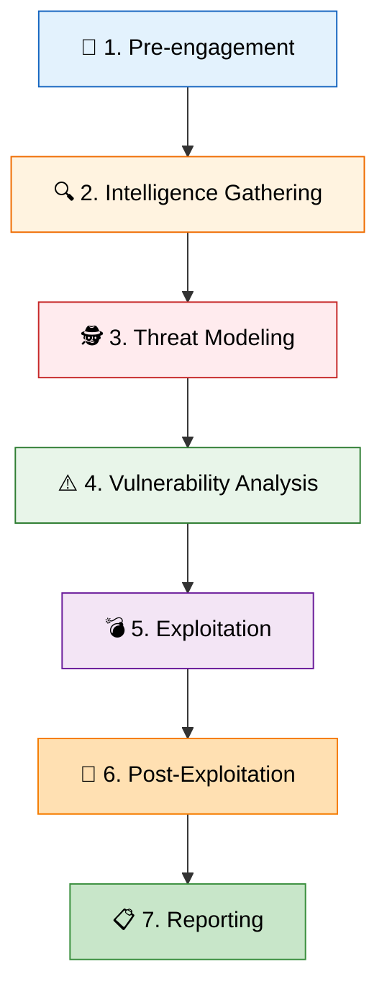

# Penetration Testing: Methodologies and Execution

Penetration testing (often referred to as pentesting) is a rigorous, structured
process of simulating a cyberattack against a computer system, network, or web
application to identify exploitable vulnerabilities. Unlike a vulnerability
assessment, which merely identifies potential flaws, a penetration test actively
attempts to exploit them to determine the real-world risk, the depth of the
potential breach, and the effectiveness of the target's defenses.

This document details the professional methodologies, scoping requirements, and
phased approaches required to execute a successful and legally sound penetration
test.

---

## ⚖ 1. Penetration Testing vs. Vulnerability Assessment vs. Red Teaming

It is crucial to understand the distinction between these often-confused
security services.

| Feature       | 📊 Vulnerability Assessment                   | 🎯 Penetration Testing                                  | 👹 Red Teaming                                        |
| :------------ | :-------------------------------------------- | :------------------------------------------------------ | :---------------------------------------------------- |
| **Objective** | Identify, quantify, and rank vulnerabilities. | Exploit vulnerabilities to prove risk and access depth. | Test detection and response capabilities (Blue Team). |
| **Scope**     | Broad (entire infrastructure).                | Targeted (specific applications/networks).              | Broad & objective-based ("Steal CEO's emails").       |
| **Stealth**   | None. Scans are noisy.                        | Moderate. The goal is finding bugs, not hiding.         | High. Evasion of SOC/EDR is critical.                 |
| **Duration**  | Days to Weeks (automated).                    | Weeks.                                                  | Months (continuous).                                  |
| **Outcome**   | List of prioritized CVEs.                     | Proof of exploitation, risk analysis, remediation.      | Analysis of defensive posture and attack paths.       |

## 2. Types of Penetration Tests

Pentests are categorized by the amount of information provided to the testing
team prior to the engagement.

| Test Type        | Knowledge Provided                             | Simulation Style                           | Pros & Cons                                                                                                 |
| :--------------- | :--------------------------------------------- | :----------------------------------------- | :---------------------------------------------------------------------------------------------------------- |
| **⬛ Black Box** | Zero knowledge (only target name/IP).          | External, unprivileged attacker.           | **Pro:** Realistic external posture. <br/> **Con:** Time-consuming reconnaissance.                          |
| **⬜ White Box** | Full transparency (source code, network maps). | Insider threat or compromised source code. | **Pro:** Extremely thorough, rapid bug finding. <br/> **Con:** Doesn't simulate initial external intrusion. |
| **🔲 Gray Box**  | Limited knowledge (low-level credentials).     | Compromised user or rogue employee.        | **Pro:** Balances realism and efficiency, focuses on privilege escalation.                                  |

## 3. Industry Frameworks and Standards

Professional pentesting is not random hacking; it is governed by structured
methodologies to ensure thoroughness, repeatability, and safety.

1.  **PTES (Penetration Testing Execution Standard):** The most comprehensive
    standard defining seven distinct phases.
2.  **OSSTMM:** Analytical and metric-driven, focusing on operational security.
3.  **NIST SP 800-115:** US government technical guide, highly structured for
    federal contracts.
4.  **OWASP WSTG:** The definitive standard for web application penetration
    testing.

## 4. The PTES Lifecycle: A Deep Dive

The **Penetration Testing Execution Standard (PTES)** outlines seven phases.

<!-- Visual flow for Penetration Testing: Methodologies and Execution. -->


### Phase 1: Pre-engagement Interactions

Before any technical work begins, the business and legal foundation must be
established.

- **Scoping:** Defining what is tested and explicitly what is **out of scope**.
- **Rules of Engagement (RoE):** Timelines, allowed techniques (e.g., No DoS),
  and emergency contacts.
- **Legal Documentation:** NDA, MSA, SOW, and the **Authorization to Test** (Get
  Out of Jail Free Card).

### Phase 2: Intelligence Gathering (Reconnaissance)

Gathering OSINT and active probing data.

- _Passive:_ WHOIS, DNS enumeration, Shodan.
- _Active:_ Port scanning (Nmap), directory brute-forcing.

### 🕵 Phase 3: Threat Modeling

Identifying assets and likely threat actors.

- Mapping paths to high-value data (customer PII, source code).
- Profiling threat actors (script kiddie vs. APT).

### ⚠ Phase 4: Vulnerability Analysis

Analyzing recon data to find specific, exploitable flaws.

- Automated scanning (Nessus) mixed with deep manual analysis of custom
  applications.

### 💣 Phase 5: Exploitation

Actively attempting to bypass security controls and gain access.

- **Network Exploitation:** Metasploit payloads (e.g., EternalBlue).
- **Web Exploitation:** SQLi, XSS, IDOR.
- **Social Engineering / Physical:** Spear-phishing or tailgating (if in scope).

> 💻 **Example: Metasploit Workflow**
>
> ```bash
> msfconsole
> msf6 > use exploit/windows/smb/ms17_010_eternalblue
> msf6 exploit(...) > set RHOSTS 192.168.1.100
> msf6 exploit(...) > set PAYLOAD windows/x64/meterpreter/reverse_tcp
> msf6 exploit(...) > exploit
> ```

### 👑 Phase 6: Post-Exploitation

Determining the value of the compromised machine and maintaining access.

1.  **Situational Awareness:** `whoami /priv`, `netstat -ano`.
2.  **Privilege Escalation:** Moving from standard user to Administrator/SYSTEM.
3.  **Pivoting / Lateral Movement:** Using the compromised host to attack deeper
    internal networks (Chisel, Proxychains).
4.  **Credential Harvesting:** Dumping hashes with Mimikatz.
5.  **Persistence:** Creating hidden users or malicious services.

### 📋 Phase 7: Reporting

A successful hack is useless if not communicated effectively.

1.  **Executive Summary:** High-level business impact and strategic
    recommendations for the C-Suite.
2.  **Technical Details:** CVSS scores, step-by-step Proof of Concept (PoC)
    screenshots, and actionable remediation advice for developers.

## 🌐 5. Specialized Penetration Testing Domains

Pentesting is a broad field with deep specializations:

| Domain          | Focus                                                    | Key Tools                           |
| :-------------- | :------------------------------------------------------- | :---------------------------------- |
| **📶 Wireless** | WEP/WPA2 cracking, rogue APs, Evil Twins.                | Aircrack-ng, Wifite, Kismet.        |
| **☁️ Cloud**    | AWS/Azure IAM audits, SSRF, S3 bucket misconfigurations. | Pacu, ScoutSuite, CloudMapper.      |
| **🏢 Physical** | Bypassing locks, cloning RFID badges, testing guards.    | Lockpicks, Proxmark3, Rubber Ducky. |

## ⚖ 6. Ethics and Liability

A professional penetration tester walks a thin line. Strict adherence to ethics
is mandatory.

> 🚨 **Critical Rules of Conduct:**
>
> - **Do No Harm:** Unless explicitly authorized, avoid causing denial of
>   service or data corruption.
> - **Data Handling:** Securely encrypt and destroy sensitive data (PII)
>   post-engagement.
> - **Transparency:** If you crash a production server, immediately notify the
>   client using emergency protocols. Covering up mistakes destroys trust and
>   carries severe legal liability.

## 🏁 Conclusion

Penetration testing is a highly structured, analytical process requiring
technical prowess, excellent communication, and strict ethical boundaries. By
following established frameworks like PTES, pentesters provide organizations
with invaluable insights into their actual security posture, allowing them to
patch critical vulnerabilities before malicious actors exploit them.

## Quick Reference

| Area | Revision point |
|---|---|
| Definition | State exactly what the topic means. |
| Mechanism | Explain the steps that produce the result. |
| Example | Use a small realistic case. |
| Pitfalls | Know common mistakes and boundary cases. |
