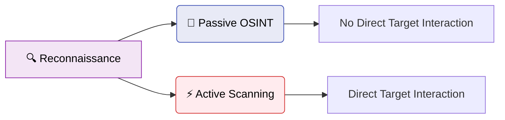

# 🕵‍♂ Reconnaissance & Footprinting

Reconnaissance, often referred to as "footprinting," is the critical first phase
of any penetration test or cyberattack. It is the process of gathering as much
information as possible about a target system, organization, or individual
before launching any active exploits.

> 💡 **Axiom in Cybersecurity:** "You cannot attack what you cannot see, and you
> cannot defend what you do not know you have."

Thorough reconnaissance often determines the success or failure of an
engagement. The more time spent in recon, the less time is required for
exploitation.

<!-- Visual flow for 🕵‍♂ Reconnaissance & Footprinting. -->


Reconnaissance is broadly divided into two categories: **Passive** and
**Active**.

---

## 🥷 1. Passive Reconnaissance (OSINT)

Passive reconnaissance involves gathering information without directly
interacting with the target's systems in a way that could trigger an alert
(e.g., IDS/IPS or firewall logs). The target remains entirely unaware that they
are being investigated. This heavily relies on **Open Source Intelligence
(OSINT)**.

### 🔎 1.1 Search Engine Dorking (Google Hacking)

Search engines constantly crawl the web and often index sensitive files,
directories, and error messages that administrators accidentally leave public.
"Dorking" uses advanced search operators to filter this data.

| Operator    | Function                                    | Example                          |
| :---------- | :------------------------------------------ | :------------------------------- |
| `site:`     | Restricts search to a specific domain       | `site:example.com`               |
| `filetype:` | Looks for specific file extensions          | `filetype:pdf` or `filetype:env` |
| `intitle:`  | Searches for keywords in the page title     | `intitle:"index of"`             |
| `inurl:`    | Searches for keywords within the URL string | `inurl:/view.shtml`              |

**Examples of Malicious Dorks:**

- Finding exposed `.env` files containing API keys:
  `site:example.com filetype:env`
- Finding open directory listings containing backups:
  `intitle:"index of" "backup.sql"`
- Finding exposed webcams: `inurl:/view.shtml`

> 📚 **Resource:** The **Google Hacking Database (GHDB)**, hosted by Exploit-DB,
> maintains thousands of these queries.

### 🌐 1.2 DNS Enumeration and WHOIS

Mapping the target's external infrastructure begins with understanding their
domains.

- **WHOIS:** Reveals the registered owner of a domain, contact emails (useful
  for phishing), and the registrar.
  ```bash
  whois example.com
  ```
- **DNS Lookups:** Identifying IP addresses, Mail Exchanger (MX) records, and
  Name Servers (NS).
  ```bash
  host example.com
  dig ANY example.com
  ```
- **Zone Transfers (AXFR):** A severe misconfiguration where a DNS server allows
  anyone to download the entire DNS zone file, revealing all internal
  subdomains.
  ```bash
  dig axfr @ns1.example.com example.com
  ```

### 🛰 1.3 Deep Scanning Search Engines

Standard search engines index web pages. Specialized search engines index
internet-connected _devices_.

- **Shodan (The Search Engine for IoT):** Scans the entire IPv4 space and
  banners returned by ports. You can find exposed webcams, industrial control
  systems (SCADA), unauthenticated databases (MongoDB/Elasticsearch), and
  vulnerable routers.
  - _Example Query:_ `org:"Example Corp" port:"3389"` (Finds RDP servers).
- **Censys:** Similar to Shodan, excellent for mapping attack surfaces and
  analyzing SSL/TLS certificates.
- **crt.sh (Certificate Transparency):** When a company issues an SSL
  certificate for a domain, it is logged publicly. Searching `crt.sh` is one of
  the best ways to find hidden subdomains.

### 👔 1.4 Social Media and Employee Harvesting

People are often the weakest link. Gathering data on employees is crucial for
social engineering and password profiling.

- **LinkedIn:** The ultimate OSINT tool for mapping organizational structure and
  identifying internal technologies from job descriptions.
- **Hunter.io / TheHarvester:** Tools to scrape the internet for valid email
  formats.
  ```bash
  theHarvester -d example.com -l 500 -b google,linkedin
  ```
- **HaveIBeenPwned:** Checking discovered employee emails against known data
  breaches.

### 📂 1.5 Source Code Repositories and Archival Data

- **GitHub/GitLab/Bitbucket:** Developers frequently commit sensitive data.
  Tools like `TruffleHog` scan repos for secrets (API keys, hardcoded
  passwords).
- **The Wayback Machine (Archive.org):** Viewing older versions of the target's
  website to find unlinked, vulnerable pages.

## 2. Active Reconnaissance

Active reconnaissance involves direct, measurable interaction with the target
system. This will generate logs and may trigger security alerts. The goal is to
identify live hosts, open ports, running services, and exact versions.

### 2.1 Network Mapping and Port Scanning (Nmap)

Network Mapper (Nmap) is the industry standard for active reconnaissance. It
sends crafted packets and analyzes the responses to determine host state and
port status.

**Understanding Port States:**

| State        | Description                                                                 |
| :----------- | :-------------------------------------------------------------------------- |
| **Open**     | An application is actively accepting connections.                           |
| **Closed**   | The port is accessible, but no application is listening.                    |
| **Filtered** | A firewall or IDS is dropping the packets. Nmap cannot determine its state. |

**Essential Nmap Scanning Techniques:**

# Basic example showing the core idea.
```bash
## Ping Sweep (Host Discovery)
nmap -sn 192.168.1.0/24

## TCP SYN Scan (Stealth Scan - Default)
nmap -sS -p- 192.168.1.100

## TCP Connect Scan (Full Handshake)
nmap -sT 192.168.1.100

## UDP Scan (Slow but finds DNS/SNMP)
nmap -sU -p 53,161,137 192.168.1.100

## Service Version Detection
nmap -sV 192.168.1.100

## OS Detection
nmap -O 192.168.1.100

## Nmap Scripting Engine (NSE)
nmap --script smb-vuln-ms17-010 192.168.1.100
```

### 🔓 2.2 Web Directory Brute-Forcing

Once a web server is discovered, the next step is to find hidden files and
directories (admin panels, configuration files) not linked on the main site.

- **Tools:** Gobuster, ffuf, DirBuster, Feroxbuster.
- **Example Gobuster Command:**
  ```bash
  gobuster dir -u http://example.com -w /usr/share/wordlists/dirb/common.txt -x php,txt,bak
  ```

### 📞 2.3 Service Enumeration

Deeper enumeration is required to extract useful data from specific services.

- **SMB (Ports 139/445):** Use `enum4linux` or `smbclient` to extract user lists
  and open shares.
  ```bash
  enum4linux -a 192.168.1.100
  ```
- **SNMP (UDP Port 161):** Extract massive amounts of routing and process data
  using `snmpwalk` if a weak community string like "public" is used.
- **SMTP (Port 25):** Use `VRFY` and `EXPN` commands to verify usernames for
  brute-force attacks.

## 🗄 3. Organizing Reconnaissance Data

The reconnaissance phase generates overwhelming data. Managing it is crucial.

- **Maltego:** A visual link analysis tool that graphs relationships between
  domains, IPs, people, and profiles.
- **Recon-ng:** A Python reconnaissance framework that automates data gathering
  via APIs.
- **SpiderFoot:** Automated OSINT and attack surface mapping tool.
- **BloodHound:** Uses graph theory to reveal complex privilege escalation paths
  in Active Directory.

## 🛑 4. OPSEC (Operational Security) During Reconnaissance

> ⚠️ **Warning:** When conducting active recon, especially during a Red Team
> engagement, stealth is paramount. Poor OPSEC leads to blocked IPs and failed
> tests.

- **Rate Limiting:** Tools like Nmap have timing templates (`-T1` to `-T5`). A
  slower scan (`-T2`) blends with normal background noise.
- **Decoys and Spoofing:** Nmap can use decoy IPs (`-D`) to confuse the IDS by
  simulating scans from multiple sources.
- **Proxychains / Tor:** Routing traffic through multiple proxies to mask the
  true origin.
- **Cloud Infrastructure:** Launching scans from ephemeral cloud instances (AWS,
  DigitalOcean) and rotating IPs frequently.

## 🏁 Conclusion

Reconnaissance is a meticulous, iterative process. It requires patience and a
systematic approach. The intelligence gathered here directly forms the threat
model and the attack plan for the Exploitation phase. A skipped step in
enumeration often results in missing the simplest path to domain compromise.

## Quick Reference

| Area | Revision point |
|---|---|
| Definition | State exactly what the topic means. |
| Mechanism | Explain the steps that produce the result. |
| Example | Use a small realistic case. |
| Pitfalls | Know common mistakes and boundary cases. |
