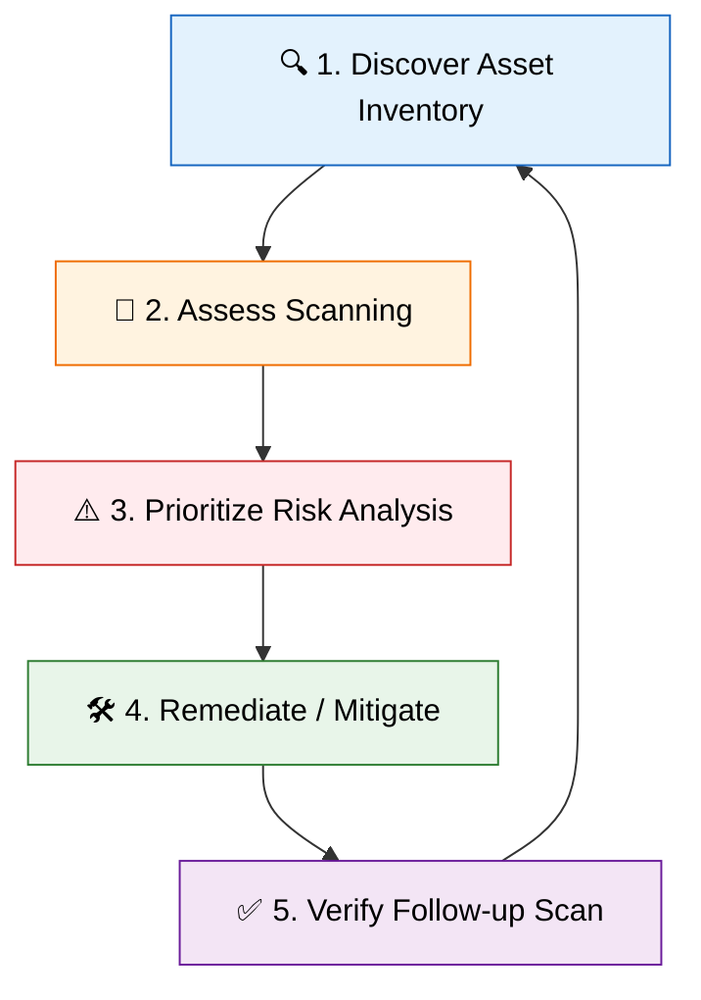

# 📊 Vulnerability Assessment & Management

**Vulnerability Assessment (VA)** is a systematic process of identifying,
quantifying, and prioritizing (or ranking) the security vulnerabilities in a
system, application, or network infrastructure. It provides an organization with
the necessary knowledge, awareness, and risk background to understand and react
to the threats to its environment.

> 💡 **Note:** Unlike Penetration Testing, which actively exploits
> vulnerabilities to prove risk, a Vulnerability Assessment is a diagnostic
> process. It focuses on **breadth** (finding everything misconfigured or
> unpatched) rather than **depth** (proving how far an attacker can get).

---

## 🔄 1. The Vulnerability Management Lifecycle

Vulnerability management is not a point-in-time exercise; it is a continuous
lifecycle. New vulnerabilities (Zero-days) are discovered daily, and network
environments constantly change.

### 🔍 Phase 1: Discover (Asset Inventory)

You cannot secure what you do not know exists. The foundational step is creating
a dynamic inventory of all IT assets.

- Includes physical servers, VMs, cloud instances, containers, network devices,
  IoT, and web apps.
- Must map dependencies and business value for prioritization.

### 📡 Phase 2: Assess (Scanning)

Utilizing automated tools to evaluate assets for known security flaws.

- **Network Scanners:** Analyze open ports and missing patches.
- **Web App Scanners:** Crawl for SQLi, XSS, etc.
- **Host-Based Scanners (Agents):** Monitor local configurations natively.

### ⚠️ Phase 3: Prioritize (Risk Analysis)

A typical scan may return thousands of vulnerabilities. Prioritization combines
technical severity (CVSS) with the business context of the asset.

- _Example:_ A medium flaw on an external payment gateway takes priority over a
  high flaw on an isolated internal server.
- _Threat Intel:_ Is this vulnerability actively exploited in the wild (CISA KEV
  list)?

### 🛠️ Phase 4: Remediate / Mitigate

Addressing the prioritized vulnerabilities.

- **Remediation:** Completely fixing the flaw (applying patches, upgrading).
- **Mitigation:** Compensating controls when a patch isn't possible (e.g.,
  placing behind a WAF, isolating on a VLAN).
- **Acceptance:** Management formally accepting the risk.

### ✅ Phase 5: Verify

Targeted follow-up scans to ensure patches worked and didn't introduce new
issues.

---

## 📈 2. Common Vulnerability Scoring System (CVSS)

The **CVSS** is the industry-standard framework for communicating vulnerability
severity. Understanding how a score is calculated is vital.

CVSS v3.1 (and v4.0) consists of three metric groups:

| Metric Group              | Description                                               | Key Factors                                                                |
| :------------------------ | :-------------------------------------------------------- | :------------------------------------------------------------------------- |
| **Base Metrics**          | Intrinsic, constant qualities of a vulnerability.         | Attack Vector (AV), Complexity (AC), Privileges Required (PR), CIA Impact. |
| **Temporal Metrics**      | Characteristics that change over time.                    | Exploit Maturity (E), Remediation Level (RL), Report Confidence (RC).      |
| **Environmental Metrics** | Customizes score based on the organization's environment. | Asset importance, compensating controls in place.                          |

**CVSS v3.1 Severity Ratings:**

- 🟢 **None:** 0.0
- 🟡 **Low:** 0.1 - 3.9
- 🟠 **Medium:** 4.0 - 6.9
- 🔴 **High:** 7.0 - 8.9
- 🚨 **Critical:** 9.0 - 10.0

> 🚀 **Trend:** Modern organizations are shifting towards **Risk-Based
> Vulnerability Management (RBVM)** using models like EPSS (Exploit Prediction
> Scoring System), which predicts real-world exploit probability.

---

## 🔑 3. Authenticated vs. Unauthenticated Scanning

When configuring a scan, the analyst must decide on the level of access.

### 🕵️‍♂️ Unauthenticated Scanning

- The scanner behaves like an external attacker with no prior access.
- Probes open ports, reads banners, infers OS and versions.
- **Pros:** Fast, reveals the external perspective, minimal setup.
- **Cons:** Highly inaccurate. Leads to **False Positives** because it relies on
  easily spoofed banners (e.g., backported patches) and misses client-side
  flaws.

### 🔐 Authenticated (Credentialed) Scanning

- The scanner is provided with login credentials (SSH keys, WinRM).
- Logs in, queries local registries, checks exact package manager versions
  (dpkg, rpm), and reads config files.
- **Pros:** Highly accurate. Reduces false positives. Discovers deep local
  vulnerabilities.
- **Cons:** Requires complex credential management (CyberArk/Vault). Can cause
  instability on fragile legacy systems.

---

## 🛠️ 4. Deep Dive into Enterprise Vulnerability Scanners

Several commercial and open-source tools dominate the landscape.

### 🟢 Tenable Nessus

The most famous vulnerability scanner.

- Uses a massive library of plugins.
- Custom scan policies (Discovery, Patch Audit).
- Compliance scanning against CIS benchmarks.

### 🐧 Greenbone Vulnerability Management (OpenVAS)

A powerful open-source scanner originally forked from Nessus.

- Relies on the Greenbone Community Feed (NVTs).
- Excellent for budget-conscious organizations, though lacks some enterprise
  polish.

### ⚡ Rapid7 Nexpose / InsightVM

Focuses heavily on risk prioritization.

- Integrates seamlessly with Metasploit for 1-click vulnerability verification.
- Uses a proprietary 1-1000 Real Risk Score incorporating threat intel.

### ☁️ Qualys

A cloud-first platform.

- Heavily relies on lightweight agents installed on endpoints, ideal for remote
  workforces without VPN requirements.

---

## 🚧 5. Modern Vulnerability Assessment Challenges

Modern architectures have changed scanning requirements:

- **Cloud Infrastructure:** Requires CSPM (Cloud Security Posture Management) to
  audit AWS/Azure APIs, IAM roles, and S3 buckets.
- **Containers (Docker/K8s):** Containers are ephemeral. Scanning must "shift
  left" into the CI/CD pipeline using tools like Trivy or Clair to scan images
  _before_ deployment.
- **False Negatives:** The most dangerous outcome. A scan reports clean, but a
  logic flaw or zero-day exists.

> ⚠️ **Warning:** Automated scanning must always be supplemented with manual
> penetration testing to uncover what scanners miss.

---

## 🏁 Conclusion

Vulnerability Management is the unglamorous but critical foundation of
enterprise security hygiene. A robust, continuous program of discovering,
credentialed scanning, and context-aware prioritization will stop the vast
majority of cyberattacks before they begin, long before advanced exploitation
techniques are ever required.
