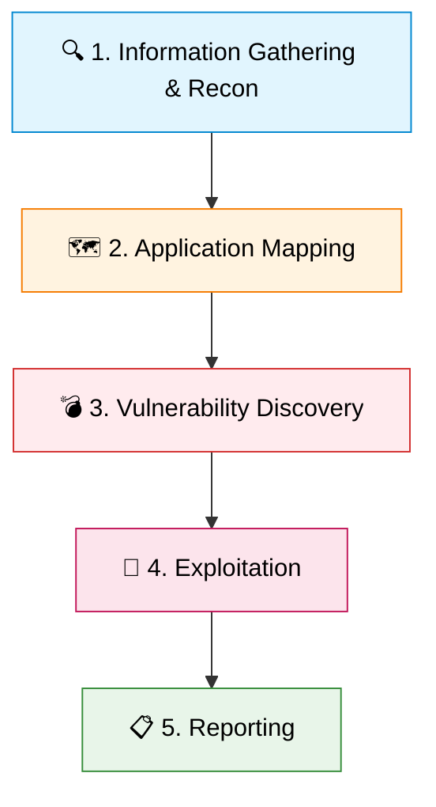

# 🕸 Web Application Penetration Testing

Web applications represent the most exposed attack surface for modern
organizations. They are accessible from anywhere in the world, interact deeply
with backend databases, and are continuously updated with complex, custom code.
Consequently, web application penetration testing is a highly specialized and
heavily demanded skill set in cybersecurity.

The methodology for web app pentesting differs significantly from network
testing. It requires a deep understanding of HTTP requests, session management,
browser security policies, and application logic.

> 💡 **Note:** Web application security is a constantly moving target. Staying
> updated with modern frameworks (React, Angular, Vue) and APIs (REST, GraphQL)
> is essential for any successful pentester.

---

## 🛠 1. The Intercepting Proxy: The Web Hacker's Primary Tool

In network hacking, Nmap and Metasploit are king. In web application hacking,
the **Intercepting Proxy** is the cornerstone of all testing.

An intercepting proxy sits between the tester's web browser and the target
server. It captures all HTTP/HTTPS traffic, allowing the tester to pause,
inspect, modify, and replay requests before they reach the server, bypassing
client-side validation (like JavaScript input limits).

### 🟠 Burp Suite Professional / Community

Developed by PortSwigger, Burp Suite is the undisputed industry standard for web
pentesting.

| Feature             | Description                                      | Use Case                                            |
| :------------------ | :----------------------------------------------- | :-------------------------------------------------- |
| **Proxy**           | Intercepts and modifies requests on the fly.     | Bypassing client-side controls, inspecting traffic. |
| **Repeater**        | Manually modify parameters and send repeatedly.  | Manual vulnerability probing and analysis.          |
| **Intruder**        | Powerful automation tool for customized attacks. | Brute-forcing, fuzzing, exploiting IDOR.            |
| **Decoder**         | Rapidly encodes/decodes data.                    | Creating bypass payloads (URL, Base64, Hex).        |
| **Scanner** _(Pro)_ | Advanced active vulnerability scanner.           | Automated discovery integrated with manual testing. |

### 🔵 OWASP ZAP (Zed Attack Proxy)

An extremely capable, free, and open-source alternative to Burp Suite,
maintained by the OWASP foundation. It includes excellent automated scanning
capabilities, a robust API for CI/CD pipeline integration, and strong fuzzing
tools.

## 🏆 2. The OWASP Top 10 (Deep Dive)

The **Open Worldwide Application Security Project (OWASP) Top 10** is the
globally recognized standard awareness document representing the most critical
security risks to web applications. Understanding these is mandatory for any
pentester.

> ⚠️ **Warning:** The OWASP Top 10 is updated periodically. The following
> represents core concepts from recent iterations, but always check the official
> OWASP site for the latest version.

### 🚪 1. Broken Access Control

Access control enforces policy such that users cannot act outside of their
intended permissions. Failures lead to unauthorized information disclosure,
modification, or destruction of all data.

- **Insecure Direct Object Reference (IDOR):** An application uses user-supplied
  input to access objects directly without verifying authorization.
  - _Attack:_ User A logs in and is redirected to
    `app.com/profile?account_id=1001`. The tester changes the URL parameter to
    `account_id=1002`. If the server returns User B's profile without checking
    if User A owns that account, IDOR exists.
- **Privilege Escalation:** A standard user modifies their JWT (JSON Web Token)
  or a hidden form field (e.g., `role=user` to `role=admin`) to gain
  administrative rights.

### 2. Cryptographic Failures (Sensitive Data Exposure)

Relates to failures in cryptography that lead to the exposure of sensitive data
like passwords, credit cards, or health records.

- **Common Attacks:**
  - Transmitting sensitive data over unencrypted HTTP.
  - Using weak or deprecated cryptographic algorithms (e.g., MD5 or SHA1 for
    password hashing).
  - Failure to use properly salted hashes.
  - Improper key management (hardcoding API keys in public GitHub repositories).

### 💉 3. Injection Flaws

Injection occurs when untrusted user data is sent to an interpreter as part of a
command or query. The attacker's hostile data tricks the interpreter into
executing unintended commands.

**A. SQL Injection (SQLi):** Attacking the backend database.

| Type                  | Description                                                             |
| :-------------------- | :---------------------------------------------------------------------- |
| **In-band (Classic)** | Results are returned directly in the response (e.g., UNION-based).      |
| **Error-based**       | Inputs syntax errors (`'`) to force DB structure disclosure via errors. |
| **Blind SQLi**        | No data/errors returned. Relies on True/False (Boolean) or time delays. |

> 🛠️ **Tool Spotlight:** **SQLmap** is the premier automated tool for finding
> and exploiting SQLi.

**B. OS Command Injection:** The application passes unsafe user-supplied data to
a system shell.

- _Attack:_ A ping functionality on a router admin page:
  `127.0.0.1; cat /etc/passwd`. The `;` ends the first command and executes the
  attacker's malicious payload.

### 4. Insecure Design

Focuses on risks related to design flaws. This emphasizes the need for threat
modeling, secure design patterns, and reference architectures.

- _Example:_ An e-commerce site requires users to answer security questions for
  password recovery. If the questions are easily guessable via OSINT ("What is
  your mother's maiden name?"), the design itself is insecure, regardless of how
  perfectly the code is written.

### ⚙ 5. Security Misconfiguration

The most common issue. Resulting from insecure default configurations,
incomplete configurations, open cloud storage, misconfigured HTTP headers, and
verbose error messages containing sensitive information.

- _Examples:_ Leaving the default Tomcat management portal exposed with
  `admin:admin` credentials. Failing to implement security headers like
  `Strict-Transport-Security` (HSTS) or `Content-Security-Policy` (CSP). Leaving
  an AWS S3 bucket publicly readable and writable.

### 6. Vulnerable and Outdated Components

Applications often utilize third-party libraries and frameworks (npm packages,
WordPress plugins, Apache Struts). If these dependencies have known CVEs and are
not patched, the entire application is compromised.

- _Example:_ The classic example is the Equifax breach, which was caused by an
  unpatched vulnerability in the Apache Struts web framework (CVE-2017-5638).

### 🕵‍♂ 7. Identification and Authentication Failures

When application functions related to session management and authentication are
implemented incorrectly.

- **Credential Stuffing:** Using automated tools with lists of valid
  username/password pairs breached from other sites, assuming users reuse
  passwords.
- **Session Fixation:** An attacker forces a user's session ID to an explicit
  value, waits for them to log in, and then uses that known session ID to hijack
  their authenticated session.
- **Lack of MFA:** Failing to enforce Multi-Factor Authentication for sensitive
  actions.

### 8. Software and Data Integrity Failures

Relates to code and infrastructure that does not protect against integrity
violations.

- **Insecure Deserialization:** Flaws occur when an application receives hostile
  serialized objects. The attacker manipulates the serialized data to alter
  application logic or achieve Remote Code Execution (RCE) when the server
  deserializes it.
- Relying on plugins, libraries, or CDNs from untrusted sources without
  verifying integrity (e.g., missing Subresource Integrity (SRI) tags).

### 9. Security Logging and Monitoring Failures

Without logging and monitoring, breaches cannot be detected.

- Most successful attacks take an average of 200 days to be detected. If an
  application does not log failed login attempts, high-value transactions, or
  fatal errors, attackers have unlimited time to probe and extract data
  silently.

### 🌐 10. Server-Side Request Forgery (SSRF)

SSRF occurs when a web application is fetching a remote resource without
validating the user-supplied URL. It allows an attacker to coerce the
application to send a crafted request to an unexpected destination, often
bypassing firewalls.

- _Attack:_ The attacker tricks a public-facing web server into querying
  internal resources, such as internal admin panels on `http://127.0.0.1/admin`
  or cloud metadata services (`http://169.254.169.254/latest/meta-data/` on AWS)
  to steal temporary IAM credentials.

## 💻 3. Beyond the OWASP Top 10: Client-Side Attacks

Client-side vulnerabilities attack the user viewing the web application, rather
than the server itself.

### 🪲 Cross-Site Scripting (XSS)

XSS occurs when an application includes untrusted data in a web page without
proper validation or escaping. This allows the attacker to execute malicious
JavaScript in the victim's browser.

| XSS Type                       | Behavior                                                                            | Impact                                        |
| :----------------------------- | :---------------------------------------------------------------------------------- | :-------------------------------------------- |
| **Reflected (Non-Persistent)** | Script is reflected off the server via a crafted URL. Victim must click the link.   | Session hijacking, phishing.                  |
| **Stored (Persistent)**        | Script is permanently saved on the server (e.g., forum comment).                    | High risk; hits any user viewing the page.    |
| **DOM-based**                  | Vulnerability is in the client-side JavaScript itself, modifying the DOM structure. | Stealthy execution, hard to detect on server. |

### 🎣 Cross-Site Request Forgery (CSRF)

CSRF forces a logged-on victim's browser to send a forged HTTP request,
including the victim's session cookie and any other automatically included
authentication information, to a vulnerable web application.

- _Attack:_ A user logs into their bank. In another tab, they visit an
  attacker's site, which contains hidden code (like an `` tag) pointing to
  `http://bank.com/transfer?amount=1000&to=Attacker`. The browser automatically
  sends the bank cookie, and the transaction succeeds.
- _Defense:_ Implementing unpredictable, unique **Anti-CSRF tokens** in forms.

## 4. Web Application Testing Methodology

A structured approach is required to ensure comprehensive coverage.

<!-- Visual flow for 🕸 Web Application Penetration Testing. -->

1.  **Information Gathering & Recon:** (Refer to Recon methodology). Identifying
    the tech stack (Wappalyzer), finding subdomains, discovering hidden
    directories (Gobuster), and reviewing `robots.txt` and `sitemap.xml`.
2.  **Application Mapping:** Walking through the application as a normal user
    through the Burp Suite proxy. Mapping the site tree, identifying all input
    vectors (URLs, parameters, headers, form fields), and understanding the core
    business logic.
3.  **Vulnerability Discovery (Active Testing):**
    - Testing authentication mechanisms (brute-forcing, checking lockouts).
    - Testing session management (analyzing cookie randomness, testing logout
      mechanisms).
    - Fuzzing input fields for Injection and XSS vulnerabilities.
    - Testing access controls (horizontal and vertical privilege escalation via
      IDOR and role manipulation).
4.  **Exploitation:** Developing Proof of Concepts (PoCs) for discovered
    vulnerabilities to demonstrate impact.
5.  **Reporting:** Documenting the findings, CVSS scores, steps to reproduce,
    and specific remediation advice tailored to the application's framework
    (e.g., providing Django-specific fixes for a Python app).

## 🏁 Conclusion

Web application penetration testing is a complex, ever-shifting puzzle. As
developers adopt new technologies (GraphQL, WebSockets, SPAs), the attack
surface evolves. A successful web pentester must combine a deep understanding of
HTTP mechanics, a methodical approach to mapping application logic, and creative
thinking to chain minor bugs into critical exploits.

## Quick Reference

| Area | Revision point |
|---|---|
| Definition | State exactly what the topic means. |
| Mechanism | Explain the steps that produce the result. |
| Example | Use a small realistic case. |
| Pitfalls | Know common mistakes and boundary cases. |
