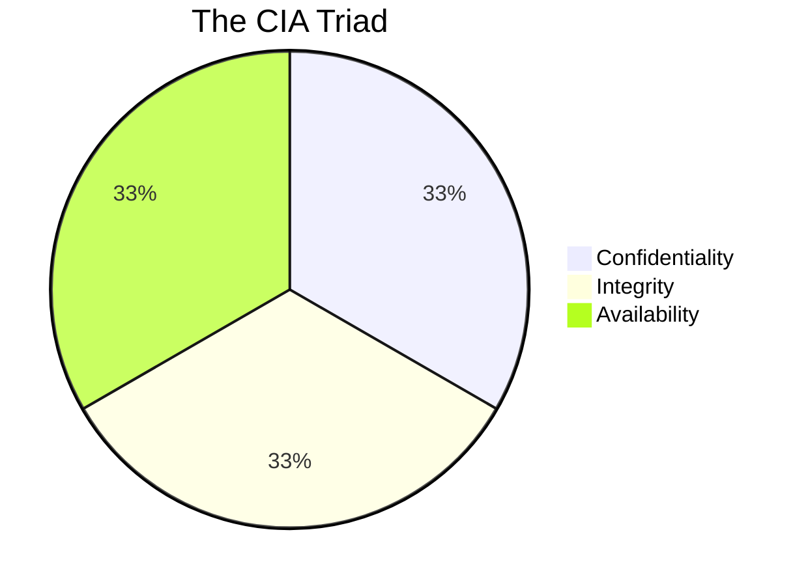
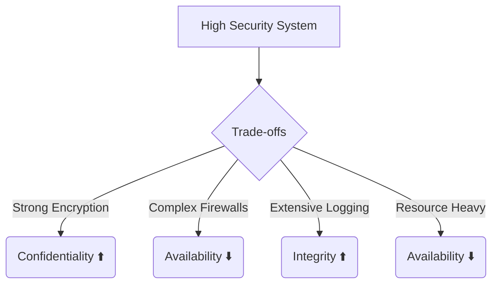

# 🔺 The CIA Triad: The Cornerstone of Information Security

The CIA Triad—Confidentiality, Integrity, and Availability—is the most
fundamental model in information security. It serves as the benchmark against
which all security systems and policies are evaluated. Every security control,
from a complex firewall appliance to a simple password policy, is designed to
support one or more of these three pillars.

This comprehensive guide explores each component in exhaustive detail, providing
theoretical foundations, practical implementation strategies, technical
deep-dives, and real-world case studies demonstrating what happens when these
pillars fail.

---

## 1. 🤫 Confidentiality: Protecting Data from Unauthorized Access

Confidentiality is roughly equivalent to privacy. It involves the efforts of an
organization to make sure data is kept secret or private. To accomplish this,
access to information must be controlled to prevent the unauthorized sharing of
data—whether intentional or accidental.

### 1.1 🧠 Core Concepts of Confidentiality

Confidentiality goes beyond simply hiding data. It requires a robust
understanding of:

- 🗂️ **Data Classification:** Not all data is created equal. Organizations must
  classify data (e.g., Public, Internal, Confidential, Restricted) to apply
  appropriate levels of protection.
- 👁️ **Need-to-Know Principle:** Individuals should only have access to the
  specific data necessary to perform their job functions.
- 🔑 **Least Privilege:** Users and systems should operate with the lowest level
  of permissions required.

### 1.2 ⚙️ Technical Implementation of Confidentiality

Achieving confidentiality requires a multi-layered approach combining several
technologies:

#### 1.2.1 🔐 Encryption (Cryptography)

Encryption is the primary mechanism for ensuring confidentiality. It transforms
readable data (plaintext) into an unreadable format (ciphertext) using an
algorithm and a key.

- **Symmetric Encryption:** Uses a single key for both encryption and decryption
  (e.g., AES-256). It's fast and suitable for bulk data (Data at Rest).
  - _Implementation:_ Full Disk Encryption (FDE) using tools like BitLocker or
    LUKS; Database-level encryption (TDE).
- **Asymmetric Encryption (Public Key Cryptography):** Uses a pair of keys
  (public and private). The public key encrypts; the private key decrypts (e.g.,
  RSA, ECC). Essential for secure communication (Data in Transit).
  - _Implementation:_ TLS/SSL protocols for securing web traffic (HTTPS).
- **End-to-End Encryption (E2EE):** Data is encrypted on the sender's device and
  only decrypted on the recipient's device, ensuring even service providers
  cannot read it.

#### 1.2.2 🚪 Access Controls

Access controls are the gatekeepers.

- **Authentication (Who are you?):**
  - _Passwords/Passphrases:_ The weakest form, requiring strong complexity rules
    and regular rotation.
  - _Multi-Factor Authentication (MFA):_ Combines something you know (password),
    something you have (security token, phone), and something you are
    (biometrics).
    > ⚠️ **Warning:** MFA is non-negotiable for critical systems.
  - _Biometrics:_ Fingerprint, retina scans, facial recognition.
- **Authorization (What can you do?):**
  - _Role-Based Access Control (RBAC):_ Access is granted based on the user's
    role within the organization.
  - _Attribute-Based Access Control (ABAC):_ Access is granted based on
    attributes (user department, time of day, location, device security
    posture). More dynamic than RBAC.
  - _Mandatory Access Control (MAC):_ The strictest model, typically used by
    government/military, where the operating system constrains the ability of a
    subject to access an object based on security clearances.

#### 1.2.3 🎭 Data Masking and Tokenization

Used primarily in non-production environments or when processing payments.

- **Masking:** Obscuring specific data elements (e.g., displaying only the last
  four digits of a social security number: `XXX-XX-1234`).
- **Tokenization:** Replacing sensitive data with non-sensitive substitutes
  (tokens) that have no extrinsic or exploitable meaning.

### 1.3 🚨 Case Study: Confidentiality Failure - The Equifax Breach (2017)

- **The Incident:** Hackers stole the personal data (names, SSNs, birth dates,
  addresses) of nearly 150 million Americans.
- **The Failure:** The breach occurred via an unpatched vulnerability in the
  Apache Struts web framework. However, the _magnitude_ of the breach was a
  failure of confidentiality controls: data was stored in plaintext, network
  segmentation was inadequate (allowing lateral movement), and aggressive
  monitoring/DLP systems were either missing or misconfigured.
- **The Lesson:** Encryption at rest and strict internal access controls are
  critical fail-safes when perimeter defenses are breached.

---

## 2. 🛡️ Integrity: Ensuring Data Accuracy and Trustworthiness

Integrity involves maintaining the consistency, accuracy, and trustworthiness of
data over its entire lifecycle. Data must not be changed in transit, and steps
must be taken to ensure that data cannot be altered by unauthorized people (for
example, in a breach of confidentiality).

### 2.1 🧠 Core Concepts of Integrity

Integrity ensures that you can trust the information you rely on to make
decisions.

- ✅ **Data Integrity:** The data has not been altered or destroyed in an
  unauthorized manner.
- ⚙️ **System Integrity:** The system performs its intended function in an
  unimpaired manner, free from deliberate or inadvertent unauthorized
  manipulation.
- ✍️ **Non-Repudiation:** Providing proof of the origin and integrity of data,
  ensuring that a party to a transaction cannot deny having received a
  transaction, nor can the other party deny having sent a transaction.

### 2.2 ⚙️ Technical Implementation of Integrity

#### 2.2.1 🧮 Hashing Algorithms

A hash function takes an input (or 'message') and returns a fixed-size
alphanumeric string. The string is the 'hash value' or 'message digest'.

- **Properties:** It must be deterministic, quick to compute, infeasible to
  generate the original input from the hash (one-way), and highly unlikely that
  two different inputs yield the same hash (collision resistance).
- **Algorithms:** SHA-256, SHA-3. (MD5 and SHA-1 are deprecated due to
  vulnerability to collision attacks).
- **Use Cases:** Downloading software (verifying the file hasn't been tampered
  with by comparing hashes), storing passwords (storing the hash, never the
  plaintext password).

#### 2.2.2 🖋️ Digital Signatures

Digital signatures combine hashing with asymmetric cryptography to provide both
integrity and non-repudiation.

1.  The sender creates a hash of the document.
2.  The sender encrypts the hash with their _private_ key. This encrypted hash
    is the digital signature.
3.  The receiver decrypts the signature using the sender's _public_ key to
    retrieve the hash.
4.  The receiver calculates their own hash of the document.
5.  If the two hashes match, the document's integrity is verified, and
    non-repudiation is established.

#### 2.2.3 📜 Version Control and Audit Trails

- **Audit Logs:** Recording who accessed what data, when, and what changes were
  made.
- **Version Control Systems (VCS):** Tools like Git ensure that every change to
  code or configuration is tracked, attributable to a specific user, and
  reversible.

#### 2.2.4 🔍 File Integrity Monitoring (FIM)

FIM tools continuously monitor critical system files, configurations, and
content for unauthorized changes.

### 2.3 🚨 Case Study: Integrity Failure - SolarWinds Supply Chain Attack (2020)

- **The Incident:** Nation-state hackers compromised the software build
  environment of SolarWinds, injecting malicious code into updates for the Orion
  IT monitoring platform.
- **The Failure:** This was a massive failure of system and software integrity.
  The attackers managed to sign the malicious updates with SolarWinds'
  legitimate digital certificates.
- **The Lesson:** Integrity must be verified throughout the entire Software
  Development Life Cycle (SDLC).
  > **Note:** Code signing is insufficient if the build environment itself is
  > compromised.

---

## 3. 🟢 Availability: Ensuring Reliable Access to Systems and Data

Availability means that information is accessible by authorized users when they
need it. Even if data is perfectly confidential and its integrity is intact, it
is useless if it cannot be accessed.

### 3.1 🧠 Core Concepts of Availability

Availability is closely tied to operational resilience and disaster recovery.

- ⏱️ **High Availability (HA):** Designing systems to operate continuously
  without failure for a long time. Expressed in "nines" (e.g., 99.999% uptime).
- 🔁 **Redundancy:** Duplicating critical components or functions of a system
  with the intention of increasing reliability.
- 🛡️ **Fault Tolerance:** The property that enables a system to continue
  operating properly in the event of the failure of one or more of its
  components.

### 3.2 ⚙️ Technical Implementation of Availability

#### 3.2.1 🔁 Redundancy and Failover

Eliminating Single Points of Failure (SPOF) is paramount.

- **Hardware Redundancy:** RAID arrays, dual power supplies, multiple NICs.
- **Network Redundancy:** Multiple ISPs, redundant core switches, BGP/OSPF
  dynamic routing.
- **Server/Application Redundancy:** Load balancers distributing traffic across
  a cluster of servers.
- **Geographic Redundancy:** Replicating infrastructure across different
  physical locations.

#### 3.2.2 🛡️ Defending Against DDoS Attacks

Distributed Denial of Service (DDoS) attacks are explicit attempts to destroy
availability by overwhelming a system with traffic.

- **Mitigation Strategies:** Over-provisioning bandwidth, CDNs, DDoS scrubbing
  services (Cloudflare, AWS Shield), Rate limiting.

#### 3.2.3 🔄 Disaster Recovery (DR) and Backups

When primary systems fail entirely, DR processes take over.

- **Backups:** The 3-2-1 rule is standard: 3 copies of data, on 2 different
  media, 1 of which is offsite. Immutability is critical for recovering from
  ransomware.
- **Recovery Objectives:**
  - _RTO (Recovery Time Objective):_ How quickly must the system be restored?
  - _RPO (Recovery Point Objective):_ How much data loss is acceptable?

#### 3.2.4 🛠️ Patch Management and System Maintenance

Proper lifecycle management ensures systems are stable and secure, minimizing
planned downtime.

### 3.3 🚨 Case Study: Availability Failure - The Dyn Cyberattack (2016)

- **The Incident:** A massive DDoS attack against Dyn, a major DNS provider.
- **The Failure:** The Mirai botnet flooded Dyn's servers with malicious
  traffic, making major sites like Twitter, Reddit, Netflix, and GitHub
  inaccessible.
- **The Lesson:** The reliance on single critical infrastructure providers
  creates systemic risk.

---

## 4. ⚖️ The Tension Within the Triad

The elements of the CIA Triad are often at odds with one another. Designing a
security system requires balancing these three pillars based on the specific
needs of the organization.

### 4.1 🎯 Context is King

The optimal balance shifts depending on the scenario:

1.  🏥 **A Medical Emergency System:** **Availability** is paramount. A doctor
    needs immediate access to a patient's allergy records.
2.  🏦 **A Financial Ledger:** **Integrity** is the absolute highest priority. A
    bank must ensure that an account balance cannot be arbitrarily changed.
3.  🪖 **Military Intelligence:** **Confidentiality** is the overriding concern.

---

## 5. 🧩 Expanding the Model: The Parkerian Hexad

While the CIA Triad remains foundational, Donn Parker proposed the Parkerian
Hexad, adding three attributes:

1.  **Possession or Control:** You can lose control of data without losing
    confidentiality.
2.  **Authenticity:** Ascertaining the validity of the information, a message,
    or the originator.
3.  **Utility:** The usefulness of the data.

## 6. 📊 Practical Application: A CIA Triad Risk Assessment Matrix

Organizations use the CIA Triad to conduct risk assessments for new systems.

| 🏢 Information System / Data Type          | 🤫 Confidentiality Impact | 🛡️ Integrity Impact | 🟢 Availability Impact | 🚨 Overall Security Categorization |
| :----------------------------------------- | :------------------------ | :------------------ | :--------------------- | :--------------------------------- |
| **Public Company Website**                 | **Low**                   | **Moderate**        | **Moderate**           | **Moderate**                       |
| **HR Database (PII)**                      | **High**                  | **Moderate**        | **Low**                | **High**                           |
| **Industrial Control System (Power Grid)** | **Low**                   | **High**            | **High**               | **High**                           |
| **Financial Transaction Database**         | **High**                  | **High**            | **High**               | **High**                           |

## 🏁 Conclusion

The CIA Triad is not just theoretical; it is a practical, operational framework
used every day by security professionals to design architectures, evaluate
risks, and respond to incidents. Mastery of Confidentiality, Integrity, and
Availability is the fundamental requirement for anyone building or defending
modern digital systems.
