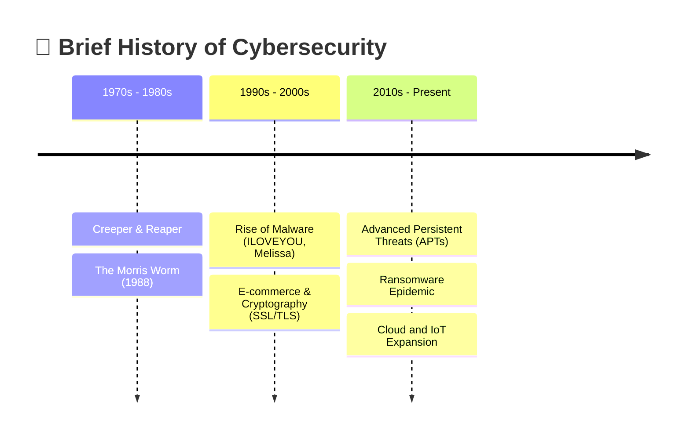

# Introduction to Cybersecurity: A Comprehensive Deep Dive

## 1. 🌐 What is Cybersecurity?

Cybersecurity is the practice of protecting systems, networks, hardware, and
data from digital attacks. In our increasingly interconnected world, where the
volume of digital assets expands exponentially, cybersecurity has evolved from a
niche IT concern into a critical pillar of national security, economic
stability, and personal privacy.

At its core, cybersecurity aims to defend against threats that seek to:

- 🔓 **Access** sensitive or restricted information.
- ✍️ **Alter** or manipulate data for fraudulent purposes.
- 💥 **Destroy** critical infrastructure or data repositories.
- 💰 **Extort** organizations or individuals (e.g., through ransomware).
- 🛑 **Disrupt** normal business or societal operations.

> ⚠️ **Warning:** The complexity of modern cybersecurity arises from the vast
> attack surface created by the proliferation of endpoints (IoT devices,
> smartphones, cloud servers) and the sophisticated, often state-sponsored,
> nature of contemporary threat actors.

---

## 2. ⏳ The Evolution of Cybersecurity

Understanding the current landscape requires a look at its historical context.

<!-- Visual flow for Introduction to Cybersecurity: A Comprehensive Deep Dive. -->

### 2.1 🕰 The Early Days (1970s - 1980s)

- 🐛 **Creeper and Reaper:** In the early 1970s, the "Creeper" worm became one
  of the first known computer viruses, traversing the ARPANET. It was followed
  by "Reaper," a program designed to find and destroy Creeper, acting as the
  first antivirus software.
- 🪱 **The Morris Worm (1988):** Robert Tappan Morris released a worm that
  inadvertently brought down a significant portion of the early internet.
  > **Note:** This event underscored the fragility of interconnected systems and
  > led to the creation of CERT (Computer Emergency Response Team).

### 2.2 🛒 The Commercial Internet (1990s - 2000s)

- 🦠 **Rise of Malware:** As personal computers became ubiquitous, viruses like
  "ILOVEYOU" and "Melissa" caused billions in damages, highlighting the need for
  commercial antivirus solutions and firewalls.
- 🔐 **E-commerce and Cryptography:** The boom of online shopping necessitated
  secure transactions, leading to the widespread adoption of SSL/TLS and
  public-key infrastructure (PKI).

### 2.3 The Modern Era (2010s - Present)

- 🕵️ **Advanced Persistent Threats (APTs):** State-sponsored groups began
  conducting long-term, stealthy operations for espionage and sabotage (e.g.,
  Stuxnet).
- 💸 **Ransomware Epidemic:** The monetization of malware through cryptocurrency
  led to devastating attacks on healthcare, infrastructure, and enterprises.
- ☁️ **Cloud and IoT:** The shift to cloud computing and the explosion of IoT
  devices drastically expanded the attack surface, shifting the focus from
  perimeter defense to identity-based and zero-trust architectures.

## 3. Core Domains of Cybersecurity

Cybersecurity is not a monolithic discipline; it is an amalgamation of
specialized domains, each requiring distinct skill sets and technologies.

| 🛡️ Domain                | 🎯 Focus Area                                      | ⚙️ Key Technologies / Practices |
| :----------------------- | :------------------------------------------------- | :------------------------------ |
| **Network Security**     | Traffic analysis, micro-segmentation, DDoS defense | NGFW, IDS/IPS, VPNs, NAC        |
| **Application Security** | Vulnerability-free software, SDLC integration      | SAST, DAST, IAST, SCA, OWASP    |
| **Cloud Security**       | Cloud environments (IaaS, PaaS, SaaS)              | CASB, CSPM, CWPP                |
| **Endpoint Security**    | End-user devices (desktops, mobile)                | EDR, XDR, MDM                   |
| **IAM**                  | Authentication, Authorization                      | MFA, SSO, PAM, RBAC             |
| **Data Security**        | Protection from unauthorized access/corruption     | Encryption, Tokenization, DLP   |

### 3.1 🕸 Network Security

Network security involves implementing hardware and software mechanisms to
protect the usability and integrity of a network and its data.

- **Key Technologies:** Firewalls (Next-Generation Firewalls - NGFW), Intrusion
  Detection/Prevention Systems (IDS/IPS), Virtual Private Networks (VPNs),
  Network Access Control (NAC).
- **Focus Areas:** Traffic analysis, micro-segmentation, securing routing
  protocols (BGP), and defending against Distributed Denial of Service (DDoS)
  attacks.

### 3.2 💻 Application Security (AppSec)

AppSec focuses on keeping software and devices free of vulnerabilities. This
must be integrated early in the Software Development Life Cycle (SDLC) – a
practice known as "shifting left."

- **Key Practices:** Static Application Security Testing (SAST), Dynamic
  Application Security Testing (DAST), Interactive Application Security Testing
  (IAST), Software Composition Analysis (SCA).
- **Common Frameworks:** OWASP Top 10 (focusing on vulnerabilities like SQL
  Injection, Cross-Site Scripting (XSS), and Broken Authentication).

### 3.3 ☁ Cloud Security

Cloud security addresses the unique challenges of protecting data, applications,
and infrastructure hosted in cloud computing environments (IaaS, PaaS, SaaS).

- **Shared Responsibility Model:** Understanding which security aspects are
  handled by the Cloud Service Provider (CSP) (e.g., physical security) and
  which are the responsibility of the customer (e.g., data encryption, IAM).
- **Key Technologies:** Cloud Access Security Brokers (CASB), Cloud Security
  Posture Management (CSPM), Cloud Workload Protection Platforms (CWPP).

### 3.4 📱 Endpoint Security

Endpoint security is the practice of securing end-user devices such as desktops,
laptops, and mobile devices from being exploited by malicious actors.

- **Evolution:** Moved from traditional signature-based antivirus to Endpoint
  Detection and Response (EDR) and Extended Detection and Response (XDR) systems
  that use behavioral analysis and machine learning to detect anomalous
  activity.
- **Mobile Device Management (MDM):** Essential for enforcing security policies
  on mobile assets.

### 3.5 🔑 Identity and Access Management (IAM)

IAM ensures that the right individuals have access to the right resources at the
right times for the right reasons.

- **Core Concepts:** Authentication (verifying identity) vs. Authorization
  (granting privileges).
- **Key Technologies:** Multi-Factor Authentication (MFA), Single Sign-On (SSO),
  Privileged Access Management (PAM), Role-Based Access Control (RBAC).

### 3.6 💾 Data Security

Data security focuses on protecting data from unauthorized access and data
corruption throughout its lifecycle.

- **Techniques:** Encryption (at rest, in transit, in use), tokenization, data
  masking, and Data Loss Prevention (DLP) solutions.

## 4. 🌍 The Societal and Economic Impact of Cybersecurity

The ramifications of cybersecurity failures extend far beyond IT departments.

### 4.1 📉 Economic Costs

Cybercrime is a multi-trillion-dollar global enterprise. Costs are incurred
through:

- 💸 **Direct Financial Loss:** Theft of funds, ransomware payments.
- ⏱️ **Operational Disruption:** Downtime causing loss of revenue and
  productivity.
- 🛠️ **Remediation Costs:** Incident response, legal fees, public relations, and
  system overhauls.
- 🧠 **Intellectual Property Theft:** Loss of competitive advantage through the
  theft of trade secrets.

### 4.2 📉 Reputational Damage

A significant data breach can severely damage consumer trust. Organizations may
suffer customer churn, lowered stock prices, and long-term brand degradation.

### 4.3 🏛 National Security and Critical Infrastructure

Cyber attacks are increasingly used as tools of geopolitical warfare. Attacks on
critical infrastructure (power grids, water treatment facilities, healthcare
systems) can cause physical harm, societal panic, and disrupt essential
services.

> ⚠️ **Warning:** The concept of "cyber warfare" is now a recognized domain of
> conflict alongside land, sea, air, and space.

## 5. ⚖ Key Principles and Best Practices (High-Level)

While specific implementations vary, foundational principles guide effective
cybersecurity strategies:

### 5.1 🏰 Defense in Depth

Never rely on a single security control. Defense in Depth (DiD) involves
layering multiple security measures (e.g., firewalls + endpoint protection +
strong IAM + user training) so that if one fails, others are in place to thwart
the attack.

### 5.2 🔑 Least Privilege

Users, applications, and systems should only be granted the minimum level of
access necessary to perform their required functions. This limits the potential
blast radius if an account is compromised.

### 5.3 🚫 Zero Trust Architecture

The traditional "castle and moat" security model (trust everyone inside the
network) is obsolete. Zero Trust operates on the principle of "never trust,
always verify."

> **Note:** Every access request, regardless of origin, must be authenticated,
> authorized, and continuously validated.

### 5.4 Continuous Monitoring and Incident Response

Assume breach. Organizations must continuously monitor their environments for
anomalies and have a well-documented, regularly tested Incident Response (IR)
plan to quickly contain and eradicate threats.

## 6. 🧑‍🤝‍🧑 The Human Element

Technology alone cannot solve cybersecurity challenges. The "human element" is
often cited as the weakest link, but it can also be the strongest defense.

### 6.1 🎓 Security Awareness Training

Regular, engaging training helps employees recognize phishing attempts,
understand social engineering tactics, and practice safe data handling.

### 6.2 🌟 Security Culture

Fostering a culture where security is everyone's responsibility, and where
reporting potential issues is encouraged rather than punished, is crucial for
organizational resilience.

## 🏁 Conclusion

Cybersecurity is a dynamic, continuous process. As technology advances, so too
do the threats. A robust cybersecurity posture requires a holistic approach
encompassing cutting-edge technology, rigorous processes, and an educated,
vigilant workforce. The fundamentals discussed here serve as the foundation upon
which resilient systems and secure organizations are built.

## Quick Reference

| Area | Revision point |
|---|---|
| Definition | State exactly what the topic means. |
| Mechanism | Explain the steps that produce the result. |
| Example | Use a small realistic case. |
| Pitfalls | Know common mistakes and boundary cases. |
