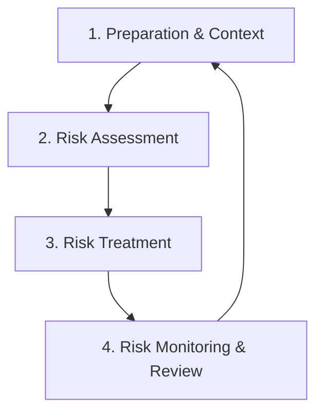

# 📉 Cybersecurity Risk Management: A Strategic Approach

In the modern digital landscape, perfect security is an illusion. Organizations
cannot eliminate all threats, nor can they afford to protect every asset to the
maximum degree. Instead, cybersecurity is fundamentally an exercise in **risk
management**.

Risk management is the systematic process of identifying, assessing, and
mitigating threats to an organization's digital assets. It aligns security
spending with business objectives, ensuring that resources are deployed where
they are needed most to reduce the potential for financial loss, reputational
damage, and operational disruption.

---

## 1. The Risk Management Lifecycle

Effective risk management is not a one-time project; it is a continuous,
iterative lifecycle.

<!-- Visual flow for 📉 Cybersecurity Risk Management: A Strategic Approach. -->

### Phase 1: Preparation and Context Establishment

Before assessing risk, an organization must understand what it is trying to
protect.

- **Asset Inventory:** Cataloging hardware, software, data repositories, cloud
  instances, and third-party integrations.
- **Asset Valuation:** Determining the criticality and value of each asset.
- **Defining Risk Appetite and Tolerance:**
  - _Risk Appetite:_ The broad amount of risk an organization is willing to
    accept.
  - _Risk Tolerance:_ The specific, measurable level of variance acceptable
    around a given objective.

### Phase 2: Risk Assessment (Identification and Analysis)

This is the core of the process—determining what could go wrong and how bad it
would be.

- **Threat Identification:** Cataloging potential sources of harm (e.g.,
  nation-state hackers, ransomware gangs, natural disasters).
- **Vulnerability Identification:** Finding the weaknesses that threats could
  exploit.
- **Risk Analysis:** Combining threat and vulnerability data to determine
  likelihood and impact.

### Phase 3: 🛠 Risk Treatment (Mitigation)

Once risks are prioritized, management must decide how to handle them:

1.  **Risk Mitigation (Reduction):** Implementing security controls.
2.  **Risk Transference (Sharing):** Shifting financial burden (e.g., insurance,
    MSSP).
3.  **Risk Avoidance:** Discontinuing the activity that causes the risk.
4.  **Risk Acceptance:** Acknowledging the risk and deciding not to take any
    action.
    > ⚠️ **Warning:** Risk acceptance _must_ be a formal, documented management
    > decision.

### Phase 4: 📈 Risk Monitoring and Review

The threat landscape changes daily.

- Continuous monitoring of security controls.
- Periodic reassessment (at least annually).
- Tracking Key Risk Indicators (KRIs).

### 2.1 Qualitative Risk Analysis

Qualitative analysis uses descriptive terms to evaluate likelihood and impact.

- **Pros:** Fast, good for high-level prioritization.
- **Cons:** Subjective, imprecise.

**The Risk Matrix:**

| Likelihood \ Impact     | 🟢 Low (Minor) | 🟡 Medium (Significant) | 🔴 High (Catastrophic) |
| :---------------------- | :------------- | :---------------------- | :--------------------- |
| **High (Frequent)**     | Medium Risk    | High Risk               | **Critical Risk**      |
| **Medium (Occasional)** | Low Risk       | Medium Risk             | High Risk              |
| **Low (Rare)**          | Low Risk       | Low Risk                | Medium Risk            |

### 2.2 💵 Quantitative Risk Analysis

Assigns concrete financial values to assets, expected losses, and the cost of
controls.

- **Pros:** Objective, provides clear financial metrics (ROI).
- **Cons:** Time-consuming, complex.

**Key Quantitative Metrics:**

1.  **Asset Value (AV):** The total financial value of the asset.
2.  **Exposure Factor (EF):** The percentage of value lost if a threat
    materialized.
3.  **Single Loss Expectancy (SLE):** Financial loss from a single occurrence
    (`SLE = AV * EF`).
4.  **Annualized Rate of Occurrence (ARO):** How many times per year the threat
    occurs.
5.  **Annualized Loss Expectancy (ALE):** Total financial loss expected per year
    (`ALE = SLE * ARO`).

> **Note - Calculation Example:**
>
> - AV (1 Day Downtime) = $10,000
> - EF = 1.0 (100% loss)
> - SLE = $10,000 \* 1.0 = $10,000
> - ARO = 2.0 (twice a year)
> - ALE = $10,000 \* 2.0 = **$20,000 / year.**

## 3. 🏛 Prominent Risk Management & Compliance Frameworks

| 📜 Framework  | 🌐 Origin     | 🎯 Core Focus                                            |
| :------------ | :------------ | :------------------------------------------------------- |
| **NIST CSF**  | US Govt       | 5 Functions: Identify, Protect, Detect, Respond, Recover |
| **ISO 27001** | International | establishing, implementing, and maintaining an ISMS      |
| **GDPR**      | EU            | Data privacy, PII protection, Data Subject Rights        |
| **HIPAA**     | US Health     | Protecting sensitive patient health information (PHI)    |
| **PCI-DSS**   | Industry      | Securing branded credit card transactions                |

## 4. 🕵 Threat Modeling: Proactive Risk Identification

Threat modeling identifies potential threats and vulnerabilities before code is
written.

### 4.1 🛠 The Threat Modeling Process

1.  **Decompose the Application:** Create Data Flow Diagrams (DFDs).
2.  **Determine and Rank Threats:** Use methodologies like STRIDE.
3.  **Determine Countermeasures:** Design security controls.
4.  **Validate:** Review the model.

### 4.2 🎭 The STRIDE Methodology

- **S - Spoofing (Identity):** Pretending to be someone else.
- **T - Tampering (Integrity):** Modifying data.
- **R - Repudiation (Non-repudiation):** Denying an action.
- **I - Information Disclosure (Confidentiality):** Exposing information.
- **D - Denial of Service (Availability):** Making a system unavailable.
- **E - Elevation of Privilege (Authorization):** Gaining privileged access.

## 5. 🤝 Third-Party and Supply Chain Risk Management (TPRM)

An organization's security boundary extends far beyond its own network.
Third-party vendors represent a massive area of risk.

- **TPRM Strategies:**
  - **Vendor Risk Assessments:** Security questionnaires (SIG or CAIQ).
  - **Right to Audit Clauses:** Legal language to independently audit the
    vendor.
  - **Continuous Monitoring:** Using services that scan vendor external
    perimeters.
  - **Software Bill of Materials (SBOM):** Requiring an inventory of all
    open-source and third-party components used.

## 🏁 Conclusion

Cybersecurity risk management is the engine that drives an effective security
program. By systematically identifying assets, analyzing threats, and
implementing cost-effective mitigations, organizations can navigate the digital
landscape with confidence and resilience.

## Quick Reference

| Area | Revision point |
|---|---|
| Definition | State exactly what the topic means. |
| Mechanism | Explain the steps that produce the result. |
| Example | Use a small realistic case. |
| Pitfalls | Know common mistakes and boundary cases. |
