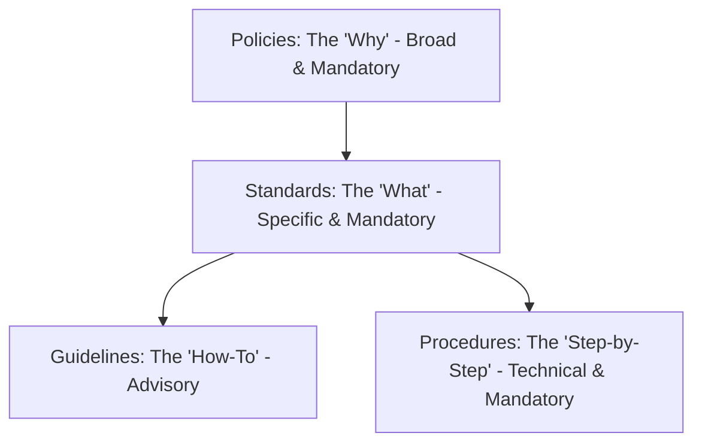

# 📜 Cybersecurity Policies and Governance: The Rules of Engagement

While firewalls, encryption algorithms, and intrusion detection systems are the
_tools_ of cybersecurity, policies and governance provide the _blueprint_.
Without strong governance, security implementations are ad-hoc, inconsistent,
and ultimately ineffective.

---

## 1. 🏛 The Governance Framework

Governance is the responsibility of executive leadership and the Board of
Directors. A strong governance program is built upon a hierarchical document
structure:

<!-- Visual flow for 📜 Cybersecurity Policies and Governance: The Rules of Engagement. -->

### 1.1 📚 The Documentation Hierarchy

- **Level 1: Policies (The "Why")**: Approved by executive management. Broad,
  technology-agnostic, mandatory.
- **Level 2: Standards (The "What")**: Specific requirements to comply with the
  Policy. Measurable rules.
- **Level 3: Guidelines (The "How-To")**: Recommendations or best practices.
  Advisory.
- **Level 4: Procedures (The "Step-by-Step")**: Detailed technical instructions
  for executing tasks.

## 2. Core Cybersecurity Policies

| 📃 Policy Name                  | 🎯 Purpose & Key Elements                                                                         |
| :------------------------------ | :------------------------------------------------------------------------------------------------ |
| **Information Security Policy** | Master policy; defines roles (CISO), responsibilities, and overall commitment to security.        |
| **Acceptable Use Policy (AUP)** | Defines allowed/prohibited actions for employees on company IT assets. No expectation of privacy. |
| **Access Control Policy**       | Enforces Least Privilege and Need-to-Know. Defines onboarding/offboarding processes.              |
| **Data Classification Policy**  | Categorizes data (Public, Confidential, Restricted) and dictates handling/encryption rules.       |
| **Incident Response Policy**    | Outlines preparation, detection, response, and recovery processes for cyber incidents.            |
| **BYOD Policy**                 | Governs use of personal devices for work. Mandates MDM, device encryption, remote wipe rights.    |

## 3. The Policy Lifecycle Management Process

A policy written and forgotten is useless. Effective governance requires a
managed lifecycle.

1.  **Development:** Drafting the document with input from key stakeholders.
2.  **Approval:** Obtaining formal sign-off from executive leadership.
3.  **Distribution and Communication:** Making policies accessible (e.g.,
    intranet).
4.  **Training and Acknowledgement:** Employees must be trained and sign an
    acknowledgment.
    > ⚠️ **Warning:** This step is vital for HR and legal enforcement.
5.  **Enforcement:** Monitoring compliance through technical controls and
    audits.
6.  **Review and Update:** Periodic reviews (usually annually) to ensure
    relevance.

## 4. ⚖ Compliance and Regulatory Auditing

Policies are the internal mechanism by which an organization achieves external
compliance.

### 4.1 🕵 The Role of the Auditor

Auditors operate on the principle of: **"Do what you say, and say what you do.
Then prove it."**

- **Say what you do:** Review Policies and Standards.
- **Do what you say:** Observe operations.
- **Prove it:** Demand evidence (logs, configuration screenshots, training
  rosters).

### 4.2 📋 Major Compliance Frameworks

- 🌍 **GDPR (EU):** Focuses heavily on Data Classification, Consent, and Data
  Subject Rights.
- 🏥 **HIPAA (Healthcare):** Requires rigorous Access Control policies,
  extensive audit logging for PHI.
- ☁️ **SOC 2:** Evaluating security, availability, processing integrity,
  confidentiality, and privacy for service providers.

## 5. Security Culture: The Ultimate Enforcement Mechanism

The most comprehensive set of policies will fail if the organizational culture
does not value security.

### 5.1 🌱 Fostering a Positive Security Culture

- **Top-Down Support:** Leadership must visibly adhere to policies.
- **Security by Design:** Make the secure way the _easiest_ way via transparent
  technical controls.
- **Engaging Awareness Training:** Use gamification, simulated phishing, and
  role-specific training.
- **A "Just Culture":** Encourage employees to report suspected incidents
  without fear of immediate termination.
  > **Note:** Punitive cultures lead to hidden breaches; just cultures lead to
  > rapid incident response.

## 🏁 Conclusion

Cybersecurity policies and governance are the connective tissue between
executive strategy and technical implementation. By establishing clear rules,
rigorous lifecycles, and a strong security culture, organizations can build a
resilient foundation capable of withstanding the complexities of the modern
threat landscape.

## Quick Reference

| Area | Revision point |
|---|---|
| Definition | State exactly what the topic means. |
| Mechanism | Explain the steps that produce the result. |
| Example | Use a small realistic case. |
| Pitfalls | Know common mistakes and boundary cases. |

## Trade-offs

Architecture decisions are rarely about a single “best” technology. Compare options using scale, latency, consistency, availability, operational cost, complexity, and team capability. State which requirement matters most because the priority determines the design.

## Failure Thinking

Assume a dependency can fail. Decide how the system detects the failure, limits its impact, recovers, and avoids creating a second failure during recovery. Timeouts, retries, idempotency, circuit breakers, and backpressure should be discussed only when they solve a real failure mode.
