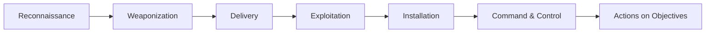

# 🌍 The Cybersecurity Threat Landscape: Actors, Vectors, and Impacts

The term "threat landscape" refers to the totality of potential and actual cyber
threats confronting an organization, industry, or nation at a given time. It is
a constantly shifting battleground characterized by rapid innovation on the part
of attackers and the continuous discovery of new vulnerabilities.

---

## 1. 🦹 Threat Actors: Who is Attacking?

Threat actors are individuals or groups responsible for cyber incidents.

| 🎭 Actor Type            | 🎯 Motivation                     | ⚙️ Characteristics / Tactics                      | 🚨 Famous Examples          |
| :----------------------- | :-------------------------------- | :------------------------------------------------ | :-------------------------- |
| **Nation-State (APTs)**  | Espionage, Sabotage, Geopolitics  | Highly skilled, zero-days, massive resources.     | Stuxnet, Cozy Bear, Lazarus |
| **Organized Cybercrime** | Financial Gain                    | Ransomware-as-a-Service, BEC, Magecart.           | Conti, LockBit, REvil       |
| **Hacktivists**          | Political/Social Causes, Ideology | DDoS, website defacement, doxing.                 | Anonymous                   |
| **Insider Threats**      | Revenge, Accidental, Financial    | Difficult to detect. Misuse of legitimate access. | Careless employees, spies   |
| **Script Kiddies**       | Thrill-seeking, Vandalism         | Unskilled, use pre-packaged exploits.             | Massive automated scans     |

### 1.1 🏛️ Nation-State Actors (APTs)

- They often lurk in networks for months or years without detection.
  > **Note:** Lazarus Group (North Korea) is unique among nation-states as they
  > frequently engage in direct financial theft to fund their regime.

### 1.2 🕴️ Organized Cybercrime Syndicates

- Highly structured, profit-driven groups operating specialized underground
  economies.

### 1.3 🏴‍☠️ Hacktivists

- Individuals or groups who use hacking to promote a political agenda or
  ideology.

### 1.4 🏢 Insider Threats

- These are incredibly dangerous because the actor already possesses legitimate
  access.
  > ⚠️ **Warning:** Careless/Negligent Insiders are statistically the most
  > common cause of security incidents.

### 1.5 🧸 Script Kiddies

- Unskilled individuals who use pre-packaged automated tools and scripts.

---

## 2. 🚪 Common Attack Vectors (How They Get In)

### 2.1 🎣 Social Engineering

Exploits human psychology rather than technical vulnerabilities.

- **Phishing:** Fraudulent emails tricking users into clicking links.
- **Spear-Phishing:** Highly targeted phishing using customized info.
- **Whaling:** Spear-phishing targeted at high-level executives (CEOs).
- **Baiting:** Leaving physical media (infected USB) to be found.

### 2.2 🦠 Malware (Malicious Software)

- **Ransomware:** Encrypts data, demanding payment. _Double Extortion_ involves
  stealing data before encrypting.
- **Trojans:** Malware disguised as legitimate software.
- **Spyware/Keyloggers:** Secretly monitors user activity.
- **Rootkits:** Designed to hide malicious processes, giving persistent,
  privileged access.

### 2.3 💥 Software Vulnerabilities and Exploits

- **Unpatched Software:** The most common technical vector.
- **Zero-Day Exploits:** Attacks targeting vulnerabilities unknown to the
  software vendor.
- **SQL Injection (SQLi):** Malicious SQL statements manipulating backend
  databases.
- **Cross-Site Scripting (XSS):** Injecting malicious scripts into trusted
  websites.

### 2.4 🔗 Supply Chain Attacks

Compromising an organization by attacking a weaker link in its supply chain
(e.g., SolarWinds, Kaseya VSA).

### 2.5 ⚙️ Misconfigurations

Mistakes by IT or security admins, such as leaving cloud storage buckets
publicly readable or using default passwords.

---

## 3. ⛓️ The Lifecycle of an Attack: The Cyber Kill Chain

Understanding how attacks progress helps defenders implement controls at
multiple stages.

1.  **Reconnaissance:** Gathering info about the target via OSINT and scans.
2.  **Weaponization:** Coupling a payload (e.g., RAT) with an exploit.
3.  **Delivery:** Transmitting the weapon to the target (e.g., spear-phishing).
4.  **Exploitation:** Triggering the vulnerability.
5.  **Installation:** Establishing a persistent presence (backdoor).
6.  **Command and Control (C2):** Receiving further instructions from attacker
    servers.
7.  **Actions on Objectives:** Exfiltration, ransomware execution, lateral
    movement.

> **Note - Defense in Depth:** The goal of security architecture is to break the
> Kill Chain at as many points as possible. Security awareness stops Delivery;
> EDR stops Installation.

---

## 4. 🔮 Emerging Trends in the Threat Landscape

- **🤖 AI in Attacks:** Attackers use generative AI (LLMs) to write convincing
  phishing emails and automate vulnerability discovery. Deepfakes aid social
  engineering.
- **🏭 Targeting of OT and IoT:** Industrial control systems and IoT devices
  present massive safety risks as they often run legacy, unpatchable software.
- **🔑 Identity-Based Attacks:** With the shift to remote work, attackers focus
  on "logging in" by compromising identities (credential stuffing, MFA fatigue)
  rather than hacking firewalls.

## 🏁 Conclusion

The modern cybersecurity threat landscape is complex, professionalized, and
relentless. Organizations must adopt proactive threat modeling, continuous
monitoring, and a layered defense-in-depth strategy to mitigate the diverse
array of threats they face daily.
