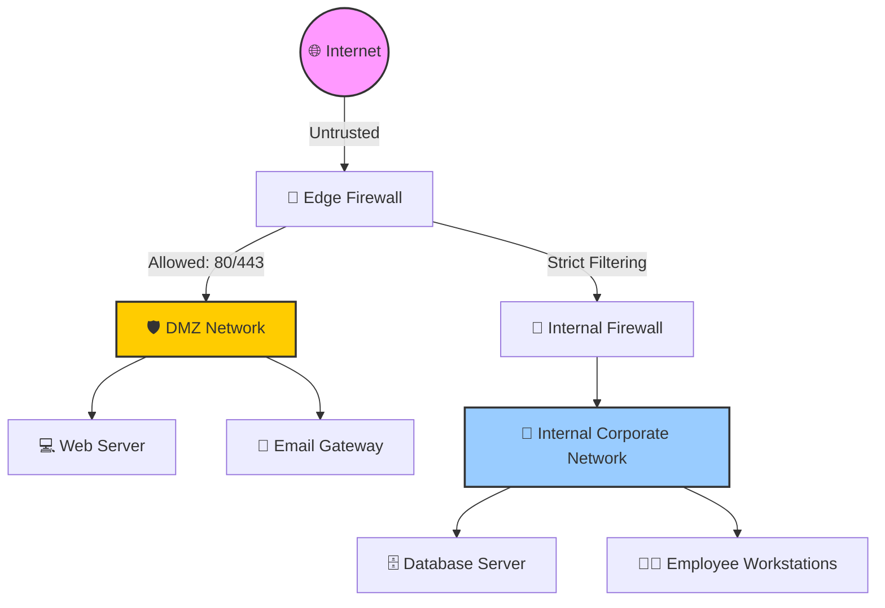

# 🧱 Firewalls: Perimeter and Internal Defense

Firewalls are the cornerstone of network security, acting as a barrier between
trusted internal networks and untrusted external networks (like the Internet).
They enforce access control policies, inspecting traffic as it crosses the
network boundary to permit or deny packets based on predefined rules. 🛡️

## 🕰 The Evolution of Firewalls

Understanding the history of firewalls is essential for grasping why modern
networks require layered defenses.

| Firewall Type                       | OSI Layer | Mechanism                                                                              | Pros ✅                                                                                      | Cons ❌                                                                                                |
| :---------------------------------- | :-------- | :------------------------------------------------------------------------------------- | :------------------------------------------------------------------------------------------- | :----------------------------------------------------------------------------------------------------- |
| **1. Packet Filtering (Stateless)** | 3 & 4     | Examines packets individually in isolation (Source/Dest IP, Protocol, Port).           | Extremely fast, low memory overhead, ideal for edge routers (ACLs).                          | Unaware of connection states. Requires explicitly allowing return traffic. Susceptible to IP spoofing. |
| **2. Stateful Inspection**          | 3 & 4     | Maintains a state table tracking active connections (e.g., TCP 3-way handshake).       | Vastly more secure than stateless, reduces complex bidirectional rule sets.                  | Primarily blind to Layer 7 attacks. Will allow malicious HTTP payloads over established connections.   |
| **3. Proxy (App-Level Gateway)**    | 7         | Acts as an intermediary, establishing separate connections to the destination.         | Deep understanding of app protocols. Hides internal IPs, completely breaks/inspects traffic. | High latency, resource-intensive, breaks apps not supporting proxies.                                  |
| **4. Next-Gen (NGFW)**              | 3 - 7     | Combines stateful inspection with DPI, IPS, malware filtering, and identity awareness. | App awareness, Identity integration (AD/LDAP), SSL/TLS Decryption.                           | Expensive, complex to configure and manage.                                                            |

---

## 🔬 Deep Packet Inspection (DPI) Mechanics

Deep Packet Inspection is what makes NGFWs and modern IPS effective. Instead of
just reading the packet headers (IP and TCP/UDP), DPI examines the data payload
of the packet. 📦

### ⚙ How DPI Works:

1. **Flow Reassembly:** 🧩 The firewall buffers and reassembles fragmented IP
   packets and out-of-order TCP segments into a continuous stream.
2. **Protocol Decoding:** 🔤 The stream is analyzed to verify it conforms to RFC
   standards for the specific protocol (e.g., ensuring traffic on port 80 is
   actually HTTP and not SSH).
3. **Pattern Matching:** 🔍 The payload is scanned against signature databases
   for known malware, exploits, or restricted content.
4. **Heuristic/Behavioral Analysis:** 🧠 Checking for statistical anomalies,
   like unusually large DNS packets (indicating DNS tunneling) or excessive
   connection rates.

## Firewall Architecture Patterns

Deploying a firewall effectively requires a well-thought-out architectural
topology.

### 🏰 The Bastion Host

A heavily fortified system exposed directly to the internet, acting as a
gateway. It has minimal services running and is hardened against attacks. Often
used as a jump server or VPN endpoint.

### 🏢 Screened Subnet (DMZ - Demilitarized Zone)

The most common enterprise architecture. It uses one or more firewalls to create
an isolated subnet for servers that must be publicly accessible (Web servers,
email gateways).

<!-- Visual flow for 🧱 Firewalls: Perimeter and Internal Defense. -->


- **🚦 Traffic Flow:**
  - Internet ➡️ DMZ: Allowed (e.g., ports 80/443).
  - DMZ ➡️ Internal: **Strictly Denied**, except for specific necessary
    application ports (e.g., DMZ Web Server to Internal DB Server).
  - Internal ➡️ DMZ/Internet: Allowed (often NATted).

### 🔀 Dual-Homed vs. Multi-Homed Firewalls

- **Dual-Homed:** A firewall with exactly two interfaces (Inside and Outside).
- **Multi-Homed:** A firewall with three or more interfaces (Inside, Outside,
  DMZ, Guest Wi-Fi, Management). This allows for complex security zoning.

## 💻 Configuration Example: iptables (Linux)

While enterprise environments use GUI-driven NGFWs (like Palo Alto, Fortinet, or
Check Point), understanding underlying command-line configurations like
`iptables` is crucial for host-based security and container environments.

Here is an example of a strict, stateful firewall script using `iptables` for a
web server:

# Basic example showing the core idea.
```bash
#!/bin/bash
## Flush existing rules
iptables -F
iptables -X

## Set default policies to DROP everything
iptables -P INPUT DROP
iptables -P FORWARD DROP
iptables -P OUTPUT DROP

## Allow loopback traffic (internal host processes)
iptables -A INPUT -i lo -j ACCEPT
iptables -A OUTPUT -o lo -j ACCEPT

## Allow established and related incoming connections (Stateful tracking)
iptables -A INPUT -m conntrack --ctstate ESTABLISHED,RELATED -j ACCEPT

## Allow outbound traffic, keeping state
iptables -A OUTPUT -m conntrack --ctstate NEW,ESTABLISHED,RELATED -j ACCEPT

## Allow inbound SSH (Port 22) - Ideally restrict by source IP
iptables -A INPUT -p tcp --dport 22 -m conntrack --ctstate NEW -s 203.0.113.50 -j ACCEPT

## Allow inbound HTTP/HTTPS (Ports 80, 443)
iptables -A INPUT -p tcp --dport 80 -m conntrack --ctstate NEW -j ACCEPT
iptables -A INPUT -p tcp --dport 443 -m conntrack --ctstate NEW -j ACCEPT

## Drop invalid packets
iptables -A INPUT -m conntrack --ctstate INVALID -j DROP

## Log dropped packets for debugging (optional, rate-limited)
iptables -A INPUT -m limit --limit 5/min -j LOG --log-prefix "iptables-dropped: "
```

> ⚠️ **Warning:** When configuring remote firewalls, always ensure you have an
> explicit ALLOW rule for your SSH connection before applying DROP policies, or
> you will lock yourself out of the server!

## 🌟 Firewall Best Practices

To maintain a secure and manageable firewall infrastructure, adhere to these
operational best practices:

1. **🚫 Default Deny Policy:** The foundation of firewall security. The last
   rule in any policy should always be a "Deny All" or "Drop All" rule.
   Everything not explicitly permitted must be blocked.
2. **🧹 Rule Minimization and Cleanup:** Over time, firewalls accumulate stale
   rules (e.g., for decommissioned servers). Regularly audit and remove unused
   rules. A large rulebase increases CPU processing time and configuration
   complexity.
3. **📦 Use Object Groups:** Instead of creating dozens of rules for individual
   IP addresses, group them (e.g., `Internal-Dev-Subnets`) and apply rules to
   the group. This reduces errors and simplifies updates.
4. **📊 Enable Logging and Forward to SIEM:** Firewall logs are critical for
   incident response. Forward all logs to a centralized SIEM (Security
   Information and Event Management) system for analysis, correlation, and
   long-term retention.
5. **🔄 Implement Change Management:** Never apply firewall rules directly in
   production without a formal review process. Ensure a rollback plan exists for
   every rule change.
6. **👻 Beware of Shadow Rules:** Ensure rules are ordered correctly. Firewalls
   process rules top-down. If Rule 1 allows ALL traffic to Server A, and Rule 2
   blocks SSH to Server A, Rule 2 will never be hit (it is "shadowed" by Rule
   1).

> **Note:** A "Shadowed Rule" is a common configuration pitfall that can
> inadvertently leave critical ports exposed or block necessary traffic. Always
> review rule order!

## 🕸 Web Application Firewalls (WAF)

While traditional and NGFWs focus on network layers and broad payload
inspection, Web Application Firewalls (WAFs) are purpose-built to protect web
applications (Layer 7).

WAFs sit in front of web servers (often as reverse proxies) and specifically
inspect HTTP/HTTPS traffic. They are designed to detect and block attacks
outlined in the OWASP Top 10, such as:

- **💉 SQL Injection (SQLi):** Detecting malicious database queries appended to
  web form inputs.
- **📜 Cross-Site Scripting (XSS):** Blocking malicious JavaScript payloads
  injected into URLs or forms.
- **📂 Path Traversal:** Stopping attempts to access unauthorized files using
  `../` directory traversal techniques.

WAFs use a combination of signature-based detection and behavioral learning
(establishing a baseline of normal application usage and blocking anomalous
requests).

## 🏁 Conclusion

Firewalls remain a critical layer in the defense-in-depth strategy. From the
humble stateful filters built into Linux kernels to the massive, AI-driven NGFW
chassis in enterprise data centers, mastering firewall concepts is fundamental
to securing network perimeters and internal segments. 🛡️🔐

## Quick Reference

| Area | Revision point |
|---|---|
| Definition | State exactly what the topic means. |
| Mechanism | Explain the steps that produce the result. |
| Example | Use a small realistic case. |
| Pitfalls | Know common mistakes and boundary cases. |
