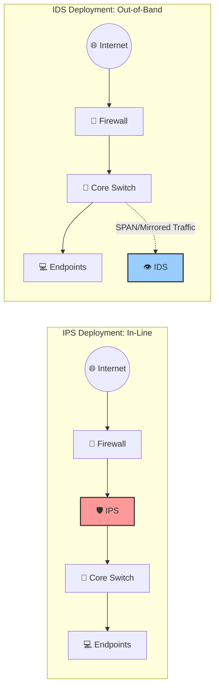

# 🚨 Intrusion Detection and Prevention Systems (IDS/IPS)

While firewalls act as the doors and locks of a network—permitting or denying
entry based on predefined rules—Intrusion Detection Systems (IDS) and Intrusion
Prevention Systems (IPS) act as the security cameras and armed guards. 🕵️‍♀️ They
deeply analyze traffic patterns and payloads to detect and thwart active
attacks, malware, and policy violations that bypass perimeter firewalls.

## ⚖ Understanding the Difference: IDS vs. IPS

The core distinction lies in their response capabilities. Here is a breakdown of
how they compare:

| Feature               | 👁️ Intrusion Detection System (IDS)                                                   | 🛡️ Intrusion Prevention System (IPS)                                                          |
| :-------------------- | :------------------------------------------------------------------------------------ | :-------------------------------------------------------------------------------------------- |
| **Mode of Operation** | **Passive** monitoring system.                                                        | **Active** control mechanism.                                                                 |
| **Primary Action**    | Generates alerts, logs the event, notifies admin/SIEM.                                | Drops malicious packets, resets TCP connections, blocks IP addresses, updates firewall rules. |
| **Deployment Mode**   | Out-of-band (e.g., SPAN port or Network TAP).                                         | **In-line** (in the direct path of network traffic).                                          |
| **Advantage**         | Cannot cause network outages or drop legitimate traffic (no false positive blocking). | Stops threats in real-time before they reach the target.                                      |
| **Disadvantage**      | Cannot stop an attack in real-time; only reports that an attack has occurred.         | False positives can block legitimate traffic (self-inflicted DoS). Introduces latency.        |

<!-- Visual flow for 🚨 Intrusion Detection and Prevention Systems (IDS/IPS). -->


---

## Types of IDS/IPS Architecture

IDS/IPS solutions are broadly categorized by where they are deployed and what
data they analyze.

### 1. 🌐 Network-Based (NIDS / NIPS)

Deployed at strategic points within the network to monitor traffic to and from
all devices on the network segment.

- **Focus:** Analyzes full packets (headers and payloads) across the wire.
- **Use Cases:** Perimeter monitoring behind a firewall, analyzing DMZ traffic,
  or inspecting inter-VLAN routing (east-west traffic).
- **Examples:** Snort, Suricata, Zeek (formerly Bro), Cisco Secure IPS.

### 2. 💻 Host-Based (HIDS / HIPS)

Installed as an agent directly on individual endpoints (servers, workstations).

- **Focus:** Monitors local system activities, including system logs, file
  integrity changes (FIM), local network traffic, and process execution.
- **Use Cases:** Detecting lateral movement, privilege escalation, or encrypted
  attacks that NIDS cannot see because the payload is decrypted on the host.
- **Examples:** OSSEC, Wazuh, Tripwire, modern EDR (Endpoint Detection and
  Response) solutions.

### 3. 📡 Wireless (WIDS / WIPS)

Monitors the radio spectrum for wireless network threats.

- **Focus:** Detects rogue access points, deauthentication attacks, MAC
  spoofing, and misconfigured access points.

## 🔬 Detection Methodologies

How do these systems actually know what is malicious? They employ several
distinct methodologies, often in combination.

| Methodology              | How it Works                                                                          | Pros ✅                                                                 | Cons ❌                                                    |
| :----------------------- | :------------------------------------------------------------------------------------ | :---------------------------------------------------------------------- | :--------------------------------------------------------- |
| **🔏 Signature-Based**   | Relies on a database of known threat signatures (like traditional AV).                | Extremely fast, highly accurate for known threats, low false positives. | Blind to zero-day attacks. Requires constant updates.      |
| **🧠 Anomaly-Based**     | Establishes a baseline of "normal" behavior using ML/statistics and flags deviations. | Detects zero-days and novel threats.                                    | High false-positive rate. Requires a long training period. |
| **📜 Protocol Analysis** | Understands how protocols (TCP, HTTP) should operate per RFCs; flags deviations.      | Detects protocol abuse and structural anomalies.                        | Can be computationally heavy.                              |

> **Note:** A robust IDS/IPS will layer these methodologies. For instance, using
> protocol analysis to decode the packet, signature-matching for known threats,
> and anomaly detection for unusual behavior.

## 🥷 Evasion Techniques and Countermeasures

Attackers constantly develop techniques to bypass IDS/IPS analysis. Security
engineers must understand these to configure sensors correctly.

| Evasion Technique 😈     | How it Works                                                                                                         | IDS/IPS Countermeasure 🛡️                                                                                                       |
| :----------------------- | :------------------------------------------------------------------------------------------------------------------- | :------------------------------------------------------------------------------------------------------------------------------ |
| **IP Fragmentation**     | Breaking the malicious payload into tiny IP fragments. If the IDS analyzes them independently, it misses the attack. | **Fragment Reassembly:** The IDS buffers and reassembles fragments before analysis.                                             |
| **TCP Session Splicing** | Sending the attack payload across multiple out-of-order TCP segments with overlapping sequence numbers.              | **TCP Stream Reassembly & State Tracking:** Keeping full state and normalizing overlapping segments.                            |
| **Obfuscation/Encoding** | Encoding the payload (e.g., URL encoding `%2e%2e%2f`, Base64, Hex) so the literal signature doesn't match.           | **Protocol Normalization:** The IDS decodes and normalizes payloads (e.g., converting everything to raw ASCII) before matching. |
| **Encryption**           | Hiding the attack inside an HTTPS or VPN tunnel; the IDS only sees encrypted gibberish.                              | **TLS/SSL Decryption:** Utilizing a proxy or NGFW to decrypt, inspect, and re-encrypt the traffic.                              |

## 🏊 Deep Dive: Snort and Suricata

**Snort** 🐽 is one of the oldest and most widely used open-source NIDS/NIPS
engines. **Suricata** 🐿️ is a modern alternative designed with native
multi-threading and built-in protocol extraction.

### Understanding Snort Signatures

A Snort rule is divided into two parts: the **rule header** (action, protocol,
IP addresses, ports) and the **rule options** (alert messages, payload
inspection criteria).

**Example Snort Rule:**

```snort
alert tcp $EXTERNAL_NET any -> $HTTP_SERVERS $HTTP_PORTS ( \
    msg:"ET EXPLOIT Possible Apache Log4j RCE Attempt"; \
    flow:established,to_server; \
    content:"${jndi:"; nocase; fast_pattern; \
    pcre:"/\$\{jndi:(ldap|rmi|dns|iiop|http):\/\//i"; \
    reference:cve,2021-44228; \
    classtype:attempted-admin; \
    sid:2034647; rev:1; \
)
```

**Rule Breakdown:**

- `alert tcp`: The action (alert) and protocol (TCP).
- `$EXTERNAL_NET any -> $HTTP_SERVERS $HTTP_PORTS`: Traffic originating from
  outside, any port, heading to defined HTTP servers on HTTP ports.
- `msg`: The alert text written to the logs.
- `flow:established,to_server`: Ensures the TCP 3-way handshake is complete and
  traffic is client-to-server.
- `content:"${jndi:"; nocase;`: Looks for the exact literal string (ignoring
  case). This acts as a fast initial filter.
- `pcre:`: Uses Perl Compatible Regular Expressions for more complex pattern
  matching.
- `sid:2034647`: The unique Snort ID for this specific signature.

## 🦉 Zeek (formerly Bro): The Network Security Monitor

While Snort and Suricata are heavily signature-based, **Zeek** takes a different
approach. Zeek is not primarily an IDS; it is a Network Security Monitor (NSM).

Instead of just alerting on known bad things, Zeek creates a highly structured,
highly detailed log of _everything_ that happens on the network. 📊

- **Logs generated:** `conn.log` (every connection), `dns.log` (every DNS
  query/response), `http.log` (every HTTP request/header/URI).
- **Scripting Engine:** Zeek features a Turing-complete scripting language. You
  can write scripts like: _"If a single internal IP downloads more than 50
  executable files over HTTP in 10 minutes, fire an alert and extract the files
  to a forensic directory."_

> 💡 **Best Practice:** Zeek is heavily favored by Incident Response (IR) teams
> because it provides the historical context needed to investigate a breach
> after it has occurred.

## 🌟 Best Practices for Deploying IDS/IPS

1. **📍 Strategic Placement:** Do not place an IDS outside the firewall (the
   dirty Internet); it will generate millions of alerts for background internet
   noise. Place it behind the firewall to see what actually bypassed the
   perimeter, or deep inside the network to monitor lateral movement.
2. **🎛️ Tuning is Mandatory:** An out-of-the-box IDS will generate thousands of
   false positives. You must "tune" the system by disabling rules for software
   you don't run (e.g., disable IIS rules if you only run Linux/Apache) and
   suppressing benign alerts.
3. **⚠️ Fail-Open vs. Fail-Closed:** If deploying an IPS in-line, decide on its
   failure state. If the IPS crashes, should traffic pass uninspected
   (Fail-Open, favors availability) or should the network drop all traffic
   (Fail-Closed, favors security)?
4. **🔄 Regular Updates:** Automate the daily downloading of new signature rules
   (e.g., via Emerging Threats or Talos intelligence feeds).
5. **🧩 Combine Technologies:** The most robust SOCs use Suricata/Snort for
   real-time alerting on known bads, Zeek for rich historical context and
   anomaly hunting, and a SIEM to correlate it all.

## 🏁 Conclusion

IDS and IPS technologies provide the deep visibility and active defense required
to secure modern networks against sophisticated adversaries. While they require
significant tuning and operational overhead, their ability to peer into the
payloads of network traffic makes them an indispensable layer of defense in
depth. 🛡️

## Quick Reference

| Area | Revision point |
|---|---|
| Definition | State exactly what the topic means. |
| Mechanism | Explain the steps that produce the result. |
| Example | Use a small realistic case. |
| Pitfalls | Know common mistakes and boundary cases. |
