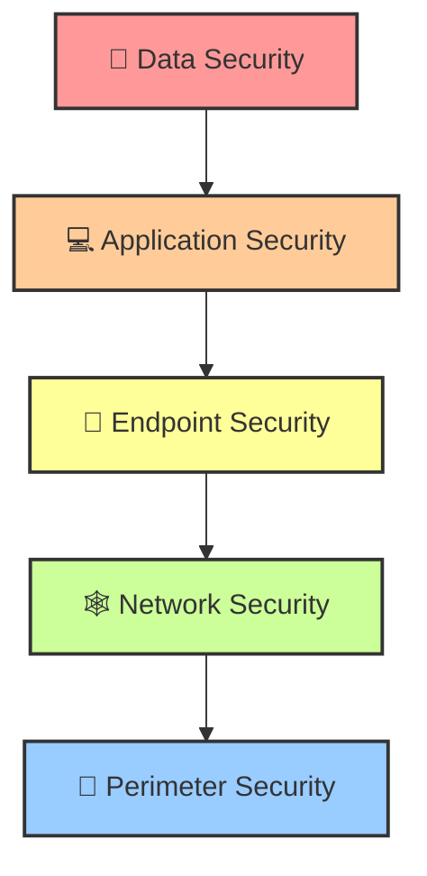

# Introduction to Network Security

Network security is an overarching framework of policies, processes, and
technologies designed to protect the integrity, confidentiality, and
accessibility of computer networks and data using both software and hardware
technologies. As the foundational layer of any organization's cybersecurity
posture, network security defends against a rapidly evolving landscape of cyber
threats, ranging from automated malware to sophisticated Advanced Persistent
Threats (APTs). 🛡️

## ⚖ Core Principles of Network Security

At the heart of network security lies the **CIA Triad**, a model designed to
guide policies for information security within an organization.

### 1. 🤫 Confidentiality

Confidentiality ensures that data is accessed only by authorized individuals. In
a network context, this involves:

- **Encryption:** 🔐 Protecting data in transit using protocols like TLS, IPsec,
  and SSH so that intercepted packets cannot be read by malicious actors.
- **Access Controls:** 🛂 Implementing strong authentication (MFA, 802.1X) and
  authorization mechanisms (RBAC, ABAC) to restrict network access.
- **Data Masking:** 🎭 Obfuscating sensitive network payloads during testing or
  monitoring.

### 2. Integrity

Integrity guarantees that data is accurate and unchanged from its original
state. Network integrity mechanisms include:

- **Hashing Algorithms:** 🔢 Using SHA-256 or HMACs (Hash-based Message
  Authentication Codes) to verify that packets have not been tampered with
  during transit.
- **Digital Signatures:** ✍️ Validating the origin and integrity of routing
  updates (e.g., BGPsec) or administrative commands.
- **Intrusion Detection Systems (IDS):** 🚨 Monitoring for unauthorized changes
  or malicious traffic that attempts to corrupt network states.

### 3. 🟢 Availability

Availability ensures that network resources and data are accessible to
authorized users when needed.

- **Redundancy & High Availability (HA):** 🔄 Deploying load balancers,
  redundant links, and clustering (e.g., VRRP, HSRP) to eliminate single points
  of failure.
- **DDoS Mitigation:** 🛑 Utilizing Anycast routing, rate limiting, and
  scrubbing centers to absorb volumetric attacks.
- **Quality of Service (QoS):** 🚦 Prioritizing critical network traffic (e.g.,
  VoIP or industrial control commands) over non-essential traffic to ensure
  operational stability during high load.

---

## 📚 The OSI Model and Network Security Mapping

To effectively secure a network, engineers must apply security controls across
the Open Systems Interconnection (OSI) model. A vulnerability at any layer can
compromise the entire stack.

| OSI Layer   | Layer Name   | Common Threats & Attacks 👾                 | Security Controls & Defenses 🛡️                                     |
| :---------- | :----------- | :------------------------------------------ | :------------------------------------------------------------------ |
| **Layer 7** | Application  | SQLi, XSS, HTTP Floods, Malware             | Web Application Firewalls (WAF), API Gateways, Secure Coding, DPI   |
| **Layer 6** | Presentation | SSL/TLS Stripping, Malformed Payloads       | TLS 1.3 encryption, Data Loss Prevention (DLP), Certificate Pinning |
| **Layer 5** | Session      | Session Hijacking, MITM, RPC attacks        | Timeouts, Strong Session IDs, Mutual Authentication (mTLS)          |
| **Layer 4** | Transport    | SYN Floods, Port Scanning, UDP Floods       | Stateful Firewalls, TCP SYN Cookies, Rate Limiting                  |
| **Layer 3** | Network      | Ping of Death, IP Spoofing, Route Hijacking | IPsec, Access Control Lists (ACLs), BGPsec, Anti-spoofing (uRPF)    |
| **Layer 2** | Data Link    | ARP Spoofing, MAC Flooding, VLAN Hopping    | Dynamic ARP Inspection (DAI), Port Security, 802.1X, MACsec         |
| **Layer 1** | Physical     | Wiretapping, Hardware theft, Signal Jamming | Biometric access, EMP shielding, TEMPEST standards, Lock & Key      |

> **Note:** Modern Next-Generation Firewalls (NGFWs) often collapse inspections
> across Layers 3 through 7, utilizing Deep Packet Inspection (DPI) to make
> holistic security decisions rather than relying on isolated layer data.

## 🧅 Defense in Depth

Defense in Depth (DiD) is an information assurance concept in which multiple
layers of security controls are placed throughout an IT system. Its intent is to
provide redundancy in the event a security control fails or a vulnerability is
exploited.

<!-- Visual flow for Introduction to Network Security. -->

### 🏛 Architectural Layers of DiD

1. **🧱 Perimeter Security:** The first line of defense. Includes edge routers,
   perimeter firewalls, and DDoS mitigation services.
2. **🕸️ Network Security:** Controls within the corporate LAN, such as VLAN
   segmentation, internal firewalls (ISFW), and Network Access Control (NAC).
3. **📱 Endpoint Security:** Protecting the devices connecting to the network
   using EDR (Endpoint Detection and Response), Antivirus, and Host-based
   firewalls.
4. **💻 Application Security:** Securing the software running on the network via
   WAFs, RASP (Runtime Application Self-Protection), and secure SDLC practices.
5. **💎 Data Security:** At the core, ensuring data is encrypted at rest and in
   transit, governed by strict IAM (Identity and Access Management) policies.

## 🚫 Zero Trust Architecture (ZTA)

The traditional "castle-and-moat" security model assumed that everything inside
the network was trusted. This model is obsolete. **Zero Trust** operates on the
principle of "Never Trust, Always Verify." 🕵️‍♂️

### 🔑 Core Tenets of Zero Trust

- **Assume Breach:** 💥 Design networks assuming that attackers are already
  present inside the perimeter.
- **Verify Explicitly:** 🛂 Always authenticate and authorize based on all
  available data points (user identity, location, device health, service or
  workload).
- **Least Privileged Access:** 📉 Limit user access with Just-In-Time (JIT) and
  Just-Enough-Access (JEA), risk-based adaptive policies, and data protection.
- **Micro-segmentation:** 🧩 Break the network into small, isolated zones to
  contain potential breaches and prevent lateral movement.

> ⚠️ **Warning:** A Zero Trust Network Access (ZTNA) implementation typically
> replaces traditional VPNs. Instead of granting users an IP address on the
> internal LAN, ZTNA brokers secure 1-to-1 connections between a verified
> user/device context and a specific application, completely hiding the internal
> network topology from the endpoint.

## ⚔ Common Network Attacks and Mitigations

Understanding the threat landscape is crucial for designing robust networks.
Here are some of the most prevalent network-level attacks:

### 1. 💥 Distributed Denial of Service (DDoS)

Attackers flood a network or service with a massive volume of traffic,
overwhelming resources.

- **Volumetric Attacks:** (e.g., DNS Amplification, NTP Reflection). Mitigation
  involves upstream scrubbing centers and Anycast IP routing.
- **Protocol Attacks:** (e.g., SYN Floods, Smurf Attacks). Mitigation involves
  TCP SYN cookies, strict state timeouts in firewalls.
- **Application Layer Attacks:** (e.g., HTTP GET/POST floods). Mitigation
  involves WAFs, CAPTCHAs, and behavioral rate limiting.

### 2. 🎭 Man-in-the-Middle (MITM)

An attacker intercepts and potentially alters communications between two
parties.

- **ARP Spoofing:** Attacker sends falsified ARP messages over a LAN to link
  their MAC address with the IP address of a legitimate server/gateway.
  - **🛡️ Mitigation:** Dynamic ARP Inspection (DAI), Static ARP entries.
- **DNS Spoofing/Poisoning:** Corrupting the DNS cache to redirect traffic to a
  malicious site.
  - **🛡️ Mitigation:** DNSSEC, DNS over HTTPS (DoH).

### 3. 🕷 Lateral Movement

Once inside, attackers move from a compromised endpoint to higher-value assets
(e.g., Domain Controllers, databases).

- **Techniques:** Pass-the-Hash, RDP hijacking, SMB exploits (e.g.,
  EternalBlue).
- **🛡️ Mitigation:** Micro-segmentation, Private VLANs, disabling legacy
  protocols (SMBv1, NTLMv1), and strict internal network monitoring via IPS.

## Network Segmentation Strategy

Segmentation is the physical or logical division of a computer network into
subnets or zones.

### 📉 Logical Segmentation (VLANs)

Virtual Local Area Networks (VLANs) operate at Layer 2 and divide broadcast
domains. While useful for traffic management, standard VLANs are vulnerable to
hopping attacks if switch ports are misconfigured (e.g., DTP left enabled).

### 🔬 Micro-segmentation

Operating primarily at Layers 4-7, micro-segmentation uses software-defined
policies to control traffic at the workload level, regardless of the underlying
infrastructure.

**Example Architecture:**

- **🌐 Web Zone:** Publicly accessible servers (DMZ). Only ports 80/443 allowed
  inbound from the internet.
- **⚙️ App Zone:** Middleware and application logic. Only accepts connections
  from the Web Zone on specific API ports.
- **🗄️ Data Zone:** Databases. Only accepts connections from the App Zone on
  database ports (e.g., 5432 for PostgreSQL). No internet access whatsoever.

> **Best Practice:** By strictly defining these communication paths, a
> compromise in the Web Zone does not grant immediate access to the Data Zone,
> effectively neutralizing the blast radius of an attack.

## 🏁 Conclusion

Network security is not a single product but a complex architecture of
overlapping controls, continuous monitoring, and strict policies. As networks
migrate to cloud and hybrid environments, traditional perimeters are dissolving,
making concepts like Zero Trust and Micro-segmentation not just best practices,
but absolute necessities for modern enterprise survival. 🚀

## Quick Reference

| Area | Revision point |
|---|---|
| Definition | State exactly what the topic means. |
| Mechanism | Explain the steps that produce the result. |
| Example | Use a small realistic case. |
| Pitfalls | Know common mistakes and boundary cases. |
