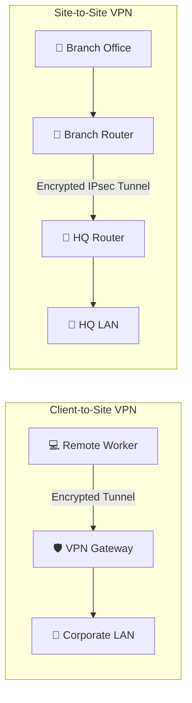

# 🚇 Virtual Private Networks (VPN)

A Virtual Private Network (VPN) creates a secure, encrypted connection (a
tunnel) over a less secure network, such as the public Internet. VPNs ensure the
confidentiality, integrity, and authenticity of data in transit, allowing remote
users or entire branch offices to securely access internal corporate resources
as if they were physically connected to the private LAN. 🔒

## 🏛 VPN Architecture Types

VPN deployments generally fall into two distinct architectural categories:

### 1. 💻 Remote Access VPN (Client-to-Site)

Designed for individual remote workers accessing the corporate network from
home, coffee shops, or hotels.

- **Mechanism:** The user's device runs a VPN client application. The client
  authenticates with the corporate VPN Gateway, establishes a secure tunnel, and
  is assigned an internal IP address.
- **Use Case:** Secure remote work, bypassing geographic censorship, protecting
  traffic on untrusted public Wi-Fi.

### 2. 🏢 Site-to-Site VPN

Designed to connect entire networks together (e.g., connecting a branch office
in New York to the main datacenter in London) over the internet, replacing
expensive leased lines (like MPLS).

- **Mechanism:** The connection is established between two VPN gateways (usually
  routers or firewalls) permanently. The end-users on either side do not run VPN
  clients; the routing and encryption are handled transparently by the network
  infrastructure.
- **Use Case:** Extending the corporate LAN across multiple geographic
  locations.

<!-- Visual flow for 🚇 Virtual Private Networks (VPN). -->

---

## 🛠 Core VPN Protocols: A Deep Dive

The security and performance of a VPN depend heavily on the underlying
cryptographic protocols used to establish the tunnel.

| Protocol              | OSI Layer | Encryption/Security            | Pros ✅                                                                  | Cons ❌                                                                                             |
| :-------------------- | :-------- | :----------------------------- | :----------------------------------------------------------------------- | :-------------------------------------------------------------------------------------------------- |
| **IPsec**             | Layer 3   | IKEv2, ESP (AES), AH           | Enterprise standard for Site-to-Site, highly secure.                     | Complex to configure, can struggle with NAT traversal.                                              |
| **SSL/TLS (OpenVPN)** | Layer 4-7 | OpenSSL libraries (AES)        | Extremely flexible, open-source, easily traverses NAT/firewalls.         | Slower than kernel-level protocols, relies on complex codebases.                                    |
| **WireGuard**         | Layer 3   | ChaCha20, Poly1305, Curve25519 | Blazing fast, tiny codebase (4k lines), highly auditable, modern crypto. | Newer standard, lacks some enterprise features out-of-the-box (like dynamic IP assignment scaling). |

### A Closer Look at IPsec (Internet Protocol Security)

IPsec is not a single protocol, but a massive suite of protocols operating at
OSI Layer 3 (Network Layer).

**Core Components of IPsec:**

- **IKE (Internet Key Exchange):** 🔑 Operates on UDP port 500. It is
  responsible for authenticating the peers and securely exchanging cryptographic
  keys (usually via Diffie-Hellman) to establish the Security Associations
  (SAs). IKEv2 is the modern standard.
- **ESP (Encapsulating Security Payload):** 📦 Protocol 50. Provides data
  confidentiality (encryption), payload integrity, and authentication. ESP
  actually encrypts the data packets.
- **AH (Authentication Header):** 🪪 Protocol 51. Provides data integrity and
  origin authentication, but **no encryption**. Rarely used today; ESP provides
  both encryption and authentication.

> **Note:** IPsec can operate in **Tunnel Mode** (entire original IP packet is
> encrypted and wrapped, used for Site-to-Site) or **Transport Mode** (only the
> payload is encrypted, used for host-to-host).

## 🔀 Split Tunneling vs. Full Tunneling

When configuring a Remote Access VPN, administrators must decide how traffic
from the client is routed.

| Feature          | 🌊 Full Tunneling                                                                                                       | 🔀 Split Tunneling                                                                                                                                                 |
| :--------------- | :---------------------------------------------------------------------------------------------------------------------- | :----------------------------------------------------------------------------------------------------------------------------------------------------------------- |
| **How it Works** | **Every single packet** is routed through the VPN tunnel to the corporate network, including general internet browsing. | Only traffic destined for specific internal corporate subnets goes through the VPN. General internet traffic goes directly out the user's local ISP.               |
| **Security**     | Maximum security. All user traffic is subjected to corporate firewall rules, web filtering, and IDS/IPS inspections.    | Lower security. The client accesses the internet without corporate oversight.                                                                                      |
| **Performance**  | Massive bandwidth utilization on the corporate internet connection and VPN gateway. High latency for the end-user.      | Greatly reduces corporate bandwidth consumption and provides a faster browsing experience for the user.                                                            |
| **Risk**         | Lower risk of malware bypassing corporate filters.                                                                      | ⚠️ **High Risk:** A user downloading malware from the open internet is simultaneously connected to the secure corporate LAN, acting as a bridge for the infection. |

## ⚠ VPN Security Risks and Vulnerabilities

While VPNs provide security, they are high-value targets for attackers.

### 1. 🎣 Credential Theft and MFA Fatigue

The most common way VPNs are breached is not through cryptographic flaws, but
through stolen user credentials.

- **Mitigation:** Multi-Factor Authentication (MFA) is strictly mandatory for
  all VPN access. Implement rate-limiting to prevent MFA fatigue attacks.

### 2. 🧟 Endpoint Security Posture

A VPN tunnel is only as secure as the device connecting to it. If a compromised
personal laptop establishes a VPN connection, the attacker now has a direct
route into the corporate network.

- **Mitigation:** Implement Network Access Control (NAC). Before the VPN grants
  access, it interrogates the endpoint to ensure it has the latest OS patches,
  active antivirus, and is a corporate-owned asset (via certificates).

### 3. VPN Fingerprinting and Zero-Days

Attackers scan the internet to fingerprint VPN gateways (e.g., identifying a
Pulse Secure or Fortinet firewall based on response headers) and then exploit
known CVEs.

- **Mitigation:** VPN gateways must be treated as critical infrastructure,
  patched immediately, and placed behind DDoS protection.

> ⚠️ **Warning:** Ransomware gangs heavily target unpatched edge VPN devices.
> Timely patching is non-negotiable!

## The Shift Toward Zero Trust Network Access (ZTNA)

The traditional VPN model has critical architectural flaws:

1. **Implicit Trust:** Once a user authenticates to the VPN, they are often
   granted broad access to the internal network, enabling lateral movement.
2. **Perimeter-based:** VPNs focus on securing the perimeter, but offer no
   defense if the perimeter is breached.

**Zero Trust Network Access (ZTNA)** (sometimes called Software-Defined
Perimeter or SDP) is rapidly replacing traditional VPNs.

- Instead of connecting users to the network, ZTNA connects users directly to
  individual applications on a 1-to-1 basis.
- The internal network remains completely hidden.
- Authentication is continuous, evaluating context (device health, location,
  behavior) on every single request, not just at login.

## 🏁 Conclusion

VPNs have been the backbone of secure remote connectivity and branch networking
for decades. While robust protocols like IPsec and modern alternatives like
WireGuard provide excellent cryptographic security, the architectural paradigm
is shifting. The transition from broad, network-level VPN access to granular,
application-level Zero Trust access is the defining trend in modern network
security. 🌐🛡️

## Quick Reference

| Area | Revision point |
|---|---|
| Definition | State exactly what the topic means. |
| Mechanism | Explain the steps that produce the result. |
| Example | Use a small realistic case. |
| Pitfalls | Know common mistakes and boundary cases. |
