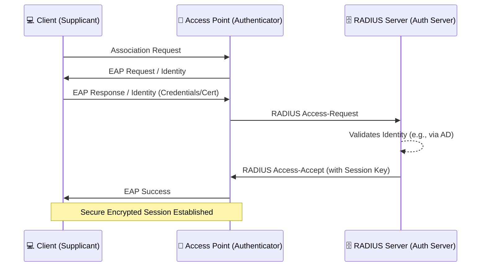

# 📡 Wireless Security (Wi-Fi)

Wireless networks (Wi-Fi, based on the IEEE 802.11 standard) present unique
security challenges compared to wired networks. In a wired network, an attacker
generally needs physical access to a switch or a wall jack. In a wireless
network, the transmission medium is the air; signals propagate far beyond the
physical walls of an organization, meaning anyone with a receiver in the
vicinity (the parking lot, an adjacent building) can intercept or manipulate the
traffic. 🌬️📶

Securing the RF (Radio Frequency) airspace is a critical component of any
comprehensive cybersecurity program.

## 🕰️ The Evolution of Wi-Fi Security Standards

Wireless security has evolved through several major iterations as cryptographic
flaws in earlier standards were discovered and exploited.

| Standard | Year | Encryption Method  | Vulnerabilities & Status                                                                                                              |
| :------- | :--- | :----------------- | :------------------------------------------------------------------------------------------------------------------------------------ |
| **WEP**  | 1997 | RC4 with 24-bit IV | ❌ **Completely broken.** IV reuse allowed keys to be cracked in minutes. Never use WEP.                                              |
| **WPA**  | 2003 | TKIP               | ❌ **Deprecated.** TKIP addressed WEP's flaws but was later found vulnerable (Beck-Tews attack).                                      |
| **WPA2** | 2004 | AES-CCMP           | ⚠️ **Vulnerable.** Susceptible to KRACK attacks (Key Reinstallation Attacks) and offline dictionary attacks on the 4-way handshake.   |
| **WPA3** | 2018 | AES-GCMP / SAE     | ✅ **State-of-the-Art.** Uses Simultaneous Authentication of Equals (SAE), offering forward secrecy and immunity to offline cracking. |

> ⚠️ **Warning:** If you are running legacy WEP or WPA/TKIP in any environment,
> consider those networks completely open and unencrypted to a motivated
> attacker. Upgrade immediately!

---

## 🏗️ Authentication Architectures: Personal vs. Enterprise

Both WPA2 and WPA3 offer two distinct modes of authentication: Personal and
Enterprise.

### 🏠 WPA-Personal (PSK / SAE)

- Designed for home use or very small businesses.
- Every client connects using the exact same password (Pre-Shared Key).
- **The Risk:** If an employee leaves or a device is lost, the only way to
  secure the network is to change the password and manually update every single
  device in the organization. Furthermore, clients cannot be individually
  identified or easily revoked.

### 🏢 WPA-Enterprise (802.1X / EAP)

- The mandatory standard for corporate environments.
- Instead of a single password, users authenticate using their individual
  corporate credentials (username/password) or digital certificates. 🪪

- **Key EAP Methods:**
  - **PEAP (Protected EAP):** The server presents a certificate to the client to
    establish an encrypted TLS tunnel, and then the client sends its
    username/password inside that tunnel.
  - **EAP-TLS:** The most secure method. Both the server _and_ the client must
    present digital certificates. Passwords are eliminated entirely. If a laptop
    is stolen, its certificate is simply revoked on the CA.

---

## 🥷 Common Wireless Threats and Attacks

Wireless networks face a unique set of attacks targeting the physical RF layer
and network protocols.

### 1. 🧟‍♂️ Rogue Access Points

An unauthorized AP connected to the corporate network. An employee might plug a
cheap home router into a wall jack in their cubicle for better signal. This
completely bypasses the corporate firewall, IDS, and 802.1X controls, providing
an open door for attackers in the parking lot.

- **🛡️ Defense:** Physical port security on switches, NAC (Network Access
  Control), and WIPS (Wireless Intrusion Prevention Systems).

### 2. 👯‍♀️ Evil Twin Attack

An attacker sets up a malicious Access Point broadcasting the exact same SSID
(network name) as the legitimate corporate or public network, often with a
stronger signal. Clients automatically connect to the attacker's AP, allowing
the attacker to execute a Man-in-the-Middle (MITM) attack, intercepting
credentials and traffic.

- **🛡️ Defense:** WPA3-Enterprise, VPNs, Certificate Pinning, and WIPS
  monitoring for MAC address spoofing and anomalous BSSIDs.

### 3. ✂️ Deauthentication Attacks

Because 802.11 management frames (prior to 802.11w) are sent unencrypted and
unauthenticated, an attacker can spoof a "Deauth" frame from the AP to a client.
The client is immediately disconnected.

- **Use Cases:** Used for denial of service, or to force a client to reconnect
  so the attacker can capture the WPA2 handshake for password cracking.
- **🛡️ Defense:** Enable **PMF (Protected Management Frames - 802.11w)**, which
  is mandatory in WPA3. PMF encrypts and authenticates management frames,
  rendering deauth attacks ineffective.

### 4. 🚗 Wardriving

The act of driving through a city or business district with a laptop, GPS, and
high-gain antenna to map and log the locations, SSIDs, and encryption types of
vulnerable wireless networks.

- **🛡️ Defense:** Reduce AP transmit power so signals do not bleed far past the
  physical building boundaries. Use directional antennas and strong WPA3
  cryptography.

---

## 🌟 Wireless Security Best Practices (Enterprise)

1. **🔒 Mandate WPA3-Enterprise (802.1X):** Utilize EAP-TLS with client
   certificates wherever possible. Never use Pre-Shared Keys for corporate
   assets.
2. **🧩 Implement Network Segmentation:**
   - Create a dedicated, firewalled VLAN for Guest Wi-Fi that only allows
     internet access (Client Isolation enabled).
   - Create a separate VLAN for IoT devices (smart TVs, projectors) that cannot
     support 802.1X.
3. **📡 Deploy WIDS/WIPS:** Wireless Intrusion Prevention Systems actively
   monitor the RF airspace. They can detect Rogue APs and Evil Twins, and can
   actively suppress them by flooding the rogue AP with deauth packets,
   preventing clients from connecting.
4. **🗺️ Tune RF Propagation:** Conduct wireless site surveys to ensure AP
   placement provides coverage where needed, but minimizes signal leakage into
   public areas.
5. **🛑 Disable WPS (Wi-Fi Protected Setup):** An old protocol designed to
   easily connect devices using an 8-digit PIN. WPS is severely flawed and
   vulnerable to brute-force PIN attacks (e.g., using tools like Reaver). Always
   disable it.

## 🏁 Conclusion

Securing wireless networks requires a dual approach: securing the RF physical
layer from signal manipulation and securing the logical layer through robust
cryptographic authentication. As the perimeter of the modern office becomes
increasingly fluid, relying on strong 802.1X authentication, migrating to WPA3,
and continuous monitoring via WIPS are foundational requirements for network
engineers and security professionals. 🛡️📶
