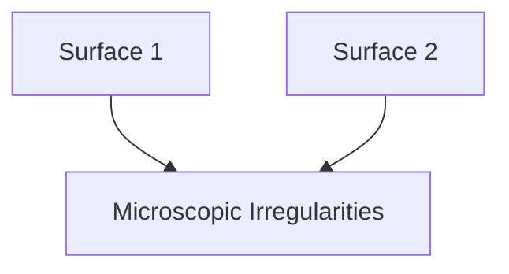
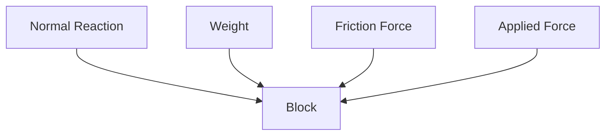
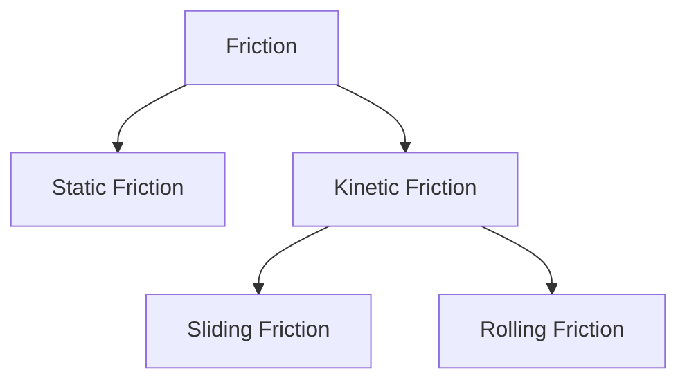
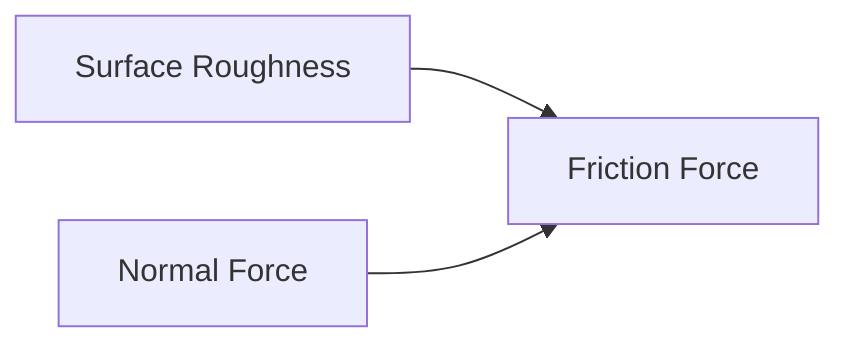
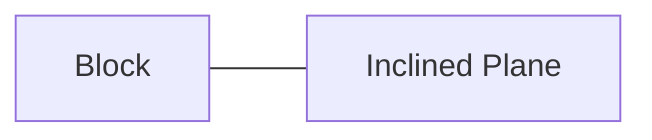
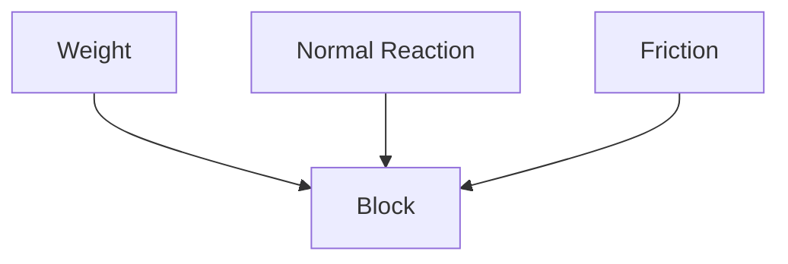
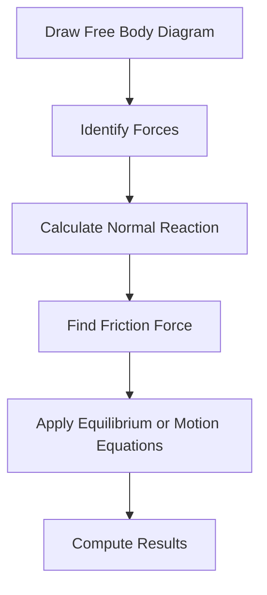

# 🤝 Friction

Friction is the force that opposes the relative motion or tendency of motion
between two surfaces in contact.

Without friction, walking, driving, writing, and even holding objects would be
impossible.

Although friction often causes energy loss, it is essential for many engineering
applications.

---

## Why Study Friction?

Friction plays an important role in engineering systems.

Engineers study friction to:

✅ Design brakes and clutches

✅ Improve machine efficiency

✅ Prevent slipping

✅ Reduce wear and tear

✅ Select suitable materials

## 🌍 Real-Life Examples

🚶 Walking on the ground

🚗 Vehicle tires gripping roads

✏️ Writing on paper

🛑 Braking systems

🔩 Nuts and bolts remaining tight

⚙️ Machine components in contact

## What Causes Friction?

Even surfaces that appear smooth have microscopic irregularities.

When two surfaces come into contact:

- Surface roughness interlocks
- Molecular attractions occur
- Resistance to motion develops

This resistance is called friction.

## Surface Interaction

<!-- Visual flow for 🤝 Friction. -->


## ⚖ Forces Acting on a Body

Consider a block resting on a rough surface.

<!-- Visual flow for 🤝 Friction. -->


Forces present:

- Weight (W)
- Normal Reaction (N)
- Applied Force (P)
- Friction Force (F)

## Types of Friction

Friction is mainly classified into:

<!-- Visual flow for 🤝 Friction. -->


## 1⃣ Static Friction

Static friction acts when the object is at rest.

It prevents motion from starting.

Example:

📦 Pushing a heavy box that does not move.

Characteristics:

✅ Opposes impending motion

✅ Varies with applied force

✅ Exists before movement starts

## Limiting Friction

The maximum value of static friction is called limiting friction.

Beyond this value, motion begins.

```text
Limiting Friction = μsN
```

Where:

- μs = Coefficient of static friction
- N = Normal reaction

## 2⃣ Kinetic Friction

Kinetic friction acts when surfaces are moving relative to each other.

📦 Sliding a box across a floor.

✅ Acts during motion

✅ Usually smaller than static friction

## Sliding Friction

Occurs when one surface slides over another.

Examples:

📦 Box sliding on floor

🛷 Sled moving on snow

## Rolling Friction

Occurs when a body rolls over a surface.

🚗 Car wheels

🚲 Bicycle tires

Rolling friction is much smaller than sliding friction.

This is why wheels are used in transportation.

## 📐 Laws of Dry Friction

The laws of friction were developed by Coulomb.

## First Law

Friction acts opposite to the direction of motion or impending motion.

## Second Law

Friction is proportional to the normal reaction.

```text
F ∝ N
```

## Third Law

Friction is independent of the apparent contact area.

## Fourth Law

Kinetic friction is less than limiting friction.

## Coefficient of Friction

The coefficient of friction is the ratio of friction force to normal reaction.

```text
μ = F / N
```

- μ = Coefficient of friction
- F = Friction force
- N = Normal reaction

## Relationship Between Forces

<!-- Visual flow for 🤝 Friction. -->


## 📈 Angle of Friction

The angle of friction is the angle between:

- Resultant reaction
- Normal reaction

Represented by:

θ

Relationship:

```text
tan θ = μ
```

## Angle of Repose

The angle of repose is the maximum angle of inclination at which a body remains
at rest.

Beyond this angle, the body starts sliding.

📦 Box on an inclined plane

<!-- Visual flow for 🤝 Friction. -->


```text
tan α = μ
```

α = Angle of repose

Interestingly:

Angle of Friction = Angle of Repose

## 🚗 Friction on an Inclined Plane

When a body is placed on an inclined surface:

Forces acting:

- Weight
- Normal Reaction
- Friction

<!-- Visual flow for 🤝 Friction. -->


As the slope increases:

- Component of weight increases
- Friction resists motion
- Sliding eventually begins

## ⚙ Advantages of Friction

✅ Enables walking

✅ Allows vehicles to move

✅ Makes braking possible

✅ Helps transmit power through belts

✅ Allows writing on paper

✅ Holds screws and bolts together

## ❌ Disadvantages of Friction

❌ Energy loss as heat

❌ Wear and tear of components

❌ Reduced machine efficiency

❌ Noise and vibration

❌ Increased maintenance costs

## 🔧 Methods to Reduce Friction

Engineers often try to minimize unwanted friction.

Methods include:

## Lubrication

Applying oil or grease between surfaces.

⚙️ Bearings

🚗 Engines

## Polishing

Reducing surface roughness.

## Ball Bearings

Replacing sliding friction with rolling friction.

<!-- Visual flow for 🤝 Friction. -->


## Streamlining

Reducing fluid friction.

✈️ Aircraft

🚗 Sports cars

🚄 High-speed trains

## 🚗 Applications of Friction

| Application    | Role of Friction    |
| -------------- | ------------------- |
| Brakes         | Stop vehicles       |
| Clutches       | Transmit power      |
| Tires          | Provide grip        |
| Belt Drives    | Transfer motion     |
| Bearings       | Controlled friction |
| Screws & Bolts | Prevent loosening   |

## 🧮 Problem-Solving Procedure

<!-- Visual flow for 🤝 Friction. -->


## ❌ Common Mistakes

- Confusing static and kinetic friction
- Using wrong coefficient of friction
- Ignoring normal reaction
- Applying friction in the wrong direction
- Forgetting limiting friction conditions

## 🌟 Key Takeaways

✅ Friction opposes motion or the tendency of motion.

✅ Static friction acts before motion begins.

✅ Kinetic friction acts during motion.

✅ Rolling friction is smaller than sliding friction.

✅ Friction depends on surface characteristics and normal force.

✅ Engineers both utilize and reduce friction depending on the application.

Friction is one of the most important forces in Engineering Mechanics because it
directly affects the performance, safety, and efficiency of nearly every
mechanical system.

## Quick Reference

| Area | Revision point |
|---|---|
| Definition | State exactly what the topic means. |
| Mechanism | Explain the steps that produce the result. |
| Example | Use a small realistic case. |
| Pitfalls | Know common mistakes and boundary cases. |
