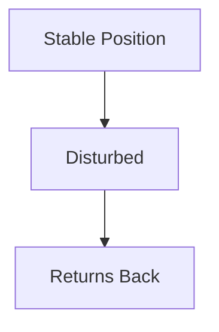
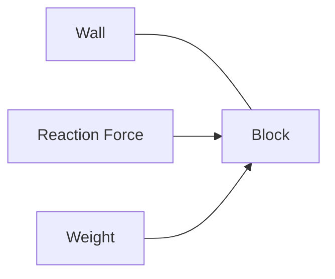
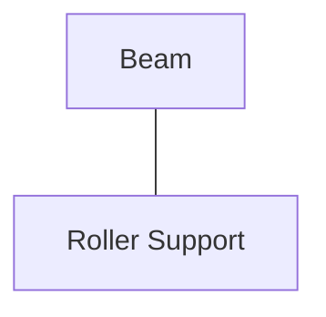
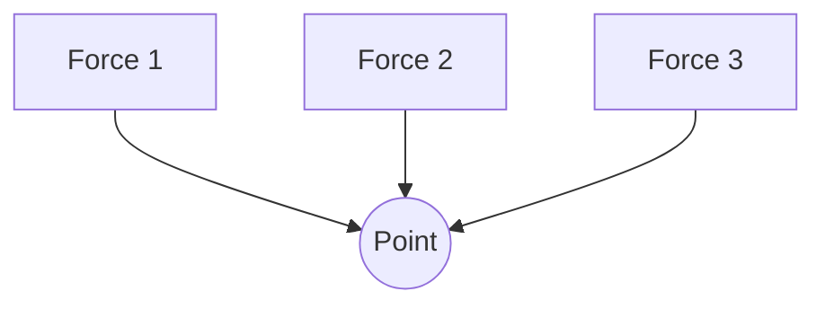
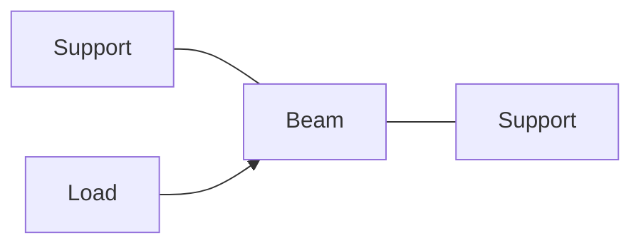
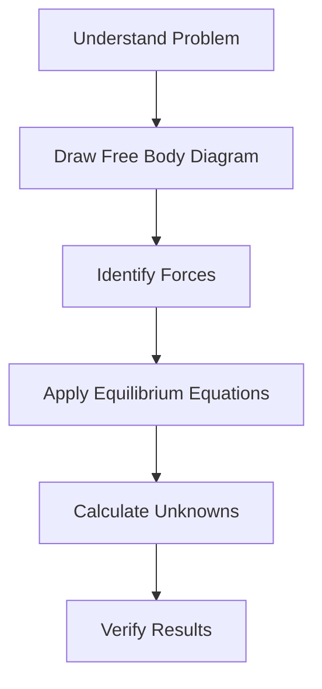

# ⚖ Statics

Statics is the branch of Engineering Mechanics that deals with bodies at rest or
moving with constant velocity under the action of forces.

A body is said to be in equilibrium when all the forces and moments acting on it
balance each other.

Statics helps engineers determine whether structures such as buildings, bridges,
towers, cranes, and machine components will remain stable under applied loads.

---

## Why Study Statics?

Every structure must safely support loads without moving or collapsing.

Statics helps engineers:

✅ Design stable structures

✅ Calculate support reactions

✅ Analyze beams and trusses

✅ Determine force distribution

✅ Ensure structural safety

## 🌍 Real-Life Examples

🏢 Building columns supporting floors

🌉 Bridge structures carrying vehicles

🗼 Transmission towers resisting wind loads

🏗️ Cranes lifting heavy materials

🚪 Doors attached to hinges

## Force

A force is a push or pull acting on a body.

Examples:

- Weight of an object
- Tension in a rope
- Wind force on a building
- Force applied by a person

Force has:

- Magnitude
- Direction
- Point of application

Unit:

Newton (N)

### External Forces

Forces acting from outside the body.

- Gravity
- Wind load
- Applied load

### Internal Forces

Forces developed within a structure to resist external loads.

- Tension
- Compression
- Shear

## Equilibrium

A body is in equilibrium when:

// Example demonstrating ⚖ Statics.
```text
Net Force = 0
Net Moment = 0
```

Conditions of equilibrium:

### Along X-axis

ΣFx = 0

### Along Y-axis

ΣFy = 0

### Rotational Equilibrium

ΣM = 0

These three equations form the foundation of statics analysis.

## Stable Equilibrium

When disturbed slightly, the body returns to its original position.

Example:

⚽ Ball inside a bowl

<!-- Visual flow for ⚖ Statics. -->


## Unstable Equilibrium

A small disturbance causes the body to move farther away.

⚽ Ball on top of a hill

## Neutral Equilibrium

The body remains in its new position after disturbance.

⚽ Ball on a flat surface

## Free Body Diagram (FBD)

A Free Body Diagram is a simplified sketch showing all external forces acting on
a body.

It is one of the most important tools in statics.

Steps:

1. Isolate the body.
2. Remove all surrounding objects.
3. Replace supports with reaction forces.
4. Show all applied forces.
5. Apply equilibrium equations.

## Example of Free Body Diagram

<!-- Visual flow for ⚖ Statics. -->


## ⚖ Support Reactions

Supports prevent movement and produce reaction forces.

Common supports:

## Roller Support

Allows horizontal movement but prevents vertical movement.

Reaction:

- One force

<!-- Visual flow for ⚖ Statics. -->


## Pin Support

Prevents movement in both horizontal and vertical directions.

- Horizontal force
- Vertical force

## Fixed Support

Prevents both translation and rotation.

- Horizontal force
- Vertical force
- Moment

## Concurrent Forces

All force lines pass through a common point.

Forces meeting at a joint in a truss.

<!-- Visual flow for ⚖ Statics. -->


## Non-Concurrent Forces

Forces do not meet at a single point.

Forces acting on a beam.

## ↔ Force Resolution

A force can be split into horizontal and vertical components.

For force F acting at angle θ:

Horizontal Component:

Fx = F cos θ

Vertical Component:

Fy = F sin θ

This makes calculations easier.

## Moment of a Force

Moment is the turning effect produced by a force.

🔧 Using a wrench

🚪 Opening a door

Moment depends on:

- Applied force
- Perpendicular distance from pivot

Formula:

M = F × d

Where:

- M = Moment
- F = Force
- d = Perpendicular distance

N·m

## ⚙ Principle of Moments

For equilibrium:

## Total Clockwise Moments

Total Counterclockwise Moments

This principle is widely used in beam and structural analysis.

## Beam Analysis

A beam is a structural member that supports loads.

Common loads:

### Point Load

Acts at a single point.

### Uniformly Distributed Load (UDL)

Load spread evenly over a length.

### Varying Load

Load intensity changes along the beam.

<!-- Visual flow for ⚖ Statics. -->


## 🧮 Procedure for Solving Statics Problems

<!-- Visual flow for ⚖ Statics. -->


## 🌟 Applications of Statics

🏢 Structural Engineering

🌉 Bridge Design

🏗️ Construction Engineering

⚙️ Machine Design

🚢 Ship Structures

✈️ Aircraft Structures

🛠️ Mechanical Components

## ❌ Common Mistakes

- Forgetting support reactions
- Ignoring force directions
- Using wrong sign conventions
- Missing moments in calculations
- Drawing incomplete FBDs

## Key Takeaways

✅ Statics deals with bodies in equilibrium.

✅ Equilibrium requires:

- ΣFx = 0
- ΣFy = 0
- ΣM = 0

✅ Free Body Diagrams are essential for analysis.

✅ Support reactions help maintain stability.

✅ Moments describe rotational effects of forces.

✅ Statics forms the foundation for structural and machine design.
