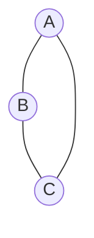
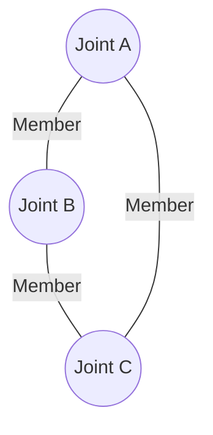
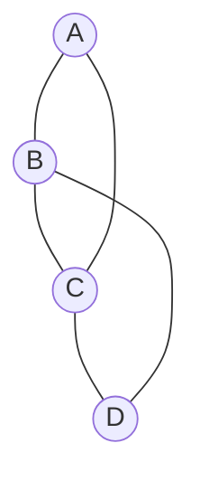
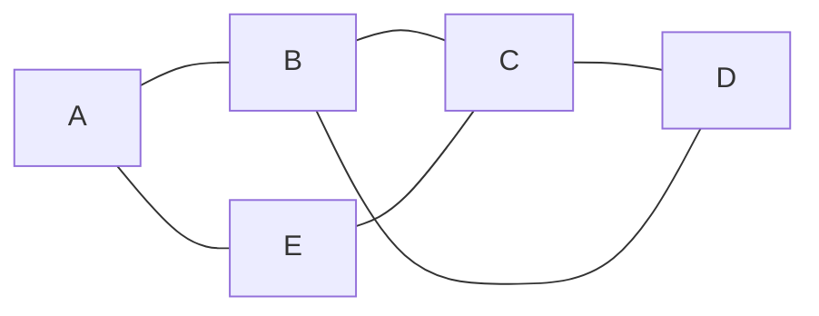
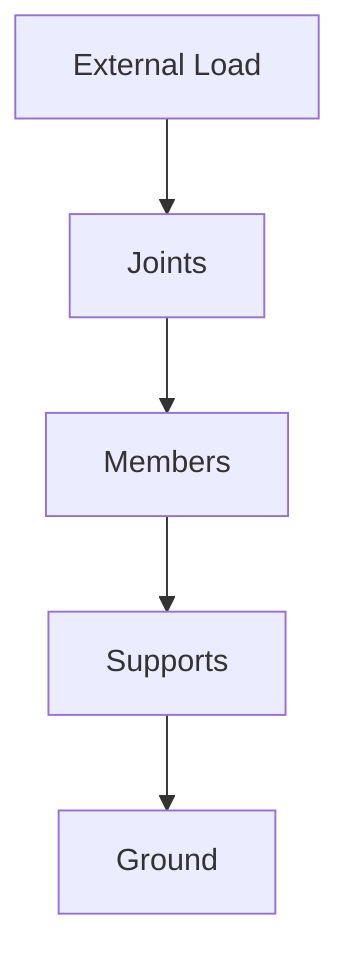
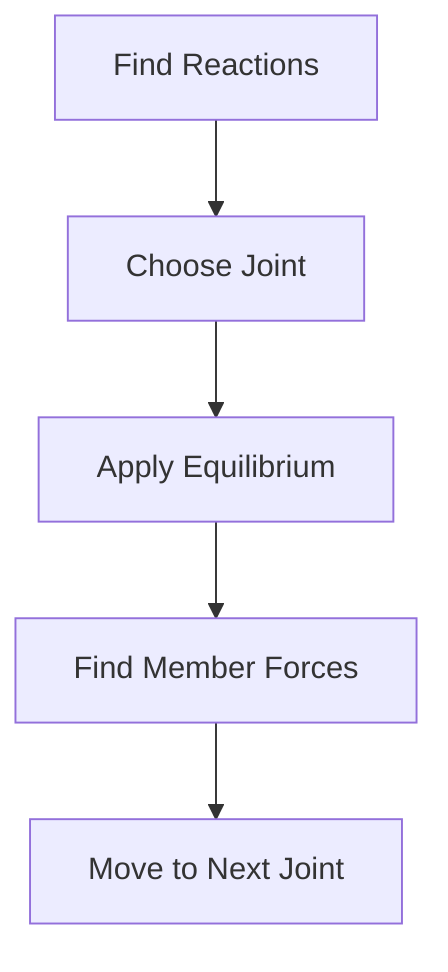
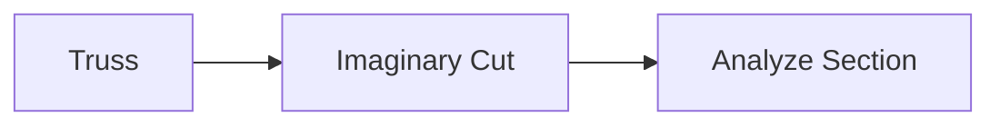
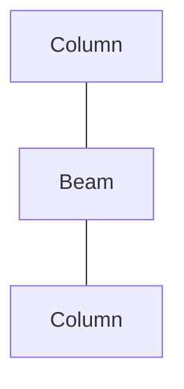

# Trusses & Frames

Trusses and Frames are structural systems used to support loads and transfer
forces safely to supports.

They are widely used in buildings, bridges, towers, cranes, roofs, and
industrial structures because they provide high strength while using less
material.

Understanding trusses and frames is essential for structural analysis and
design.

---

## Why Study Trusses & Frames?

Engineers use trusses and frames because they:

✅ Support large loads

✅ Cover long spans economically

✅ Reduce structural weight

✅ Improve stability

✅ Simplify force analysis

## 🌍 Real-Life Applications

🌉 Bridge Structures

🏢 Building Roofs

🏗️ Construction Cranes

⚡ Transmission Towers

✈️ Aircraft Structures

🏟️ Stadium Roof Systems

## What is a Truss?

A truss is a structure made up of straight members connected at their ends by
pin joints.

Loads are assumed to act only at the joints.

Each member carries either:

- Tension
- Compression

## Simple Truss Structure

<!-- Visual flow for Trusses & Frames. -->


This triangular arrangement is the simplest and most stable truss.

## Characteristics of an Ideal Truss

✅ Members are straight

✅ Connections are pin joints

✅ Loads act only at joints

✅ Self-weight is often neglected during basic analysis

✅ Members carry only axial forces

## Joint

A point where members meet.

Examples:

A, B, C in a truss structure.

## Member

A structural element connecting two joints.

Members carry internal forces.

## Support

Provides stability and reactions.

Common supports:

- Pin Support
- Roller Support

## Truss Components

<!-- Visual flow for Trusses & Frames. -->


## Simple Truss

Constructed by adding triangular units.

Example:

Roof trusses.

<!-- Visual flow for Trusses & Frames. -->


## Compound Truss

Two or more simple trusses connected together.

Used for long-span bridges.

## Complex Truss

Trusses that cannot be analyzed directly using simple methods.

Require advanced analysis techniques.

## Pratt Truss

Used in railway and highway bridges.

<!-- Visual flow for Trusses & Frames. -->


## Warren Truss

Uses a series of triangles.

Provides uniform force distribution.

A --- E
    E --- B
    B --- F
    F --- C
    C --- G
    G --- D
```

```
## Howe Truss

Commonly used in roof structures.

Diagonal members typically experience compression.

## Internal Forces in Truss Members

A truss member experiences either:

## Tension

Member is being stretched.

Rope pulling a load.


Characteristics:

✅ Member elongates

✅ Force acts away from the joint

## Compression

Member is being squeezed.

Building column.

```mermaid
graph LR
    A --> Compression <-- B
```

✅ Member shortens

✅ Force acts toward the joint

## 📐 Truss Stability

For a planar truss:

```text
m = 2j - 3
```

Where:

- m = Number of members
- j = Number of joints

Conditions:

| Condition  | Meaning         |
| ---------- | --------------- |
| m = 2j - 3 | Perfect Truss   |
| m > 2j - 3 | Redundant Truss |
| m < 2j - 3 | Unstable Truss  |

## Force Flow in a Truss



Loads are transferred through members to supports.

## 1⃣ Method of Joints

Based on equilibrium of individual joints.

At every joint:

```text
ΣFx = 0
ΣFy = 0
```

Procedure:

1. Find support reactions.
2. Select a joint.
3. Apply equilibrium equations.
4. Determine member forces.

Advantages:

✅ Simple

✅ Accurate

## Method of Joints Workflow



## 2⃣ Method of Sections

Used when only a few member forces are required.

1. Cut through the truss.
2. Isolate one side.
3. Apply equilibrium equations.

✅ Faster for large trusses

✅ Reduces calculations

## Method of Sections



## What is a Frame?

A frame is a structure consisting of connected members that may experience:

- Tension
- Compression
- Shear
- Bending

Unlike trusses, loads can act anywhere on frame members.

## Truss vs Frame

| Feature       | Truss       | Frame           |
| ------------- | ----------- | --------------- |
| Load Location | Joints only | Anywhere        |
| Member Forces | Axial only  | Axial + Bending |
| Joint Type    | Pin joint   | Rigid or pin    |
| Analysis      | Simpler     | More complex    |

## Example of a Frame



Building structures are common examples of frames.

## Rigid Frame

Connections resist rotation.

🏢 Buildings

🌉 Industrial structures

## Pin-Jointed Frame

Members connected using pin joints.

Used in lightweight structures.

## Machine Frame

Used in machines to support moving components.

🚜 Excavators

🏗️ Cranes

## Applications of Trusses

🌉 Bridges

🏟️ Stadium Roofs

🏢 Roof Structures

✈️ Aircraft Wings

🏗️ Construction Platforms

## Applications of Frames

🏗️ Industrial Structures

🚜 Construction Equipment

🚗 Vehicle Chassis

⚙️ Machinery Supports

## Advantages of Trusses

✅ High strength-to-weight ratio

✅ Economical

✅ Suitable for long spans

✅ Easy force analysis

✅ Efficient load transfer

## Advantages of Frames

✅ Greater rigidity

✅ Can support loads anywhere

✅ Better resistance to bending

✅ Suitable for complex structures

## ❌ Common Mistakes

- Assuming all members are in tension
- Ignoring support reactions
- Forgetting equilibrium equations
- Incorrectly identifying member force directions
- Confusing frames with trusses

## Key Takeaways

✅ Trusses are structures made of straight members connected by pin joints.

✅ Truss members carry only tension or compression.

✅ Loads are assumed to act at joints.

✅ Frames can carry bending, shear, tension, and compression.

✅ Method of Joints and Method of Sections are the most common truss analysis
techniques.

✅ Trusses and frames form the backbone of modern structural engineering.

From bridges and towers to buildings and cranes, trusses and frames make it
possible to create strong, stable, and efficient structures.
