# ✈ Drag & Lift

When a fluid flows around an object, forces are generated due to pressure
differences and viscous effects. Two of the most important aerodynamic forces
are **Drag** and **Lift**.

These forces play a crucial role in the design of:

- Aircraft
- Cars
- Ships
- Wind turbines
- Racing vehicles
- Drones

Understanding drag and lift helps engineers improve efficiency, stability, and
performance.

---

## What are Drag and Lift?

When fluid flows around a body:

- A force parallel to the flow direction is called **Drag**.
- A force perpendicular to the flow direction is called **Lift**.

// Example demonstrating ✈ Drag & Lift.
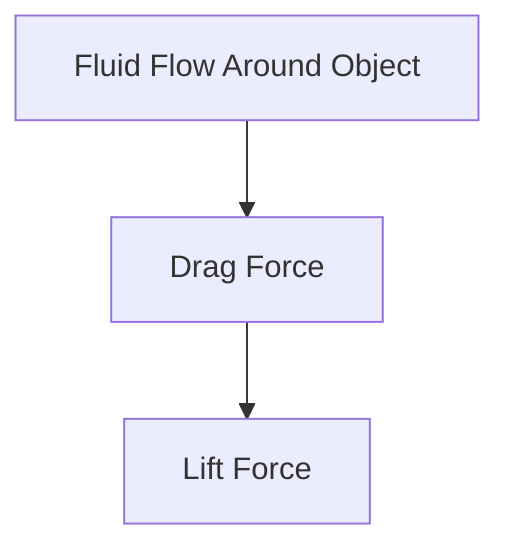

## 🌊 Fluid Flow Around an Object

Consider air flowing around an aircraft wing.

<!-- Visual flow for ✈ Drag & Lift. -->
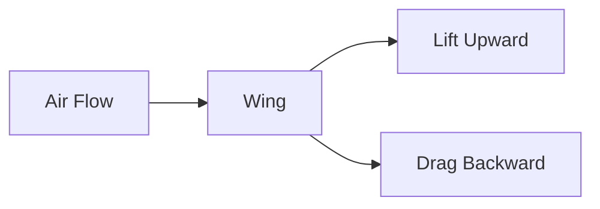

The wing experiences:

- Lift acting upward
- Drag acting opposite to motion

## 1⃣ Drag Force

Drag is the resistance force exerted by a fluid on a moving object.

It acts in the direction opposite to motion.

<!-- Visual flow for ✈ Drag & Lift. -->

## Drag Force Equation

[ F_D ===

\frac{1}{2} \rho V^2 C_D A ]

Where:

- (F_D) = Drag Force (N)
- (\rho) = Fluid density (kg/m³)
- (V) = Relative velocity (m/s)
- (C_D) = Drag coefficient
- (A) = Reference area (m²)

## Factors Affecting Drag

<!-- Visual flow for ✈ Drag & Lift. -->
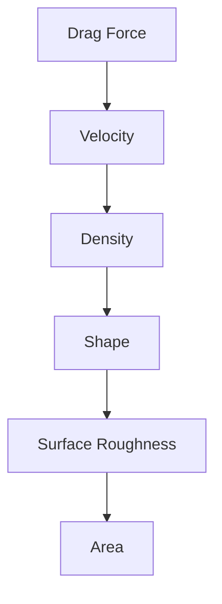

## Velocity

Drag increases rapidly with velocity.

Since:

[ F_D \propto V^2 ]

Doubling speed increases drag four times.

## Shape

Streamlined shapes reduce drag.

Examples:

✅ Airplane

✅ Fish

✅ High-speed trains

## Surface Roughness

Rough surfaces increase drag because they disturb flow.

## Area

Larger exposed area creates greater drag.

## Types of Drag

<!-- Visual flow for ✈ Drag & Lift. -->
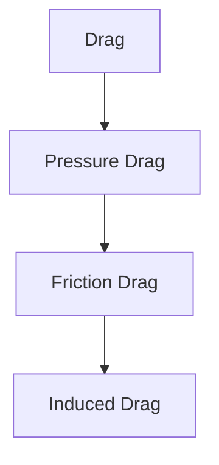

## Pressure Drag

Occurs because of pressure differences between the front and rear of an object.

- Buildings
- Trucks
- Cylinders

## Friction Drag

Caused by viscous shear forces acting on the surface.

- Aircraft skin
- Ship hulls
- Pipeline walls

## Induced Drag

Associated with lift generation.

Occurs mainly on aircraft wings.

## Streamlined Body

Designed to reduce flow separation and drag.

- Aircraft
- Fish
- Sports cars

<!-- Visual flow for ✈ Drag & Lift. -->

## Bluff Body

Flow separates early, creating large wake regions.

- Buildings
- Cubes
- Trucks

<!-- Visual flow for ✈ Drag & Lift. -->

## 2⃣ Lift Force

Lift is the force acting perpendicular to the direction of fluid flow.

It is responsible for:

- Aircraft flight
- Helicopter operation
- Wind turbine blade performance

## Lift Force Equation

[ F_L ===

\frac{1}{2} \rho V^2 C_L A ]

- (F_L) = Lift force (N)
- (C_L) = Lift coefficient

## How Lift is Generated

Lift occurs due to pressure differences around an object.

The most common example is an aircraft wing.

<!-- Visual flow for ✈ Drag & Lift. -->
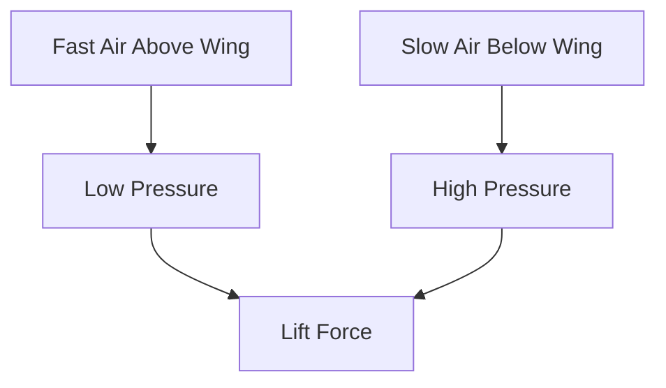

## Bernoulli's Principle and Lift

According to Bernoulli's Principle:

- Faster airflow → Lower pressure
- Slower airflow → Higher pressure

This pressure difference creates lift.

## Airfoil

An airfoil is the cross-sectional shape of an aircraft wing.

<!-- Visual flow for ✈ Drag & Lift. -->
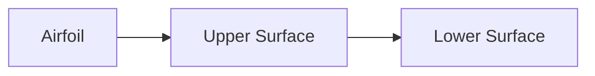

Features:

- Curved upper surface
- Relatively flatter lower surface
- Designed to maximize lift

## Angle of Attack

Angle of attack is the angle between:

- Airflow direction
- Wing chord line

<!-- Visual flow for ✈ Drag & Lift. -->
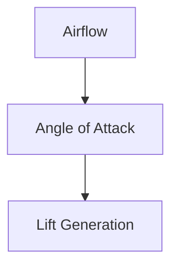

## Effect of Angle of Attack

Increasing angle of attack:

- Increases lift initially
- Increases drag
- May eventually cause stall

## Stall

A stall occurs when airflow separates from the wing surface.

<!-- Visual flow for ✈ Drag & Lift. -->
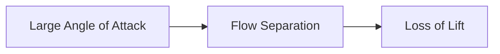

Consequences:

- Sudden reduction in lift
- Increased drag
- Aircraft instability

## Drag and Lift on an Airfoil

<!-- Visual flow for ✈ Drag & Lift. -->
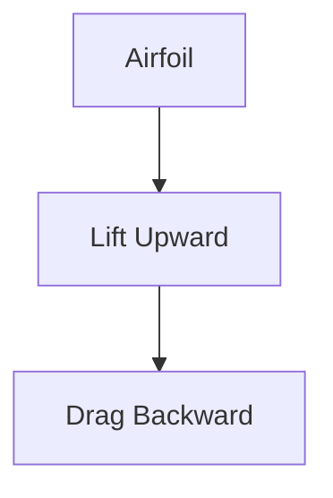

Both forces act simultaneously.

Designers try to:

- Increase lift
- Reduce drag

## Lift-to-Drag Ratio

One of the most important aerodynamic performance parameters is:

[ \frac{L}{D} ===========

\frac{Lift}{Drag} ]

Higher values indicate more efficient designs.

| Vehicle             | Lift-to-Drag Ratio |
| ------------------- | ------------------ |
| Glider              | Very High          |
| Commercial Aircraft | High               |
| Car                 | Low                |
| Parachute           | Very Low           |

## Boundary Layer and Drag

Viscosity creates a boundary layer near the surface.

<!-- Visual flow for ✈ Drag & Lift. -->

Boundary layer behavior strongly affects drag and lift.

## Reynolds Number and Drag

The Reynolds Number influences:

- Flow separation
- Turbulence
- Drag coefficient

<!-- Visual flow for ✈ Drag & Lift. -->
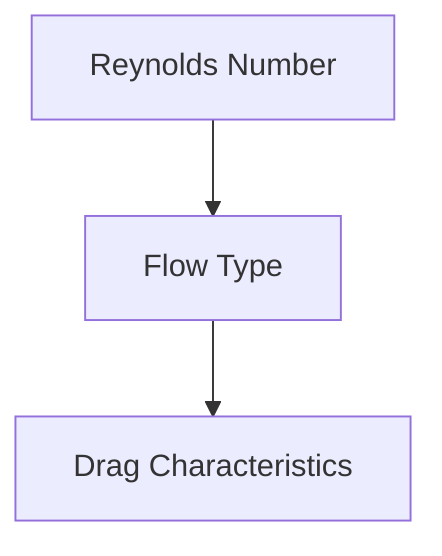

## 🚗 Automobile Design

Reduce fuel consumption by lowering drag.

## 🚄 High-Speed Trains

Improve efficiency and reduce noise.

## 🚢 Ship Design

Reduce water resistance.

## 🏃 Sports Engineering

Optimize athlete performance.

## ✈ Aircraft

Lift enables flight.

## 🚁 Helicopters

Rotor blades generate lift.

## 🌬 Wind Turbines

Aerodynamic lift rotates blades.

## 🏎 Formula Racing

Special wings generate downforce.

## Downforce

Downforce is simply negative lift.

<!-- Visual flow for ✈ Drag & Lift. -->
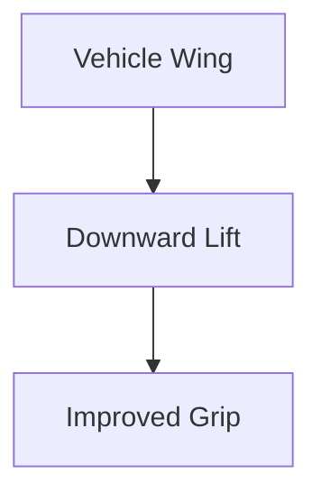

Used in:

- Formula 1 cars
- Racing motorcycles
- Sports cars

## Airplane Flight

Lift generated by wings keeps the aircraft airborne.

## Cricket Ball Swing

Pressure differences around the ball create lateral forces.

## Racing Cars

Aerodynamic wings produce downforce for better traction.

## Wind Turbines

Lift force rotates blades and generates electricity.

## Comparison Between Drag and Lift

| Property    | Drag             | Lift                  |
| ----------- | ---------------- | --------------------- |
| Direction   | Parallel to Flow | Perpendicular to Flow |
| Purpose     | Resists Motion   | Supports Motion       |
| Symbol      | (F_D)            | (F_L)                 |
| Coefficient | (C_D)            | (C_L)                 |

## Engineering Design Goals

<!-- Visual flow for ✈ Drag & Lift. -->
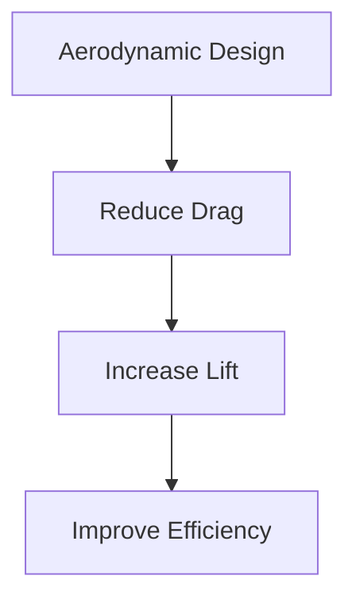

Engineers aim to:

- Minimize drag
- Maximize lift
- Improve performance
- Reduce energy consumption

## 📋 Summary

| Quantity           | Formula                         |
| ------------------ | ------------------------------- |
| Drag Force         | (F_D=\frac{1}{2}\rho V^2 C_D A) |
| Lift Force         | (F_L=\frac{1}{2}\rho V^2 C_L A) |
| Lift-to-Drag Ratio | (L/D)                           |

## Key Takeaways

- Drag is the force opposing fluid motion.
- Lift is the force perpendicular to fluid flow.
- Drag depends on velocity, shape, area, and surface roughness.
- Lift is generated primarily through pressure differences.
- Bernoulli's principle helps explain lift generation.
- Airfoils are designed to maximize lift and minimize drag.
- Engineers use drag and lift analysis in aircraft, vehicles, ships, wind
  turbines, and sports equipment.
- Aerodynamic optimization improves efficiency, speed, and stability.
