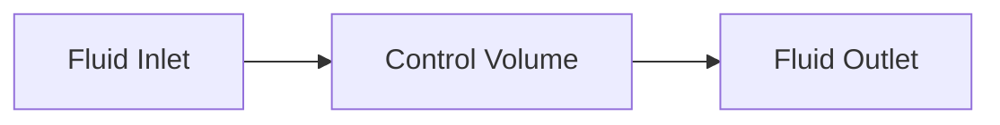
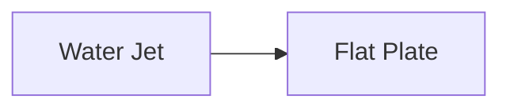
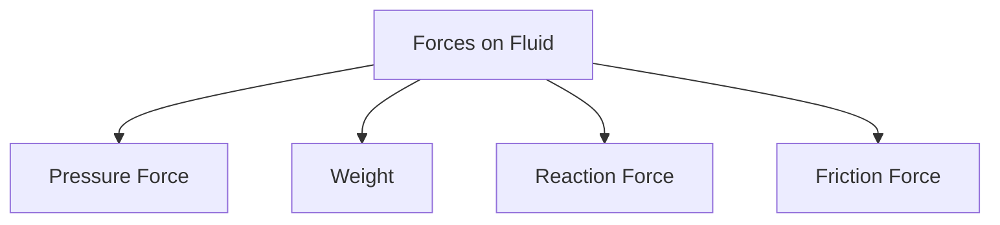
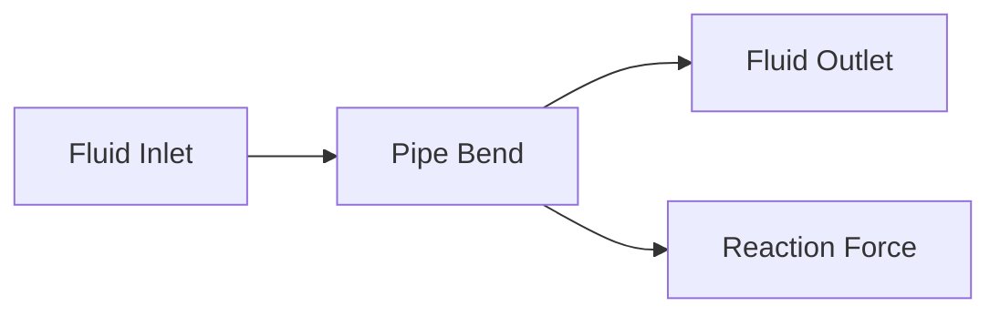
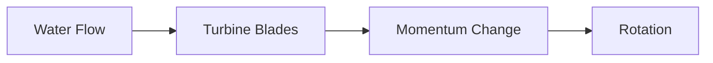
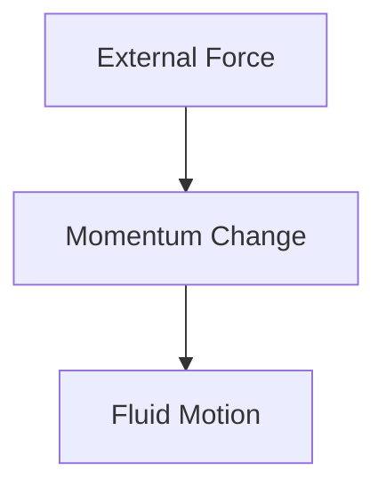
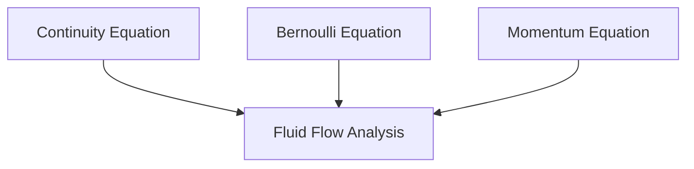

# ➡ Momentum Equation

The Momentum Equation is one of the most important equations in fluid mechanics.
It is based on **Newton's Second Law of Motion**, which states:

> The net force acting on a body is equal to the rate of change of momentum of
> that body.

In fluid flow, the momentum equation helps determine the forces exerted by
moving fluids on pipes, bends, nozzles, turbine blades, and hydraulic
structures.

---

## What is Momentum?

Momentum is the quantity of motion possessed by a moving body.

### Formula

[ \text{Momentum} = mv ]

Where:

- (m) = Mass (kg)
- (v) = Velocity (m/s)

### SI Unit

[ kg \cdot m/s ]

## Example

A fluid particle of mass 10 kg moving at 5 m/s has momentum:

[ 10 \times 5 = 50 \ kg \cdot m/s ]

## 🌊 Momentum in Fluid Flow

Since fluids flow continuously, we use **momentum flow rate** instead of
momentum of a single particle.

// Example demonstrating ➡ Momentum Equation.

Mass flow rate:

[ \dot m = \rho AV ]

Therefore,

[ \text{Momentum Flow Rate} =========================

\dot m V ]

## [

\rho AV^2 ]

## Newton's Second Law for Fluids

For fluid flow:

[ \text{Force} ============

\text{Rate of Change of Momentum} ]

This becomes:

[ F =

\dot m(V_2 - V_1) ]

- (F) = Force acting on fluid
- (V_1) = Inlet velocity
- (V_2) = Outlet velocity

## 📐 Momentum Equation

For one-dimensional steady flow:

Substituting:

gives:

\rho AV(V_2 - V_1) ]

## Understanding the Equation

// Example demonstrating ➡ Momentum Equation.

### Key Idea

- Larger velocity change → Larger force
- Larger mass flow rate → Larger force

## Control Volume Approach

In fluid mechanics, the momentum equation is applied to a control volume.

// Example demonstrating ➡ Momentum Equation.

Net external force equals:

[ \text{Momentum Out}

\text{Momentum In} ]

## Linear Momentum Equation

For steady flow:

[ \sum F ======

\dot m(V*{out}-V*{in}) ]

This is the most widely used form.

## Example 1: Force on a Nozzle

Water enters a nozzle at:

[ V_1 = 3 \ m/s ]

and exits at:

[ V_2 = 12 \ m/s ]

[ \dot m = 20 \ kg/s ]

Find the force.

### Solution

20(12-3) ]

[ F=180N ]

The nozzle experiences a reaction force of 180 N.

## Example 2: Jet Striking a Plate

A water jet strikes a stationary flat plate.

// Example demonstrating ➡ Momentum Equation.

Given:

- Mass flow rate = 25 kg/s
- Jet velocity = 15 m/s

After striking the plate:

[ V_2 = 0 ]

Using momentum equation:

25(15-0) ]

[ F = 375N ]

The plate experiences a force of 375 N.

## Forces Acting on a Fluid

Several forces may act on a control volume.

// Example demonstrating ➡ Momentum Equation.

## Pressure Force

Pressure acting on inlet and outlet sections.

[ F_P = PA ]

## Gravity Force

Weight of the fluid.

[ W=mg ]

## Reaction Force

Force exerted by pipe walls or fittings.

## Friction Force

Force due to viscosity.

## Momentum Equation in X-Direction

For horizontal flow:

[ \sum F_x ========

\dot m (V*{2x}-V*{1x}) ]

Used in:

- Nozzles
- Pipe bends
- Jets

## Momentum Equation in Y-Direction

For vertical flow:

[ \sum F_y ========

\dot m (V*{2y}-V*{1y}) ]

- Pipe elbows
- Hydraulic structures
- Curved vanes

## Force on Pipe Bend

When fluid changes direction, momentum changes.

This produces a force on the pipe bend.

// Example demonstrating ➡ Momentum Equation.

This principle is important in pipeline support design.

## Jet Propulsion Principle

Jet engines work using the momentum equation.

// Example demonstrating ➡ Momentum Equation.

The engine accelerates gases backward.

By conservation of momentum:

- Exhaust moves backward
- Aircraft moves forward

## Hydraulic Turbines

Water changes direction and velocity while passing through turbine blades.

// Example demonstrating ➡ Momentum Equation.

The change in momentum creates torque and power.

## Jet Engines

Calculating thrust force.

## ⚙ Hydraulic Turbines

Determining blade forces.

## 💧 Pipe Bends

Calculating support reactions.

## 🌊 Water Jets

Finding impact force on structures.

## 🚢 Marine Propulsion

Analyzing propeller thrust.

## 🏭 Industrial Piping

Designing safe pipeline supports.

### Fire Hose

When water exits at high speed, firefighters feel a backward force.

This is due to momentum change.

### Rocket Launch

Exhaust gases move downward.

Rocket moves upward.

### Garden Sprinkler

Water jets produce rotational motion through momentum effects.

### Water Wheel

Flowing water transfers momentum to blades, causing rotation.

## Linear Momentum Principle

// Example demonstrating ➡ Momentum Equation.

Mathematically:

\frac{d(mV)}{dt} ]

\dot m(V_2-V_1) ]

## Momentum Correction Factor

Real fluid velocity is not uniform across a pipe section.

Therefore, a correction factor may be introduced.

[ \beta =====

\frac{\text{Actual Momentum}} {\text{Momentum Using Average Velocity}} ]

Typical values:

| Flow Type      | β           |
| -------------- | ----------- |
| Turbulent Flow | 1.01 – 1.05 |
| Laminar Flow   | 1.33        |

## Relationship with Other Equations

// Example demonstrating ➡ Momentum Equation.

### Continuity Equation

Conservation of mass.

### Bernoulli Equation

Conservation of energy.

### Momentum Equation

Conservation of momentum.

Together they form the foundation of fluid mechanics.

## 📋 Summary

| Quantity           | Formula             |
| ------------------ | ------------------- |
| Momentum           | (mv)                |
| Mass Flow Rate     | (\dot m=\rho AV)    |
| Momentum Flow Rate | (\dot mV)           |
| Momentum Equation  | (F=\dot m(V_2-V_1)) |
| Pressure Force     | (PA)                |

## Key Takeaways

- The Momentum Equation is derived from Newton's Second Law.
- Force equals the rate of change of momentum.
- Momentum in fluids depends on mass flow rate and velocity.
- Velocity changes create forces on pipes, nozzles, and structures.
- The equation is widely used in jet propulsion, turbines, pipe bends, and
  hydraulic systems.
- Momentum analysis is essential for calculating reaction forces and thrust.
- Along with continuity and Bernoulli equations, it forms the core of fluid flow
  analysis.
