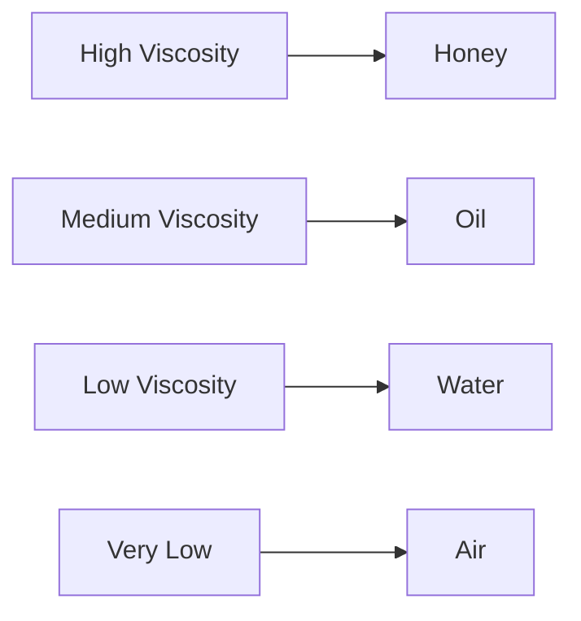
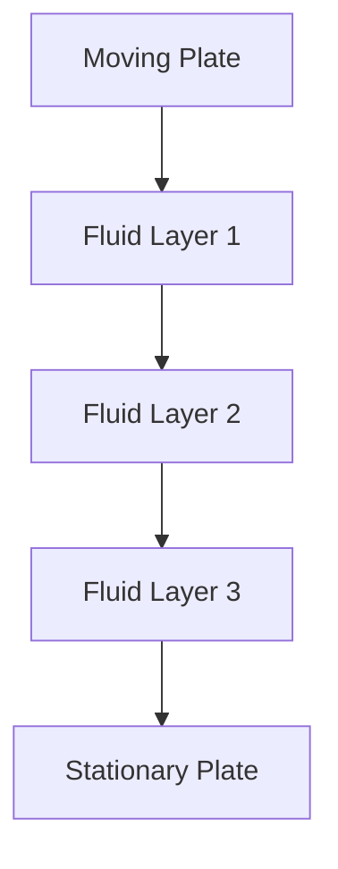
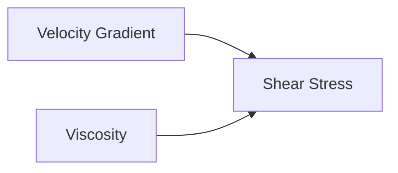
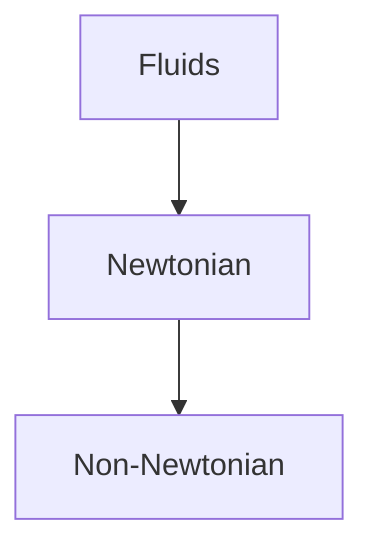
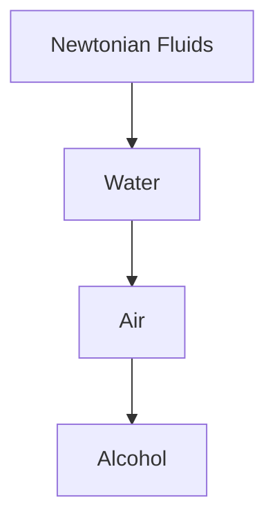
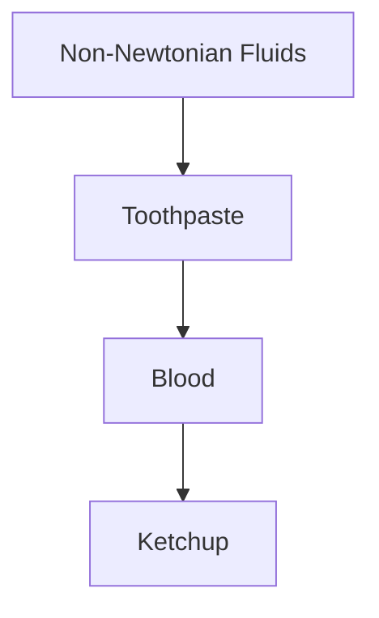
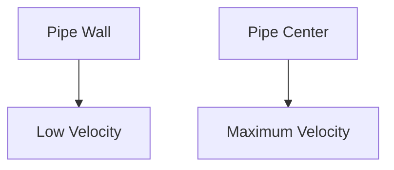
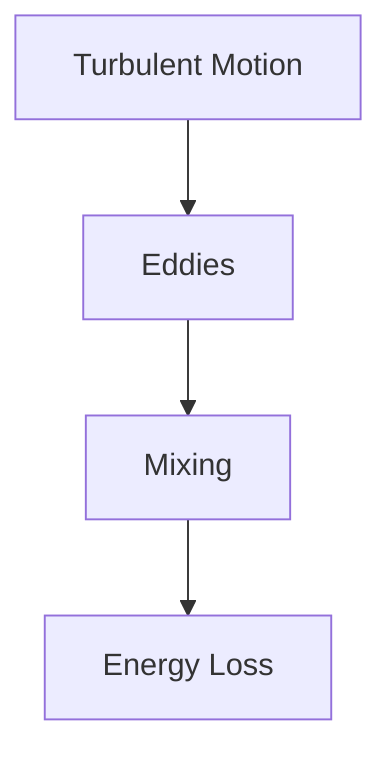

# 🌀 Viscous Flow

In real life, every fluid has some amount of viscosity. Because of viscosity,
fluid particles experience internal friction while flowing. This type of flow is
known as **Viscous Flow**.

Viscous flow plays a major role in pipelines, lubrication systems, blood
circulation, hydraulic machines, and aerodynamic applications.

> Without viscosity, fluids would flow without any resistance, which never
> happens in real-world conditions.

---

## What is Viscosity?

Viscosity is the property of a fluid that resists relative motion between
adjacent fluid layers.

It can be thought of as:

> Internal friction within a fluid.

### Examples

| Fluid      | Viscosity |
| ---------- | --------- |
| Honey      | Very High |
| Engine Oil | High      |
| Water      | Low       |
| Air        | Very Low  |

## 🌊 What is Viscous Flow?

Viscous flow is a fluid flow in which viscous forces significantly influence the
motion of the fluid.

In viscous flow:

- Internal friction exists
- Energy is lost due to resistance
- Velocity varies across the flow section
- Shear stress develops between fluid layers

## Understanding Fluid Layers

Consider fluid flowing between two plates.

<!-- Visual flow for 🌀 Viscous Flow. -->

The fluid layer touching the moving plate moves fastest.

The layer touching the stationary plate remains almost stationary.

Intermediate layers move at different velocities.

This velocity variation creates shear stress.

## Newton's Law of Viscosity

According to Newton:

> Shear stress is directly proportional to the rate of change of velocity.

### Mathematical Form

[ \tau = \mu \frac{du}{dy} ]

Where:

- (\tau) = Shear stress (Pa)
- (\mu) = Dynamic viscosity (Pa·s)
- (du/dy) = Velocity gradient

## Understanding the Equation

### Observations

- Larger viscosity → Larger shear stress
- Larger velocity difference → Larger shear stress

## Dynamic Viscosity

Dynamic viscosity measures a fluid's resistance to flow.

### Symbol

[ \mu ]

### SI Unit

[ Pa \cdot s ]

or

[ N \cdot s/m^2 ]

## Kinematic Viscosity

Kinematic viscosity is the ratio of dynamic viscosity to density.

### Formula

[ \nu = \frac{\mu}{\rho} ]

- (\nu) = Kinematic viscosity
- (\mu) = Dynamic viscosity
- (\rho) = Density

[ m^2/s ]

## Types of Fluids Based on Viscosity

## 1⃣ Newtonian Fluids

These fluids obey Newton's law of viscosity.

Viscosity remains constant.

- Water
- Air
- Alcohol
- Gasoline

## 2⃣ Non-Newtonian Fluids

These fluids do not obey Newton's law of viscosity.

Viscosity changes with shear rate.

- Toothpaste
- Paint
- Blood
- Ketchup

## No-Slip Condition

One of the most important concepts in viscous flow is the **No-Slip Condition**.

It states:

> Fluid velocity at a solid boundary is equal to the velocity of the boundary.

For a stationary wall:

[ V = 0 ]

at the wall surface.

## Velocity Profile in a Pipe

Due to viscosity, fluid velocity is not uniform across the pipe.

<!-- Visual flow for 🌀 Viscous Flow. -->

### Characteristics

- Zero velocity at wall
- Maximum velocity at center
- Smooth velocity variation

## Laminar Viscous Flow

In laminar flow:

- Fluid moves in smooth layers
- Mixing is minimal
- Viscosity dominates

Typical condition:

[ Re < 2000 ]

## Turbulent Viscous Flow

In turbulent flow:

- Random fluctuations occur
- Mixing is significant
- Energy losses increase

[ Re > 4000 ]

## Hagen-Poiseuille Equation

For laminar flow through a circular pipe:

[ Q =

\frac{\pi r^4 \Delta P} {8\mu L} ]

- (Q) = Flow rate
- (r) = Pipe radius
- (\Delta P) = Pressure difference
- (L) = Pipe length
- (\mu) = Dynamic viscosity

## Important Observation

The flow rate depends on:

[ r^4 ]

This means a small increase in pipe radius greatly increases flow rate.

## Energy Loss Due to Viscosity

Viscosity causes friction between fluid layers and pipe walls.

This leads to:

- Pressure drop
- Energy loss
- Reduced efficiency

## Boundary Layer Concept

When fluid flows over a surface, viscosity creates a thin region called the
boundary layer.

Inside the boundary layer:

- Velocity changes rapidly
- Viscous effects dominate

Outside the boundary layer:

- Viscous effects are small

## 🚗 Automotive Lubrication

Engine oils reduce friction between moving parts.

## 🩸 Blood Flow Analysis

Blood viscosity affects circulation and heart workload.

## 🏭 Pipeline Transport

Used to predict pressure losses.

## ⚙ Hydraulic Systems

Determines pump power requirements.

## ✈ Aerodynamics

Boundary layer behavior affects drag.

## 🛢 Oil Transportation

Viscosity influences pumping requirements.

### Honey Pouring

Honey flows slowly because it has high viscosity.

### Water Flow

Water flows easily because it has low viscosity.

### Engine Lubrication

Oil forms a thin viscous layer that prevents metal-to-metal contact.

### Blood Circulation

Blood viscosity influences resistance in arteries and veins.

## Comparison: Ideal Flow vs Viscous Flow

| Property      | Ideal Flow | Viscous Flow |
| ------------- | ---------- | ------------ |
| Viscosity     | Zero       | Present      |
| Friction Loss | None       | Present      |
| Pressure Loss | None       | Present      |
| Realistic     | No         | Yes          |

## Advantages of Understanding Viscous Flow

✅ Predicts pressure losses

✅ Helps design pipelines

✅ Improves lubrication systems

✅ Essential for CFD simulations

✅ Important in aerodynamics and hydraulics

## 📋 Summary

| Parameter                  | Formula                           |
| -------------------------- | --------------------------------- |
| Shear Stress               | (\tau=\mu \frac{du}{dy})          |
| Kinematic Viscosity        | (\nu=\frac{\mu}{\rho})            |
| Laminar Flow               | (Re < 2000)                       |
| Turbulent Flow             | (Re > 4000)                       |
| Hagen-Poiseuille Flow Rate | (\frac{\pi r^4 \Delta P}{8\mu L}) |

## Key Takeaways

- Viscous flow occurs because real fluids possess viscosity.
- Viscosity acts as internal friction within a fluid.
- Newton's law of viscosity relates shear stress to velocity gradient.
- Viscous effects create pressure losses and energy dissipation.
- The no-slip condition causes velocity to be zero at solid boundaries.
- Boundary layers form because of viscous effects near surfaces.
- Viscous flow analysis is essential in pipelines, lubrication systems,
  aerodynamics, and hydraulic engineering.
