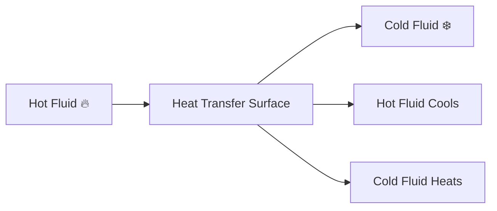
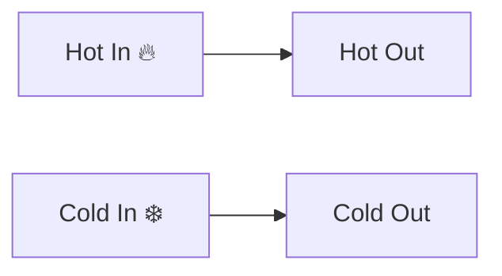
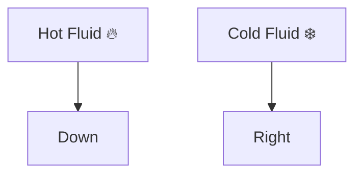

# ♨ Heat Exchangers

A heat exchanger is a device used to transfer heat from one fluid to another
without allowing the fluids to mix.

Heat exchangers are among the most important equipment in thermal engineering
and are widely used in power plants, refrigeration systems, automobiles,
chemical industries, and HVAC systems.

### 🌍 Everyday Examples

- Car radiators
- Air conditioners
- Refrigerators
- Water heaters
- Power plant condensers

## Why Heat Exchangers Are Needed

Heat exchangers help:

✅ Transfer heat efficiently

✅ Recover waste heat

✅ Improve energy efficiency

✅ Reduce fuel consumption

✅ Control process temperatures

<!-- Visual flow for ♨ Heat Exchangers. -->


## ⚙ Basic Working Principle

Heat always flows from the hotter fluid to the colder fluid.

The fluids are separated by a solid wall.

Heat transfer occurs through:

1. Convection from hot fluid to wall
2. Conduction through wall
3. Convection from wall to cold fluid

<!-- Visual flow for ♨ Heat Exchangers. -->


### 1⃣ Parallel Flow Heat Exchanger

Both fluids move in the same direction.

<!-- Visual flow for ♨ Heat Exchangers. -->


### Characteristics

- Simple design
- Lower efficiency
- Larger temperature drop initially

### Applications

- Small heating systems
- Low-cost applications

---

### 2⃣ Counter Flow Heat Exchanger

Fluids move in opposite directions.

ColdOut[Cold Out] --> ColdIn[Cold In ❄️]
// Example demonstrating ♨ Heat Exchangers.
```

✅ Higher efficiency

✅ Better temperature control

✅ Greater heat transfer rate

- Industrial heat exchangers
- Power plants
- Chemical processing units

Counter-flow arrangement is generally preferred in engineering systems.

### 3⃣ Cross Flow Heat Exchanger

Fluids move perpendicular to each other.



- Automobile radiators
- Air conditioning coils
- Cooling towers

### Double Pipe Heat Exchanger

Consists of one pipe inside another.

```mermaid
flowchart LR
    A[Inner Pipe]
    B[Outer Pipe]

A --> HeatTransfer
    B --> HeatTransfer
// Example demonstrating ♨ Heat Exchangers.
```

#### Advantages

- Simple construction
- Easy maintenance

#### Disadvantages

- Limited heat transfer area

### Shell and Tube Heat Exchanger

Most widely used industrial heat exchanger.

It contains:

- Bundle of tubes
- Outer shell
- Fluid flowing inside tubes
- Another fluid flowing around tubes

```mermaid
flowchart LR
    Shell[Shell Side Fluid]
    --> Tubes[Tube Bundle]
    --> Outlet[Outlet]

Tubes --> HeatTransfer[Heat Exchange]
// Example demonstrating ♨ Heat Exchangers.
```


- Power plants
- Oil refineries
- Chemical industries

### Plate Heat Exchanger

Constructed using multiple thin metal plates.

```mermaid
flowchart LR
    Plate1[Plate]
    Plate2[Plate]
    Plate3[Plate]
    Plate4[Plate]
// Example demonstrating ♨ Heat Exchangers.
```

✅ High efficiency

✅ Compact size

✅ Large heat transfer area

- Food processing
- Refrigeration
- Dairy industries

## 📏 Heat Exchanger Performance

Heat transfer rate is:

```
Q = mCp(Tin - Tout)
// Example demonstrating ♨ Heat Exchangers.
```

Where:

- Q = Heat transfer rate (W)
- m = Mass flow rate (kg/s)
- Cp = Specific heat capacity
- Tin = Inlet temperature
- Tout = Outlet temperature

## 🌡 Log Mean Temperature Difference (LMTD)

Temperature difference changes throughout a heat exchanger.

To account for this variation, engineers use LMTD.

```
LMTD = (ΔT₁ - ΔT₂) / ln(ΔT₁/ΔT₂)
// Example demonstrating ♨ Heat Exchangers.
```

- ΔT₁ = Temperature difference at one end
- ΔT₂ = Temperature difference at the other end

Higher LMTD means better heat transfer potential.

## Effectiveness of Heat Exchanger

Effectiveness indicates how well a heat exchanger performs compared to the
maximum possible heat transfer.

```
Effectiveness = Actual Heat Transfer / Maximum Possible Heat Transfer
// Example demonstrating ♨ Heat Exchangers.
```

Value ranges from:

- 0 → No heat transfer
- 1 → Perfect heat transfer

### Power Plants

- Boilers
- Condensers
- Feedwater heaters

### Automobiles

- Radiators
- Engine oil coolers

### Refrigeration Systems

- Condensers
- Evaporators

### Chemical Industries

- Process heating
- Process cooling

### Food Industry

- Pasteurization
- Milk processing

### HVAC Systems

- Air conditioning coils
- Heat recovery units

## 🚗 Example: Car Radiator

The engine coolant absorbs heat from the engine.

The hot coolant flows through radiator tubes.

Air flowing across the tubes removes heat.

```mermaid
flowchart LR
    Engine[Engine 🔥]
    --> Coolant[Hot Coolant]

Coolant --> Radiator[Radiator]

Air[Cooling Air 🌬️]
    --> Radiator

Radiator --> Engine
// Example demonstrating ♨ Heat Exchangers.
```

This prevents engine overheating.

## Comparison of Flow Arrangements

| Feature             | Parallel Flow | Counter Flow | Cross Flow    |
| ------------------- | ------------- | ------------ | ------------- |
| Flow Direction      | Same          | Opposite     | Perpendicular |
| Efficiency          | Low           | High         | Medium        |
| Temperature Control | Moderate      | Excellent    | Good          |
| Industrial Usage    | Less          | Most Common  | Common        |

## Key Points

✅ Heat exchangers transfer heat between fluids without mixing them

✅ Heat transfer occurs through conduction and convection

✅ Counter-flow heat exchangers provide the highest efficiency

✅ Shell-and-tube heat exchangers are widely used in industries

✅ Plate heat exchangers offer compact and efficient heat transfer

✅ LMTD is used to analyze heat exchanger performance

✅ Heat exchangers improve energy efficiency and reduce operating costs

## Quick Reference

| Area | Revision point |
|---|---|
| Definition | State exactly what the topic means. |
| Mechanism | Explain the steps that produce the result. |
| Example | Use a small realistic case. |
| Pitfalls | Know common mistakes and boundary cases. |
