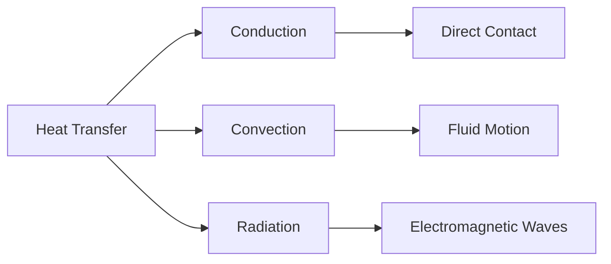

# Introduction to Heat Transfer

Heat Transfer is the science of studying how thermal energy moves from one place
to another due to a temperature difference.

Whenever two objects have different temperatures, heat naturally flows from the
hotter object to the colder object until thermal equilibrium is reached.

### 🌍 Why Heat Transfer Matters

Heat transfer is used in almost every engineering system:

- Car radiators
- Air conditioners
- Refrigerators
- Boilers
- Power plants
- Electronic cooling systems
- Solar heaters

Understanding heat transfer helps engineers design efficient systems and reduce
energy losses.

## 🔥 What is Heat?

Heat is a form of energy that transfers because of temperature difference.

Example:

- A hot cup of tea cools down because heat moves to the surrounding air.
- Ice melts because heat flows from the environment into the ice.

## 🌡 What is Temperature?

Temperature indicates the degree of hotness or coldness of a body.

Heat flows only when there is a temperature difference.

- Water at 80°C transfers heat to water at 30°C.

## Modes of Heat Transfer

Heat can be transferred in three ways:

1. Conduction
2. Convection
3. Radiation

<!-- Visual flow for Introduction to Heat Transfer. -->

## 🔥 Conduction

Heat transfer through direct molecular interaction without movement of material.

- A metal spoon becomes hot when placed in hot tea.

## 🌬 Convection

Heat transfer due to movement of fluids.

- Boiling water in a pot.

## ☀ Radiation

Heat transfer through electromagnetic waves.

No medium is required.

- Heat from the Sun reaching Earth.

## Temperature Difference Drives Heat Transfer

The larger the temperature difference, the faster the heat transfer.

- Ice melts faster in hot water than in cold water.

## ⚙ Engineering Applications

- Engine cooling
- Heat exchangers
- Electronic devices
- HVAC systems
- Thermal power plants
- Solar energy systems

## Key Points

✅ Heat flows from high temperature to low temperature

✅ Heat transfer occurs because of temperature difference

✅ Three modes: Conduction, Convection and Radiation

✅ Heat transfer is essential in all thermal engineering systems

## Quick Reference

| Area | Revision point |
|---|---|
| Definition | State exactly what the topic means. |
| Mechanism | Explain the steps that produce the result. |
| Example | Use a small realistic case. |
| Pitfalls | Know common mistakes and boundary cases. |

## Assumptions and Units

For engineering topics, write down known quantities, unknowns, units, and governing assumptions before calculating. Check the final unit and physical direction of the result. A mathematically correct expression can still be physically invalid if an assumption has been violated.

## Limiting Conditions

Pay attention to boundary conditions, material properties, environmental changes, sign conventions, and measurement error. If a formula relies on an approximation, state when that approximation is reasonable. Revision becomes much easier when each equation is attached to the condition that justifies it.

## Worked Check

After solving a numerical example, estimate the order of magnitude and compare it with a realistic range. A quick sanity check often catches unit conversion errors, misplaced decimal points, and incorrect signs.

## Model Limitations

Every engineering model is valid only within stated assumptions. Identify the operating range, approximations, and variables that can change the result. When a quantity is measured rather than exact, consider uncertainty and whether the required precision justifies the calculation. In revision, remember the relationship together with its assumptions; applying a correct equation outside its valid range can produce a physically misleading answer.

## Final Understanding Check

Before considering **Introduction to Heat Transfer** revised, make sure you can state the definition without relying on the example, explain the mechanism in the correct order, and predict what happens when one important input or assumption changes. Then check one boundary case and one practical use case. The example should support the explanation rather than replace it. When a result is surprising, inspect the rule that produced it and verify the relevant precondition. This approach is more reliable than memorising a code snippet, formula, command, or interview answer because the same reasoning can be applied to a new problem. For technical topics, also distinguish what is guaranteed by the language, library, protocol, or mathematical rule from what is merely a common convention. That distinction helps you choose the correct solution when the context changes.
