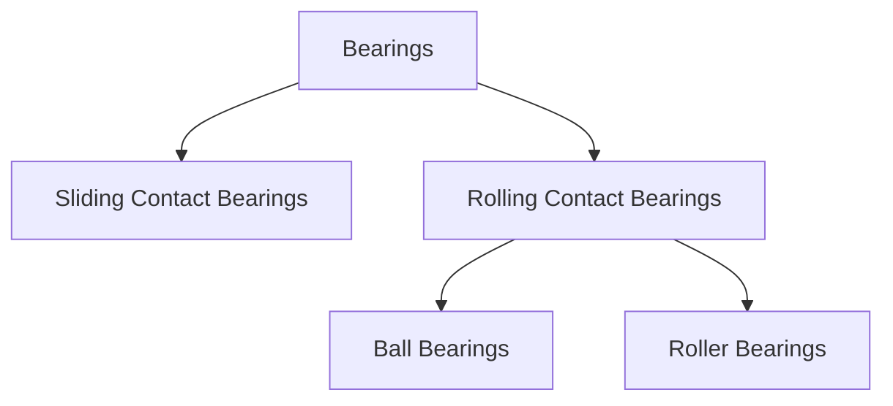
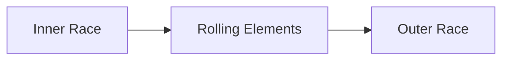
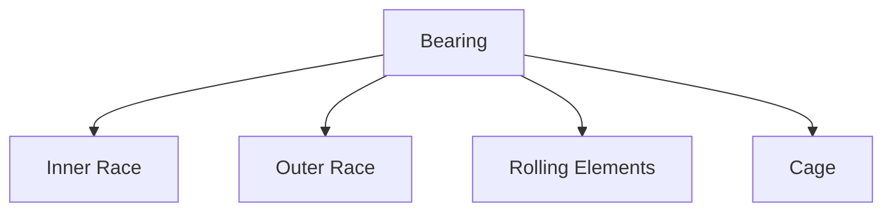
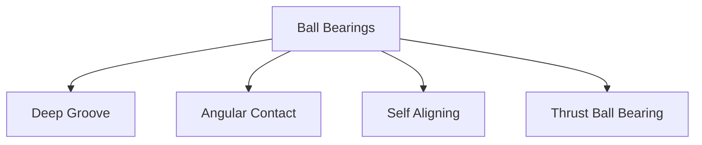
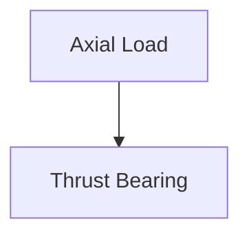
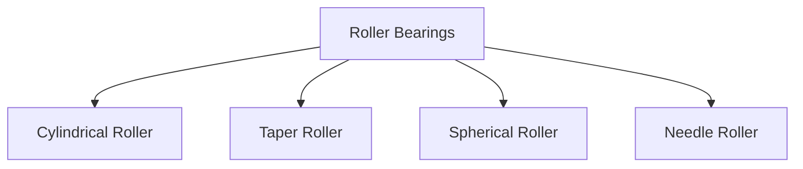
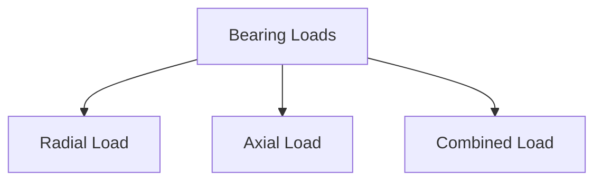
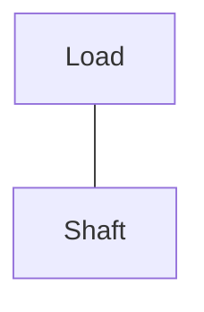
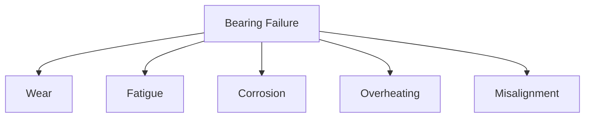

# 🔘 Bearings

Bearings are machine elements that support rotating or moving parts and reduce
friction between surfaces in contact.

Almost every machine containing rotating components uses bearings. They help
shafts rotate smoothly, carry loads, reduce wear, and improve machine
efficiency.

Examples include automobiles, electric motors, pumps, fans, turbines, and
industrial machinery.

---

## Functions of Bearings

Bearings perform several important functions:

✅ Support rotating shafts

✅ Reduce friction

✅ Carry radial and axial loads

✅ Improve efficiency

✅ Reduce wear

✅ Increase machine life

## Why Bearings are Needed

Without bearings:

- Friction increases
- Heat generation increases
- Power losses increase
- Component wear increases
- Machine life decreases

## Simple Example

Imagine rotating a steel shaft directly inside a hole.

<!-- Visual flow for 🔘 Bearings. -->

Now add a bearing:

<!-- Visual flow for 🔘 Bearings. -->

Result:

- Lower friction
- Longer life
- Better performance

## ⚙ Classification of Bearings

<!-- Visual flow for 🔘 Bearings. -->

## 1⃣ Sliding Contact Bearings

Also called:

- Plain Bearings
- Journal Bearings

In these bearings:

- Shaft slides over bearing surface.
- Lubrication reduces friction.

<!-- Visual flow for 🔘 Bearings. -->

## Advantages

✅ Simple construction

✅ Quiet operation

✅ Suitable for heavy loads

## Disadvantages

❌ Higher friction

❌ Continuous lubrication required

## Applications

- Turbines
- Large generators
- Marine shafts

## 2⃣ Rolling Contact Bearings

Rolling elements are placed between moving surfaces.

Examples:

- Ball Bearings
- Roller Bearings

Friction is greatly reduced.

<!-- Visual flow for 🔘 Bearings. -->

## Components of a Rolling Bearing

<!-- Visual flow for 🔘 Bearings. -->

## Inner Race

Mounted on the shaft.

Rotates with the shaft.

## Outer Race

Mounted inside housing.

Usually stationary.

## Rolling Elements

May be:

- Balls
- Cylinders
- Tapered rollers
- Needles

## Cage

Keeps rolling elements equally spaced.

## ⚪ Ball Bearings

The most common bearing type.

Rolling elements are spherical balls.

<!-- Visual flow for 🔘 Bearings. -->

## Characteristics

- Low friction
- High speed capability
- Moderate load capacity

- Electric motors
- Fans
- Household appliances
- Pumps

## Types of Ball Bearings

<!-- Visual flow for 🔘 Bearings. -->

## Deep Groove Ball Bearing

Most widely used.

Supports:

- Radial loads
- Moderate axial loads

## Angular Contact Bearing

Designed for:

- Combined radial and axial loads

Used in:

- Machine tool spindles
- Pumps

## Self-Aligning Bearing

Automatically adjusts shaft misalignment.

Useful when alignment is difficult.

## Thrust Ball Bearing

Designed mainly for axial loads.

<!-- Visual flow for 🔘 Bearings. -->

## 🔵 Roller Bearings

Use rollers instead of balls.

Because contact area is larger:

- Higher load capacity

<!-- Visual flow for 🔘 Bearings. -->

## Types of Roller Bearings

<!-- Visual flow for 🔘 Bearings. -->

## Cylindrical Roller Bearing

Characteristics:

- High radial load capacity
- Suitable for heavy-duty applications

Applications:

- Gearboxes
- Rolling mills

## Taper Roller Bearing

- Radial loads
- Axial loads

Commonly used in:

- Automobile wheel hubs

## Spherical Roller Bearing

Can accommodate shaft misalignment.

Suitable for:

- Heavy industrial equipment

## Needle Roller Bearing

Uses very thin rollers.

Advantages:

- Compact size
- High load capacity

- Transmissions
- Automotive systems

## 📏 Loads Acting on Bearings

<!-- Visual flow for 🔘 Bearings. -->

## Radial Load

Acts perpendicular to shaft axis.

Example:

<!-- Visual flow for 🔘 Bearings. -->

Common in:

- Motors
- Pulleys

## Axial Load (Thrust Load)

Acts along shaft axis.

<!-- Visual flow for 🔘 Bearings. -->

- Propeller shafts
- Screw jacks

## Combined Load

Contains both radial and axial components.

- Gearboxes
- Automotive wheel hubs

## 🛢 Bearing Lubrication

Lubrication reduces:

- Friction
- Heat generation
- Wear

## Grease Lubrication

- Simple
- Low maintenance

- Motors
- Fans

## Oil Lubrication

- Better cooling
- Suitable for high speed

- Turbines
- Gearboxes

## ⚠ Bearing Failures

<!-- Visual flow for 🔘 Bearings. -->

## 1⃣ Wear

Caused by:

- Dirt
- Lack of lubrication

## 2⃣ Fatigue Failure

Repeated stress causes cracks.

Results in:

- Pitting
- Surface damage

## 3⃣ Corrosion

Occurs due to:

- Moisture
- Chemical exposure

## 4⃣ Overheating

- Excessive friction
- Poor lubrication

## 5⃣ Misalignment

Improper shaft alignment causes:

- Vibration
- Premature failure

## Bearing Life

Bearing life is usually expressed in:

### Number of Revolutions

or

### Operating Hours

Manufacturers often specify:

### L10 Life

Meaning:

90% of bearings are expected to survive up to the stated life.

## Factors Affecting Bearing Life

- Load
- Speed
- Lubrication
- Alignment
- Temperature
- Contamination

## Automotive

- Wheels
- Gearboxes
- Engines

## Industrial Machines

- Pumps
- Compressors
- Conveyors

## Electrical Equipment

- Motors
- Generators
- Fans

## Aerospace

- Turbines
- Landing gear systems

## Household Appliances

- Washing machines
- Air conditioners
- Mixers

## 📈 Advantages of Bearings

✅ Reduced friction

✅ Smooth operation

✅ Increased efficiency

✅ Reduced wear

✅ Longer machine life

✅ Lower power consumption

## ⚠ Limitations

❌ Require lubrication

❌ Sensitive to contamination

❌ Proper alignment is necessary

❌ Limited life under excessive loads

## Key Points

- Bearings support rotating components and reduce friction.
- Bearings are classified into sliding and rolling contact bearings.
- Ball bearings are suitable for high-speed applications.
- Roller bearings are suitable for heavier loads.
- Bearings carry radial, axial, or combined loads.
- Lubrication is essential for reliable operation.
- Common failures include wear, fatigue, corrosion, and overheating.
- Proper bearing selection significantly improves machine performance and life.

## Quick Reference

| Area | Revision point |
|---|---|
| Definition | State exactly what the topic means. |
| Mechanism | Explain the steps that produce the result. |
| Example | Use a small realistic case. |
| Pitfalls | Know common mistakes and boundary cases. |
